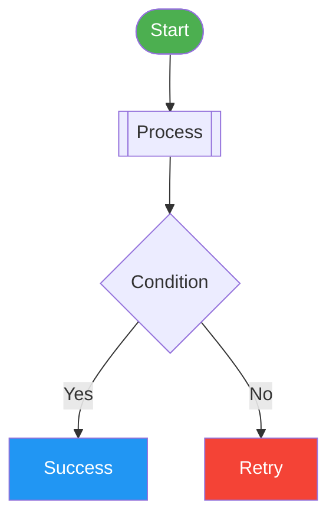
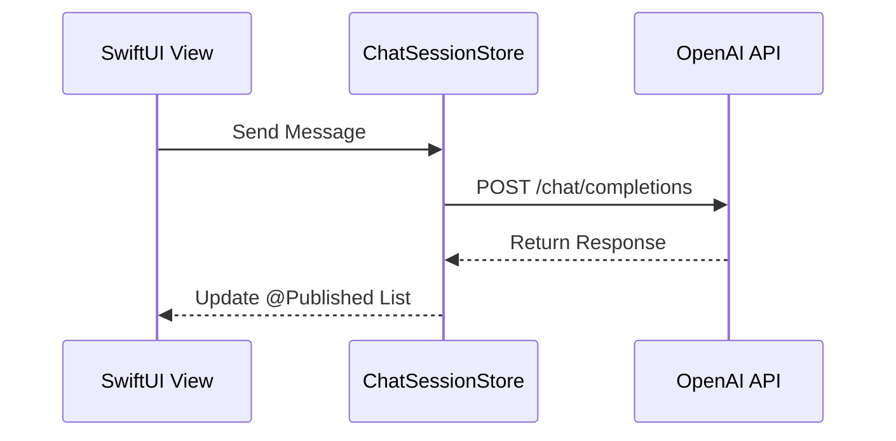
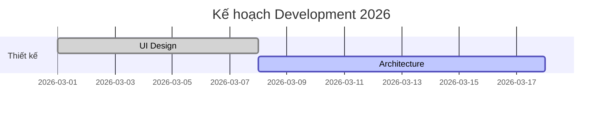

# 📗 Hướng dẫn: Tạo Biểu đồ Premium trong Antigravity

Chào bạn! Bản hướng dẫn này giúp bạn nắm vững cách sử dụng mã Markdown kết hợp với Mermaid để tôi (Antigravity) có thể giúp bạn tạo ra các bản "Preview Canvas" đẳng cấp.

---

## 🚀 1. Công thức cơ bản
Để tôi có thể vẽ được biểu đồ, bạn chỉ cần đưa đoạn mã vào khối code như sau trong file `.md` của bạn:

```text
# Tên biểu đồ của bạn
```mermaid
[Mã nguồn Mermaid ở đây]
\``` (Nhớ đóng block bằng 3 dấu nháy)
```

---

## 🎨 2. Các mẫu biểu đồ "đẹp" nhất

### A. Biểu đồ luồng (Flowchart - `graph TD`)
Dùng để vẽ kiến trúc app hoặc luồng logic code.
- **Tip**: Dùng `subgraph` để nhóm các module lại.
- **Tip**: Sử dụng các hình dáng nút khác nhau: `[Nút vuông]`, `(Nút tròn)`, `([Nút elip])`, `[[Nút sub-process]]`.



### B. Biểu đồ tuần tự (Sequence Diagram - `sequenceDiagram`)
Mô tả cách các Class/Service tương tác qua lại.


### C. Biểu đồ Gantt (Tiến độ - `gantt`)
Rất tốt để theo dõi Roadmap dự án.


---

## ✨ 3. Mẹo làm đẹp (Styling Level "Premium")

Để biểu đồ không bị "phẳng" và nhạt nhòa, bạn có thể thêm các dòng lệnh **Style** ở cuối khối Mermaid:

- `style ID fill:#hex,stroke:#hex,stroke-width:2px,rx:10,ry:10`
  - `fill`: Màu nền (dùng mã màu HSL hoặc HEX).
  - `stroke`: Màu viền.
  - `rx`, `ry`: Độ bo góc cho nút.
- `linkStyle default stroke:#888,stroke-width:1px` : Làm các đường nối thanh mảnh và sang trọng hơn.

---

## 🛠️ 4. Quy trình làm việc đề xuất

1.  **Draft**: Sử dụng [Mermaid Live Editor](https://mermaid.live/) để kéo thả hoặc gõ mã thử nghiệm.
2.  **Paste**: Copy mã từ Live Editor vào file `.md` của dự án bạn.
3.  **Command**: Gọi tôi bằng câu lệnh: **"Hãy render file MD này thành Artifact bản đẹp"**.

---

## 🛑 5. Những nguyên tắc vàng (Anti-Error)
Để tránh các lỗi render phổ biến ("Lexical error" hoặc "Syntax error"), hãy luôn tuân thủ 3 nguyên tắc sau:

### ✅ Luôn dùng Dấu ngoặc kép `"` cho nhãn (Labels)
Nếu nhãn của bạn chứa **Emoji**, **ký tự đặc biệt** (như `[`, `]`, `(`, `)`, `:`, `-`) hoặc **khoảng trắng**, hãy luôn bọc nó trong `""`.
- ❌ Sai: `User([👤 User])`
- ✅ Đúng: `User(["👤 User"])`

### ✅ Dùng `<br/>` thay cho `\n` để xuống dòng
Ký tự `\n` thường gây lỗi trong một số môi trường render. Hãy dùng thẻ HTML `<br/>`.
- ❌ Sai: `DT[[ChatDebugTool\n⚠️ Chỉ là Debug View]]`
- ✅ Đúng: `DT[["ChatDebugTool<br/>⚠️ Chỉ là Debug View"]]`

### ✅ Bọc ID của các Participant (Sequence Diagram)
Trong biểu đồ tuần tự, hãy dùng dấu nháy kép cho tên Participant nếu có ký tự đặc biệt.
- ❌ Sai: `participant V as View (onAppear)`
- ✅ Đúng: `participant V as "View (onAppear)"`

---
*Lưu ý: Bạn không cần lo lắng về việc cài đặt thư viện. Tôi đã tích hợp sẵn trình biên dịch Mermaid tối ưu nhất cho các bản Artifact của bạn.*
