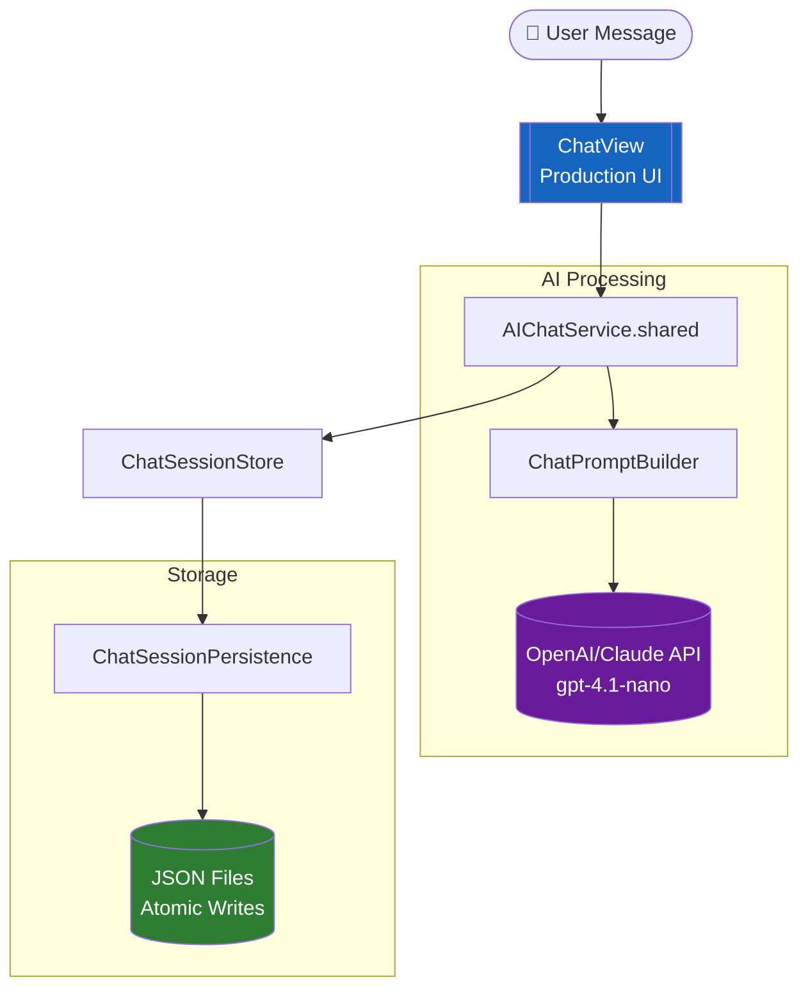
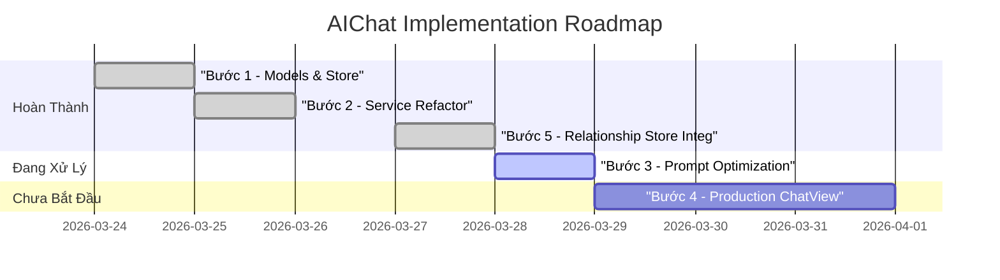

# 📊 Example: AIChat Audit (Với Biểu Đồ Mermaid)

> [!NOTE]
> **Đây là file ví dụ để bạn tham khảo cách viết mã Mermaid kết hợp Markdown.**

---

## 🗺️ Visual Architecture Flow
Sơ đồ Mermaid vẽ kiến trúc:

---

## 📈 Dự Án Tiến Độ (Project Roadmap)
Ví dụ về biểu đồ Gantt:

---

## 🏔️ Tình Trạng Tổng Quan

Proposal đề ra 5 bước. Hiện tại **4/5 bước đã hoàn thành**, bước còn lại (ChatView) chưa tồn tại.

---
*File này được tạo tự động để làm mẫu cho bộ hướng dẫn tạo Chart.*
