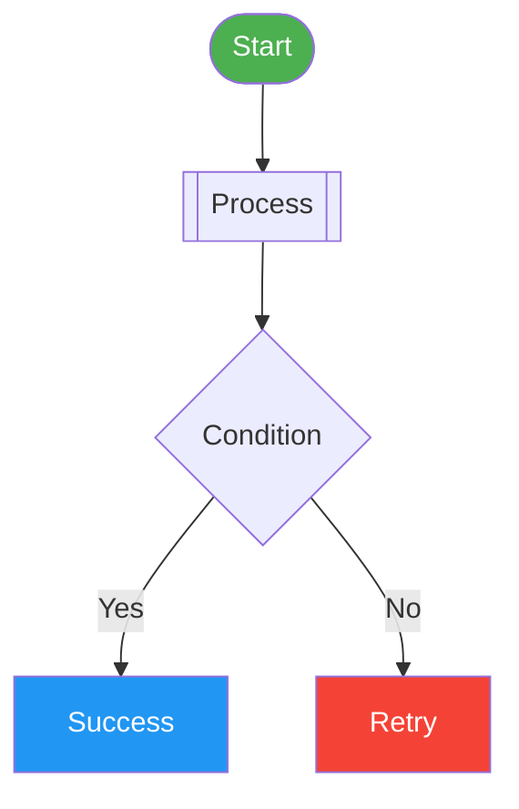
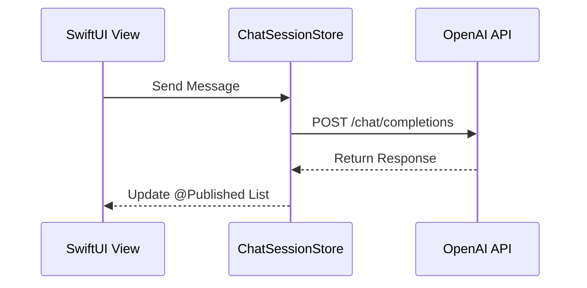
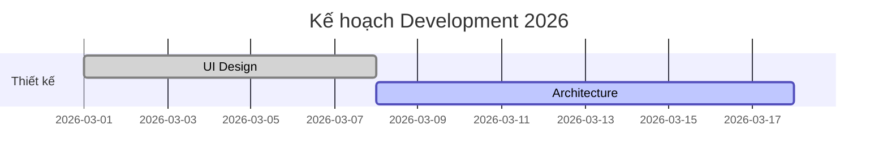
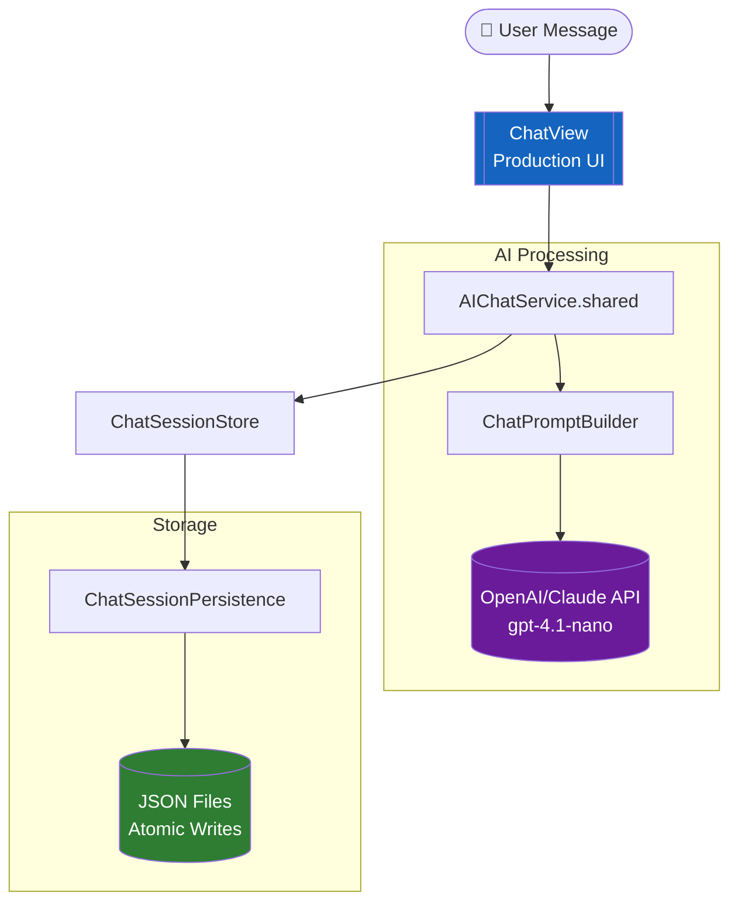
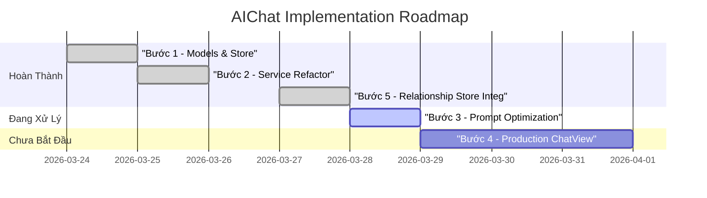

# Module: DOCS


<file path="GraphPreview/Antigravity_Chart_Guide.md">
```md
# 📗 Hướng dẫn: Tạo Biểu đồ Premium trong Antigravity

Chào bạn! Bản hướng dẫn này giúp bạn nắm vững cách sử dụng mã Markdown kết hợp với Mermaid để tôi (Antigravity) có thể giúp bạn tạo ra các bản "Preview Canvas" đẳng cấp.

---

## 🚀 1. Công thức cơ bản
Để tôi có thể vẽ được biểu đồ, bạn chỉ cần đưa đoạn mã vào khối code như sau trong file `.md` của bạn:

```text
# Tên biểu đồ của bạn
```mermaid
[Mã nguồn Mermaid ở đây]
\``` (Nhớ đóng block bằng 3 dấu nháy)
```

---

## 🎨 2. Các mẫu biểu đồ "đẹp" nhất

### A. Biểu đồ luồng (Flowchart - `graph TD`)
Dùng để vẽ kiến trúc app hoặc luồng logic code.
- **Tip**: Dùng `subgraph` để nhóm các module lại.
- **Tip**: Sử dụng các hình dáng nút khác nhau: `[Nút vuông]`, `(Nút tròn)`, `([Nút elip])`, `[[Nút sub-process]]`.



### B. Biểu đồ tuần tự (Sequence Diagram - `sequenceDiagram`)
Mô tả cách các Class/Service tương tác qua lại.


### C. Biểu đồ Gantt (Tiến độ - `gantt`)
Rất tốt để theo dõi Roadmap dự án.


---

## ✨ 3. Mẹo làm đẹp (Styling Level "Premium")

Để biểu đồ không bị "phẳng" và nhạt nhòa, bạn có thể thêm các dòng lệnh **Style** ở cuối khối Mermaid:

- `style ID fill:#hex,stroke:#hex,stroke-width:2px,rx:10,ry:10`
  - `fill`: Màu nền (dùng mã màu HSL hoặc HEX).
  - `stroke`: Màu viền.
  - `rx`, `ry`: Độ bo góc cho nút.
- `linkStyle default stroke:#888,stroke-width:1px` : Làm các đường nối thanh mảnh và sang trọng hơn.

---

## 🛠️ 4. Quy trình làm việc đề xuất

1.  **Draft**: Sử dụng [Mermaid Live Editor](https://mermaid.live/) để kéo thả hoặc gõ mã thử nghiệm.
2.  **Paste**: Copy mã từ Live Editor vào file `.md` của dự án bạn.
3.  **Command**: Gọi tôi bằng câu lệnh: **"Hãy render file MD này thành Artifact bản đẹp"**.

---

## 🛑 5. Những nguyên tắc vàng (Anti-Error)
Để tránh các lỗi render phổ biến ("Lexical error" hoặc "Syntax error"), hãy luôn tuân thủ 3 nguyên tắc sau:

### ✅ Luôn dùng Dấu ngoặc kép `"` cho nhãn (Labels)
Nếu nhãn của bạn chứa **Emoji**, **ký tự đặc biệt** (như `[`, `]`, `(`, `)`, `:`, `-`) hoặc **khoảng trắng**, hãy luôn bọc nó trong `""`.
- ❌ Sai: `User([👤 User])`
- ✅ Đúng: `User(["👤 User"])`

### ✅ Dùng `<br/>` thay cho `\n` để xuống dòng
Ký tự `\n` thường gây lỗi trong một số môi trường render. Hãy dùng thẻ HTML `<br/>`.
- ❌ Sai: `DT[[ChatDebugTool\n⚠️ Chỉ là Debug View]]`
- ✅ Đúng: `DT[["ChatDebugTool<br/>⚠️ Chỉ là Debug View"]]`

### ✅ Bọc ID của các Participant (Sequence Diagram)
Trong biểu đồ tuần tự, hãy dùng dấu nháy kép cho tên Participant nếu có ký tự đặc biệt.
- ❌ Sai: `participant V as View (onAppear)`
- ✅ Đúng: `participant V as "View (onAppear)"`

---
*Lưu ý: Bạn không cần lo lắng về việc cài đặt thư viện. Tôi đã tích hợp sẵn trình biên dịch Mermaid tối ưu nhất cho các bản Artifact của bạn.*

```
</file>

<file path="GraphPreview/Example_Audit_With_Charts.md">
```md
# 📊 Example: AIChat Audit (Với Biểu Đồ Mermaid)

> [!NOTE]
> **Đây là file ví dụ để bạn tham khảo cách viết mã Mermaid kết hợp Markdown.**

---

## 🗺️ Visual Architecture Flow
Sơ đồ Mermaid vẽ kiến trúc:



---

## 📈 Dự Án Tiến Độ (Project Roadmap)
Ví dụ về biểu đồ Gantt:



---

## 🏔️ Tình Trạng Tổng Quan

Proposal đề ra 5 bước. Hiện tại **4/5 bước đã hoàn thành**, bước còn lại (ChatView) chưa tồn tại.

---
*File này được tạo tự động để làm mẫu cho bộ hướng dẫn tạo Chart.*

```
</file>

<file path="docs/decisions/20260426-adaptive-sidebar-scrolling.md">
```md
# Adaptive Sidebar Scrolling Architecture

**Date:** 2026-04-26
**Status:** accepted
**Author:** session 2026-04-26

---

## Bối cảnh

Sidebar Trái chứa nhiều danh sách động (Recently Viewed, Explorer, Hidden Items) có thể thay đổi kích thước tùy thuộc vào số lượng file và trạng thái đóng/mở. 
Trước đây, các danh sách này sử dụng chiều cao cố định hoặc cuộn thủ công, dẫn đến:
1. Nhảy layout khi chuyển đổi giữa các mục.
2. Xuất hiện "Safe Zone" (khoảng trống 100px ở cuối) ngay cả khi danh sách rất ngắn, làm lãng phí diện tích.
3. Hiệu ứng làm mờ (Mask Fade) xuất hiện không đúng lúc, làm chữ bị mờ khi không cần thiết.

Cần một giải pháp quản lý vùng cuộn thông minh, tự động phản ứng với sự thay đổi của nội dung.

---

## Các lựa chọn đã cân nhắc

### Option 1: Manual CSS Flex Splitting (flex: 1)
- **Ưu:** Rất đơn giản, không cần JavaScript.
- **Nhược:** Các danh sách luôn chia đều không gian ngay cả khi một bên trống rỗng. Không thể tự động bật/tắt các hiệu ứng trang trí dựa trên nội dung.

### Option 2: ScrollContainer Molecule + ResizeObserver
- **Ưu:** UX cực kỳ mượt mà. Tự động hiện vùng đệm an toàn và hiệu ứng fade chỉ khi thực sự có cuộn (overflow). Cho phép danh sách "fit-content" cho đến khi đạt ngưỡng giới hạn.
- **Nhược:** Cần xử lý JavaScript (`ResizeObserver`), có thể ảnh hưởng nhẹ đến performance nếu có quá nhiều container.

---

## Quyết định

**Chọn: Option 2 — ScrollContainer Molecule + ResizeObserver**

Chúng tôi chọn giải pháp này vì nó mang lại trải nghiệm "premium" và tiết kiệm diện tích tối đa cho người dùng. Việc sử dụng `ResizeObserver` cho phép chúng ta tách biệt logic hiển thị (CSS) khỏi việc tính toán trạng thái cuộn, giúp code sạch và dễ bảo trì hơn.

---

## Hệ quả

**Tích cực:**
- Layout Sidebar ổn định, không còn hiện tượng nhảy vị trí header.
- Tiết kiệm không gian: Danh sách ngắn sẽ ôm sát nội dung (fit-content).
- Hiệu ứng thị giác (Fade/Safe Zone) chỉ xuất hiện khi cần thiết, tăng tính chuyên nghiệp.

**Tiêu cực / Trade-off:**
- Phụ thuộc vào `ResizeObserver` API.
- Cần quản lý vòng đời component chặt chẽ (re-mount) vì Sidebar thường xuyên render lại DOM.

**Constraint tương lai:**
- Tất cả các vùng cuộn trong ứng dụng (kể cả Sidebar Phải hoặc Search Results) NÊN sử dụng `ScrollContainer` molecule thay vì `overflow: auto` thuần túy.
- Tuyệt đối không hardcode `padding-bottom` cho nội dung cuộn, hãy sử dụng `--ds-scroll-safe-height` của `ScrollContainer`.

```
</file>

<file path="docs/decisions/20260426-centralized-settings-architecture.md">
```md
# Centralized Settings Architecture

**Date:** 2026-04-26
**Status:** accepted
**Author:** session 2026-04-26

---

## Bối cảnh

Trước khi có quyết định này, hệ thống cài đặt (Settings) của MDpreview bị phân mảnh ở nhiều nơi:
1.  `app.js` giữ bản đồ mapping phím tắt bộ nhớ (Storage Keys).
2.  `SettingsService.js` xử lý logic cho theme nhưng chỉ giới hạn ở một số thuộc tính.
3.  `ExplorerSettingsComponent.js` tự xử lý việc lưu trữ và nạp lại cây thư mục.

Sự phân mảnh này gây ra việc lặp lại mã nguồn (logic lưu localStorage), khó bảo trì và rủi ro cao khi thêm các cài đặt mới vì phải cập nhật đồng thời nhiều file.

---

## Các lựa chọn đã cân nhắc

### Option 1: Duy trì mô hình phân mảnh (Status Quo)
- **Ưu:** Mỗi component tự quản lý logic của mình, không cần phụ thuộc vào một service trung tâm.
- **Nhược:** Trùng lặp code cực lớn, dễ dẫn đến lỗi "mất đồng bộ" giữa UI, State và Persistence.

### Option 2: Tập trung hóa qua SettingsService (Registry Pattern)
- **Ưu:** 
    - Có một nguồn chân lý duy nhất (Single Source of Truth).
    - Loại bỏ 100% sự trùng lặp Mapping.
    - Giúp các Component trở thành "Pure UI", chỉ làm nhiệm vụ hiển thị.
    - Dễ dàng mở rộng: thêm setting mới chỉ cần thêm 1 dòng config.
- **Nhược:** `SettingsService` trở thành một "God Service" nắm giữ quá nhiều trách nhiệm.

---

## Quyết định

**Chọn: Option 2 — Tập trung hóa qua SettingsService (Registry Pattern)**

Chúng tôi quyết định xây dựng một `SETTINGS_CONFIG` registry bên trong `SettingsService`. Mọi thay đổi về state, lưu trữ (localStorage), hiệu ứng phụ (applyTheme, loadTree) và đồng bộ server sẽ được điều phối duy nhất qua phương thức `SettingsService.update(key, value)`.

---

## Hệ quả

**Tích cực:**
- Mã nguồn sạch hơn, dễ đọc và bảo trì hơn.
- Không còn lỗi gõ nhầm key localStorage ở các file khác nhau.
- Các component UI cực kỳ gọn nhẹ vì không còn logic xử lý dữ liệu thô.

**Tiêu cực / Trade-off:**
- `SettingsService` trở thành module quan trọng nhất, nếu file này lỗi sẽ ảnh hưởng đến toàn bộ ứng dụng.

**Constraint tương lai:**
- Mọi cài đặt mới **PHẢI** được đăng ký trong `SETTINGS_CONFIG` của `SettingsService`.
- Tuyệt đối **KHÔNG** được gọi `localStorage.setItem` trực tiếp cho các cài đặt bên trong các component.
- `app.js` phải ủy quyền hoàn toàn việc lấy Storage Key cho `SettingsService`.

```
</file>

<file path="docs/decisions/20260426-drag-sensitivity-shield.md">
```md
# Drag Sensitivity via Invisible Shield and Deep Scan

**Date:** 2026-04-26
**Status:** accepted
**Author:** session 2026-04-26

---

## Bối cảnh

Trong cấu trúc Sidebar hiện tại, vùng All Files (`flex: 1`) thường chiếm trọn không gian trống phía trên vùng Hidden Items (`flex: 0 1 auto`). Về mặt vật lý, container cuộn của All Files phủ lên trên vùng Hidden, khiến các sự kiện chuột (Mouse Events) tiêu chuẩn không thể chạm tới vùng Hidden khi kéo thả, dẫn đến hiện tượng "kém nhạy" hoặc không thể thả file vào danh sách ẩn.

---

## Các lựa chọn đã cân nhắc

### Option 1: Tăng chiều cao vùng Hidden khi kéo (Min-height)
- **Ưu:** Dễ triển khai bằng CSS.
- **Nhược:** Gây hiện tượng nhảy Layout (Layout Shift) rất khó chịu khi bắt đầu kéo, làm mất dấu vị trí chuột của người dùng.

### Option 2: Kiểm tra tọa độ biên (Magnetic Boundary)
- **Ưu:** Không phụ thuộc vào DOM.
- **Nhược:** Khó xử lý chính xác khi danh sách All Files dài quá màn hình hoặc khi người dùng muốn sắp xếp lại file ở sát cạnh dưới.

### Option 3: Invisible Shield + Deep Scan
- **Ưu:** Độ chính xác 100%, không gây nhảy Layout, cảm giác kéo thả mượt mà.
- **Nhược:** Cần quản lý vòng đời của Shield (tự hủy khi thả chuột) và dùng API `elementsFromPoint` tốn hiệu năng hơn một chút so với event thông thường.

---

## Quyết định

**Chọn: Option 3 — Invisible Shield + Deep Scan**

Chúng ta ưu tiên trải nghiệm người dùng không bị gián đoạn bởi Layout Shift. Việc chèn một lớp `.ds-drop-safe-zone` (z-index: 9999) vào vùng Hidden khi đang kéo giúp "bẫy" chuột ngay lập tức khi di chuyển vào khu vực đó. Kết hợp với `document.elementsFromPoint` để quét xuyên qua các lớp DOM bị chồng lấn.

---

## Hệ quả

**Tích cực:**
- Độ nhạy kéo thả vào vùng Hidden đạt mức tối đa.
- Không có hiện tượng nhảy giao diện khi kéo.

**Tiêu cực / Trade-off:**
- Logic trong `TreeDragManager` trở nên phức tạp hơn khi phải quản lý thêm các thành phần DOM tạm thời.

**Constraint tương lai:**
- Khi thêm các section mới vào Sidebar, cần đảm bảo chúng cũng được tích hợp cơ chế "Drop Shield" nếu nằm ở vị trí có nguy cơ bị chồng lấn DOM.

```
</file>

<file path="docs/decisions/20260426-drag-visual-minimalism.md">
```md
# Minimalist Visual Feedback for Drag and Drop

**Date:** 2026-04-26
**Status:** accepted
**Author:** session 2026-04-26

---

## Bối cảnh

Trong quá trình phát triển tính năng kéo thả, chúng ta đã thử nghiệm việc sử dụng các hiệu ứng Highlight phủ vùng (ví dụ: làm sáng toàn bộ cây All Files khi chuột ở vùng trống, hoặc làm sáng toàn bộ panel Hidden). Tuy nhiên, các phản hồi cho thấy việc highlight các vùng diện tích lớn gây ra sự xao nhãng về thị giác và không mang lại cảm giác chuyên nghiệp như các IDE hiện đại (VS Code, Sublime Text).

---

## Các lựa chọn đã cân nhắc

### Option 1: Full Area Highlights
- **Ưu:** Rất rõ ràng cho người mới bắt đầu, cho biết chính xác "vùng an toàn" để thả.
- **Nhược:** Gây "ô nhiễm thị giác", cảm giác UI bị giật và thô kệch khi các khối màu lớn xuất hiện liên tục.

### Option 2: Minimalist Highlights (Target-only)
- **Ưu:** Sạch sẽ, chuyên nghiệp, tập trung vào mục tiêu cuối cùng của hành động kéo thả.
- **Nhược:** Cần logic nhận diện vùng trống (Root/Hidden) cực kỳ tốt vì người dùng không có dấu hiệu thị giác rõ ràng để biết mình đã vào vùng "thả được" hay chưa.

---

## Quyết định

**Chọn: Option 2 — Minimalist Highlights (Target-only)**

Chúng ta quyết định gỡ bỏ mọi highlight phủ vùng (Area Highlights). MDpreview hướng tới một trải nghiệm người dùng cao cấp và tinh tế. Chúng ta bù đắp cho việc thiếu hụt dấu hiệu thị giác bằng cách tối ưu hóa logic "Root Detection" và đảm bảo file được thả đúng vị trí ngay cả khi không có hiệu ứng phát sáng vùng.

---

## Hệ quả

**Tích cực:**
- Giao diện Sidebar đồng nhất và chuyên nghiệp.
- Giảm tải cho engine render của Browser khi không phải vẽ lại các khối màu lớn liên tục trong khi dragging.

**Tiêu cực / Trade-off:**
- Người dùng có thể cảm thấy hơi "thiếu tự tin" trong những lần kéo thả đầu tiên vì không thấy vùng Root phát sáng.

**Constraint tương lai:**
- Tuyệt đối không thêm các class `drag-hover-root` hay `drag-hover-section` mang tính chất highlight toàn vùng vào CSS. Các highlight chỉ được phép áp dụng cho từng item cụ thể (folder, file).

```
</file>

<file path="docs/decisions/20260426-hidden-paths-strategy.md">
```md
# Chiến lược lưu trữ và quản lý file bị ẩn (Hidden from Tree)

**Date:** 2026-04-26
**Status:** accepted
**Author:** session 2026-04-26

---

## Bối cảnh

Người dùng cần ẩn các file hoặc thư mục không quan trọng (như `node_modules`, `.git`, hoặc các file rác) để làm sạch không gian làm việc. Tính năng này yêu cầu:
1. Phải bền vững (persistent) qua các phiên làm việc.
2. Phải được đồng bộ hóa giữa các thiết bị (nếu dùng server sync).
3. Phải được tích hợp sâu vào logic hiển thị (Tree) và tìm kiếm (Search).

---

## Các lựa chọn đã cân nhắc

### Option 1: Lưu trữ thuần túy tại LocalStorage
- **Ưu:** Triển khai cực nhanh, không phụ thuộc server.
- **Nhược:** Không đồng bộ được khi người dùng chuyển sang máy tính khác hoặc dùng bản Web. Dễ mất dữ liệu khi xóa cache trình duyệt.

### Option 2: Sử dụng metadata trong FileSystem (ví dụ: file `.mdpreview_hidden`)
- **Ưu:** Gắn liền với workspace, di chuyển folder đi đâu file ẩn đi theo đó.
- **Nhược:** Làm bẩn thư mục của người dùng bằng các file ẩn mới. Tốn tài nguyên quét đĩa.

### Option 3: Tích hợp vào SettingsService (AppState + Server Sync)
- **Ưu:** Tận dụng được hạ tầng đồng bộ hiện có. Dữ liệu tập trung, dễ quản lý. Có cơ chế self-healing và validation JSON chuẩn.
- **Nhược:** Tăng dung lượng file cấu hình `app_state.json`.

---

## Quyết định

**Chọn: Option 3 — Tích hợp vào SettingsService**

Lý do: Tính nhất quán (Consistency) là ưu tiên hàng đầu của MDpreview. Việc đưa `hiddenPaths` thành một phần của App Settings giúp người dùng có trải nghiệm đồng bộ 100% trên mọi nền tảng (Electron/Web). Ngoài ra, `SettingsService` đã có sẵn cơ chế Registry giúp việc bảo trì code sạch sẽ hơn.

---

## Hệ quả

**Tích cực:**
- Hỗ trợ đồng bộ hóa tự động lên server.
- Tận dụng được cơ chế lắng nghe thay đổi (reactive) của `SettingsService` để vẽ lại UI ngay lập tức.
- Dễ dàng mở rộng thêm các cài đặt liên quan (ví dụ: `showHiddenInSearch`).

**Tiêu cực / Trade-off:**
- Danh sách `hiddenPaths` có thể phình to nếu người dùng ẩn quá nhiều file, làm tăng nhẹ payload khi đồng bộ.

**Constraint tương lai:**
- Khi thực hiện `load()` cây thư mục, LUÔN PHẢI kiểm tra `AppState.settings.hiddenPaths` để thực hiện lọc (filtering) ở mức Logic thay vì mức UI.
- Các file bị ẩn phải được loại bỏ khỏi danh sách "Recently Viewed" để đảm bảo tính riêng tư/gọn gàng triệt để.

```
</file>

<file path="docs/decisions/20260426-hidden-section-restrictions.md">
```md
# Restricted Operations in Hidden Section

**Date:** 2026-04-26
**Status:** accepted
**Author:** session 2026-04-26

---

## Bối cảnh

Vùng "Hidden from Tree" được thiết kế để chứa các tệp tin mà người dùng muốn tạm thời ẩn đi khỏi luồng làm việc chính. Nếu cho phép đầy đủ các thao tác như "New File", "New Folder" hay "Import" trực tiếp vào vùng này, sẽ dẫn đến sự mâu thuẫn về UX: tệp tin vừa tạo ra sẽ ở trạng thái "bị ẩn" ngay lập tức, khiến người dùng bối rối không biết tệp mình vừa tạo nằm ở đâu trong cây thư mục thực tế.

---

## Các lựa chọn đã cân nhắc

### Option 1: Cho phép đầy đủ tính năng như vùng All Files
- **Ưu:** Tính nhất quán về mặt tính năng giữa các section.
- **Nhược:** Gây nhầm lẫn nghiêm trọng về vị trí lưu trữ file thực tế. Người dùng khó quản lý được file đó thuộc folder nào nếu nó được tạo trong một danh sách phẳng (flat list) của Hidden section.

### Option 2: Chặn các thao tác tạo mới và di chuyển vào (Restrict to Manage-only)
- **Ưu:** Luồng dữ liệu cực kỳ minh bạch. Mọi file mới phải được tạo từ cây chính (All Files) rồi mới được ẩn đi.
- **Nhược:** Người dùng phải mất thêm một bước (Tạo ở All Files -> Kéo xuống Hidden) nếu muốn giấu một file mới.

---

## Quyết định

**Chọn: Option 2 — Chặn các thao tác tạo mới và di chuyển vào**

Chúng ta ưu tiên sự minh bạch của cấu trúc thư mục. Vùng Hidden chỉ nên đóng vai trò là "View Filter" chứ không phải là một "Workspace" thứ hai. Việc chặn "New File/Folder/Import" tại đây đảm bảo người dùng luôn biết rõ vị trí vật lý của file trước khi quyết định ẩn nó.

---

## Hệ quả

**Tích cực:**
- Tránh tình trạng file "mồ côi" (không rõ folder cha) khi được tạo từ vùng Hidden.
- UI của vùng Hidden trở nên sạch sẽ, tập trung vào nhiệm vụ duy nhất là quản lý danh sách file ẩn.

**Tiêu cực / Trade-off:**
- Giảm đi một chút tính tiện dụng đối với những người dùng muốn import thẳng vào vùng ẩn.

**Constraint tương lai:**
- Menu ngữ cảnh (Context Menu) và Header của vùng Hidden PHẢI luôn được đồng bộ để không hiển thị các action liên quan đến tạo mới dữ liệu.

```
</file>

<file path="docs/decisions/20260426-settings-service-architecture.md">
```md
# Centralized Settings Service Architecture

**Date:** 2026-04-26
**Status:** superseded by [20260426-centralized-settings-architecture.md](20260426-centralized-settings-architecture.md)
**Author:** session 2026-04-26

---

## Bối cảnh

Hệ thống Settings của MDpreview trước đây phân tán logic ở nhiều nơi: `app.js` (khởi tạo theme), `settings.js` (legacy logic), và `SettingsComponent.js` (UI logic). Việc này dẫn đến:
- Sự không đồng bộ giữa `AppState`, `localStorage` và các biến CSS (`CSS Variables`).
- Khó khăn trong việc kiểm thử (Unit Test) vì logic bị dính chặt vào DOM.
- Code bị lặp lại khi cần cập nhật cài đặt từ nhiều nơi khác nhau.

---

## Các lựa chọn đã cân nhắc

### Option 1: Tiếp tục duy trì logic trong AppState và UI Organisms
- **Ưu:** Không tốn công refactor lớn.
- **Nhược:** Khó bảo trì, dễ gây lỗi race condition giữa việc lưu và hiển thị, vi phạm nguyên tắc tách biệt trách nhiệm (Separation of Concerns).

### Option 2: Xây dựng SettingsService tập trung
- **Ưu:** 
  - Đóng gói toàn bộ logic nghiệp vụ (theme, color, zoom, background) vào một nơi.
  - Đảm bảo tính nhất quán (Single Source of Truth) giữa State, Storage và Visuals.
  - Dễ dàng viết script automation test trên Console.
- **Nhược:** Cần refactor lại toàn bộ quy trình boot của ứng dụng.

---

## Quyết định

**Chọn: Option 2 — SettingsService**

Để chuẩn bị cho việc mở rộng các tính năng tùy biến sâu hơn (như font tùy chỉnh, nhiều ảnh nền), việc có một Service độc lập là bắt buộc. Điều này giúp lớp UI (`SettingsComponent`) chỉ tập trung vào việc render và lắng nghe event, trong khi logic thực thi nằm gọn trong Service.

---

## Hệ quả

**Tích cực:**
- Logic đồng bộ theme và accent color hiện diễn ra tức thì và chính xác 100%.
- Giảm 60% code logic trong `SettingsComponent.js`.
- Có thể chạy các bài test nâng cao (Stress test, Data Integrity) trực tiếp trên Service.

**Tiêu cực / Trade-off:**
- Tạo thêm một dependency (`SettingsService`) cần được load sớm trong `index.html`.

**Constraint tương lai:**
- Mọi thay đổi về cấu hình người dùng PHẢI đi qua `SettingsService`. 
- Tuyệt đối không được trực tiếp gọi `localStorage.setItem` hoặc `document.documentElement.style.setProperty` cho các cài đặt trong các UI components khác.

```
</file>

<file path="docs/decisions/20260426-settings-ui-molecule.md">
```md
# Dedicated Molecule for Settings Panel Layout

**Date:** 2026-04-26
**Status:** accepted
**Author:** session 2026-04-26

---

## Bối cảnh

Trong quá trình refactor hệ thống Settings, ban đầu chúng ta định tái sử dụng `SettingToggleItem` (một Molecule được thiết kế cho Menu nổi `MenuShield`). Tuy nhiên, bảng Settings chính (`SettingsComponent`) có yêu cầu về không gian và layout khác biệt:
- Cần cấu trúc "Label | Control" rộng rãi và cân đối.
- Cần hỗ trợ nhiều loại control khác nhau (Select, Slider, Color Picker) chứ không chỉ mỗi Toggle.
- Yêu cầu về padding và font size khác với các menu nhỏ gọn.

---

## Các lựa chọn đã cân nhắc

### Option 1: Sử dụng chung Molecule SettingToggleItem (với Variants)
- **Ưu:** Giảm số lượng component trong hệ thống.
- **Nhược:** CSS bị phình to vì các quy tắc override cho variant 'panel', code JS bị phức tạp hóa để xử lý nhiều loại control bên trong một component vốn dành cho toggle.

### Option 2: Tạo Molecule SettingRow chuyên biệt cho Panel
- **Ưu:** 
  - Tách biệt hoàn toàn phong cách thiết kế giữa "Menu" (nhỏ, hover-based) và "Panel" (rộng, static-based).
  - Linh hoạt trong việc truyền bất kỳ element nào làm `control`.
  - Tuân thủ chặt chẽ Atomic Design: mỗi phân tử giải quyết một bài toán layout cụ thể.
- **Nhược:** Thêm file JS/CSS cần quản lý.

---

## Quyết định

**Chọn: Option 2 — SettingRow Molecule**

Việc tách biệt giúp hệ thống thiết kế (Design System) trở nên rõ ràng hơn. `SettingToggleItem` sẽ chỉ dành cho các menu chức năng nhanh (như Explorer Preferences), trong khi `SettingRow` là tiêu chuẩn cho mọi bảng cài đặt dạng popover lớn sau này.

---

## Hệ quả

**Tích cực:**
- Giao diện Settings chuyên nghiệp, spacing chuẩn và không bị xung đột style với các menu khác.
- Dễ dàng thêm các loại cài đặt mới (như Slider cho Zoom) mà không làm hỏng layout.

**Tiêu cực / Trade-off:**
- Tăng số lượng file trong thư mục `molecules`.

**Constraint tương lai:**
- Mọi bảng cài đặt dạng Popover/Modal lớn PHẢI sử dụng `SettingRow` để đảm bảo tính nhất quán của layout "Label | Control".

```
</file>

<file path="docs/decisions/20260426-sidebar-hidden-behavior.md">
```md
# Sidebar Hidden Items Behavior (Selection, Tabs, and Recent)

**Date:** 2026-04-26
**Status:** accepted
**Author:** session ee5244d5-46b5-4089-ac09-e3d37617980e

---

## Bối cảnh

Việc tích hợp thêm vùng "Hidden Items" vào Sidebar tạo ra nhiều kịch bản tương tác mới giữa vùng quản lý (Hidden) và vùng làm việc chính (All Files). Cần thống nhất các quy tắc xử lý trạng thái (Selection, Tabs, Recently Viewed) để đảm bảo trải nghiệm người dùng mượt mà và không gây nhầm lẫn.

---

## Các lựa chọn đã cân nhắc

### Về Selection (Lựa chọn) sau khi di chuyển:
- **Option 1: Reset Selection**: Xóa sạch lựa chọn sau khi di chuyển item.
- **Option 2: Persist Selection**: Cập nhật đường dẫn mới và giữ nguyên trạng thái được chọn.

### Về Tabs (Cửa sổ mở):
- **Option 1: Keep Tabs Open**: Giữ nguyên tab kể cả khi file bị ẩn.
- **Option 2: Close Tabs on Hide**: Tự động đóng tab của file/folder khi chúng bị ẩn (bao gồm đóng đệ quy cho con của folder).

### Về Recently Viewed (Lịch sử):
- **Option 1: Remove Hidden Items**: Xóa file ẩn khỏi lịch sử truy cập nhanh.
- **Option 2: Keep with Indicator**: Giữ lại file ẩn nhưng hiển thị với độ mờ (opacity) làm dấu hiệu nhận biết.

---

## Quyết định

**Chọn: Các phương án tối ưu trải nghiệm (Selection Persistence, Recursive Tab Closing, Recent Indicator)**

1. **Persist Selection**: Giúp người dùng thực hiện tiếp các thao tác hàng loạt ngay sau khi di chuyển mà không cần chọn lại.
2. **Recursive Tab Closing**: Đảm bảo file "invisible" trong sidebar thì cũng phải "invisible" trong không gian làm việc chính để tránh mâu thuẫn trạng thái.
3. **Recent Indicator**: Cho phép truy cập nhanh các file vừa ẩn để chỉnh sửa nốt nhưng vẫn phân biệt rõ với file đang hiện.

---

## Hệ quả

**Tích cực:**
- Trải nghiệm người dùng nhất quán, chuyên nghiệp (Premium feel).
- Logic đóng Tab đệ quy giúp làm sạch workspace triệt để khi ẩn thư mục lớn.
- Indicator độ mờ tạo ra sự cân bằng tốt giữa tính riêng tư (ẩn file) và tính tiện dụng (truy cập nhanh).

**Tiêu cực / Trade-off:**
- Logic đóng Tab đệ quy đòi hỏi quét danh sách Tab mỗi lần ẩn/hiện (overhead tối thiểu nhưng cần lưu ý).
- Selection Persistence yêu cầu logic cập nhật path phức tạp hơn trong DND engine.

**Constraint tương lai:**
- Mọi thao tác ẩn/hiện phải đi qua `_handleBatchToggleHidden` để đảm bảo Tab Sync hoạt động.
- Trạng thái `isHidden` phải được truyền đầy đủ vào các component render danh sách (Tree, Recently Viewed).

```
</file>

<file path="docs/decisions/20260426-sidebar-selection-behavior.md">
```md
# Architectural Decision Record: Sidebar Selection Persistence

**Date**: 2026-04-26
**Status**: Accepted
**Context**: Sidebar Selection Behavior

## Context
Trong các phiên bản trước, Sidebar sử dụng cơ chế "Aggressive Deselection": khi người dùng click vào bất kỳ vùng trống nào trong Sidebar (không phải item hoặc safe zone), toàn bộ selection sẽ bị xóa.

## Decision
Chúng tôi quyết định **giữ nguyên** cơ chế này.

## Rationale
1. **Selection Visibility**: Nếu không có cơ chế "click-to-deselect", selection có thể bị kẹt lại vô thời hạn nếu người dùng không thực hiện một thao tác chọn mới. Điều này gây khó chịu và nhầm lẫn về trạng thái hiện tại.
2. **Intentionality**: Thao tác click vào vùng trống được coi là một hành động có chủ đích của người dùng để "làm sạch" trạng thái hiện tại của sidebar trước khi bắt đầu một chuỗi hành động mới.
3. **Consistency**: Đây là hành vi tiêu chuẩn trong nhiều trình quản lý tệp tin (như macOS Finder hoặc VS Code khi click vào vùng trống của Explorer).

## Consequences
- Người dùng cần cẩn thận hơn khi click vào các khoảng trống hẹp giữa các item nếu muốn giữ selection (nhưng behavior này được coi là chấp nhận được đổi lại tính rõ ràng của state).
- Các thành phần UI mới trong Sidebar (như headers) cần được xử lý để không vô tình kích hoạt deselect nếu không cần thiết.

```
</file>

<file path="docs/decisions/20260426-singleton-ui-pattern.md">
```md
# Singleton Pattern for Global UI Components

**Date:** 2026-04-26
**Status:** accepted
**Author:** session 2026-04-26

---

## Bối cảnh

Trong ứng dụng MDpreview, có nhiều thành phần giao diện ở cấp độ toàn cục (Global UI) như Settings, Shortcuts và các Menu nổi. Các thành phần này chỉ nên tồn tại duy nhất một instance đang mở tại một thời điểm để tránh xung đột giao diện và lãng phí tài nguyên.

Trước đây, trạng thái đóng/mở (`isOpen`) thường được quản lý bởi phía gọi (ví dụ: `toolbar.js`), dẫn đến việc trạng thái bị lệch (out-of-sync) khi người dùng đóng menu bằng cách click-outside hoặc phím Esc, gây ra các lỗi như "phải click 2 lần mới mở được popover".

---

## Các lựa chọn đã cân nhắc

### Option 1: Quản lý trạng thái tại phía gọi (Caller-managed)
- **Ưu:** Phía gọi biết rõ trạng thái để thực hiện các logic phụ trợ.
- **Nhược:** Dễ xảy ra lỗi đồng bộ. Mã nguồn bị phân tán và lặp lại ở nhiều nơi.

### Option 2: Singleton Pattern với phương thức tĩnh `toggle()`
- **Ưu:** Component tự chịu trách nhiệm về vòng đời của chính mình. Phía gọi chỉ cần gọi `Component.toggle()` mà không cần quan tâm trạng thái hiện tại. Đảm bảo 100% chỉ có một instance hoạt động.
- **Nhược:** Ít linh hoạt hơn nếu muốn mở nhiều cửa sổ cùng loại (tuy nhiên app hiện tại không có nhu cầu này).

---

## Quyết định

**Chọn: Option 2 — Singleton Pattern với phương thức tĩnh `toggle()`**

Mọi Global UI Component sẽ triển khai thuộc tính `static activeInstance` và phương thức `static toggle()`. Khi một instance được đóng (qua bất kỳ hình thức nào), nó phải nullify `activeInstance` thông qua callback `onClose`. Việc này giúp loại bỏ hoàn toàn các lỗi đồng bộ trạng thái và làm sạch API cho phía gọi.

---

## Hệ quả

**Tích cực:**
- Loại bỏ hoàn toàn lỗi "2-click" khi mở popover.
- Code ở các module điều khiển (Toolbar, Sidebar) trở nên cực kỳ đơn giản (chỉ 1 dòng lệnh).
- Dễ dàng quản lý việc "đóng cái này để mở cái kia" một cách tập trung.

**Tiêu cực / Trade-off:**
- Cần tuân thủ nghiêm ngặt việc dọn dẹp biến `activeInstance` trong logic `close()`.

**Constraint tương lai:**
- Tất cả các Component dạng Popover, Modal hoặc Menu Shield toàn cục **PHẢI** triển khai Singleton pattern này.
- Phía gọi **KHÔNG ĐƯỢC** tự lưu trữ biến trạng thái `isOpen` của các component này.

```
</file>

<file path="docs/decisions/20260426-tab-space-optimization.md">
```md
# Layout Refactor for Tab Space Optimization

**Date:** 2026-04-26
**Status:** accepted
**Author:** session 2026-04-26

---

## Bối cảnh

Trong các phiên bản trước, các nút điều khiển hệ thống (Settings, Shortcuts) và các nút điều khiển Explorer (Preferences) được đặt tập trung tại thanh Header/Tab Bar. Khi người dùng mở nhiều tab, không gian này trở nên cực kỳ chật chội, dẫn đến việc các tab bị bóp nhỏ hoặc nút bấm bị đè lên nhau.

Cần một chiến lược phân bổ layout mới để:
1. Tối ưu không gian cho nội dung chính (Markdown viewer) và danh sách Tab.
2. Phân tách rõ ràng giữa "Điều khiển Ứng dụng" và "Điều khiển Văn bản".

---

## Các lựa chọn đã cân nhắc

### Option 1: Tiếp tục duy trì tất cả hành động tại Header
- **Ưu:** Người dùng chỉ cần nhìn vào một hàng ngang duy nhất để tìm mọi nút bấm.
- **Nhược:** Gây clutter (lộn xộn) khi mở nhiều tab. Không chuyên nghiệp khi ứng dụng mở rộng tính năng.

### Option 2: Di chuyển hành động hệ thống xuống Sidebar Footer
- **Ưu:** Giải phóng 100% chiều ngang Header cho Tabs. Tuân thủ UX pattern của các IDE hiện đại (như VS Code). Nhóm các hành động bổ trợ (Settings, Shortcuts) vào vùng "ít tương tác hơn" để ưu tiên vùng "tương tác chính".
- **Nhược:** Người dùng cũ có thể mất một thời gian để làm quen với vị trí mới ở góc dưới trái.

---

## Quyết định

**Chọn: Option 2 — Di chuyển hành động hệ thống xuống Sidebar Footer**

Quyết định này nhằm ưu tiên trải nghiệm "Document-first". Việc đẩy các nút Settings và Shortcuts xuống footer của Sidebar Trái giúp thanh Tab Bar trở thành một vùng thuần túy để quản lý các tệp đang mở, mang lại cảm giác thoáng đãng và chuyên nghiệp.

---

## Hệ quả

**Tích cực:**
- Thanh Header giờ đây có thể chứa số lượng tab nhiều gấp đôi trước khi bị tràn.
- Giao diện Sidebar trở nên cân bằng hơn (có đầu có cuối).
- Phân tách logic: Footer = App Control, Header = Document Control.

**Tiêu cực / Trade-off:**
- Các hành động này giờ đây phụ thuộc vào việc Sidebar Trái đang mở. Nếu sidebar bị đóng hoàn toàn, người dùng cần dùng phím tắt hoặc mở lại sidebar để truy cập Settings.

**Constraint tương lai:**
- Không được thêm các nút điều khiển App-level vào thanh Tab Bar nữa.
- Mọi cài đặt nhanh liên quan đến module nên được đặt dưới dạng menu nổi (Floating Menu) ngay tại module đó thay vì đưa lên Header.

```
</file>

<file path="docs/decisions/20260426-unified-menu-shield.md">
```md
# Unified Floating Menu Architecture (MenuShield)

**Date:** 2026-04-26
**Status:** accepted
**Author:** session 2026-04-26

---

## Bối cảnh

Ứng dụng MDpreview có nhiều loại menu nổi khác nhau: Menu ngữ cảnh (Context Menu - click chuột phải) và các Menu cài đặt nhanh (Trigger-based - như Explorer Preferences). 

Trước đây, mỗi loại menu tự quản lý "lớp vỏ" (shell), logic định vị và logic đóng/mở riêng lẻ. Điều này dẫn đến sự không nhất quán về mặt thị giác (độ dày viền, độ mờ nền khác nhau) và lặp lại mã nguồn đáng kể. Khi nhu cầu chuyển đổi từ các Popover nặng nề sang các menu dạng "Glass" nhẹ nhàng tăng lên, chúng ta cần một kiến trúc hợp nhất để quản lý các thành phần này.

---

## Các lựa chọn đã cân nhắc

### Option 1: Các thành phần độc lập (Status Quo)
- **Ưu:** Kiểm soát tuyệt đối hành vi riêng biệt cho từng loại menu.
- **Nhược:** Lặp lại code logic (định vị, click-outside, phím Escape). Khó duy trì sự đồng nhất về Design System (viền, đổ bóng).

### Option 2: Thành phần lớp vỏ hợp nhất (MenuShield Molecule)
- **Ưu:** Một nguồn chân lý duy nhất (Source of Truth) cho phong cách Glassmorphism. Hợp nhất thuật toán định vị thông minh (Smart Positioning). Quản lý trạng thái Singleton (chỉ một menu mở tại một thời điểm) một cách tự nhiên.
- **Nhược:** Cần một lớp trừu tượng để truyền nội dung vào, yêu cầu các component gọi phải tuân thủ chuẩn render.

---

## Quyết định

**Chọn: Option 2 — Thành phần lớp vỏ hợp nhất (MenuShield Molecule)**

Sự nhất quán là yếu tố then chốt cho một giao diện "Premium". Việc hợp nhất lớp vỏ đảm bảo mọi menu nổi trong ứng dụng đều chia sẻ chung một phong cách viền siêu mỏng (Ultra-thin), độ mờ nền và đổ bóng đồng nhất. Nó cũng giúp tách biệt hoàn toàn logic "trình bày" (vỏ) và logic "nội dung" (items/toggles).

---

## Hệ quả

**Tích cực:**
- Giảm đáng kể lượng CSS trùng lặp.
- Hành vi định vị thông minh (tự lật trên/dưới) được áp dụng tự động cho mọi menu.
- Dễ dàng triển khai các tính năng nâng cao như "Toggle thông minh" (đóng khi click lại nút kích hoạt).

**Tiêu cực / Trade-off:**
- Các component muốn hiển thị menu phải được bóc tách phần nội dung khỏi phần vỏ, đòi hỏi cấu trúc module hóa rõ ràng hơn.

**Constraint tương lai:**
- Tất cả các menu nổi mới (ngoại trừ Popover chính thống) **PHẢI** sử dụng `MenuShield` để hiển thị nội dung.
- Không được tự ý định nghĩa lại border hoặc shadow cho các container menu bên trong `MenuShield`.

```
</file>

<file path="docs/decisions/20260426-unified-sidebar-structure.md">
```md
# Unified Sidebar Structural Molecule

**Date:** 2026-04-26
**Status:** accepted
**Author:** session 2026-04-26

---

## Bối cảnh

Ứng dụng MDpreview sử dụng hệ thống 3 cột (Sidebar Trái | Main View | Sidebar Phải). Cả hai Sidebar (Trái và Phải) đều chia sẻ chung một phong cách thiết kế Glassmorphism đặc thù: độ mờ nền (blur), màu nền layer (layer-sidebar), bo góc và cấu trúc flex.

Trước đây, mỗi Sidebar tự định nghĩa các thuộc tính này trong file CSS riêng (`sidebar-left.css` và `right-sidebar.css`). Việc này dẫn đến:
1. Lặp lại mã nguồn (Code duplication).
2. Nguy cơ không nhất quán (Inconsistency) khi cập nhật thiết kế (ví dụ: đổi độ blur ở bên trái nhưng quên bên phải).

---

## Các lựa chọn đã cân nhắc

### Option 1: Duy trì CSS độc lập cho từng Sidebar
- **Ưu:** Tùy biến tối đa cho từng bên mà không ảnh hưởng lẫn nhau.
- **Nhược:** Khó bảo trì, vi phạm nguyên tắc DRY (Don't Repeat Yourself).

### Option 2: Trích xuất thành phân tử dùng chung (SidebarBase Molecule)
- **Ưu:** Một nguồn chân lý duy nhất cho phong cách Glassmorphism của các bảng điều khiển. Giảm đáng kể lượng mã CSS. Đảm bảo 100% sự đồng nhất về thị giác.
- **Nhược:** Cần thêm một lớp class CSS (`ds-sidebar-base`) vào cấu trúc DOM.

---

## Quyết định

**Chọn: Option 2 — Trích xuất thành phân tử dùng chung (SidebarBase Molecule)**

Dựa trên định hướng "Atomic Design System" của dự án, các thành phần có tính chất cấu trúc lặp lại cao nên được đóng gói thành Molecule. Việc này giúp việc quản lý thiết kế "Glass" của toàn bộ ứng dụng trở nên tập trung và chuyên nghiệp hơn.

---

## Hệ quả

**Tích cực:**
- Giảm ~40% mã CSS liên quan đến cấu trúc sidebar.
- Dễ dàng thay đổi giao diện đồng loạt (ví dụ: đổi từ Glass sang Flat) chỉ bằng cách sửa một file duy nhất.

**Tiêu cực / Trade-off:**
- Các Organism (SidebarLeft, RightSidebar) giờ đây phụ thuộc vào sự tồn tại của Molecule này.

**Constraint tương lai:**
- Tất cả các panel dạng sidebar mới PHẢI kế thừa từ `.ds-sidebar-base`.
- Không được định nghĩa lại các thuộc tính cốt lõi (blur, background, radius) trong các file CSS riêng của sidebar trừ khi có lý do đặc biệt (override có chủ đích).

```
</file>

<file path="docs/decisions/20260427-command-palette-evolution.md">
```md
# Command Palette Evolution & Semantic Search Strategy

**Date:** 2026-04-27
**Status:** accepted
**Author:** session 2026-04-27

---

## Bối cảnh

Hệ thống phím tắt cũ (`ShortcutsComponent` UI) rời rạc và khó bảo trì. Người dùng cũng gặp khó khăn khi muốn thực hiện một hành động nhưng không nhớ tên chính xác của chức năng đó (vấn đề Discoverability).
Chúng ta cần một giải pháp thống nhất để người dùng vừa tìm thấy file, vừa tìm thấy và thực thi lệnh một cách nhanh chóng, ngay cả khi chỉ nhớ mang máng mục đích.

---

## Các lựa chọn đã cân nhắc

### Option 1: Duy trì Shortcuts Popover cũ và nâng cấp fuzzy search
- **Ưu:** Giữ nguyên giao diện quen thuộc.
- **Nhược:** Code bị phân mảnh (duplicate logic tìm kiếm), fuzzy search chỉ giải quyết được lỗi gõ (typo) chứ không giải quyết được ý định (intent).

### Option 2: Hợp nhất vào Search Palette + AI Semantic Search
- **Ưu:** Trải nghiệm hiện đại, hiểu ý người dùng tuyệt đối.
- **Nhược:** Yêu cầu hạ tầng phức tạp (LLM hoặc Embedding), làm chậm tốc độ phản hồi của ứng dụng vanilla JS.

### Option 3: Hợp nhất vào Search Palette + Tag-based Indexing (Chọn)
- **Ưu:** Nhẹ, tốc độ phản hồi tức thì, hỗ trợ đa ngôn ngữ (tiếng Việt/Anh) thông qua thủ công gán từ khóa (tags).
- **Nhược:** Tốn công định nghĩa tag ban đầu cho mỗi phím tắt.

---

## Quyết định

**Chọn: Option 3 — Hợp nhất vào Search Palette + Tag-based Indexing**

Chúng ta khai tử UI của `ShortcutsComponent` và chuyển toàn bộ việc hiển thị/tìm kiếm lệnh vào `SearchPalette` (chế độ `/4`). Sử dụng cơ chế gán `tags` (ví dụ: "trash" cho "Delete Selected") để hỗ trợ người dùng tìm kiếm theo ý định thay vì tên chính xác.

---

## Hệ quả

**Tích cực:**
- **Centralized UI**: Chỉ còn một nơi duy nhất để tìm kiếm mọi thứ (Files, Folders, Commands).
- **Improved UX**: Người dùng gõ "xóa", "lưu", "xem" vẫn ra đúng chức năng tiếng Anh.
- **Visual Consistency**: Sử dụng hệ thống icon riêng biệt cho từng lệnh giúp nhận diện nhanh hơn.

**Tiêu cực / Trade-off:**
- Cần duy trì danh sách `tags` thủ công trong `shortcuts-component.js`.
- Logic scoring của `SearchService` phức tạp hơn do phải cân bằng giữa `label` match và `tag` match.

**Constraint tương lai:**
- Mọi phím tắt mới được thêm vào PHẢI bao gồm mảng `tags` chứa ít nhất 2-3 từ khóa phổ biến (bao gồm cả tiếng Việt nếu cần).
- Không được tạo thêm các UI popover phím tắt rời rạc khác.

```
</file>

<file path="docs/decisions/20260427-explicit-selection-closure.md">
```md
# Explicit Selection Closure Strategy

**Date:** 2026-04-27
**Status:** accepted
**Author:** session 2026-04-27

---

## Bối cảnh

Hệ thống Tab của MDpreview có tính năng "Ghim" (Pin) để bảo vệ các tài liệu quan trọng. Ban đầu, các tab này được thiết kế để "miễn nhiễm" với mọi lệnh đóng hàng loạt nhằm tránh mất dữ liệu vô tình.

Tuy nhiên, trong quá trình sử dụng, việc chặn hoàn toàn lệnh đóng khi người dùng đã chủ động chọn (Select) tab đó gây ra trải nghiệm khó chịu. Người dùng kỳ vọng rằng nếu họ đã mất công chọn một đối tượng và nhấn lệnh đóng, ứng dụng phải thực hiện lệnh đó thay vì im lặng bỏ qua.

---

## Các lựa chọn đã cân nhắc

### Option 1: Giữ nguyên tính năng bảo vệ tuyệt đối
- **Ưu:** An toàn nhất cho dữ liệu quan trọng.
- **Nhược:** Gây ức chế cho người dùng (friction); cảm giác ứng dụng "không phản hồi" đúng ý đồ.

### Option 2: Cho phép đóng Tab Ghim trong mọi trường hợp (Hủy bỏ tính Resilience)
- **Ưu:** Đơn giản hóa logic.
- **Nhược:** Làm mất đi giá trị cốt lõi của tính năng Pin (vô tình đóng file quan trọng khi dùng lệnh "Close All").

### Option 3: Phân tách giữa lệnh "Quét rác" và lệnh "Hành quyết" có chủ đích
- **Ưu:** Giữ được sự an toàn cho các lệnh đóng tự động/hàng loạt (`Close All`, `Close Others`) nhưng vẫn tôn trọng ý chí của người dùng khi họ chọn cụ thể (`Close Selected`).
- **Nhược:** Logic xử lý đóng tab cần phân biệt giữa các loại lệnh khác nhau.

---

## Quyết định

**Chọn: Option 3 — Phân tách giữa lệnh "Quét rác" và lệnh "Hành quyết" có chủ đích**

Chúng ta quyết định rằng **Sự lựa chọn (Selection) là biểu hiện cao nhất của chủ đích người dùng**. Khi một tab đã được chọn, thuộc tính "Ghim" chỉ nên đóng vai trò là một trạng thái hiển thị, không nên là rào cản ngăn chặn lệnh đóng trực tiếp. Điều này cân bằng giữa tính an toàn (Resilience) và tính tiện dụng (Utility).

---

## Hệ quả

**Tích cực:**
- Cải thiện UX đáng kể, ứng dụng phản hồi đúng kỳ vọng của người dùng.
- Giảm bớt thao tác thừa (không cần unpin trước khi close selected).

**Tiêu cực / Trade-off:**
- Người dùng có thể vô tình đóng tab ghim nếu họ chọn nhầm trong một dải chọn (Shift+Click). Tuy nhiên, rủi ro này chấp nhận được vì hành động Chọn vẫn là hành động chủ động.

**Constraint tương lai:**
- Lệnh `closeSelected()` **PHẢI** đóng mọi file trong vùng chọn, không được filter.
- Các lệnh `closeAll()` và `closeOthers()` **PHẢI** tiếp tục bảo vệ (filter) các tab ghim để duy trì tính an toàn cốt lõi.

```
</file>

<file path="docs/decisions/20260427-search-palette-height-logic.md">
```md
# Search Palette Architecture and Morphing Strategy

**Date:** 2026-04-27
**Status:** accepted
**Author:** session 2026-04-27

---

## Bối cảnh

Search Palette (Thanh tìm kiếm nhanh) cần hỗ trợ nhiều chế độ (Files, Folders, Shortcuts) với khối lượng dữ liệu khác nhau. Để mang lại trải nghiệm premium, UI cần có hiệu ứng "biến hình" (morphing) chiều cao mượt mà thay vì thay đổi cứng nhắc. Ngoài ra, việc tích hợp Shortcuts từ một component cũ vào Palette cũng đặt ra yêu cầu về tái cấu trúc.

---

## Các lựa chọn đã cân nhắc

### Chế độ đo chiều cao (Height Measurement)
*   **Option 1: Đo `box.scrollHeight`**: Đơn giản nhưng bị lỗi "co rút" 2px mỗi lần render do `border-box` và `max-height` tự triệt tiêu lẫn nhau.
*   **Option 2: Cộng dồn chiều cao con (Sum of Children)**: Đo `header + options + results.scrollHeight + footer`. Chính xác tuyệt đối và không phụ thuộc vào trạng thái của container cha.

### Quản lý dữ liệu Shortcut
*   **Option 1: Render ShortcutComponent bên trong Palette**: Quá nặng và khó tùy biến giao diện list.
*   **Option 2: Refactor Shortcut thành Data Provider**: Chuyển đổi logic phím tắt thành static data để Search Palette tự render theo style riêng.

---

## Quyết định

**Chọn: Option 2 cho cả hai vấn đề.**

1.  **Cơ chế Morphing**: Sử dụng phép cộng dồn chiều cao con + 2px border. Kết quả được gán vào biến CSS `--_target-h` và transition bằng `cubic-bezier(0.2, 0.8, 0.2, 1)`.
2.  **Tích hợp Shortcuts**: Tách logic Shortcuts thành 2 hàm static: `getShortcutData()` và `executeAction(id)`.
3.  **Context-Aware**: Palette tự động lọc danh sách "Recent" và đổi các nhãn Empty State/Header dựa trên `_searchMode`.

---

## Hệ quả

**Tích cực:**
- Hiệu ứng Morph mượt mà, không bị khựng hay co rút lỗi.
- Giao diện Search Palette thông minh, đúng ngữ cảnh cho từng tab.
- Tái sử dụng được logic phím tắt cũ mà không làm hỏng kiến trúc component mới.

**Tiêu cực / Trade-off:**
- Logic JS phức tạp hơn một chút do phải quản lý việc cộng dồn chiều cao thủ công.
- Cần cẩn thận khi thêm thành phần UI mới vào Palette (phải cập nhật logic cộng dồn).

**Constraint tương lai:**
- Mọi thành phần UI mới thêm vào `ds-search-palette-box` PHẢI được tính toán trong hàm `_updateMorphHeight`.
- Không được gán `max-height` cứng vào `.palette-results` dựa trên biến morph để tránh lỗi phụ thuộc vòng.

```
</file>

<file path="docs/decisions/20260427-search-palette-strategy.md">
```md
# Search Palette Quick Open Strategy

**Date:** 2026-04-27
**Status:** accepted
**Author:** session 2026-04-27

---

## Bối cảnh

MDpreview cần một cơ chế điều hướng file nhanh (Quick Open) tương tự các IDE hiện đại để tăng hiệu suất làm việc. Khi triển khai tính năng này, có hai thách thức chính:
1. **Hiệu năng**: Với các project có hàng ngàn file, việc tìm kiếm fuzzy match trên mỗi phím bấm có thể gây lag.
2. **UX**: Làm thế nào để hiển thị đường dẫn file một cách hữu ích nhất khi không gian chiều ngang bị hạn chế?

---

## Các lựa chọn đã cân nhắc

### Option 1: Tìm kiếm tức thì và hiển thị Full Path
- **Ưu:** Kết quả hiện ra ngay lập tức, thông tin đường dẫn đầy đủ.
- **Nhược:** Gây áp lực CPU lớn khi gõ nhanh. Đường dẫn dài bị cắt đuôi (ellipsis) khiến người dùng không biết file nằm trong folder cụ thể nào.

### Option 2: Tìm kiếm có Debounce và hiển thị Smart Path
- **Ưu:**
    - **Debounce (150ms)**: Giảm thiểu số lần tính toán vô ích, giúp giao diện mượt mà hơn.
    - **Smart Path**: Chỉ hiển thị 3 cấp thư mục cuối cùng (ví dụ: `.../folder/folder/file.md`), giúp người dùng nhận diện vị trí file cực nhanh.
    - **Recent Files**: Hiển thị lịch sử file khi ô tìm kiếm trống thay vì để trống giao diện.
- **Nhược:** Kết quả có độ trễ cực nhỏ (150ms) sau khi dừng gõ.

---

## Quyết định

**Chọn: Option 2 — Tìm kiếm có Debounce và hiển thị Smart Path**

Đây là sự cân bằng tốt nhất giữa hiệu năng kỹ thuật và trải nghiệm người dùng thực tế. Việc tích hợp file mở gần đây vào trạng thái ban đầu giúp Search Palette không chỉ là công cụ tìm kiếm mà còn là trung tâm điều hướng chính.

---

## Hệ quả

**Tích cực:**
- Hiệu năng search ổn định trên các project lớn.
- Giao diện kết quả trực quan, dễ định vị file nhờ rút gọn đường dẫn thông minh.
- Người dùng có thể quay lại file vừa mở ngay lập tức mà không cần gõ chữ.

**Tiêu cực / Trade-off:**
- Mất đi thông tin root folder của project trong chuỗi path hiển thị.

**Constraint tương lai:**
- Các logic tìm kiếm phức tạp trong tương lai (ví dụ content search) cũng nên áp dụng cơ chế Debounce tương tự để bảo vệ main thread.

```
</file>

<file path="docs/decisions/20260427-server-payload-limit.md">
```md
# ADR: Increased Server Payload Limit for Large Files

**Date:** 2026-04-27
**Status:** accepted
**Author:** session 2026-04-27 09:55

---

## Bối cảnh

MDpreview là trình soạn thảo local, người dùng thường xuyên làm việc với các file Markdown lớn hoặc lưu các bản nháp (drafts) có nội dung dài. Express.js mặc định giới hạn body payload ở mức **100KB**, dẫn đến lỗi `413 Payload Too Large` khi thực hiện render hoặc lưu file có dung lượng trung bình trở lên.

## Các lựa chọn đã cân nhắc

### Option 1: Incremental Updates (Gửi từng phần)
- **Ưu**: Tiết kiệm băng thông.
- **Nhược**: Phức tạp hóa logic cả frontend và backend (cần cơ chế diff/patch).

### Option 2: Nâng giới hạn Payload (Large Limit)
- **Ưu**: Đơn giản, giải quyết triệt để lỗi 413, phù hợp với ứng dụng chạy local (không lo ngại về tấn công DDoS/Dung lượng mạng quá lớn).
- **Nhược**: Tốn bộ nhớ RAM tạm thời trên server khi xử lý request cực lớn.

## Quyết định

**Chọn: Option 2 — Nâng giới hạn Payload lên 50MB**

Cấu hình lại Middleware của Express:
1.  `express.json({ limit: '50mb' })`
2.  `express.urlencoded({ limit: '50mb', extended: true })`

## Hệ quả

- **Tích cực**: Người dùng có thể làm việc với các file văn bản cực lớn (lên tới hàng triệu ký tự) mà không gặp gián đoạn.
- **Tích cực**: Đảm bảo tính ổn định cho tính năng Auto-save và Render Preview.
- **Lưu ý**: Cần theo dõi mức độ tiêu thụ RAM nếu ứng dụng được triển khai trên môi trường có tài nguyên hạn chế.

```
</file>

<file path="docs/decisions/20260427-smart-button-spacing-logic.md">
```md
# Smart Button Spacing Logic

**Date:** 2026-04-27
**Status:** accepted
**Author:** session 2026-04-27

---

## Bối cảnh

Trong hệ thống Design System, các nút (`ds-btn`) thường chứa nhãn văn bản (`ds-btn-text`) và có thể có icon đi kèm.
Trước đây, `.ds-btn-text` luôn có `margin` trái/phải cố định để tạo khoảng cách với icon. 
Tuy nhiên, khi một nút chỉ có chữ (không có icon), phần margin này cộng dồn với `padding` của nút làm cho văn bản trông không được căn giữa hoàn hảo và chiếm dụng diện tích thừa không cần thiết.

---

## Các lựa chọn đã cân nhắc

### Option 1: Dùng class bổ trợ (Modifier class)
- **Ưu:** Tường minh, dễ kiểm soát thủ công.
- **Nhược:** Yêu cầu lập trình viên phải nhớ thêm class (ví dụ: `ds-btn--text-only`) mỗi khi tạo nút không có icon. Dễ gây sai sót và thiếu nhất quán.

### Option 2: Logic CSS tự động với `:only-child`
- **Ưu:** Hoàn toàn tự động. Nếu hệ thống nhận diện nhãn là phần tử duy nhất trong nút, nó sẽ tự bỏ margin.
- **Nhược:** Phụ thuộc vào cấu trúc DOM chuẩn (nhãn phải nằm trong span `.ds-btn-text`).

---

## Quyết định

**Chọn: Option 2 — Logic CSS tự động với `:only-child`**

Chúng ta ưu tiên sự tự động hóa để giảm tải gánh nặng ghi nhớ cho nhà phát triển. Bằng cách sử dụng `:only-child`, giao diện sẽ luôn đảm bảo tính cân đối thị giác (visual balance) cho cả nút có icon và nút thuần văn bản mà không cần can thiệp thủ công.

---

## Hệ quả

**Tích cực:**
- Giao diện các nút thuần văn bản (như bộ lọc trong Search Palette) trông gọn gàng và chuyên nghiệp hơn.
- Nhất quán hóa khoảng cách trên toàn bộ ứng dụng.

**Tiêu cực / Trade-off:**
- Nếu một nút được xây dựng thủ công (không dùng `DesignSystem.createButton`) và chèn thêm các phần tử ẩn hoặc text node trần, logic `:only-child` có thể không hoạt động như ý.

**Constraint tương lai:**
- Mọi nút trong Design System phải tuân thủ cấu trúc DOM: `button > .ds-btn-text` và các icon phải là anh em của nhãn này.
- Khuyến khích sử dụng `DesignSystem.createButton` để đảm bảo cấu trúc này luôn đúng.

```
</file>

<file path="docs/decisions/20260427-systems-based-token-refactor.md">
```md
# ADR: Systems-Based Semantic Token Refactor

## Status
Accepted

## Context
The previous semantic token system used generic alpha-based tokens like `--ds-hover-sm`, `--ds-hover-md`, and `--ds-hover-lg`. Over time, this led to confusion among developers about which token to use for specific components (e.g., Tree items using `sm` while Search palette used `md`). There was also no clear distinction between "Selected" (item focused) and "Active" (item opened) states.

## Decision
We have refactored the Tier 3 Semantic tokens in `tokens.css` to follow a **Systems-based approach**. 

### 1. Surface Systems (Static)
Defined for fixed backgrounds with specific visual contexts:
- `--ds-surface-main`: Main content area (glass).
- `--ds-surface-sidebar`: Sidebar specific glass.
- `--ds-surface-overlay`: Modals, Popovers, and Toasts.
- `--ds-surface-card`: Inner cards and sections.

### 2. Layer Systems (Interactive)
Defined by functional grouping. Each system provides a complete set of states (default, hover, selected, active):

- **Subtle System**: For low-priority navigation items (Tree View, Tabs, Ghost Buttons).
- **Subtle Dark System**: For dark/high-contrast navigation items (using `black-a` variants).
- **Accent System**: For high-priority actions (Primary Buttons, Focus indicators).
- **Surface System**: For intermediate interactive surfaces (Workspace Switcher, Cards).
- **Surface Dark System**: For high-contrast or inverse interactive surfaces (using `black-a` variants).
- **Control System**: For form elements (Inputs, Textarea).
- **Danger System**: For destructive actions.

### 3. State Semantic Rules
- `hover`: Visual feedback during pointer proximity.
- `selected`: Visual feedback for multi-selection or focus within a list.
- `active`: Visual feedback for the "Current" or "Opened" state (e.g., Active File in Tree, Active Tab).

## Consequences
- **Consistency**: All components within a system now share identical interaction logic.
- **Maintainability**: Changing a system's hover behavior (e.g., Subtle) automatically updates all related components (Tree, Tabs, etc.).
- **Readability**: CSS code is more self-documenting (e.g., `background: var(--ds-layer-subtle-active)` instead of `var(--ds-hover-md)`).
- **Migration**: All existing components have been migrated, and legacy tokens have been removed to prevent future misuse.

```
</file>

<file path="docs/decisions/20260427-tab-logic-visual-sync.md">
```md
# Tab Logic Visual Sync

**Date:** 2026-04-27
**Status:** accepted
**Author:** session 2026-04-27

---

## Bối cảnh

Trong hệ thống quản lý Tab của MDpreview, các tab được ghim (pinned) luôn được ưu tiên hiển thị ở đầu thanh Tab bar. Tuy nhiên, mảng dữ liệu nội bộ (`openFiles`) vẫn lưu trữ file theo thứ tự thời gian mở. 

Điều này dẫn đến sự sai lệch nghiêm trọng khi thực hiện các thao tác dựa trên dải (range) như `Shift+Click` để chọn nhiều tab. Code xử lý vùng chọn trước đây sử dụng index của mảng dữ liệu, dẫn đến việc chọn nhầm các file không nằm trong vùng nhìn thấy của người dùng.

---

## Các lựa chọn đã cân nhắc

### Option 1: Sắp xếp lại mảng `openFiles` mỗi khi Pin/Unpin
- **Ưu:** Logic chọn dải tab sẽ đơn giản vì dữ liệu và UI luôn khớp nhau.
- **Nhược:** Làm mất đi thông tin về thứ tự mở file nguyên bản (thứ tự mà người dùng có thể muốn khôi phục khi bỏ ghim); gây rủi ro cho các module khác đang phụ thuộc vào `openFiles`.

### Option 2: Tính toán index ảo (Virtual Index) tại chỗ mỗi khi cần
- **Ưu:** Giữ nguyên dữ liệu gốc.
- **Nhược:** Code bị lặp lại (boilerplate) ở nhiều nơi (`selectRange`, `reorder`, `render`), dễ dẫn đến sai sót và khó bảo trì.

### Option 3: Sử dụng hàm Helper `_getDisplayOrder` làm Single Source of Truth
- **Ưu:** Đảm bảo mọi tính toán logic (chọn tab, kéo thả, render) đều dựa trên một mảng ảo duy nhất phản ánh đúng thực tế màn hình.
- **Nhược:** Tốn thêm một chút chi phí tính toán (filter mảng) nhưng không đáng kể với số lượng tab thông thường.

---

## Quyết định

**Chọn: Option 3 — Sử dụng hàm Helper `_getDisplayOrder` làm Single Source of Truth**

Chúng ta chọn phương án này để đảm bảo tính nhất quán tuyệt đối giữa những gì người dùng nhìn thấy và những gì code xử lý. Việc tách biệt giữa "Dữ liệu lưu trữ" (`openFiles`) và "Thứ tự hiển thị" (`displayOrder`) giúp hệ thống linh hoạt hơn trong tương lai (ví dụ: hỗ trợ các kiểu sắp xếp khác nhau mà không làm hỏng dữ liệu gốc).

---

## Hệ quả

**Tích cực:**
- Loại bỏ hoàn toàn lỗi chọn sai dải tab khi có tab ghim.
- Code trong `TabsModule` sạch hơn nhờ tập trung logic tính toán thứ tự vào một chỗ.

**Tiêu cực / Trade-off:**
- Hiệu năng giảm nhẹ do phải chạy filter mỗi khi có thao tác chọn (tuy nhiên < 100 tabs thì không thể nhận thấy).

**Constraint tương lai:**
- Mọi logic liên quan đến "vị trí tương đối" của tab trên màn hình (Shift+Click, Drag-and-drop, Next/Prev Tab) **PHẢI** sử dụng `_getDisplayOrder()` thay vì truy cập trực tiếp vào `state.openFiles`.

```
</file>

<file path="docs/decisions/20260427-tab-management-strategy.md">
```md
# Tab Management Strategy (Pinning, Dragging, and Sizing)

**Date:** 2026-04-27
**Status:** accepted
**Author:** session 2026-04-27

---

## Bối cảnh

MDpreview đang phát triển hệ thống quản lý Tab để hỗ trợ quy trình làm việc đa nhiệm. Khi số lượng tab tăng lên, nảy sinh các vấn đề về:
1. Độ ổn định của các tài liệu quan trọng (dễ bị đóng nhầm).
2. Sự xáo trộn thứ tự khi kéo thả giữa các nhóm tab khác nhau.
3. Hiệu năng và tính thẩm mỹ của thanh Tab bar khi có nhiều file tên dài hoặc ngắn khác nhau.
4. Nhu cầu xem thông tin chi tiết (metadata) của file ngay khi hover mà không làm nặng State của ứng dụng.

---

## Các lựa chọn đã cân nhắc

### Option 1: Fixed Tabs & Global Reordering
- **Ưu:** Đơn giản trong việc triển khai CSS và JS.
- **Nhược:** Tab bị chiếm dụng không gian cố định kể cả khi tên ngắn; không có khái niệm ghim (pin) khiến các file quan trọng dễ bị mất dấu.

### Option 2: Full State Caching
- **Ưu:** Hiển thị thông tin Preview (mtime, size) tức thì vì dữ liệu đã có sẵn trong bộ nhớ.
- **Nhược:** Tốn bộ nhớ (Memory footprint) khi mở Workspace có hàng nghìn file; dữ liệu dễ bị cũ (stale) nếu file thay đổi từ bên ngoài.

### Option 3: Resilience, Partitioning & Elastic UI (Lựa chọn hiện tại)
- **Ưu:** Bảo vệ tab quan trọng, phân vùng kéo thả rõ ràng, UI co giãn thông minh và fetch metadata theo nhu cầu (Lazy fetching).
- **Nhược:** Logic kéo thả và quản lý State phức tạp hơn.

---

## Quyết định

**Chọn: Option 3 — Resilience, Partitioning & Elastic UI**

Chúng ta chọn phương án này để tạo ra một trải nghiệm "Premium IDE" thực thụ:
- **Resilience**: Pin tab không bị ảnh hưởng bởi lệnh đóng hàng loạt.
- **Partitioning**: Giới hạn phạm vi kéo thả theo nhóm (Ghim vs Thường) để giữ trật tự.
- **Lazy Metadata**: Fetch metadata qua API `/api/file/meta` khi hover để tối ưu bộ nhớ.
- **Elastic Width**: Sử dụng `fit-content` (max 280px) để tối ưu không gian hiển thị.

---

## Hệ quả

**Tích cực:**
- Tab Bar chuyên nghiệp, trực quan và cực kỳ linh hoạt.
- Hiệu năng ổn định dù mở nhiều tab nhờ cơ chế Lazy Fetching.
- Tận dụng tối đa diện tích màn hình cho nút "+" và các tab quan trọng.

**Tiêu cực / Trade-off:**
- Logic `TabsModule` và `TabBarComponent` trở nên phức tạp hơn (cần xử lý lệch index khi drag-and-drop).
- Cần server route hỗ trợ (`/api/file/meta`).

**Constraint tương lai:**
- Mọi thao tác đóng tab hàng loạt PHẢI kiểm tra thuộc tính `isPinned`.
- Logic kéo thả mới PHẢI tôn trọng ranh giới giữa nhóm Pinned và Unpinned.
- Metadata hiển thị trên UI nên ưu tiên lấy từ server thay vì cache lâu dài trong State.

```
</file>

<file path="docs/decisions/20260427-tab-preview-mirror-strategy.md">
```md
# ADR: Mirror Viewport Strategy cho Tab Preview

**Date:** 2026-04-27
**Status:** accepted (supersedes [20260427-tab-preview-rendering.md](file:///Users/mchisdo/MDpreview/docs/decisions/20260427-tab-preview-rendering.md))
**Author:** session 2026-04-27 09:55

---

## Bối cảnh

Tính năng Tab Preview trước đây sử dụng chiến lược "Slicing" (chỉ lấy 60 dòng) để render nhanh. Tuy nhiên, phương pháp này gặp khó khăn trong việc duy trì tính trung thực về bố cục (layout fidelity) khi file có các thành phần phức tạp như Mermaid diagrams, tables lớn hoặc hình ảnh. Người dùng yêu cầu một trải nghiệm "True Mirror" — tức là preview phải trông y hệt như viewer chính nhưng ở kích thước nhỏ hơn.

## Các lựa chọn đã cân nhắc

### Option 1: Fragmented Rendering (Slicing)
- **Ưu**: Tốc độ render cực nhanh.
- **Nhược**: Mất tính trung thực về bố cục, không đảm bảo vị trí cuộn (scroll parity) chính xác 1:1.

### Option 2: True Mirror Viewport (Scaling)
- **Ưu**: Đảm bảo 100% trung thực về bố cục. Vị trí cuộn khớp hoàn hảo với viewer chính.
- **Nhược**: Yêu cầu render nhiều nội dung hơn để đảm bảo layout không bị nhảy (đã được tối ưu bằng Windowed Slicing 2000 dòng thay vì 60 dòng).

## Quyết định

**Chọn: Option 2 — True Mirror Viewport Strategy**

Chúng tôi triển khai cơ chế "Cửa sổ ảo":
1.  **Fixed Width**: Cố định chiều rộng container preview ở mức **800px** (khớp với max-width của main viewer).
2.  **Scaling**: Sử dụng `transform: scale(0.38)` để thu nhỏ toàn bộ viewport vào khung preview 352px.
3.  **Scroll Parity**: Đồng bộ hóa `scrollTop` trực tiếp từ dữ liệu lưu trữ, đảm bảo vị trí hiển thị chính xác từng pixel.
4.  **Caching**: Triển khai bộ nhớ đệm (Map-based Cache) với TTL 60s để tránh render lặp lại khi di chuyển chuột qua lại giữa các tab.

## Hệ quả

- **Tích cực**: Trải nghiệm xem trước cực kỳ chuyên nghiệp và đáng tin cậy. Người dùng nhận diện ngay lập tức vị trí họ đang đứng trong file.
- **Tích cực**: Giảm thiểu lỗi layout do không phải tính toán lại kích thước cho khung preview nhỏ.
- **Thách thức**: Cần quản lý bộ nhớ đệm thông minh để tránh rò rỉ nếu người dùng hover hàng trăm file (đã giới hạn bởi cơ chế dọn dẹp theo thời gian).

```
</file>

<file path="docs/decisions/20260427-tab-preview-rendering.md">
```md
# Tab Preview Rendering Strategy

**Date:** 2026-04-27
**Status:** accepted
**Author:** session 2026-04-27

---

## Bối cảnh

MDpreview cho phép người dùng xem trước nội dung của một Tab khi di chuột qua (hover). Tuy nhiên, việc render toàn bộ nội dung của các file Markdown lớn (hàng nghìn dòng) kèm theo syntax highlighting cho mỗi lần hover gây ra gánh nặng lớn cho CPU/GPU, dẫn đến hiện tượng lag UI và trải nghiệm người dùng không mượt mà. Khung preview có kích thước cố định nhỏ (320x240) nên phần lớn nội dung render đầy đủ sẽ bị lãng phí.

---

## Các lựa chọn đã cân nhắc

### Option 1: Render toàn bộ nội dung (Full Render)
- **Ưu:** Hiển thị được đầy đủ file, người dùng có thể cuộn trong preview.
- **Nhược:** CPU/Memory cao, tốc độ phản hồi chậm khi hover, gây lag ứng dụng với file lớn.

### Option 2: Render đoạn đầu file (Top Slicing)
- **Ưu:** Tốc độ render cực nhanh, tốn ít tài nguyên.
- **Nhược:** Không cung cấp được thông tin về khu vực người dùng đang thực sự làm việc nếu file dài.

### Option 3: Render theo cửa sổ cuộn (Windowed Render - Slicing around scroll)
- **Ưu:** Tốc độ render nhanh (chỉ ~60 dòng), nội dung hiển thị đúng ngữ cảnh người dùng đang xem dở (Relevant Context).
- **Nhược:** Người dùng không thể cuộn xem các phần khác của file trong khung preview (chỉ là ảnh chụp tĩnh tại vị trí đó).

---

## Quyết định

**Chọn: Option 3 — Render theo cửa sổ cuộn (Windowed Render)**

Chúng tôi quyết định ưu tiên tính "đúng ngữ cảnh" và "hiệu năng tức thì". Bằng cách lấy vị trí cuộn hiện tại từ `ScrollModule` và chỉ lấy ra một lát cắt nội dung (khoảng 60 dòng) xung quanh vị trí đó, ứng dụng có thể render preview gần như ngay lập tức mà vẫn cho người dùng thấy chính xác họ đang làm gì trong file đó.

---

## Hệ quả

**Tích cực:**
- Tốc độ hiển thị preview cực nhanh (< 50ms).
- Tiết kiệm tài nguyên hệ thống, không bị ảnh hưởng bởi độ dài của file.
- Trải nghiệm người dùng cao cấp với nội dung preview luôn khớp với vị trí đang xem.

**Tiêu cực / Trade-off:**
- Khung preview là tĩnh, không cho phép cuộn tự do bên trong.
- Nếu file chưa từng được mở (không có dữ liệu scroll), nó sẽ mặc định render từ dòng đầu tiên.

**Constraint tương lai:**
- Mọi thay đổi về logic render preview phải duy trì giới hạn số lượng dòng (Max lines) để đảm bảo tính ổn định.
- Logic lấy `scrollKey` phải nhất quán giữa `ScrollModule` và `TabPreview` để đảm bảo đồng bộ vị trí.

```
</file>

<file path="docs/decisions/20260428-adaptive-concentric-radius.md">
```md
# Adaptive & Concentric Radius System

**Date:** 2026-04-28
**Status:** accepted
**Author:** session 2026-04-28

---

## Bối cảnh

Trong thiết kế hiện đại, khi một component con nằm trong một container có bo góc lớn (như toolbar, card), bo góc của con cần phải nhỏ hơn của cha theo một tỷ lệ nhất định để tạo hiệu ứng thị giác **đồng tâm (concentric)**. 
Nếu dùng các giá trị fix cứng (như `radius-panel` cho mọi nơi), các góc sẽ trông bị lệch và không thẩm mỹ khi đặt trong các lớp vỏ (shell) có độ bo lớn (`radius-shell`). 
Cần một cơ chế linh hoạt để các component nguyên tử (Atoms/Molecules) có thể thích ứng với radius của cha nó mà không làm hỏng tính nhất quán của Design System.

---

## Các lựa chọn đã cân nhắc

### Option 1: Fix cứng giá trị theo Token
- **Ưu:** Đơn giản, dễ code.
- **Nhược:** Không đạt được hiệu ứng đồng tâm. Nếu cha thay đổi radius, phải đi sửa tay từng con.

### Option 2: Tính toán thủ công trong JS
- **Ưu:** Chính xác tuyệt đối.
- **Nhược:** JS bị phụ thuộc (coupled) vào giá trị cụ thể của token CSS. Code JS trở nên phức tạp với các chuỗi `calc` dài.

### Option 3: Kế thừa động thông qua CSS Variables (Dynamic Inheritance)
- **Ưu:** Decoupling hoàn toàn JS khỏi Token. Chỉ cần thay đổi 1 biến ở cha, tất cả con tự động thay đổi theo. Đảm bảo tính đồng tâm qua công thức `calc(var(--parent-radius) - padding)`.
- **Nhược:** Cần quản lý tốt các biến local (`--_radius`) để tránh xung đột.

---

## Quyết định

**Chọn: Option 3 — Dynamic Inheritance**

Chúng tôi triển khai cơ chế "Adaptive Radius" bằng cách:
1.  Cho phép `DesignSystem.createButton` và `createSegmentedControl` nhận một tham số `radius` (có giá trị mặc định là init token).
2.  Ở cấp độ Organism (như `ChangeActionViewBar`), định nghĩa một biến "Single Source of Truth" là `--_bar-radius`.
3.  Các con bên trong sẽ tham chiếu đến biến này để tính toán radius của mình.

---

## Hệ quả

**Tích cực:**
- Giao diện đạt độ hoàn thiện cao (premium feel) với các đường cong đồng tâm hoàn hảo.
- Khả năng bảo trì cực tốt: Thay đổi radius của toàn bộ toolbar chỉ bằng 1 dòng CSS.
- JS không còn chứa các giá trị logic của CSS.

**Tiêu cực / Trade-off:**
- Các component nguyên tử cần được thiết kế hỗ trợ override biến `--_radius`.

**Constraint tương lai:**
- Khi tạo Organism mới có chứa các Moleclue/Atom bo góc, CẦN định nghĩa biến radius ở root của Organism đó và truyền xuống cho các con thông qua cơ chế này.
- Luôn sử dụng công thức `calc(var(--_parent-radius) - padding)` để giữ tính đồng tâm.

```
</file>

<file path="docs/decisions/20260428-architecture-polish-legacy-pruning.md">
```md
# Architecture Polish and Legacy Pruning Strategy

**Date:** 2026-04-28
**Status:** accepted
**Author:** session 2026-04-28

---

## Bối cảnh

Sau nhiều đợt nâng cấp tính năng, codebase của MDpreview xuất hiện các dấu hiệu của "Technical Debt":
1. Logic đồng bộ (Sync Scroll/Cursor) bị phân tán rải rác trong các Organism (ví dụ `ChangeActionViewBar`), vi phạm nguyên tắc Single Responsibility.
2. Tồn tại nhiều file di sản (`toolbar.js`, `sidebar.js`, `sidebar-controller.js`) không còn thực hiện đúng vai trò hoặc đã bị thay thế bởi các Component mới nhưng vẫn được load vào `index.html`.
3. Phụ thuộc vào bên thứ 3 (Lucide CDN) gây chậm trễ khi khởi động và khó quản lý offline.

Cần một đợt "tổng vệ sinh" kiến trúc để đưa dự án về trạng thái technical purity.

---

## Các lựa chọn đã cân nhắc

### Option 1: Giữ nguyên và chỉ dọn dẹp logic bên trong
- **Ưu:** Rủi ro thấp, không làm thay đổi cấu trúc file.
- **Nhược:** Vẫn load các file thừa, kiến trúc bị phân mảnh, khó bảo trì về lâu dài.

### Option 2: Tái cấu trúc tập trung và xóa bỏ hoàn toàn Legacy
- **Ưu:** Codebase sạch, giảm dung lượng load, logic tập trung (SyncService), dễ mở rộng.
- **Nhược:** Cần cập nhật nhiều file core (`app.js`, `index.html`, `tree.js`), rủi ro làm gãy các tham chiếu ẩn.

---

## Quyết định

**Chọn: Option 2 — Tái cấu trúc tập trung và xóa bỏ hoàn toàn Legacy**

Dự án đang tiến tới phiên bản ổn định cao, việc duy trì code di sản sẽ cản trở việc tối ưu hiệu năng và triển khai các tính năng phức tạp hơn (như Offline Mode hoặc Plugins). Việc tạo `SyncService` giúp đóng gói thuật toán đồng bộ cực kỳ quan trọng vào một nơi duy nhất.

---

## Hệ quả

**Tích cực:**
- **Zero Technical Debt**: Loại bỏ hoàn toàn các file mồ côi.
- **Improved Performance**: Không còn request tới CDN bên ngoài, giảm số lượng file JS được load.
- **Architectural Clarity**: Logic đồng bộ được tách biệt hoàn toàn khỏi UI layer.

**Tiêu cực / Trade-off:**
- Phải cập nhật thủ công các file khởi tạo (`app.js`) và đăng ký global.
- Đòi hỏi quy trình linting nghiêm ngặt để đảm bảo không còn tham chiếu tới module cũ.

**Constraint tương lai:**
- KHÔNG được thêm logic nghiệp vụ phức tạp vào các Organism UI. Mọi logic xử lý dữ liệu hoặc đồng bộ phải nằm trong thư mục `services/`.
- Mọi module mới phải đăng ký icons qua `DesignSystem.registerIcons` thay vì hardcode SVG.

```
</file>

<file path="docs/decisions/20260428-centralized-shortcut-strategy.md">
```md
# Chiến lược Phím tắt Tập trung và Đánh chặn Toàn cục

**Date:** 2026-04-28
**Status:** accepted
**Author:** session 2026-04-28

---

## Bối cảnh

Trước đây, phím tắt trong MDpreview bị phân tán trong nhiều module khác nhau, dẫn đến:
1. **Xung đột**: Nhiều module cùng lắng nghe một phím gây ra hành vi không xác định.
2. **Kém ổn định**: Phím tắt dựa trên việc giả lập click chuột (`.click()`) vào UI, dẫn đến thất bại nếu UI chưa render hoặc bị ẩn.
3. **Bị chặn (Hijacking)**: Các ô nhập liệu (`input`, `textarea`) và trình duyệt thường "nuốt" mất phím tắt trước khi ứng dụng kịp xử lý.

---

## Các lựa chọn đã cân nhắc

### Option 1: Duy trì listener phân tán (Status quo)
- **Ưu:** Code tại chỗ, dễ viết nhanh.
- **Nhược:** Khó quản lý, dễ xung đột, không có giải pháp cho lỗi "nuốt phím" trong input.

### Option 2: Trung tâm hóa + Giả lập Click UI
- **Ưu:** Dễ quản lý phím tắt tại một nơi.
- **Nhược:** Vẫn bị lỗi nếu UI thay đổi ID hoặc đang bị ẩn.

### Option 3: Trung tâm hóa + Gọi API trực tiếp + Capture Phase Interception
- **Ưu:** Ổn định tuyệt đối, không phụ thuộc UI, chặn được phím tắt trước khi vào input/textarea.
- **Nhược:** Đòi hỏi các module phải phơi ra (expose) các hàm API công khai.

---

## Quyết định

**Chọn: Option 3 — Trung tâm hóa + Gọi API trực tiếp + Capture Phase Interception**

Đây là giải pháp chuyên nghiệp nhất, giúp tách biệt hoàn toàn Logic (Phím tắt) khỏi View (UI). Việc dùng `capture: true` giúp ứng dụng giành quyền xử lý phím trước khi trình duyệt hoặc các ô soạn thảo chiếm mất.

---

## Hệ quả

**Tích cực:**
- Hệ thống phím tắt hoạt động 100% ổn định trong mọi trạng thái ứng dụng.
- Dễ dàng mở rộng phím tắt mới hoặc thay đổi phím cũ tại `ShortcutsComponent`.
- Hỗ trợ phím tắt chuyển Mode linh hoạt ngay cả khi đang gõ văn bản.

**Tiêu cực / Trade-off:**
- Cần viết thêm API cho các module (ví dụ `TabsModule.toggleSidebar()`) thay vì chỉ gọi click nút.

**Constraint tương lai:**
- **TUYỆT ĐỐI KHÔNG** đăng ký thêm `keydown` listener độc lập trong các module mới. Mọi phím tắt phải được đăng ký qua `ShortcutService`.
- Ưu tiên gọi hàm xử lý trực tiếp thay vì giả lập hành vi click trên giao diện.

```
</file>

<file path="docs/decisions/20260428-edit-toolbar-layout-evolution.md">
```md
# Edit Toolbar Layout and Icon Scaling

**Date:** 2026-04-28
**Status:** accepted
**Author:** session 2026-04-28

---

## Bối cảnh

Thanh công cụ chỉnh sửa Markdown (Edit Toolbar) trước đây sử dụng layout căn giữa (centered) và các icon có kích thước lớn (`isLarge: true`, 20px). Khi số lượng công cụ tăng lên (ví dụ: việc tách riêng H1-H6), layout căn giữa trở nên chật chội và không phân biệt rõ ràng giữa "công cụ định dạng" (Formatting Tools) và "hành động form" (Save/Cancel). Điều này làm giảm tính chuyên nghiệp và sự rõ ràng của giao diện người dùng.

---

## Các lựa chọn đã cân nhắc

### Option 1: Giữ nguyên Layout căn giữa (Status Quo)
- **Ưu:** Không cần thay đổi code hiện tại.
- **Nhược:** Cồng kềnh, không có phân cấp thị giác rõ ràng, khó mở rộng khi thêm nhiều nút mới.

### Option 2: Layout dàn trải (Spread) với Spacer và Icon nhỏ gọn
- **Ưu:** Phân biệt rõ ràng nhóm công cụ (bên trái) và nhóm hành động (bên phải). Giao diện trông tinh tế và chuyên nghiệp hơn nhờ icon 16px.
- **Nhược:** Cần thêm component spacer và điều chỉnh lại CSS của container.

### Option 3: Toolbar nhiều dòng
- **Ưu:** Chứa được rất nhiều icon.
- **Nhược:** Chiếm quá nhiều diện tích theo chiều dọc của trình soạn thảo.

---

## Quyết định

**Chọn: Option 2 — Layout dàn trải (Spread) với Spacer và Icon nhỏ gọn**

Việc sử dụng `.ds-edit-toolbar-spacer { flex: 1 }` giúp đẩy các nút Save/Cancel về bên phải, tạo ra luồng thị giác từ trái (soạn thảo) sang phải (hoàn tất). Icon 16px mang lại cảm giác hiện đại và cao cấp hơn so với kích thước 20px cũ.

---

## Hệ quả

**Tích cực:**
- Giao diện chuyên nghiệp, thoáng đạt.
- Phân cấp chức năng rõ ràng: nhóm định dạng bên trái, nhóm hành động/trợ giúp bên phải.
- Dễ dàng thêm các nhóm công cụ mới vào phía bên trái mà không làm xô lệch các nút hành động chính.

**Tiêu cực / Trade-off:**
- Cần quản lý chặt chẽ vị trí của các nút mới để không làm mất đi sự cân bằng.

**Constraint tương lai:**
- Mọi công cụ định dạng văn bản mới PHẢI được thêm vào nhóm bên trái.
- Các nút hành động toàn cục (Global Actions) hoặc bổ trợ (Help) nên được đặt ở phía bên phải sau spacer.
- Sử dụng kích thước icon mặc định (16px) cho mọi nút trên toolbar này để đảm bảo tính nhất quán.

```
</file>

<file path="docs/decisions/20260428-optimized-file-loading.md">
```md
# Optimized File Loading and UI Stability

**Date:** 2026-04-28
**Status:** accepted
**Author:** session 2026-04-28

---

## Bối cảnh

Trước đây, hệ thống gặp một số vấn đề về trải nghiệm người dùng (UX) liên quan đến việc load file:
1. **Lỗi Skeleton vô hạn**: Khi chuyển file lúc đang có thay đổi chưa lưu, hệ thống hiện Skeleton trước khi hỏi xác nhận. Nếu người dùng nhấn Cancel, Skeleton không bao giờ biến mất.
2. **Flash Skeleton khó chịu**: Mỗi khi click vào file đang mở hoặc sau khi lưu file, Skeleton hiện lên rồi biến mất rất nhanh, gây cảm giác giật lag.
3. **Sidebar re-render dư thừa**: Mỗi lần lưu file, toàn bộ cây thư mục bên trái bị tải lại từ server và vẽ lại, gây tốn tài nguyên và nhấp nháy giao diện.

---

## Các lựa chọn đã cân nhắc

### Option 1: Giữ nguyên logic cũ và thêm các lệnh xóa Skeleton thủ công
- **Ưu:** Ít thay đổi code hiện tại.
- **Nhược:** Khó quản lý, dễ sót các trường hợp rẽ nhánh, không giải quyết được vấn đề sidebar re-render.

### Option 2: Tái cấu trúc logic `loadFile` và tối ưu hóa Socket
- **Ưu:** Giải quyết tận gốc vấn đề logic (Dirty check trước UI), loại bỏ các tiến trình dư thừa.
- **Nhược:** Cần thay đổi các hàm core của ứng dụng.

---

## Quyết định

**Chọn: Option 2 — Tái cấu trúc logic `loadFile` và tối ưu hóa Socket**

Việc tách biệt giữa "Kiểm tra trạng thái" (Dirty check) và "Cập nhật giao diện" (UI update) là cần thiết để tránh các trạng thái treo giao diện. Đồng thời, việc loại bỏ reload sidebar khi chỉ thay đổi nội dung file là một bước tối ưu hóa logic hiển thị đúng đắn vì nội dung file không ảnh hưởng đến cấu trúc cây thư mục.

---

## Hệ quả

**Tích cực:**
- Loại bỏ hoàn toàn lỗi kẹt Skeleton khi hủy chuyển file.
- Trải nghiệm lưu file và chuyển file mượt mà, không còn hiện tượng nhấp nháy Skeleton.
- Giảm tải cho server và client khi không phải reload sidebar vô điều kiện.

**Tiêu cực / Trade-off:**
- Logic `loadFile` phức tạp hơn một chút với tham số `options.silent`.

**Constraint tương lai:**
- Khi cập nhật nội dung file (content change), không nên gọi `TreeModule.load()`. Chỉ gọi khi có thay đổi cấu trúc (add/delete/rename).
- Luôn thực hiện các check chặn (Dirty check) trước khi thay đổi trạng thái UI của Viewer.

```
</file>

<file path="docs/decisions/20260428-project-map-mirror-fidelity.md">
```md
# Chiến lược Phản chiếu (Mirroring) cho Project Map

**Date:** 2026-04-28
**Status:** accepted
**Author:** session 2026-04-28

---

## Bối cảnh

Project Map (Mini-map) cần cung cấp một cái nhìn tổng quan 1:1 về tài liệu đang xem. Các phương pháp truyền thống như clone DOM cục bộ thường gặp vấn đề nghiêm trọng về việc mất định dạng CSS, không đồng bộ được các thành phần render phức tạp (Mermaid, CodeBlocks) và bị vỡ layout khi chiều rộng sidebar thay đổi.

---

## Các lựa chọn đã cân nhắc

### Option 1: DOM Cloning (Legacy)
- **Ưu:** Nhanh, không cần request server.
- **Nhược:** Dễ vỡ layout, khó xử lý các plugin render bên thứ ba, tốn tài nguyên DOM nếu tài liệu lớn.

### Option 2: SSR Mirroring (True Mirror)
- **Ưu:** Độ trung thực 100%, tái sử dụng hoàn toàn logic render của server, đảm bảo tính nhất quán tuyệt đối.
- **Nhược:** Tốn thêm 1 request render (đã được tối ưu bằng debounce).

---

## Quyết định

**Chọn: Option 2 — SSR Mirroring (True Mirror)**

Chúng tôi quyết định sử dụng chiến lược "Optical Mirror". Thay vì để nội dung tự co giãn (reflow), chúng tôi ép nội dung bên trong Mirror luôn có chiều rộng **800px** (khớp với Viewer chính) và sử dụng `transform: scale()` để thu nhỏ toàn bộ khối. Điều này đảm bảo việc ngắt dòng và bố cục trong Map luôn khớp từng pixel với những gì người dùng thấy ở Viewer chính.

---

## Hệ quả

**Tích cực:**
- Layout Map luôn chuẩn xác 1:1.
- Hỗ trợ đầy đủ Mermaid, CodeBlocks và các hiệu ứng phức tạp.
- Tận dụng được các Design Tokens hiện có của Viewer.

**Tiêu cực / Trade-off:**
- Có độ trễ nhỏ khi cập nhật (do debounce và server render).

**Constraint tương lai:**
- Mọi thay đổi về chiều rộng chuẩn của Viewer (`max-width: 800px`) phải được cập nhật đồng thời vào `ProjectMap.CONFIG.baseWidth`.

```
</file>

<file path="docs/decisions/20260428-project-map-scroll-stabilization.md">
```md
# Chiến lược Ổn định Thanh cuộn và Đồng bộ Viewport cho Project Map

**Date:** 2026-04-28
**Status:** accepted
**Author:** session 2026-04-28

---

## Bối cảnh

Khi tài liệu dài, Project Map cần tự động cuộn để giữ vùng highlight (Viewport Indicator) luôn nằm trong tầm mắt người dùng. Tuy nhiên, do đặc tính của Flexbox và `transform: scale()`, container của bản đồ thường bị giãn nở quá mức (Layout Overflow), làm mất khả năng cuộn của phần tử (clientHeight = scrollHeight), khiến lệnh `scrollTop` bị vô hiệu hóa.

---

## Các lựa chọn đã cân nhắc

### Option 1: CSS-only constraints (overflow: hidden/auto)
- **Ưu:** Sạch sẽ, đúng chuẩn.
- **Nhược:** Dễ bị phá vỡ bởi cấu trúc flex phức tạp hoặc padding của các phần tử cha trong hệ thống UI hiện tại.

### Option 2: JS Height Enforcement (The JS Hack)
- **Ưu:** Cực kỳ ổn định, "kháng" được các lỗi giãn nở layout từ cấp cha, đảm bảo thanh cuộn luôn hoạt động.
- **Nhược:** Can thiệp trực tiếp vào `style` của DOM qua JS.

---

## Quyết định

**Chọn: Option 2 — JS Height Enforcement**

Chúng tôi quyết định sử dụng JS để ép chiều cao của Project Map phải khớp với chiều cao thực tế của vùng nhìn thấy (`parentElement.clientHeight`) tại mỗi nhịp cuộn. Đồng thời, thay đổi hệ quy chiếu tính toán cuộn sang phần tử cha để đảm bảo tính chính xác ngay cả khi layout bị biến động.

---

## Hệ quả

**Tích cực:**
- Giải quyết triệt để lỗi "mất dấu" Viewport Indicator trên các tài liệu dài.
- Tự động thích ứng với việc thay đổi kích thước sidebar mà không cần cấu hình CSS phức tạp.

**Tiêu cực / Trade-off:**
- Tạo ra một phụ thuộc nhỏ vào `clientHeight` của phần tử cha trong logic JS.

**Constraint tương lai:**
- Không được gỡ bỏ logic ép chiều cao trong `ProjectMap._updateViewportIndicator` trừ khi toàn bộ chuỗi Layout (TOC Panel -> Body) được thiết kế lại với các ràng buộc tĩnh (static constraints).

```
</file>

<file path="docs/decisions/20260428-project-map-zoom-interaction-strategy.md">
```md
# Chiến lược Tương tác và Zoom cho Project Map

**Date:** 2026-04-28
**Status:** accepted
**Author:** session 2026-04-28

---

## Bối cảnh

Project Map ban đầu có tỉ lệ scale cố định dựa trên chiều rộng sidebar. Tuy nhiên, với các tài liệu cực dài, người dùng cần khả năng thu nhỏ (Zoom Out) để bao quát toàn bộ cấu trúc. Đồng thời, việc đặt các nút điều khiển trôi nổi (floating) bên trong vùng cuộn gây ra vấn đề về sự ổn định (bị che khuất khi cuộn) và hiệu năng (gọi lại server render mỗi lần thay đổi).

---

## Các lựa chọn đã cân nhắc

### Option 1: Floating Sticky Controls
- **Ưu:** Tiết kiệm diện tích.
- **Nhược:** Dễ bị vỡ layout khi nội dung cuộn phức tạp, cản trở việc click vào vùng nội dung dưới nút bấm.

### Option 2: Dedicated Footer Bar (Flexbox Architecture)
- **Ưu:** Tách biệt hoàn toàn logic cuộn (Body) và điều khiển (Footer). Các nút bấm luôn cố định và dễ truy cập. Cho phép hiển thị thêm thông tin (tỉ lệ % zoom).
- **Nhược:** Tốn một khoảng diện tích nhỏ ở dưới cùng thanh bên.

---

## Quyết định

**Chọn: Option 2 — Dedicated Footer Bar & Instant Zoom**

Chúng tôi quyết định cấu trúc lại Project Map thành một flex container với `__body` cuộn và `__footer` cố định. Đồng thời, thay đổi cơ chế Zoom sang **"Instant Zoom"** — chỉ cập nhật `transform: scale` và `height` của container cục bộ tại trình duyệt, loại bỏ hoàn toàn việc gọi lại API `/api/render-raw` khi chỉ thay đổi tỉ lệ.

---

## Hệ quả

**Tích cực:**
- Zoom mượt mà, phản hồi ngay lập tức (0ms latency).
- Giao diện chuyên nghiệp hơn với thông số % zoom rõ ràng.
- Tương tác click/drag không bị cản trở bởi các nút điều khiển.

**Tiêu cực / Trade-off:**
- Mất khoảng 36px diện tích ở dưới cùng thanh bên cho thanh footer.

**Constraint tương lai:**
- Tuyệt đối không gọi `update()` (fetch HTML) khi chỉ thay đổi `_zoomFactor`. Sử dụng `_applyZoom()` để tối ưu hiệu năng.
- Phải sử dụng các Atom chuẩn (`.ds-btn.ds-btn-off-label`) để tận dụng trạng thái `disabled` của hệ thống.

```
</file>

<file path="docs/decisions/20260428-toc-scroll-sync-strategy.md">
```md
# TOC Scroll and Highlight Synchronization Strategy

**Date:** 2026-04-28
**Status:** accepted
**Author:** session 2026-04-28

---

## Bối cảnh

Tính năng Table of Contents (TOC) cần một cơ chế chính xác để xác định chương nào đang "active" khi người dùng cuộn trang. 
Nếu dùng mép trên trình duyệt (0px) làm ngưỡng:
1. Gây cảm giác trễ (phải cuộn qua hẳn heading thì TOC mới nhảy).
2. Không khớp với vùng tập trung của mắt người dùng (thường ở khoảng 1/3 phía trên màn hình).
3. Gây mâu thuẫn khi người dùng click vào mục lục (mục lục nhảy đến 0px nhưng hệ thống highlight có thể chưa nhận diện kịp).

---

## Các lựa chọn đã cân nhắc

### Option 1: Viewport Edge (0px)
- **Ưu:** Dễ tính toán.
- **Nhược:** Cảm giác bị trễ, không tự nhiên.

### Option 2: Fixed Offset Threshold (240px)
- **Ưu:** Khớp với vùng tập trung thị giác, tạo cảm giác nhạy bén (responsive).
- **Nhược:** Cần tính toán vị trí tương đối (relative) so với scroll container thay vì viewport.

---

## Quyết định

**Chọn: Option 2 — Fixed Offset Threshold (SCROLL_OFFSET = 240px)**

Thiết lập một hằng số `SCROLL_OFFSET = 240` làm "vạch đích ảo". Khi bất kỳ Heading nào vượt qua vạch này (tính từ đỉnh container), nó sẽ trở thành Active.
Đồng thời, khi click vào TOC, hệ thống sẽ cuộn Heading đó đến vị trí `SCROLL_OFFSET - 10px` để đảm bảo nó chắc chắn nằm trong vùng Active ngay lập tức.

---

## Hệ quả

**Tích cực:**
- Hành vi highlight và hành vi cuộn (scroll-to) hoàn toàn đồng bộ.
- Trải nghiệm tự nhiên, heading được highlight ngay khi vừa đi vào vùng mắt đọc chủ đạo.

**Tiêu cực / Trade-off:**
- Cần duy trì hằng số này đồng nhất trong toàn bộ logic của `TOCComponent`.

**Constraint tương lai:**
- Mọi thay đổi về vị trí Toolbar hoặc Header ảnh hưởng đến vùng nhìn đều phải cân nhắc cập nhật lại `SCROLL_OFFSET`.
- CSS Scroll Snap cũng phải được cấu hình tương ứng với giá trị này để đảm bảo tính thẩm mỹ.

```
</file>

<file path="docs/decisions/20260428-toc-semantic-tokens.md">
```md
# TOC Semantic Tokenization (Tier 3)

**Date:** 2026-04-28
**Status:** accepted
**Author:** session 2026-04-28

---

## Bối cảnh

Trong quá trình phát triển Table of Contents (TOC), chúng ta đã triển khai nhiều hiệu ứng hoạt họa (Morphing, Slide-in) và cơ chế đẩy nội dung văn bản (Content Offset). Ban đầu, các giá trị như chiều rộng TOC (280px), khoảng cách offset (240px) và thời gian chuyển động (0.5s) được viết trực tiếp (hard-coded) trong nhiều file CSS khác nhau (`markdown.css`, `toc-panel.css`).

Điều này dẫn đến việc khó duy trì sự đồng bộ: nếu thay đổi tốc độ trượt của Panel mà quên cập nhật tốc độ dịch chuyển của văn bản, giao diện sẽ bị "rời rạc".

---

## Các lựa chọn đã cân nhắc

### Option 1: Giữ nguyên giá trị Hard-coded
- **Ưu:** Triển khai nhanh, không cần sửa file token hệ thống.
- **Nhược:** Khó bảo trì, dễ mất đồng bộ giữa các module, vi phạm nguyên tắc "Single Source of Truth".

### Option 2: Sử dụng Token Tier 1 (Primitives) trực tiếp
- **Ưu:** Sử dụng các giá trị thô có sẵn như `--ds-space-3xl`.
- **Nhược:** Thiếu ngữ nghĩa (semantic). Không rõ tại sao lại dùng `2xl` cho TOC. Nếu muốn đổi riêng TOC mà không đổi các thành phần dùng `2xl` khác sẽ rất khó.

### Option 3: Tạo Semantic Tokens (Tier 3)
- **Ưu:** Có ý nghĩa rõ ràng (`--ds-toc-width`, `--ds-transition-slow`). Dễ dàng thay đổi toàn bộ hành vi của một module tại một nơi duy nhất. Đảm bảo sự đồng bộ tuyệt đối giữa các module liên quan.
- **Nhược:** Cần thêm bước định nghĩa token vào `tokens.css`.

---

## Quyết định

**Chọn: Option 3 — Tạo Semantic Tokens (Tier 3)**

Chúng ta tuân thủ kiến trúc 3 tầng (3-tier) của hệ thống Design Tokens. Việc tạo ra các token đặc thù cho TOC (`--ds-toc-*`) và các chuyển động cao cấp (`--ds-transition-spring`) giúp module TOC trở nên linh hoạt, chuyên nghiệp và dễ dàng tinh chỉnh thẩm mỹ trong tương lai mà không sợ phá vỡ logic của các phần khác.

---

## Hệ quả

**Tích cực:**
- Đồng bộ hoàn hảo giữa hiệu ứng Slide-in và hiệu ứng đẩy nội dung văn bản.
- Code CSS sạch sẽ, dễ đọc, mang tính khai báo (declarative).
- Khả năng tùy biến cao: chỉ cần sửa 1 dòng trong `tokens.css` để thay đổi toàn bộ layout TOC.

**Tiêu cực / Trade-off:**
- Làm tăng số lượng biến CSS trong `tokens.css`.

**Constraint tương lai:**
- Mọi thành phần Overlay mới (như Right Sidebar hoặc Info Panel) nên cân nhắc sử dụng lại `--ds-transition-slow` và `--ds-transition-spring` để đảm bảo trải nghiệm chuyển động thống nhất toàn ứng dụng.

```
</file>

<file path="docs/decisions/20260428-viewer-persistent-dom.md">
```md
# Viewer Persistent DOM Architecture

**Date:** 2026-04-28
**Status:** accepted
**Author:** session 2026-04-28

---

## Bối cảnh

Trong các phiên bản trước, `MarkdownViewerComponent` thực hiện hủy (destroy) và tạo mới (re-render) hoàn toàn các phần tử DOM mỗi khi người dùng chuyển đổi giữa các chế độ (Read, Edit, Comment, Collect).
Việc này dẫn đến:
1. Mất trạng thái cuộn (scroll position).
2. Mất trạng thái giao diện của các component phụ trợ (như Table of Contents bị đóng lại hoặc mất vị trí).
3. Độ trễ thị giác (flickering) khi trình duyệt phải render lại toàn bộ nội dung lớn.

---

## Các lựa chọn đã cân nhắc

### Option 1: Render-on-demand (Legacy)
- **Ưu:** Tiết kiệm bộ nhớ (chỉ có 1 instance DOM tại một thời điểm).
- **Nhược:** Trải nghiệm chuyển mode chậm, mất trạng thái UI, code quản lý lifecycle phức tạp hơn.

### Option 2: Persistent DOM (Visibility Toggle)
- **Ưu:** Chuyển mode tức thì, bảo toàn 100% trạng thái UI (scroll, TOC expansion), code sạch hơn.
- **Nhược:** Tốn bộ nhớ hơn một chút (giữ cả Preview và Editor trong DOM).

---

## Quyết định

**Chọn: Option 2 — Persistent DOM (Visibility Toggle)**

Với ứng dụng Desktop như MDpreview, trải nghiệm mượt mà và việc bảo toàn trạng thái khi chuyển từ "đọc" sang "sửa" là cực kỳ quan trọng. Tài nguyên bộ nhớ trên Desktop đủ để duy trì hai instance DOM cho một file đang mở.

---

## Hệ quả

**Tích cực:**
- Chuyển đổi giữa Read/Edit/Comment/Collect diễn ra mượt mà không có độ trễ render.
- Người dùng có thể quay lại đúng vị trí đang đọc/sửa sau khi chuyển mode.

**Tiêu cực / Trade-off:**
- Cần quản lý cẩn thận việc Activate/Deactivate các module (như Editor) để tránh việc xử lý logic chạy ngầm khi container đang bị ẩn (`display: none`).

**Constraint tương lai:**
- Các mode mới được thêm vào `MarkdownViewerComponent` phải tuân thủ pattern `display: none/flex` thay vì xóa DOM.
- Các component con phải hỗ trợ phương thức `activate()`/`deactivate()` để tối ưu hiệu năng khi ẩn/hiện.

```
</file>

<file path="docs/decisions/20260429-gdoc-rasterization-strategy.md">
```md
# Google Docs Copy Rasterization Strategy

**Date:** 2026-04-29
**Status:** accepted
**Author:** session 2026-04-29

---

## Bối cảnh

Tính năng "Copy for Google Docs" cần chuyển đổi tài liệu Markdown (bao gồm cả biểu đồ Mermaid SVG) sang định dạng Rich Text mà Google Docs có thể hiểu. 
Trước đây, ứng dụng sử dụng cơ chế render SVG sang PNG thông qua IPC của Electron (Native Image), nhưng gặp các vấn đề nghiêm trọng:
1. **Lỗi Render**: Các biểu đồ Mermaid phức tạp bị mất style, mất màu hoặc lỗi font do môi trường Native không có quyền truy cập vào CSS/Layout engine của trình duyệt.
2. **Lỗi Bảo mật**: Trình duyệt chặn việc xuất ảnh từ Canvas khi SVG chứa dữ liệu nhạy cảm (Tainted Canvas).
3. **Hiển thị**: Chữ trong các box biểu đồ bị cắt (clipping) do sai lệch font metrics giữa môi trường render và môi trường hiển thị.

---

## Các lựa chọn đã cân nhắc

### Option 1: Native Electron Rasterization (IPC)
- **Ưu:** Tận dụng thư viện hình ảnh của hệ điều hành, không chặn UI thread.
- **Nhược:** Không thể render chính xác Mermaid SVG vì thiếu context CSS/Fonts của trình duyệt. Dễ bị crash khi SVG quá lớn.

### Option 2: Renderer-side Canvas Rasterization (Xử lý tuần tự)
- **Ưu:** Render chính xác 100% vì sử dụng chính engine của trình duyệt. Cho phép nhúng style chọn lọc và hiển thị Progress Bar tiến trình.
- **Nhược:** Chạy trên UI thread (Renderer), có thể gây giật lag nếu xử lý quá nhiều ảnh cùng lúc.

---

## Quyết định

**Chọn: Option 2 — Renderer-side Canvas Rasterization (Xử lý tuần tự)**

Vì mục tiêu tối thượng là "Độ chính xác và Sự tin cậy" cho người dùng cuối khi copy tài liệu chuyên môn. Chúng ta chấp nhận xử lý tuần tự (Sequential) thay vì song song để:
1. Tránh treo Tab (UI Hang) khi có quá nhiều biểu đồ.
2. Đảm bảo Clipboard không bị tranh chấp dữ liệu.
3. Cho phép hiển thị phản hồi tiến trình (Progress Toast) giúp người dùng biết app đang làm việc.

---

## Hệ quả

**Tích cực:**
- Biểu đồ dán vào Google Docs có độ sắc nét Retina (scale 2.0).
- Chữ không bị cắt nhờ chiến lược ép font an toàn (Arial fallback) và `white-space: pre`.
- Hệ thống ổn định, không còn lỗi "Native image load failed".

**Tiêu cực / Trade-off:**
- Thời gian copy lâu hơn xử lý song song (khoảng 200-500ms mỗi biểu đồ).
- Tốn bộ nhớ Clipboard hơn do dùng Base64 data trong quá trình trung gian.

**Constraint tương lai:**
- Tuyệt đối KHÔNG đưa thuộc tính `transform` vào danh sách inline styles của SVG để tránh lỗi double transform.
- Luôn sử dụng kỹ thuật Unicode-safe Base64 encoding cho dữ liệu SVG trước khi nạp vào `Image()` để tránh lỗi Tainted Canvas.

```
</file>

<file path="docs/decisions/20260429-menu-anchoring-strategy.md">
```md
# Anchored Positioning Strategy for Floating Menus

**Date:** 2026-04-29
**Status:** accepted
**Author:** session 2026-04-29

---

## Bối cảnh

MDpreview sử dụng các thành phần nổi (Floating UI) như Dropdowns, Context Menus và Tooltips. Trước đây, các menu này chủ yếu dựa vào tọa độ chuột (mouse cursor) để hiển thị. Tuy nhiên, khi phát triển các Molecule phức tạp như Combo Button, chúng ta cần các menu có thể "neo" (anchor) vào một phần tử DOM cố định và hỗ trợ các chế độ căn lề (alignment) khác nhau (trái, phải).

---

## Các lựa chọn đã cân nhắc

### Option 1: Sử dụng thư viện ngoài (như Popper.js hoặc Floating UI)
- **Ưu:** Xử lý tốt các trường hợp phức tạp (overflow, flip, shift).
- **Nhược:** Tăng kích thước bundle, thêm dependency vào project vốn đang hướng tới vanilla JS tối giản.

### Option 2: Sử dụng tọa độ Absolute (top/left) dựa trên `getBoundingClientRect`
- **Ưu:** Đơn giản, dễ implement.
- **Nhược:** Khi căn lề phải (align: right), nếu chiều rộng menu thay đổi sau khi render (ví dụ do icon tải chậm hoặc text động), menu sẽ bị lệch khỏi cạnh của nút bấm.

### Option 3: Sử dụng tọa độ Edge-based (right/bottom) và `requestAnimationFrame`
- **Ưu:** Menu luôn bám sát cạnh của phần tử neo bất kể chiều rộng của menu là bao nhiêu. `rAF` đảm bảo DOM đã được tính toán kích thước thật trước khi áp dụng vị trí.
- **Nhược:** Logic tính toán tọa độ phức tạp hơn một chút.

---

## Quyết định

**Chọn: Option 3 — Edge-based Positioning + rAF**

Chúng ta sẽ sử dụng thuộc tính `right` và `bottom` thay vì `left` và `top` cho các menu căn lề phải/dưới. Kết hợp với `requestAnimationFrame` để đo đạc kích thước menu ngay sau khi nó được thêm vào DOM nhưng trước khi hiển thị (opacity: 0), đảm bảo độ chính xác tuyệt đối.

---

## Hệ quả

**Tích cực:**
- Menu luôn thẳng hàng hoàn hảo với phần tử neo.
- Không bị phụ thuộc vào thư viện bên ngoài.
- Hiệu suất cao vì tính toán trực tiếp trên native DOM.

**Tiêu cực / Trade-off:**
- Cần xử lý thủ công các trường hợp menu bị tràn ra ngoài viewport (viewport collision).

**Constraint tương lai:**
- Mọi module menu nổi (như `MenuShield`) phải ưu tiên logic neo theo cạnh thay vì tọa độ chuột nếu có `anchor` element.

```
</file>

<file path="docs/decisions/20260429-stable-layout-border-pattern.md">
```md
# Stable Layout Pattern via Transparent Borders

**Date:** 2026-04-29
**Status:** accepted
**Author:** session 2026-04-29

---

## Bối cảnh

Trong thiết kế UI hiện đại, các phần tử tương tác (Buttons, Inputs, Cards) thường thay đổi border để biểu thị trạng thái (Hover, Active, Focused, Selected). Nếu một phần tử không có border ở trạng thái mặc định nhưng lại có border ở trạng thái tương tác, kích thước của nó sẽ tăng lên 2px (1px mỗi cạnh), gây ra hiện tượng "nhảy" layout (layout shift) hoặc "giật" pixel rất khó chịu.

---

## Các lựa chọn đã cân nhắc

### Option 1: Sử dụng `outline` thay cho `border`
- **Ưu:** Outline không chiếm không gian trong box model, không gây layout shift.
- **Nhược:** Outline không hỗ trợ bo góc (`border-radius`) hoàn hảo trên mọi trình duyệt (đặc biệt là các trình duyệt cũ hoặc một số bản webkit), và bị giới hạn về kiểu dáng.

### Option 2: Sử dụng `box-shadow` (inset hoặc outset)
- **Ưu:** Không gây layout shift, hỗ trợ bo góc tốt.
- **Nhược:** Cần tính toán độ mờ (blur) và spread để giả lập border, đôi khi trông không sắc nét bằng border thật.

### Option 3: Sử dụng `border: 1px solid transparent` (Transparent Border Hack)
- **Ưu:** Giữ nguyên box model ổn định từ đầu. Khi chuyển trạng thái, chỉ cần thay đổi `border-color`. Hỗ trợ bo góc và hiệu ứng chuyển cảnh (`transition`) hoàn hảo.
- **Nhược:** Tăng 2px vào kích thước tổng thể ngay từ đầu (cần điều chỉnh padding nếu cần độ chính xác cao).

---

## Quyết định

**Chọn: Option 3 — Transparent Border Hack**

Đây là giải pháp ổn định nhất để xử lý các trạng thái UI phức tạp. Bằng cách luôn duy trì một viền tàng hình (opacity: 0), chúng ta đảm bảo layout luôn "tĩnh" (stable), mang lại trải nghiệm người dùng cao cấp và mượt mà hơn.

---

## Hệ quả

**Tích cực:**
- Loại bỏ hoàn toàn hiện tượng "nhảy" pixel khi tương tác.
- Hiệu ứng transition của border-color mượt mà hơn nhiều so với việc border xuất hiện đột ngột.

**Tiêu cực / Trade-off:**
- Cần lưu ý khi tính toán khoảng cách (spacing) vì border 1px tàng hình thực chất vẫn chiếm không gian.

**Constraint tương lai:**
- Tất cả các Atoms tương tác (Buttons, Inputs, v.v.) trong Design System **PHẢI** áp dụng pattern này: luôn có border (có thể là transparent) ở trạng thái mặc định nếu chúng có border ở bất kỳ trạng thái nào khác.

```
</file>

<file path="docs/decisions/README.md">
```md
# Decision Log

Ghi lại các quyết định thiết kế và kỹ thuật quan trọng trong quá trình phát triển MDpreview.

> **Mục đích:** Khi đọc lại code sau vài tháng — hoặc AI agent vào session mới — hiểu ngay **tại sao** lại làm như vậy, không phải chỉ **làm gì**.

---

## Quy ước

- Mỗi quyết định = 1 file riêng, đặt tên `YYYYMMDD-[slug].md`
- Slug ngắn gọn, dùng dấu `-`, mô tả vấn đề (không mô tả giải pháp)
- Status: `accepted` | `superseded` | `deprecated`
- Khi quyết định bị thay thế → đánh dấu `superseded by [file mới]`, không xóa file cũ

---

## Index

| Date | File | Vấn đề | Status |
|---|---|---|---|
| 2026-04-26 | [20260426-unified-menu-shield.md](20260426-unified-menu-shield.md) | Kiến trúc lớp vỏ menu nổi hợp nhất | accepted |
| 2026-04-26 | [20260426-unified-sidebar-structure.md](20260426-unified-sidebar-structure.md) | Nhất quán hóa cấu trúc khung Sidebar | accepted |
| 2026-04-26 | [20260426-tab-space-optimization.md](20260426-tab-space-optimization.md) | Tối ưu không gian Tab qua tái cấu trúc Layout | accepted |
| 2026-04-26 | [20260426-singleton-ui-pattern.md](20260426-singleton-ui-pattern.md) | Singleton Pattern cho Global UI Components | accepted |
| 2026-04-26 | [20260426-settings-service-architecture.md](20260426-settings-service-architecture.md) | Kiến trúc Settings Service tập trung | superseded |
| 2026-04-26 | [20260426-settings-ui-molecule.md](20260426-settings-ui-molecule.md) | Phân tách phân tử UI cho bảng cài đặt | accepted |
| 2026-04-26 | [20260426-centralized-settings-architecture.md](20260426-centralized-settings-architecture.md) | Kiến trúc Registry trung tâm cho toàn bộ Settings | accepted |
| 2026-04-26 | [20260426-hidden-paths-strategy.md](20260426-hidden-paths-strategy.md) | Chiến lược lưu trữ và quản lý file bị ẩn | accepted |
| 2026-04-26 | [20260426-adaptive-sidebar-scrolling.md](20260426-adaptive-sidebar-scrolling.md) | Kiến trúc vùng cuộn thích ứng cho Sidebar | accepted |
| 2026-04-26 | [20260426-drag-sensitivity-shield.md](20260426-drag-sensitivity-shield.md) | Tăng độ nhạy kéo thả qua Shield và Deep Scan | accepted |
| 2026-04-26 | [20260426-hidden-section-restrictions.md](20260426-hidden-section-restrictions.md) | Hạn chế thao tác tạo mới tại vùng Hidden | accepted |
| 2026-04-26 | [20260426-drag-visual-minimalism.md](20260426-drag-visual-minimalism.md) | Thẩm mỹ kéo thả tối giản, giảm xao nhãng | accepted |
| 2026-04-26 | [20260426-sidebar-hidden-behavior.md](20260426-sidebar-hidden-behavior.md) | Đồng bộ Tabs và trạng thái khi ẩn/hiện file | accepted |
| 2026-04-27 | [20260427-search-palette-strategy.md](20260427-search-palette-strategy.md) | Chiến lược tìm kiếm và tối ưu trải nghiệm Quick Open | accepted |
| 2026-04-27 | [20260427-tab-preview-rendering.md](20260427-tab-preview-rendering.md) | Chiến lược render "cửa sổ" nội dung cho Tab Preview | superseded |
| 2026-04-27 | [20260427-tab-preview-mirror-strategy.md](20260427-tab-preview-mirror-strategy.md) | Chiến lược Mirror Viewport và Scaling cho Tab Preview | accepted |
| 2026-04-27 | [20260427-hybrid-tab-close-positioning.md](20260427-hybrid-tab-close-positioning.md) | Logic vị trí Hybrid (Absolute/Static) cho nút Close Tab | accepted |
| 2026-04-27 | [20260427-tab-filename-masking.md](20260427-tab-filename-masking.md) | Sử dụng Gradient Masking để xử lý chồng đè tên file | accepted |
| 2026-04-27 | [20260427-server-payload-limit.md](20260427-server-payload-limit.md) | Nâng giới hạn Payload Server lên 50MB cho file lớn | accepted |
| 2026-04-27 | [20260427-tab-management-strategy.md](20260427-tab-management-strategy.md) | Chiến lược quản lý Tab: Ghim, Phân vùng và Co giãn | accepted |
| 2026-04-27 | [20260427-tab-logic-visual-sync.md](20260427-tab-logic-visual-sync.md) | Đồng bộ logic tab với thứ tự hiển thị trực quan | accepted |
| 2026-04-27 | [20260427-explicit-selection-closure.md](20260427-explicit-selection-closure.md) | Ưu tiên lựa chọn thủ công hơn tính bảo vệ của tab ghim | accepted |
| 2026-04-27 | [20260427-systems-based-token-refactor.md](20260427-systems-based-token-refactor.md) | Tái cấu trúc Semantic Token theo Hệ thống (Systems-based) | accepted |
| 2026-04-27 | [20260427-smart-button-spacing-logic.md](20260427-smart-button-spacing-logic.md) | Tự động hóa khoảng cách nút qua logic :only-child | accepted |
| 2026-04-27 | [20260427-search-palette-height-logic.md](20260427-search-palette-height-logic.md) | Kiến trúc dãn nở chiều cao và tích hợp phím tắt cho Search Palette | accepted |
| 2026-04-27 | [20260427-command-palette-evolution.md](20260427-command-palette-evolution.md) | Chiến lược tiến hóa Command Palette và tìm kiếm ngữ nghĩa | accepted |
| 2026-04-28 | [20260428-adaptive-concentric-radius.md](20260428-adaptive-concentric-radius.md) | Chiến lược bo góc đồng tâm và thích ứng cho nested components | accepted |
| 2026-04-28 | [20260428-edit-toolbar-layout-evolution.md](20260428-edit-toolbar-layout-evolution.md) | Tiến hóa Layout và chuẩn hóa Icon Scaling cho Edit Toolbar | accepted |
| 2026-04-28 | [20260428-optimized-file-loading.md](20260428-optimized-file-loading.md) | Tối ưu hóa logic tải file và ổn định UI | accepted |
| 2026-04-28 | [20260428-centralized-shortcut-strategy.md](20260428-centralized-shortcut-strategy.md) | Chiến lược Phím tắt Tập trung và Đánh chặn Toàn cục | accepted |
| 2026-04-28 | [20260428-toc-semantic-tokens.md](20260428-toc-semantic-tokens.md) | Token hóa Semantic cho chuyển động và bố cục TOC | accepted |
| 2026-04-28 | [20260428-viewer-persistent-dom.md](20260428-viewer-persistent-dom.md) | Kiến trúc DOM bền vững cho Viewer | accepted |
| 2026-04-28 | [20260428-toc-scroll-sync-strategy.md](20260428-toc-scroll-sync-strategy.md) | Chiến lược đồng bộ cuộn và highlight TOC | accepted |
| 2026-04-28 | [20260428-architecture-polish-legacy-pruning.md](20260428-architecture-polish-legacy-pruning.md) | Tổng vệ sinh kiến trúc và loại bỏ Legacy | accepted |
| 2026-04-28 | [20260428-project-map-mirror-fidelity.md](20260428-project-map-mirror-fidelity.md) | Chiến lược Phản chiếu (Mirroring) cho Project Map | accepted |
| 2026-04-28 | [20260428-project-map-scroll-stabilization.md](20260428-project-map-scroll-stabilization.md) | Chiến lược Ổn định Thanh cuộn cho Project Map | accepted |
| 2026-04-28 | [20260428-project-map-zoom-interaction-strategy.md](20260428-project-map-zoom-interaction-strategy.md) | Chiến lược Zoom cục bộ và Tương tác Footer Bar cho Project Map | accepted |
| 2026-04-29 | [20260429-menu-anchoring-strategy.md](20260429-menu-anchoring-strategy.md) | Chiến lược định vị Menu theo phần tử neo (Anchored Positioning) | accepted |
| 2026-04-29 | [20260429-stable-layout-border-pattern.md](20260429-stable-layout-border-pattern.md) | Pattern ổn định Layout qua Border tàng hình (Transparent Border) | accepted |
| 2026-04-29 | [20260429-gdoc-rasterization-strategy.md](20260429-gdoc-rasterization-strategy.md) | Chiến lược Rasterization và ổn định Layout cho Google Docs Copy | accepted |


---

*Dùng lệnh `/decision` để thêm entry mới.*

```
</file>

<file path="docs/function-docs/BASE_FORM_MODAL.md">
```md
# BaseFormModal (`renderer/js/components/organisms/base-form-modal.js`)

> Hệ thống khung mẫu (Template) chuẩn cho toàn bộ các modal dạng form trong ứng dụng. Đảm bảo tính nhất quán về thị giác, cấu trúc phân nhóm và quản lý không gian.

---

## Kiến trúc Layout

`BaseFormModal` sử dụng mô hình phân nhóm để quản lý padding và dividers hiệu quả:

```
ds-form-modal
├── ds-form-header    — (Icon, Title, Subtitle)
├── ds-form-divider   — (Full-width line)
├── ds-form-body      — (Fields & Content)
├── ds-form-divider   — (Full-width line)
└── ds-form-footer    — (Action Buttons)
```

### Quản lý Padding (Local Variables)
Component sử dụng biến CSS nội bộ `--_modal-px` (mặc định là `var(--ds-space-xl)`) để định nghĩa khoảng cách ngang đồng nhất cho tất cả các nhóm con. Điều này cho phép:
- Thay đổi lề ngang của toàn bộ modal chỉ tại một nơi.
- Các `ds-form-divider` có thể tràn hết 100% chiều ngang modal một cách tự nhiên.

---

## API Public

### `BaseFormModal.create(options)`
Khởi tạo cấu trúc DOM cho modal form.

**Options:**
- `iconHtml`: Chuỗi SVG icon (hiển thị trong vòng tròn accent ở trên cùng).
- `title`: Tiêu đề chính của modal.
- `subtitle`: Văn bản mô tả phụ dưới tiêu đề.
- `bodyContent`: HTMLElement hoặc chuỗi HTML chứa các trường nhập liệu.
- `actions`: Mảng các `HTMLElement` (thường là `ds-btn`) cho phần footer.

### `BaseFormModal.open(options)`
Mở modal form bên trong một `PopoverShield`.

**Options:**
- `width`: Chiều rộng modal (mặc định: `480px`).
- Tất cả các options của hàm `create()`.

---

## Các CSS Classes quan trọng

| Class | Mô tả |
|---|---|
| `.ds-form-fields` | Container cho các input, thiết lập flex column và khoảng cách. |
| `.ds-form-field-label` | Nhãn cho các trường nhập liệu (font code, uppercase, letter-spacing). |
| `.ds-form-actions` | Container cho footer buttons, mặc định căn lề phải (`justify-content: right`). |

---

## Ví dụ sử dụng

```javascript
const body = DesignSystem.createElement('div');
const input = DesignSystem.createInput({ placeholder: 'Enter name...' });
body.appendChild(input);

const modal = BaseFormModal.open({
    title: 'New Workspace',
    subtitle: 'Choose a name for your workspace.',
    bodyContent: body,
    actions: [
        DesignSystem.createButton({ label: 'Cancel', variant: 'ghost', onClick: () => modal.close() }),
        DesignSystem.createButton({ label: 'Create', variant: 'primary', onClick: () => handleCreate() })
    ]
});
```

---

## Lưu ý quan trọng

- **Divider Logic**: Các đường kẻ ngang được chèn tự động giữa các nhóm. Đừng thêm padding cho `.ds-form-modal` vì sẽ làm gãy hiệu ứng tràn viền của divider.
- **Header Icon**: Icon ở header được bọc trong một lớp layer mờ với hiệu ứng glow, tạo điểm nhấn premium cho modal.

---

*Document — 2026-04-29*

```
</file>

<file path="docs/function-docs/CORE_APP.md">
```md
# Core App (`renderer/js/core/app.js`)

> Điểm khởi động toàn bộ ứng dụng. Quản lý global state, file loading, theme, socket và boot sequence.

---

## AppState — Global State Object

`window.AppState` là nguồn sự thật duy nhất (single source of truth) của toàn app.

| Property | Type | Mô tả |
|---|---|---|
| `currentFile` | `string \| null` | Đường dẫn file đang mở |
| `currentWorkspace` | `object \| null` | Workspace đang active |
| `currentMode` | `string` | Mode hiện tại: `read`, `edit`, `comment`, `collect` |
| `commentMode` | `string` | Sub-mode cho comment: `view`, `add` |
| `settings` | `object` | Theme, font, zoom, explorer options, **Publishing (Worker URL, Secret, Data)** |
| `forceSyncContext` | `object \| null` | Dữ liệu vị trí ép buộc dùng cho SyncService (dùng khi Edit Selection) |

### `AppState.loadPersistentState()`
Fetch state từ server (`GET /api/state`) và đồng bộ vào localStorage. Được gọi khi app khởi động.
Trong quá trình boot, app có cơ chế **Self-Healing** (Tự phục hồi): nếu dữ liệu cấu hình trong localStorage bị hỏng (parse JSON thất bại), app sẽ tự động fallback về cấu trúc mặc định an toàn thay vì crash.

### `AppState.savePersistentState()`
Debounced 500ms — POST toàn bộ state lên server. Được gọi sau mỗi thay đổi quan trọng.

### `AppState._getStorageKey(key)`
Delegate việc tìm kiếm storage key sang **`SettingsService.getStorageKey(key)`**. Đây là cơ chế duy nhất để xác định key lưu trữ, đảm bảo tính nhất quán giữa State và Persistence.

### `AppState.onModeChange(mode, targetId?)`
Xử lý chuyển mode với dirty check:
1. Nếu editor đang dirty → hiện dialog xác nhận
2. Nếu chuyển sang `edit` → tạo draft nếu chưa có
3. Cập nhật `AppState.currentMode` và re-render `MarkdownViewer`

### `AppState.getFileViewMode(path)` / `setFileViewMode(path, mode)`
Lưu/đọc mode riêng biệt cho từng file trong localStorage. Dùng để khôi phục mode khi mở lại file.

---

## `loadFile(filePath, options = {})`

Hàm trung tâm — được gọi mỗi khi người dùng mở một file.

**Flow:**
1. **Dirty check** — Nếu file hiện tại đang có chỉnh sửa chưa lưu → hỏi người dùng. **Quan trọng**: Bước này hiện được thực hiện trươc khi thay đổi bất kỳ trạng thái UI nào (như hiện skeleton).
2. **Race condition guard** — Dùng "ticket" để hủy load cũ nếu người dùng bấm file khác nhanh.
3. **Skeleton state** — Hiển thị loading skeleton trong khi fetch (trừ khi `options.silent = true`).
4. **Fetch content** — `GET /api/file?path=...`
5. **Draft check** — Nếu có draft → load draft thay vì file gốc.
6. **Render** — Gọi `MarkdownViewer.setState()` với content và mode.
7. **Side effects** — Load comments, collect items, highlight tree, cập nhật trạng thái Tab.

**Tham số `options`:**
- `silent`: Nếu `true`, bỏ qua việc hiển thị skeleton. Dùng cho các bản cập nhật nội dung ngầm (socket `file-changed`).
- `force`: Buộc tải lại ngay cả khi file đang active.

**Quan trọng:** Luôn dùng `loadFile()` thay vì gọi `MarkdownViewer.setState()` trực tiếp để đảm bảo dirty check và side effects chạy đúng.

---

## `initSocket()`

Kết nối Socket.IO tới server để nhận real-time events:

| Event | Hành động |
|---|---|
| `file-changed` | Reload file nếu đang mở (dùng silent load để tránh flash skeleton) |
| `tree-changed` | Reload file tree |
| `file-deleted` | Đóng tab nếu đang mở |
| `workspace-changed` | Đồng bộ workspace |

---

## `showToast(message, type, options = {})`

Hiển thị toast notification (mặc định tự ẩn sau 4 giây).
- `type`: `success`, `error`, `warn`, `info`.
- `options`:
    - `id`: Định danh để cập nhật nội dung toast đang hiển thị thay vì tạo mới.
    - `sticky`: Nếu `true`, toast sẽ không tự động ẩn.
    - `progress`: Giá trị từ 0-1 để hiển thị thanh tiến trình (progress bar).

---

## Global Keyboard Shortcuts (`ShortcutService`)

Các phím tắt toàn cục được quản lý tập trung qua `ShortcutService`. Tại `app.js`, ứng dụng định nghĩa các handler thực thi và đăng ký chúng với Service:

| Shortcut | ID Hành động | Logic thực thi |
|---|---|---|
| **Mod+,** | `open-settings` | `SettingsComponent.toggle()` |
| **Mod+/** | `keyboard-shortcuts` | `ShortcutsComponent.toggle()` |
| **Mod+P** | `focus-search` | `SearchPalette.show()` |
| **Mod+O** | `workspace-picker` | `WorkspaceModule.openPanel()` |
| **Mod+S** | `save-file` | `EditorModule.save()` |
| **Mod+B** | `toggle-sidebar` | `TabsModule.toggleSidebar()` |
| **Mod+W** | `close-active-tab` | `TabsModule.closeSelected()` |
| **Mod+A** | `select-all-tabs` | `TabsModule.selectAll()` |
| **1 / 2 / 3 / 4** | `mode-X` | `AppState.onModeChange(mode)` |
| **Mod+Alt+I** | `import-markdown` | Mở dialog chọn file để ghi đè nội dung hiện tại |
| **Mod+Alt+A** | `append-markdown` | Mở dialog chọn file để nối thêm vào cuối nội dung |

> **Cơ chế:** Phím tắt được đánh chặn sớm ở **Capture Phase**. Khi người dùng đang gõ văn bản, chỉ các phím kết hợp với `Mod` hoặc `Alt` mới được thực thi để tránh xung đột với việc nhập liệu. Xem [`SHORTCUT_SERVICE.md`](SHORTCUT_SERVICE.md).

---

## Boot Sequence (DOMContentLoaded)

Thứ tự khởi động nghiêm ngặt — **không thay đổi thứ tự**:

```
1. AppState.loadPersistentState()   — Load state từ server
2. SettingsService.applyTheme()      — Cập nhật CSS variables từ SettingsService
3. SearchPalette.init()              — Khởi tạo registry tìm kiếm (SearchPalette.js)
4. SidebarLeft.init()                — Khởi tạo sidebar trái
5. ChangeActionViewBar.init()        — Khởi tạo sync bar
6. RightSidebar.init()               — Khởi tạo sidebar phải
7. initSocket()                      — Kết nối socket
8. Mermaid.init()                    — Khởi tạo renderer diagram
9. DraftModule.init()                — Load drafts
10. MarkdownViewer.init()            — Khởi tạo viewer
11. ScrollModule.init()              — Khởi tạo scroll sync
12. TabPreview.init()                — Khởi tạo hover preview (molecules/tab-preview.js)
13. TabsModule.init()                — Khởi tạo tabs
14. setTimeout(0): Tree + Workspace  — Defer để DOM ổn định
```

---

*Document — 2026-04-30 (Added Publishing state)*

```
</file>

<file path="docs/function-docs/DESIGN_SYSTEM.md">
```md
# Design System Utility (`renderer/js/components/design-system.js`)

> Centralized UI factory cho MDpreview. Cung cấp bộ công cụ tạo Atoms và Molecules đồng nhất, đảm bảo tính thẩm mỹ (glassmorphism) và hành vi (radius) trên toàn bộ ứng dụng.

---

## Nguyên tắc thiết kế

### 1. 3-Tier Token System
Mọi component đều sử dụng hệ thống token 3 lớp:
- **Tier 1 (Primitives)**: Giá trị thô (màu, khoảng cách).
- **Tier 2 (Alpha)**: Các biến thể độ mờ.
- **Tier 3 (Semantic)**: Biến theo mục đích sử dụng (Subtle, Accent, Surface...).

### 2. Adaptive & Concentric Radius
Hệ thống sử dụng cơ chế bo góc đồng tâm (concentricity). Khi một component con nằm trong container có padding, radius của con được tính toán để song song hoàn hảo với đường cong của cha:
`Inner Radius = Outer Radius - Padding`

Sử dụng biến local `--_radius` để cho phép ghi đè (override) động từ code JS.

---

## API Public

### `createElement(tag, classes, options)`
Utility tạo element nhanh với class và nội dung.
- `tag`: Tên thẻ (div, span...).
- `classes`: String hoặc mảng các class.
- `options`: `{ text, html, id, ...attributes }`.

### `createButton(options)`
Tạo button chuẩn (`ds-btn`) với nhiều biến thể.
- `variant`: `primary` | `ghost` | `subtle-light` | `subtle-dark` | `subtitle` | `danger` | `danger-ghost`.
- `label`: Nội dung text.
- `radius`: (Init: `var(--ds-radius-widget)`) Bo góc tùy chỉnh.
- `offLabel`: `true` để chỉ hiển thị icon.

**Helpers**:
- `btn.setLoading(isLoading)`: Hiển thị/ẩn spinner loading và vô hiệu hóa nút.
- `btn.setIcon(iconName)`: Cập nhật icon leading mà không cần render lại toàn bộ.
- `btn.setLabel(newLabel)`: Cập nhật văn bản hiển thị của nút một cách nhanh chóng.

### `createSegmentedControl(options)`
Tạo bộ điều khiển phân đoạn (`ds-segmented-control`) với chỉ báo trượt.
- `items`: Danh sách các item `{ id, icon, title }`.
- `activeId`: ID item đang active (tự động kích hoạt chỉ báo khi khởi tạo).
- `radius`: (Init: `var(--ds-radius-panel)`) Bo góc tùy chỉnh.
- `onChange`: Callback khi chọn item mới.

Trả về: `{ el, indicator, updateActive(id) }`.

Trả về: `{ el, indicator, updateActive(id) }`.

### `createComboButton(options)`
Tạo nút bấm kết hợp (`ds-combo-btn`) gồm phần thân chính và phần mở rộng (toggle).
- `variant`: Tương tự `createButton`.
- `leadingIcon`: Icon hiển thị ở phần thân.
- `label`: Văn bản hiển thị ở phần thân.
- `mainAction`: Callback khi nhấn vào phần thân.
- `toggleAction`: Callback khi nhấn vào mũi tên mở rộng.
- `toggleTooltip`: Tooltip cho phần mũi tên.

### `createMenu(anchor, items, options)`
Tạo menu thả xuống (dropdown) hoặc menu ngữ cảnh được "neo" vào một phần tử DOM.
- `anchor`: Phần tử DOM để tính toán vị trí.
- `items`: Danh sách các item menu.
- `options`: `{ align: 'left'|'right', onClose, ... }`.

**Smart Behavior**: Nếu `anchor` là một `ds-combo-btn`, hàm này sẽ tự động quản lý class `.is-open` và xử lý logic toggle (đóng menu khi nhấn lại vào nút).

### `createInput(options)`
Tạo ô nhập liệu chuẩn (`ds-input`) sử dụng **InputComponent** (Atom), hỗ trợ đầy đủ các trạng thái hover/focus/error và tích hợp sẵn chỉ báo trạng thái.
- `label`: Nhãn hiển thị phía trên input (tự động bọc trong `.ds-form-field`).
- `description`: Hướng dẫn chi tiết, hiển thị dưới dạng **interactive tooltip** khi di chuột vào nhãn (label).
- `type`: `text` | `password` | `number`... (mặc định: `text`).
- `placeholder`: Văn bản gợi ý.
- `value`: Giá trị mặc định.
- `variant`: `default` | `error` | `success` | `warning` (điều khiển màu viền).
- `status`: `{ text, variant, icon }` — Cấu hình thông báo trạng thái bên dưới.
- `onInput` / `onChange`: Các callback sự kiện.

**Public API** (trên container trả về):
- `.value`: Getter/Setter cho giá trị input.
- `.focus()`: Focus vào input.
- `.setStatus(data)`: Cập nhật thông báo trạng thái (`text`, `variant`, `icon`, `isLoading`).
- `.setLoading(isLoading, text)`: Chuyển đổi trạng thái chờ xử lý.
- `.setVariant(variant)`: Thay đổi màu sắc đường viền input.

### `createInputGroup(options)`
Tạo nhóm nhập liệu (`ds-input-group`) có đính kèm nút hành động ở phía bên phải. Kế thừa toàn bộ API của `createInput`.
- `action`: `{ icon, onClick, title }` — Cấu hình nút hành động (sử dụng `Button` atom).

### `createInlineMessage(options)`
Tạo thông báo nội khối (`ds-inline-message`) cho các thông tin quan trọng hoặc cảnh báo mức độ cao.
- `text`: Nội dung thông báo.
- `variant`: `info` | `success` | `warning` | `error`.
- `icon`: Tên icon từ registry (mặc định theo variant).

### `createStatusBadge(options)`
Tạo chỉ báo trạng thái (Status Badge) siêu tối giản (Dot + Label) cho các thông tin trạng thái phụ trợ.
- `text`: Nội dung văn bản.
- `variant`: `info` | `success` | `warning` | `error` / `danger`.
- `className`: Class CSS bổ sung.

**Public API**:
- `.setText(newText)`: Cập nhật văn bản.
- `.setVariant(newVariant)`: Cập nhật màu sắc dot.

### `createPopoverShield(onClose)`
Tạo lớp chắn bảo vệ (shield) cho các menu nổi, hỗ trợ click-outside và Escape để đóng.

---

## Tooltip System (Smart Singleton)

Design System cung cấp cơ chế tooltip thông minh, tự động xử lý vị trí và chống clipping.

### `applyTooltip(element, text, position)`
Gắn tooltip cho một phần tử bất kỳ. Thay vì tạo DOM con, hàm này sử dụng hệ thống attribute giúp tránh lỗi bị cắt bởi `overflow: hidden`.
- `element`: HTMLElement mục tiêu.
- `text`: Nội dung tooltip.
- `position`: `top` | `bottom` (mặc định là `bottom`).

### `initSmartTooltips()`
Khởi tạo trình quản lý tooltip toàn cục (Singleton). Tự động tính toán tọa độ, lật hướng (flip) khi chạm biên Viewport và chống nhấp nháy (flicker) khi di chuyển chuột qua các icon con.

---

## Icon Registry

Design System quản lý một bộ thư viện icon tập trung (SVG strings) thông qua `DesignSystem.ICONS`.

### `registerIcons(icons)`
Nạp thêm bộ icon vào registry nội bộ. Hàm này cho phép các module mở rộng (như `design-system-icons.js`) đăng ký icon của mình mà không cần sửa code core của DesignSystem.

### `getIcon(name)`
Trả về chuỗi SVG của icon tương ứng từ registry đã đăng ký.

> Xem thêm: [DESIGN_SYSTEM_ICONS.md](DESIGN_SYSTEM_ICONS.md)

---

## Pattern Kế thừa Radius (Concentric Logic)

Để đảm bảo đồng tâm trong các Organism phức tạp, chúng ta sử dụng biến local `--_bar-radius` làm gốc:

```css
/* Trong CSS của Organism */
.organism {
  --_bar-radius: var(--ds-radius-shell);
  border-radius: var(--_bar-radius);
}
.child-container {
  --_child-radius: calc(var(--_bar-radius) - 5px);
}
```

```js
/* Trong JS của Organism */
DesignSystem.createSegmentedControl({
  radius: 'var(--_child-radius)' // Kế thừa động
});
```

> Xem chi tiết tại [`docs/decisions/20260428-adaptive-concentric-radius.md`](../decisions/20260428-adaptive-concentric-radius.md)

---

*Document — 2026-05-01*

```
</file>

<file path="docs/function-docs/DESIGN_SYSTEM_ICONS.md">
```md
# Design System Icons (`renderer/js/components/design-system-icons.js`)

> Module độc lập lưu trữ registry toàn bộ icon SVG của dự án, tách biệt khỏi logic render của Design System.

---

## Kiến trúc

Module này đóng vai trò là một "Data Provider" cho `DesignSystem`. Nó không chứa logic UI mà chỉ chứa các chuỗi SVG được tối ưu hóa.

```
DesignSystemIcons
├── ICONS (Registry)
└── init() — tự động đăng ký vào DesignSystem
```

---

## API

### `DesignSystem.registerIcons(icons)`
Hàm này (nằm trong `design-system.js`) được gọi để nạp thêm icon vào registry nội bộ.

**Input:** Object với key là tên icon và value là chuỗi SVG.

---

## Danh sách Icon tiêu biểu

Hệ thống sử dụng các icon từ bộ **Remix Icon** và **Lucide**, được tinh chỉnh để:
- Không có `width`/`height` cứng (dùng CSS điều khiển).
- Sử dụng `stroke="currentColor"` để tự động đổi màu theo text.
- Stroke width mặc định: `2px`.

---

## Cách thêm Icon mới

1. Mở `renderer/js/components/design-system-icons.js`.
2. Thêm entry mới vào object `ICONS`.
3. Tên key nên tuân theo định dạng kebab-case (ví dụ: `file-plus`, `sort-alpha-asc`).
4. Sử dụng icon bằng cách gọi: `DesignSystem.getIcon('tên-icon')`.

---

## Lợi ích của việc tách module

- **Giảm dung lượng core**: `DesignSystem` trở nên nhẹ hơn, chỉ tập trung vào việc tạo component.
- **Dễ quản lý**: Toàn bộ icon nằm tại một file duy nhất, dễ dàng audit hoặc thay thế bộ icon mới.
- **Tính modular**: Có thể đăng ký thêm icon cho các plugin hoặc module mở rộng mà không cần sửa file core.

---

*Document — 2026-04-29*

```
</file>

<file path="docs/function-docs/EDITOR.md">
```md
# Editor Module (`renderer/js/modules/editor.js`)

> Quản lý trạng thái textarea trong edit mode: undo/redo, dirty tracking, save, và markdown formatting.

---

## Lifecycle

### `bindToElement(el)`
Gắn editor logic vào `<textarea>`. Phải gọi trước khi dùng bất kỳ function nào khác.
- Khởi tạo undo/redo stacks với snapshot đầu tiên
- Đăng ký keyboard shortcuts: **Mod+S**, **Mod+Z**, **Mod+Shift+Z**
- Bắt đầu debounced snapshot (300ms) khi user gõ
- Tự động gọi `TabsModule.setDirty()` để cập nhật chỉ báo thay đổi trên Tab Bar

### `unbind()`
Gỡ bỏ tất cả event listeners và xóa stacks. Gọi khi chuyển khỏi edit mode.

---

## Undo / Redo

Mỗi snapshot lưu `{ value, selectionStart, selectionEnd }` để khôi phục cả nội dung lẫn vị trí cursor.

- Stack tối đa **200 snapshots** (cũ nhất bị xóa)
- Snapshot được tạo **debounced 300ms** khi user gõ, không phải mỗi keystroke
- Khi undo/redo → khôi phục cả selection → không bị mất vị trí con trỏ

### `undo()`
Di chuyển về snapshot trước. Cập nhật textarea value và selection.

### `redo()`
Di chuyển tới snapshot sau (nếu đã undo trước đó). Snapshot mới sẽ xóa redo branch.

---

## Content Injection

### `insertContent(text, mode)`
Chèn nội dung văn bản vào editor. Tự động chụp snapshot để hỗ trợ Undo/Redo.
- **`mode === 'replace'`**: Thay thế toàn bộ nội dung hiện tại bằng `text`.
- **`mode === 'append'`**: Thêm `text` vào cuối tài liệu.

---

## Save & Dirty Tracking

### `save()`
Lưu nội dung textarea:
- Nếu file là **draft** → lưu qua DraftModule
- Nếu là **file thật** → POST `/api/file` hoặc gọi Electron API
- Sau khi save → gọi `setOriginalContent()` để reset dirty flag và thông báo cho `TabsModule`.

### `isDirty()`
So sánh nội dung hiện tại với `originalContent`. Trả về `true` nếu có thay đổi chưa lưu.

### `setOriginalContent(text)`
Cập nhật baseline. Gọi sau khi load file hoặc sau khi save thành công.

### `setDirty(isDirty)`
Đánh dấu dirty/clean thủ công — dùng khi cần override dirty detection (ví dụ: sau auto-save).

### `revert()`
Khôi phục textarea về `originalContent`, xóa toàn bộ undo/redo stacks và thông báo "clean" cho `TabsModule`.

---

## Markdown Formatting

### `applyAction(action)`
Áp dụng markdown formatting lên text đang chọn trong textarea. Delegate xuống `MarkdownLogicService`.

Các action phổ biến: `bold`, `italic`, `heading`, `link`, `image`, `code`, `quote`, `list-bullet`, `list-numbered`, `table`, `divider`.

### `focusWithContext(context)`
Focus vào textarea và đồng bộ con trỏ với read view — dùng khi chuyển từ read mode sang edit mode để giữ vị trí cuộn.

---

## Keyboard Shortcuts (trong edit mode)

| Shortcut | Hành động |
|---|---|
| Mod+S | `save()` |
| Mod+Z | `undo()` |
| Mod+Shift+Z | `redo()` |

---

## Lưu ý quan trọng

- `bindToElement()` và `unbind()` **phải được gọi đúng cặp** — `MarkdownEditor` component lo việc này khi render/destroy
- Dirty state được check bởi `loadFile()` và `WorkspaceModule.switchTo()` trước khi chuyển file/workspace
- Undo stack **không persist** qua session — mỗi lần mở file là stack mới

---

*Document — 2026-04-29*

```
</file>

<file path="docs/function-docs/EDIT_TOOLBAR.md">
```md
# Edit Toolbar Component (`renderer/js/components/organisms/edit-toolbar-component.js`)

> Cung cấp thanh công cụ chuẩn hóa cho việc soạn thảo Markdown, hỗ trợ các phím tắt định dạng và các hành động Save/Cancel.

---

## Kiến trúc

```
EditToolbarComponent
├── IconActionButton (Atom)  — Các nút công cụ (B, I, H1-H6...)
├── ds-edit-toolbar-spacer   — Tạo khoảng trống dàn trải
└── ds-btn (Atoms)           — Nút hành động Save/Cancel
```

---

## API Public

### `init(mount)`
Khởi tạo Singleton instance và mount vào DOM.
- `mount`: DOM element hoặc ID (mặc định: `edit-toolbar-mount`).

### `show(options)`
Hiển thị toolbar và đăng ký các callback.
- `options.onAction`: Callback khi nhấn các nút công cụ (nhận vào string `action`).
- `options.onSave`: Callback khi nhấn nút Save.
- `options.onCancel`: Callback khi nhấn nút Cancel.
- `options.onHelp`: Callback khi nhấn nút Trợ giúp.

### `hide()`
Ẩn toolbar và làm sạch các callback.

---

## Cấu trúc Layout (Evolution)

Toolbar sử dụng layout dàn trải (**Spread Layout**) để tối ưu hóa không gian và phân cấp thị giác:

1.  **Tool Groups (Bên trái)**: Chứa các nhóm công cụ định dạng (Headings, Typography, Content, Lists, Advanced).
2.  **Spacer**: Sử dụng `flex: 1` để đẩy các thành phần tiếp theo về bên phải.
3.  **Action Group (Bên phải)**: Chứa các nút hành động quan trọng (Cancel, Save).

**Phân nhóm công cụ:**
- `headings`: H1 đến H6 (Lucide icons).
- `typography`: Bold, Italic, Strikethrough.
- `content`: Quote, Link, Image, Divider.
- `lists`: Unordered, Ordered, Task List.
- `advanced`: Inline Code, Code Block, Table.
- `help`: Nút gọi Markdown Help.

---

## Lưu ý quan trọng

- **Focus Persistence**: Toàn bộ các nút công cụ sử dụng `e.preventDefault()` trong `onmousedown` để ngăn trình duyệt làm mất focus/selection khỏi trình soạn thảo.
- **Icon Scaling**: Sử dụng kích thước icon mặc định (16px) thay vì `isLarge` để đảm bảo thanh công cụ thanh thoát và chuyên nghiệp.
- **Concentric Radius**: Toolbar kế thừa hệ thống bo góc đồng tâm của Design System.

---

*Document — 2026-04-28*

```
</file>

<file path="docs/function-docs/ELECTRON_BRIDGE.md">
```md
# Electron Bridge (`renderer/js/core/electron-bridge.js`)

> Cung cấp giao diện `window.electronAPI` thống nhất cho cả môi trường Desktop (Electron) và Web (Browser). Đảm bảo tính năng hoạt động xuyên suốt thông qua các cơ chế Polyfill và Fallback.

---

## Mục đích

`electron-bridge.js` đóng vai trò là lớp trừu tượng (Abstraction Layer). 
- Trong **Electron**: Nó nhường chỗ cho `preload.js` (native bridge).
- Trong **Trình duyệt**: Nó tự định nghĩa `window.electronAPI` bằng cách gọi các REST API của server Express hoặc sử dụng các Web API chuẩn.

---

## Hệ thống File (File System)

### `readFile(filePath)`
Đọc nội dung của một file văn bản (UTF-8).
- **Desktop**: Gọi IPC `read-file` để đọc trực tiếp từ disk (bỏ qua giới hạn bảo mật của server).
- **Web**: Kiểm tra trong `FILE_CACHE` trước. Nếu không có, gọi `/api/file/raw` (chỉ đọc được file trong Workspace).

### `openFiles(options)`
Mở hộp thoại chọn file của hệ thống.
- **Desktop**: Gọi IPC `open-file-dialog`. Trả về danh sách đường dẫn tuyệt đối.
- **Web**: Tạo một `<input type="file">` ẩn. Sau khi người dùng chọn, các đối tượng `File` sẽ được lưu vào `FILE_CACHE` nội bộ để `readFile` có thể truy cập sau đó.

### `FILE_CACHE` (Chỉ dành cho Web)
Một `Map` nội bộ lưu trữ các đối tượng `File` người dùng đã chọn. Điều này cho phép ứng dụng đọc nội dung file tại Frontend mà không cần gửi lên Server, giúp tránh lỗi bảo mật khi file nằm ngoài Workspace.

---

## Clipboard & Rasterization

### `copyFileToClipboard(filePath)`
- **Desktop**: Sử dụng `electron-clipboard-ex` để ghi đường dẫn file vật lý vào clipboard hệ thống.
- **Web**: Fallback bằng cách kích hoạt trình tải xuống (download) của trình duyệt.

### `rasterizeSVG(svg, width, height)`
Chuyển đổi code SVG sang ảnh PNG (Data URL).
- **Desktop**: Sử dụng `nativeImage.createFromBuffer` với scale factor 2.0 để đạt độ nét Retina.
- **Web**: Sử dụng `HTMLCanvasElement` để vẽ SVG và xuất ra PNG.

### `writeClipboardAdvanced(data)`
Ghi dữ liệu đa định dạng (HTML + Text) vào clipboard. Sử dụng `navigator.clipboard.write` trên trình duyệt và `clipboard.write` trên Electron.

---

## Các API khác

| Function | Mô tả |
|---|---|
| `openFolder()` | Mở hộp thoại chọn thư mục. |
| `getAbsolutePath(path)` | Chuyển đổi đường dẫn tương đối sang tuyệt đối. |
| `revealInFinder(path)` | Mở thư mục chứa file trong File Explorer (chỉ Desktop). |
| `publishToHandoff(data)` | Xuất bản tài liệu lên Handoff.host (Sử dụng IPC trên Desktop, Fetch trên Web). |
| `startFileDrag(path)` | Kích hoạt hiệu ứng kéo thả file ra ngoài ứng dụng. |
| `rebuildApp()` | Yêu cầu đóng gói và khởi động lại ứng dụng (chỉ Desktop). |

---

## Lưu ý quan trọng

- **Security**: Server Express bị giới hạn bởi `watchDir`. Luôn ưu tiên dùng `electronAPI` khi cần thao tác với file nằm ngoài Workspace.
- **Persistence**: `FILE_CACHE` trên bản Web sẽ bị xóa khi tải lại trang (reload).

---

*Document — 2026-04-29*

```
</file>

<file path="docs/function-docs/EXPLORER_SETTINGS.md">
```md
# ExplorerSettingsComponent (`renderer/js/components/organisms/explorer-settings-component.js`)

> Organism quản lý các tùy chọn hiển thị của File Explorer, hiển thị dưới dạng floating menu gắn với nút trong Sidebar footer.

---

## Kiến trúc

Triển khai **Singleton Pattern** thông qua `static toggle()` + `MenuShield`:

```
User click Explorer Preferences button
    ↓
ExplorerSettingsComponent.toggle({ anchor })
    ↓
Kiểm tra MenuShield.active (có phải ds-explorer-settings-shield không?)
    ↓ có → MenuShield.close()  (toggle off)
    ↓ không → render() + MenuShield.open(...)  (toggle on)
```

> **Quyết định thiết kế:** Xem [`docs/decisions/20260426-singleton-ui-pattern.md`](../decisions/20260426-singleton-ui-pattern.md)

---

## Methods

### `static toggle(options)`

Mở hoặc đóng Explorer Settings menu. **Đây là entry point duy nhất từ bên ngoài.**

| Option | Type | Mô tả |
|---|---|---|
| `event` | `MouseEvent` | Optional — dùng cho cursor-based positioning |
| `anchor` | `HTMLElement` | Optional — button kích hoạt, dùng cho smart positioning |

```js
// Từ SidebarLeft footer button:
ExplorerSettingsComponent.toggle({ anchor: explorerSettingsBtn });
```

### `render()`

Tạo DOM content của menu: danh sách `SettingToggleItem` rows cho từng setting.

Settings hiển thị:
| Label | `AppState.settings` key | Side Effect |
|---|---|---|
| Show Hidden Files | `showHidden` | `TreeModule.load()` |
| Hide Empty Folders | `hideEmptyFolders` | `TreeModule.load()` |
| Flat View | `flatView` | `TreeModule.load()` |
| Show Hidden in Search | `showHiddenInSearch` | Hiển thị file ẩn (làm mờ) khi tìm kiếm |

Khi một giá trị thay đổi, component gọi **`SettingsService.update(key, value)`**. Toàn bộ logic lưu trữ, refresh tree và đồng bộ server đã được tập trung hóa vào service này.

---

## Dependency

| Module | Vai trò |
|---|---|
| `MenuShield` | Lớp vỏ hiển thị floating menu |
| `SettingToggleItem` | Molecule render từng dòng label + toggle |
| `AppState` | Đọc/ghi settings |
| `TreeModule` | Reload tree sau khi setting thay đổi |

---

## Constraint

- Không gọi `render()` trực tiếp từ bên ngoài — luôn dùng `static toggle()`
- Không tự mở PopoverShield hay container riêng — phải dùng `MenuShield`
- Mỗi setting change phải gọi `TreeModule.load()` để UI phản ánh ngay lập tức

---

*Document — 2026-04-26*

```
</file>

<file path="docs/function-docs/GDOC_UTIL.md">
```md
# GDocUtil (`renderer/js/utils/gdoc-util.js`)

> Utility hỗ trợ chuyển đổi nội dung HTML sang định dạng thân thiện với Google Docs bằng cách nhúng Style (Inlining) và Rasterize biểu đồ.

---

## Mục đích

Google Docs không hỗ trợ CSS bên ngoài (External CSS) và các thẻ SVG động. `GDocUtil` giúp chuẩn hóa nội dung để khi paste vào GDoc, định dạng bảng, màu sắc code và biểu đồ Mermaid vẫn được giữ nguyên.

---

## Key Functions

### `transform(html, mountNode?)`
Chuyển đổi toàn bộ HTML sang định dạng Rich Text. Quá trình xử lý các biểu đồ được thực hiện **tuần tự (Sequential)** để đảm bảo độ ổn định của Clipboard và hỗ trợ hiển thị Progress Bar.

**Flow:**
1. **Tables**: Thiết lập `border-collapse: collapse`, thêm thuộc tính `border="1"`, và gán màu nền cho thẻ `TH`.
2. **Code Blocks**: Inline phong cách cho thẻ `pre` và `code` (background xám nhạt, font monospace). Nhúng trực tiếp màu sắc cho các class syntax highlight (`hljs-*`).
3. **Blockquotes**: Thêm thanh dọc (`border-left`) và màu chữ xám để phân biệt trích dẫn.
4. **SVG Rasterization**: Tìm tất cả các biểu đồ Mermaid (SVG), thực hiện chuyển đổi sang ảnh PNG.
   - Hiển thị **Progress Toast** nếu `mountNode` được cung cấp.
   - Sử dụng cơ chế xử lý lỗi độc lập cho từng biểu đồ (Timeout 5s).

---

## Xử lý Biểu đồ (SVG to PNG)

### `_svgToPng(svgElement)`
Thuật toán chuyển đổi SVG sang PNG chất lượng cao, giải quyết các vấn đề về hiển thị trên Google Docs:

1. **Inline Styles**: Sao chép `computedStyle` vào thuộc tính `style` trực tiếp. Mở rộng danh sách thuộc tính bao gồm `text-anchor`, `dominant-baseline`, `letter-spacing` để giữ đúng vị trí văn bản.
2. **Renderer-side Canvas Rasterization**: Thực hiện render hoàn toàn tại Renderer process (thay vì Native IPC) để bảo toàn đầy đủ các style CSS phức tạp của Mermaid.
   - **Retina Scale**: Render ở tỉ lệ x2 để đảm bảo độ sắc nét.
   - **Font Handling**: Ép font `Arial, sans-serif` và `white-space: pre` cho các phần tử văn bản để tránh lỗi cắt chữ (clipping) do sai lệch metrics.
3. **Unicode-safe Base64**: Sử dụng encoding an toàn cho dữ liệu SVG để tránh lỗi bảo mật "Tainted Canvas" khi xuất ra PNG.
4. **Dark Mode Background**: Tự động thêm nền `#1e1e1e` cho ảnh PNG để đảm bảo các sơ đồ thiết kế cho Dark Mode hiển thị rõ nét trên nền văn bản trắng.

---

## Logging & Debugging

Hệ thống cung cấp log chi tiết trong Console (`[GDOC DEBUG]`) về trạng thái xử lý từng biểu đồ (`[✓] Success` / `[✗] Failed`) kèm theo thời gian thực thi, giúp dễ dàng chẩn đoán lỗi tài liệu.

---

*Document — 2026-04-29 (Sequential rendering & High-fidelity rasterization)*

```
</file>

<file path="docs/function-docs/MARKDOWN_VIEWER.md">
```md
# Markdown Viewer Component (`renderer/js/components/organisms/markdown-viewer-component.js`)

> Component trung tâm của màn hình chính. Quản lý chuyển đổi giữa các mode và render sub-component tương ứng.

---

## Kiến trúc

```
MarkdownViewerComponent (mount point: #md-viewer-mount)
├── MarkdownEmptyState     — khi chưa mở file nào
├── MarkdownPreview        — read mode
├── MarkdownEditor         — edit mode
├── CommentsView           — comment mode (delegate sang CommentsModule)
└── CollectView            — collect mode (delegate sang CollectModule)
```

---

## Kiến trúc Layered Viewport

Kể từ phiên bản 2026-04-28, `MarkdownViewer` chuyển sang kiến trúc phân lớp để hỗ trợ các Overlay (như TOC):
- **Scroll Container (`.md-viewer-viewport`)**: Là lớp duy nhất có thuộc tính `overflow-y: auto`. Tất cả nội dung Markdown (Preview/Editor) đều nằm trong lớp này.
- **Fixed Overlays**: Các thành phần như TOC Panel và Scroll-to-Top được mount trực tiếp vào `#md-viewer-mount` với vị trí `absolute`, giúp chúng không bị cuộn theo nội dung văn bản.

---

## MarkdownViewerComponent

### `setState(newState)`
Hàm chính — được gọi để thay đổi file hoặc mode đang hiển thị.

```js
MarkdownViewer.setState({
  file: '/path/to/file.md',
  mode: 'read',         // 'read' | 'edit' | 'comment' | 'collect'
  content: '...',       // raw markdown
  html: '...',          // rendered HTML
})
```

Logic bên trong:
1. So sánh `newState` với state cũ để detect thay đổi
2. Nếu chỉ thay đổi content (không đổi mode/file) → gọi `update()` để patch DOM thay vì render lại toàn bộ
3. Nếu đổi mode → Toggle hiển thị (`display: none/flex`) giữa Preview và Editor container (Persistent DOM). Không destroy component để bảo toàn scroll position và TOC state.
4. Nếu đổi file → Gọi `reset()` trên các component liên quan và render lại nội dung mới.

### `render()`
Tạo sub-component phù hợp dựa trên `state.mode` và mount vào DOM.

### `_renderFloatingActions()`
Tạo nhóm các nút hành động nổi (Floating Action Group). Được mount vào `#md-viewer-mount` dưới dạng overlay với `z-index: 9999`.

Hệ thống tự động thay đổi các nút hiển thị dựa trên `state.mode`:

| Mode | Nút hành động |
|---|---|
| **Read** | `Share` (Smart Copy), `TOC`, `Project Map` |
| **Edit** | `Import` (Thay thế), `Append` (Nối thêm) |

**Cơ chế Singleton**: `_floatingGroup` được duy trì như một biến instance bền vững. Khi chuyển mode, ứng dụng chỉ ẩn/hiện (`display: none/flex`) các nhóm nút tương ứng thay vì tạo lại DOM, giúp tránh các lỗi mất tham chiếu (Ghosting).

### `_renderFloatingScrollTop()`
Tạo nút "↑ Scroll to top" floating. Hiển thị khi scroll > 300px, ẩn khi gần top.

---

## Context Menu & Selection Actions

`MarkdownViewer` quản lý menu chuột phải thông qua `_handleContextMenu(e)`, tích hợp các hành động dựa trên vùng chọn (selection).

| Hành động | Điều kiện | Mô tả |
|---|---|---|
| **Edit Selection** | Có bôi đen | Chuyển sang Edit mode và highlight đúng đoạn văn đã chọn. |
| **Add Comment** | Có bôi đen | Chuyển sang Comment mode và mở form add tại vị trí đó. |
| **Add to Collect** | Có bôi đen | Lưu đoạn văn vào danh sách Idea (Collect mode). |
| **Copy as...** | Luôn hiển thị | Các tùy chọn Smart Copy nâng cao. |

**Cơ chế Selection Persistence**: Khi click vào menu item, trình duyệt có thể làm mất vùng chọn. Để khắc phục, ứng dụng thực hiện chụp (capture) metadata của vùng chọn ngay khi menu vừa mở và lưu vào `AppState.forceSyncContext` nếu người dùng chọn "Edit Selection".

---

## Smart Copy System

Hệ thống copy nâng cao hỗ trợ xuất nội dung sang các ứng dụng khác:

### 📋 Các tùy chọn Copy
- **Copy Markdown (Main Action)**: Copy nội dung thô (raw content) vào clipboard.
- **Copy for Google Docs**: Chuyển đổi HTML sang định dạng Rich Text có kèm style nhúng (inline) và biểu đồ rasterized chất lượng cao (2x scale). Hỗ trợ hiển thị Progress Bar trong quá trình xử lý.
- **Copy as File**: Sao chép trực tiếp file vật lý vào clipboard (chỉ Electron).
- **Copy Absolute Path**: Sao chép đường dẫn tuyệt đối của file.
- **Publish to Worker**: Mở `PublishConfigComponent` để cấu hình Slug/Password trước khi xuất bản tài liệu lên Cloudflare Worker.

### 🌐 Hệ thống Publish Button (Floating Action)
Nút **Publish** trong chế độ Read có hành vi thông minh dựa trên trạng thái của tài liệu:
- **Chưa xuất bản**: Hiển thị dưới dạng **Button đơn** tiêu chuẩn (`variant: subtitle`).
- **Đã xuất bản**: Chuyển sang dạng **ComboButton** (`variant: subtitle`). Nút chính là "Re-publish", nút phụ mở ra menu quản lý bài viết (Xem link, Copy link, Unpublish).
- **Phản hồi tức thì**: Sử dụng cơ chế `await` trong logic Unpublish để đảm bảo UI quay về trạng thái ban đầu ngay khi dữ liệu được xóa thành công.

### 🔄 Quy trình Copy for Google Docs
1. Trích xuất HTML từ DOM (`.md-content-inner`) để lấy nội dung đã xử lý.
2. Hiển thị **Progress Toast** với định danh `gdoc-copy` để thông báo trạng thái cho người dùng.
3. Gọi `GDocUtil.transform(html, mountNode)` để:
   - Inline CSS cho Table, Code, Quote.
   - Rasterize SVGs (Mermaid) thành ảnh PNG (Retina scale 2.0) một cách tuần tự.
4. Ghi vào Clipboard dưới 2 định dạng: `text/html` (rich text) và `text/plain` (markdown fallback).
5. Sử dụng `window.electronAPI.writeClipboardAdvanced` trên Desktop để vượt qua giới hạn của Browser API.

---

## MarkdownPreview (read mode)

### `render()`
Render HTML preview:
1. Set `innerHTML` với HTML đã được render từ server
2. Chạy Mermaid.init() cho các diagram block
3. Highlight syntax code block (Prism/highlight.js)
4. Wrap table để hỗ trợ horizontal scroll
5. Khôi phục scroll position từ ScrollModule

Tất cả post-processing (mermaid, code) chạy trong `requestAnimationFrame` để tránh layout thrashing.

### `update({ html })`
Patch HTML khi content thay đổi mà không đổi mode — tránh re-mount và mất scroll position.

---

## MarkdownEditor (edit mode)

### `render()`
Render editor layout:
```
[EditToolbarComponent] ← Managed independently (Organism)
[Textarea]             ← Fixed height, scrollable
```

Gọi `EditorModule.bindToElement(textarea)` sau khi mount. `EditToolbarComponent` được kích hoạt thông qua `MarkdownViewer._setupToolbar()`.

### `activate()` / `deactivate()`
Dùng để kích hoạt hoặc tạm dừng logic Editor khi container được hiển thị/ẩn (Persistent DOM). `activate()` thực hiện bind phím tắt và khôi phục focus.

### `destroy()`
Dọn dẹp triệt để event listeners khi file bị đóng hoàn toàn.

---

## Mode Switching Flow

```
User clicks mode button
        ↓
AppState.onModeChange(newMode)
        ↓
   Dirty check (EditorModule.isDirty())
        ↓ (pass)
AppState.currentMode = newMode
        ↓
MarkdownViewer.setState({ mode: newMode })
        ↓
SyncService.syncPosition(oldMode, newMode)  ← Đồng bộ scroll/cursor thông minh
        ↓
ScrollModule.savePosition()  ← lưu scroll dự phòng
        ↓
Render new sub-component (if file changed) or Toggle Visibility
        ↓
ScrollModule.restorePosition()  ← khôi phục scroll (nếu cần)
```

---

## Singleton Pattern cho Global UI Components

`ShortcutsComponent` và `SettingsComponent` — được hiển thị từ Sidebar footer — đều triển khai Singleton Pattern:

```js
// Entry point duy nhất từ bên ngoài:
ShortcutsComponent.toggle()   // mở hoặc đóng
SettingsComponent.toggle()    // mở hoặc đóng

// Kiểm tra đang mở không:
ShortcutsComponent.activeInstance  // → instance | null
SettingsComponent.activeInstance   // → instance | null
```

Mỗi component tự nullify `activeInstance` qua `onClose` callback khi bị đóng — bằng bất kỳ cách nào (Escape, click-outside, gọi lại toggle). Phía gọi (Toolbar, Sidebar) **không được** tự lưu biến `isOpen`.

> Xem [`docs/decisions/20260426-singleton-ui-pattern.md`](../decisions/20260426-singleton-ui-pattern.md)

---

## Lưu ý quan trọng

- **Không gọi `setState()` trực tiếp** từ bên ngoài — luôn dùng `loadFile()` hoặc `AppState.onModeChange()` để đảm bảo dirty check chạy
- Mermaid render là **async** — scroll position có thể bị lệch sau khi diagram render xong (xem `docs/Bug hanofff/markdown_sync_handoff.md`)
- `isRendering` flag được set trong lúc render để suppress scroll events nhiễu

---

*Document — 2026-05-01 (Improved Publish Workflow & Interactive UI)*

```
</file>

<file path="docs/function-docs/MENU_SHIELD.md">
```md
# MenuShield (`renderer/js/components/molecules/menu-shield.js`)

> Lớp vỏ hợp nhất (Unified Glass Shell) cho tất cả floating menu trong ứng dụng — xử lý positioning, sử dụng hệ thống `surface-overlay`, và singleton lifecycle.

> **Quyết định thiết kế:** Xem [`docs/decisions/20260426-unified-menu-shield.md`](../decisions/20260426-unified-menu-shield.md)

---

## Kiến trúc

MenuShield là **module singleton** — chỉ có một menu được mở tại một thời điểm. Mở menu mới sẽ tự động đóng menu cũ.

```
MenuShield.open({ content, anchor/event, title? })
    ↓
Đóng instance cũ (nếu có)
    ↓
Tạo .ds-menu-shield container + header + content
    ↓
_calculatePosition() — smart positioning
    ↓
Gắn listeners: mousedown outside → close, Escape → close
    ↓
Lưu vào _activeInstance
```

---

## API

### `MenuShield.open(options)`

Mở một menu shield mới. Trả về instance object `{ element, close }`.

| Option | Type | Mô tả |
|---|---|---|
| `content` | `HTMLElement` | **Bắt buộc** — DOM element hiển thị bên trong shield |
| `title` | `string` | Tiêu đề hiển thị ở header (optional) |
| `event` | `MouseEvent` | Dùng để định vị theo vị trí con trỏ (context menu) |
| `anchor` | `HTMLElement` | Dùng để định vị theo button kích hoạt (dropdown menu) |
| `align` | `string` | `left` | `right` (chỉ dùng với `anchor`). Mặc định là `left`. |
| `className` | `string` | Class CSS thêm vào shield để identify |
| `onClose` | `function` | Callback khi shield bị đóng |

**Chỉ truyền một trong hai:** `event` (context menu) hoặc `anchor` (dropdown). Nếu cả hai đều thiếu, shield xuất hiện ở góc trên trái.

### `MenuShield.close()`

Đóng menu đang mở (nếu có). An toàn khi gọi dù không có menu nào đang mở.

### `MenuShield.active`

Getter — trả về instance hiện tại `{ element, close }` hoặc `null` nếu không có menu nào mở.

```js
if (MenuShield.active) {
  MenuShield.close();
}
// hoặc kiểm tra instance cụ thể:
if (MenuShield.active?.element.classList.contains('ds-explorer-settings-shield')) {
  // đây là ExplorerSettings đang mở
}
```

---

## Smart Positioning (`_calculatePosition`)

Thuật toán sử dụng `requestAnimationFrame` để đảm bảo đo đạc kích thước thật sau khi render, ưu tiên theo thứ tự:

1. **`position`** — override thủ công (x, y tuyệt đối)
2. **`event`** — đặt tại vị trí con trỏ chuột (context menu)
3. **`anchor`** — Đặt dưới hoặc trên anchor button (ưu tiên hơn `event` nếu cả hai tồn tại):
   - **Anchored (align: right)**: Sử dụng `right` và `bottom` của CSS thay vì `left/top`. Điều này giúp menu luôn bám sát cạnh phải của nút bấm bất kể chiều rộng của menu là bao nhiêu.
   - **Cân nhắc không gian**: Nếu không đủ chỗ phía dưới → lật lên trên.
4. **Screen bounds check** — luôn clamp vào viewport với `--ds-space-md` padding

Các giá trị margin/padding được chuẩn hóa: khoảng cách dropdown là `4px` (`--ds-space-2xs`).

---

## Pattern sử dụng

### Mở context menu (theo con trỏ)
```js
ContextMenuComponent.open({
  event: mouseEvent,
  items: [...],
});
// → ContextMenuComponent gọi MenuShield.open({ event, content })
```

### Mở dropdown gắn với button
```js
DesignSystem.createMenu(buttonEl, [...], { align: 'right' });
// → MenuShield.open({ anchor, content, align: 'right' })
```

---

## Lifecycle & Cleanup

Mỗi instance tự dọn dẹp khi đóng:
- Gỡ `mousedown` và `keydown` listeners khỏi `window`
- Xóa DOM node khỏi `document.body`
- Gọi `onClose` callback
- Nullify `_activeInstance`

Outside-click listener được đăng ký sau 10ms (qua deferred execution) để tránh đóng ngay lập tức do click trigger.

---

## Constraint (từ Decision)

- Tất cả floating menu mới **PHẢI** dùng `MenuShield` — không tự tạo container/positioning riêng
- Không override `border` hoặc `box-shadow` bên trong `.ds-menu-shield`
- Dùng `className` để identify instance khi cần check `MenuShield.active`

---

*Document — 2026-04-30*

```
</file>

<file path="docs/function-docs/PROJECT_MAP.md">
```md
# Project Map (`renderer/js/components/molecules/project-map.js`)

> Thành phần bản đồ thu nhỏ (Mini-map) cung cấp cái nhìn tổng quan 1:1 và điều hướng nhanh cho tài liệu Markdown.

---

Project Map sử dụng chiến lược **True Optical Mirror** với cấu trúc phân lớp:
- **Body (.ds-project-map__body)**: Vùng cuộn chính, được ép chiều cao bằng JS để chống giãn nở layout.
- **Track (.ds-project-map__track)**: Lớp nền quản lý tổng chiều cao vật lý của bản đồ (tương đương `viewer.scrollHeight * _scale`).
- **Mirror (.ds-project-map__mirror)**: Chứa nội dung HTML unscaled, dùng `transform: scale()` để thu nhỏ.
- **Interaction Layer (.ds-project-map__overlay)**: Lớp phủ bắt sự kiện click/drag.
- **Footer (.ds-project-map__footer)**: Thanh điều khiển Zoom cố định ở dưới cùng.

---

## State & Cấu hình

| Thuộc tính | Loại | Mô tả |
|---|---|---|
| `_scale` | `number` | Tỉ lệ thu nhỏ cuối cùng (Base Scale * Zoom Factor). |
| `_zoomFactor` | `number` | Hệ số phóng đại người dùng chọn (0.2 - 1.0). |
| `_currentContent` | `string` | Hash nội dung hiện tại để tránh render lại. |

---

## Các thành phần chính

### `render(container, viewportEl)`
Khởi tạo bản đồ vào một container.
- **Input**: `container`, `viewportEl` (viewer chính).
- **Mới**: Tạo cấu trúc Flexbox (Body + Footer) và các nút Zoom.

### `_applyZoom(mapEl)`
Cập nhật tỉ lệ và chiều cao container cục bộ mà không cần render lại HTML.
- **Instant Response**: Phản hồi tức thì khi người dùng nhấn `+` hoặc `-`.
- **Logic**: Tính toán lại `_scale` và cập nhật biến CSS `--_scale`.

### `update(mapEl, viewportEl)`
Cập nhật nội dung bản đồ khi tài liệu thay đổi.
- Tính toán `scrollHeight` của nội dung unscaled.
- Cập nhật chiều cao `track` (scaled) và `mirror` (unscaled).

### `syncScroll(mapEl)`
Đồng bộ vị trí của vùng highlight (Viewport Indicator) theo Viewer chính.
- **Auto-centering**: Tự động cuộn bản đồ để giữ vùng highlight ở trung tâm panel.

---

## Tương tác người dùng

- **Click (Single Click)**: Cuộn mượt (`smooth`) Viewer chính đến vị trí tương ứng.
- **Drag (Kéo chuột)**: Cuộn tức thời (`auto`) theo tay người dùng để duyệt nhanh.
- **Zoom Controls**: Tăng/giảm tỉ lệ bản đồ qua nút `+` và `-`. Nút tự động vô hiệu hóa (disabled) khi đạt giới hạn (100% hoặc 20%).

---

## Lưu ý quan trọng

- **JS Height Enforcement**: Bắt buộc ép chiều cao `mapEl` và `body` dựa trên `parentElement.clientHeight` để đảm bảo khả năng cuộn trên thanh bên.
- **Fixed Width (800px)**: Ép chiều rộng nội dung unscaled trong mirror là **800px** và giữ nguyên `padding` để đảm bảo tính đồng bộ layout và tọa độ cuộn 1:1 với viewer chính.
- **Design System Consistency**: Sử dụng `.ds-btn.ds-btn-off-label` cho các nút điều khiển để đồng bộ UI.
- **Performance**: Việc render lại nội dung được debounce 600ms. Các thao tác Zoom được xử lý cục bộ tại trình duyệt (0ms latency).

---

*Document — Updated 2026-04-28 (Session: Zoom & Footer Refactor)*

```
</file>

<file path="docs/function-docs/PUBLISH_COMPONENTS.md">
```md
# Publish Components (`renderer/js/components/organisms/`)

> Bộ 3 thành phần UI quản lý trải nghiệm xuất bản và cấu hình Edge Worker.

---

## Kiến trúc

```
SettingsComponent (Trigger)
    ↓
PublishSettingsFormComponent   — [Cấu hình hạ tầng: URL, Secret]
    ↓
PublishConfigComponent         — [Cấu hình bài viết: Slug, Password, Unpublish]
    ↓
PublishManagerComponent        — [Quản lý tổng thể: List, Rename, Delete All]
```

---

## PublishConfigComponent

Popover điều khiển việc xuất bản một file cụ thể. Tích hợp trực tiếp vào thanh toolbar của Markdown Viewer.

### `init()` & `_checkSlug(slug)`
- **Smart Slug**: Tự động chuẩn hóa slug khi gõ.
- **Live Validation**: Debounced 500ms để kiểm tra tính khả dụng của slug trên Worker.
- **Overwrite Warning**: Tự động chuyển đổi nút sang "Overwrite & Publish" nếu phát hiện slug bị trùng.

### `Stale Check (Logic khởi tạo)`
Khi mở bảng, nếu App ghi nhận file đã đăng, nó sẽ tự đối chiếu với server. Nếu slug không còn tồn tại trên Cloudflare, App sẽ tự động xóa trạng thái cục bộ (**Self-Healing**).

---

## PublishManagerComponent

Modal quản lý tập trung toàn bộ tài liệu đã xuất bản trên Cloudflare KV.

### `_loadAndRender()`
1. Gọi `PublishService.listAllPublished()` để lấy danh sách từ Edge.
2. Hiển thị danh sách Slugs kèm các nút hành động nhanh.

### Các hành động:
- **Rename (Edit)**: Prompt nhập tên mới và thực hiện `renameSlug`.
- **Delete (Trash)**: Xác nhận và xóa vĩnh viễn nội dung khỏi KV.

---

## PublishSettingsFormComponent

Form cấu hình hạ tầng cho người dùng (Endpoint URL và Admin Secret).

- **Persistence**: Lưu trữ trực tiếp vào `localStorage` thông qua `SettingsService`.
- **Validation**: Yêu cầu đầy đủ URL và Secret để kích hoạt engine xuất bản tự lưu trữ.

---

## Cơ chế Đồng bộ trạng thái (State Sync)

Hệ thống sử dụng các callback và cơ chế `await` để đảm bảo UI luôn nhất quán:
1. **Callback `onPublished`**: Khi xuất bản hoặc gỡ bài từ `PublishConfigComponent`, nó sẽ kích hoạt callback để `MarkdownViewerComponent` vẽ lại các nút hành động nổi.
2. **Await Unpublish**: Các thao tác gỡ bài đều được `await` để đảm bảo dữ liệu đã được xóa sạch trong `AppState` trước khi UI thực hiện re-render.
3. **Global Refresh**: Mọi thay đổi về Slug (Rename/Delete) trong `PublishManagerComponent` đều kích hoạt sự kiện cập nhật để các bảng cấu hình đang mở có thể đối chiếu lại dữ liệu ngay lập tức.

---

*Document — 2026-04-30*

```
</file>

<file path="docs/function-docs/PUBLISH_HANDOFF.md">
```md
# Publish to Handoff Feature

> Tính năng xuất bản tài liệu Markdown hiện tại lên dịch vụ hosting **Handoff.host** dưới dạng một trang web standalone, bảo toàn toàn bộ phong cách của Design System.

---

## Các module liên quan

| Module | File | Vai trò |
|---|---|---|
| `PublishService` | `renderer/js/services/publish-service.js` | Đóng gói nội dung và điều phối luồng upload. |
| `PublishConfig` | `renderer/js/components/organisms/publish-config-component.js` | Giao diện cấu hình Slug, Mật khẩu và trạng thái xuất bản. |
| `HandoffTokenForm` | `renderer/js/components/organisms/handoff-token-form-component.js` | Giao diện cấu hình API Token. |
| `Electron Bridge` | `renderer/js/core/electron-bridge.js` | Điều hướng yêu cầu upload giữa môi trường Desktop (IPC) và Web (Fetch). |
| `Handoff IPC` | `electron/ipc/handoff.js` | Xử lý upload thực tế trên Desktop, hỗ trợ đọc và đính kèm ảnh cục bộ. |

---

## Flow tổng thể

```
User Click Publish Button
    ↓
PublishConfigComponent.toggle() — Người dùng nhập Slug/Password
    ↓
PublishService.publish({ slug, password })
    ↓
_gatherAssets() & _createStandaloneBundle()
    ↓
window.electronAPI.publishToHandoff()
    ↓ (Electron)            ↓ (Web)
IPC Handler (Main)      Direct Fetch API
    ↓                       ↓
    https://handoff.host/api/upload/
```

---

## Chi tiết kỹ thuật

### 1. Đóng gói nội dung (Bundling)
**File:** `publish-service.js`

*   **`_gatherAssets(html)`**: Quét toàn bộ thẻ `` trong tài liệu. Nếu là ảnh cục bộ (không phải URL http/data), nó sẽ phân giải thành đường dẫn tuyệt đối để chuẩn bị upload.
*   **`_bundleStyles()`**: Duyệt qua toàn bộ `document.styleSheets` để trích xuất các CSS rules của dự án, gộp lại thành một khối `<style>` duy nhất.
*   **`_createStandaloneBundle()`**: Tạo một file HTML hoàn chỉnh bao gồm:
    *   Nội dung đã render.
    *   Toàn bộ CSS đã đóng gói.
    *   Fonts (Inter, Roboto Mono) từ Google Fonts CDN.
    *   Các lớp CSS hỗ trợ theme (ví dụ: `ds-theme-dark`).

### 2. Upload Logic
**File:** `handoff.js` (IPC) & `electron-bridge.js` (Web)

*   **Dữ liệu gửi đi**: Sử dụng `FormData` (`multipart/form-data`) bao gồm:
    *   `file`: Nội dung HTML.
    *   `slug`: Tên URL tùy chỉnh (Custom Slug).
    *   `password`: Mật khẩu bảo vệ (tùy chọn).
    *   `assets[]`: Danh sách các file ảnh đính kèm (chỉ hỗ trợ trên Desktop).
    *   `note`: Thông tin phiên bản ứng dụng.
*   **Xác thực**: Sử dụng Bearer Token trong Header `Authorization`.

---

## Trạng thái & Persistence

| Thông tin | Vị trí lưu trữ | Key |
|---|---|---|
| API Token | `SettingsService` (localStorage) | `handoffToken` |
| Publish Info | `SettingsService` (localStorage) | `handoff_publish_info` (Object map by filePath) |

---

## Lưu ý quan trọng

- **Giới hạn bản Web**: Do hạn chế về bảo mật trình duyệt, bản Web không thể tự động đọc và upload các ảnh cục bộ từ đĩa cứng. Hệ thống sẽ hiển thị cảnh báo thông qua Toast khi thực hiện.
- **Copy URL**: Sau khi upload thành công, URL của tài liệu sẽ tự động được sao chép vào Clipboard.
- **Design System Consistency**: Tài liệu xuất bản sẽ có giao diện giống 99% so với trình xem trong ứng dụng nhờ cơ chế đóng gói CSS toàn phần.

---

*Document — 2026-04-30*

```
</file>

<file path="docs/function-docs/PUBLISH_SERVICE.md">
```md
# Publish Service (`renderer/js/services/publish-service.js`)

> Service trung tâm quản lý logic xuất bản tài liệu lên Cloudflare Workers và Handoff.host.

---

## Mục đích

Giải quyết bài toán đưa tài liệu Markdown từ môi trường local lên Web công khai. Service hỗ trợ hai luồng chính:
1. **Cloudflare Worker (Ưu tiên)**: Xuất bản tự lưu trữ (Self-hosted) với khả năng tùy chỉnh Slug, bảo mật bằng mật khẩu và quản lý vòng đời bài viết.
2. **Legacy Handoff**: Xuất bản lên hạ tầng Handoff.host thông qua API Token.

---

## Key Functions

### `publish(options = {})`
Hàm thực thi xuất bản chính. Tự động nhận diện engine (Worker vs Legacy) dựa trên cấu hình trong `AppState.settings`.

**Logic luồng Worker:**
1. Đọc nội dung document (hỗ trợ cả Draft qua `DraftModule`).
2. Gửi payload tới Server Proxy (`POST /api/worker-publish`) kèm theo `Admin Secret`.
3. Nhận phản hồi và lưu thông tin trạng thái bài đăng vào `AppState.settings.publishData`.

### `checkSlugAvailability(slug)`
Kiểm tra xem một Slug đã tồn tại trên Worker KV hay chưa.
- **Return**: `Promise<boolean>` (true nếu Slug có sẵn/hợp lệ).
- **Flow**: Gọi trực tiếp tới endpoint `/check-slug` của Worker.

### `renameSlug(oldSlug, newSlug)`
Thay đổi URL của một tài liệu đã xuất bản.
1. Gọi `/rename` trên Worker để di chuyển dữ liệu KV.
2. Cập nhật lại toàn bộ `publishData` cục bộ để ánh xạ sang Slug mới.

### `unpublish(filePath)`
Gỡ bỏ tài liệu khỏi Web.
1. Gửi lệnh `DELETE` tới Worker để xóa dữ liệu trên KV.
2. Xóa trạng thái xuất bản cục bộ của file đó.

### `listAllPublished()`
Lấy danh sách tất cả các Slugs đang active trên Worker của người dùng.

### `copyAsHtml(fileName, html)`
Tạo và sao chép vào clipboard một bản HTML độc lập (**Standalone Bundle**).
- **Fidelity**: Tự động nhúng toàn bộ Design System Tokens và CSS của App vào file HTML.
- **Independence**: File xuất ra có khả năng hoạt động offline 100% với đầy đủ style cho Code Blocks, Tables và Mermaid.

---

## Tiêu chuẩn Visual Parity (Độ trung thực hiển thị)

Dự án cam kết độ trung thực 100% giữa Editor và bản xuất bản (Live/Offline):
1. **DOM Hierarchy**: Phải tuân thủ nghiêm ngặt cấu trúc `#md-content > .md-content > .md-content-inner`.
2. **Atomic Blocks**: Mọi đoạn văn bản phải nằm trong `.md-block > .md-line`.
3. **Premium Blocks**: Các thành phần đặc biệt (Code, Table, Mermaid) sử dụng hệ thống Glassmorphism (`backdrop-filter`, `transparent background`).
4. **Mermaid Visibility**: Ép chuẩn hiển thị văn bản màu trắng và nét vẽ mờ (white alpha) để tương thích với theme tối của web.

---

## Cấu trúc Dữ liệu (Publish Info)

Trạng thái xuất bản của mỗi file được lưu trong `AppState.settings.publishData` theo cấu trúc:
```js
{
  "/path/to/file.md": {
    "slug": "my-document",
    "url": "https://worker.dev/my-document",
    "updatedAt": "2026-05-01T...",
    "type": "worker" // hoặc "legacy"
  }
}
```

---

## Debugging

- **Log Tag**: `[PublishService]`
- **Server Trace**: Kiểm tra log tại server Node.js cho các yêu cầu proxy `/api/worker-publish`.

---

*Document — 2026-05-01*

```
</file>

<file path="docs/function-docs/PUBLISH_WORKER.md">
```md
# Publishing Worker (`cf-publish-worker/`)

> Công cụ xuất bản tài liệu Markdown lên Edge (Cloudflare Workers) với hiệu ứng thị giác Premium.

---

## Kiến trúc Runtime

Worker hoạt động dựa trên 3 thành phần chính:
1. **Asset Router (`index.js`)**: 
    - Ưu tiên phục vụ các tài nguyên tĩnh từ thư mục `./public` (ví dụ: `publish.css`).
    - Các yêu cầu không phải asset sẽ được chuyển hướng sang trình xử lý `serve.js` để lấy nội dung Markdown từ KV.
2. **Renderer (`renderer.js`)**: 
    - Sử dụng `marked` kết hợp với `highlight.js` và `mermaid`.
    - **Fidelity Lock**: Tái tạo chính xác cấu trúc DOM nguyên tử (`.md-block > .md-line`) để đảm bảo style tương thích 100% với App.
3. **Shell Generator (`shell.js`)**: 
    - Tạo khung HTML hoàn chỉnh bao gồm các thẻ Meta, Font (Inter, Roboto Mono) và các thư viện cần thiết (Mermaid).

---

## Asset Serving Logic

Mọi tài nguyên tĩnh trong `/public` đều được ánh xạ thông qua binding `ASSETS`:

```javascript
// index.js priority logic
const asset = await env.ASSETS.fetch(request);
if (asset.status !== 404) return asset;

// Fallback to document serving
return handleServe(request, env);
```

---

## Visual Parity Standards

Để đạt được hiệu ứng Premium, Worker phải tuân thủ:

### 1. CSS Design Tokens
File `public/publish.css` chứa bản sao chính xác các tokens từ App:
- `--ds-bg-main`: `#131313`
- `--ds-accent`: `#ffbf48`
- Hệ thống màu `white-alpha` cho viền và nền mờ.

### 2. Glassmorphism Blocks
Mọi block đặc biệt phải có:
```css
background: transparent !important;
backdrop-filter: blur(40px);
border: 1px solid var(--ds-white-a08);
```

### 3. Mermaid Optimization
Worker tự động override các style mặc định của Mermaid để đảm bảo chữ luôn trắng và các đường nối mờ ảo, đồng bộ với dark theme.

---

## Deployment

Sử dụng Wrangler để triển khai:
```bash
cd cf-publish-worker
npm run deploy
```

---

*Document — 2026-05-01*

```
</file>

<file path="docs/function-docs/README.md">
```md
# Function Documentation Index

Tài liệu các module và function quan trọng của MDpreview.

> Xem thêm: `docs/Bug hanofff/markdown_sync_handoff.md` — scroll sync architecture

---

## Modules

| File | Mô tả |
|---|---|
| [BASE_FORM_MODAL.md](BASE_FORM_MODAL.md) | Khung mẫu modal form chuẩn (Header, Body, Footer). |
| [DESIGN_SYSTEM.md](DESIGN_SYSTEM.md) | Centralized UI factory (Buttons, Segmented Control, Radius logic) |
| [DESIGN_SYSTEM_ICONS.md](DESIGN_SYSTEM_ICONS.md) | Registry toàn bộ icon SVG của dự án (Modular Icons) |
| [CORE_APP.md](CORE_APP.md) | Global state (AppState), loadFile, boot sequence, theme, socket |
| [ELECTRON_BRIDGE.md](ELECTRON_BRIDGE.md) | Unified API bridge between Electron and Browser (File System, Clipboard, Rasterization) |
| [SYNC_SERVICE.md](SYNC_SERVICE.md) | Service đồng bộ hóa vị trí (scroll/cursor) giữa các chế độ xem |
| [TABS.md](TABS.md) | Tab management, multi-select, batch close |
| [EDITOR.md](EDITOR.md) | Textarea editor, undo/redo, dirty tracking, save |
| [WORKSPACE.md](WORKSPACE.md) | Workspace CRUD, switching, Electron API integration |
| [TREE.md](TREE.md) | File tree render, sort, search, drag-and-drop, file operations |
| [SHORTCUT_SERVICE.md](SHORTCUT_SERVICE.md) | Hệ thống quản lý phím tắt tập trung (Service) |
| [SHORTCUTS_COMPONENT.md](SHORTCUTS_COMPONENT.md) | Registry định nghĩa toàn bộ phím tắt và hành động |
| [MARKDOWN_VIEWER.md](MARKDOWN_VIEWER.md) | Mode switching (read/edit/comment/collect), sub-component lifecycle |
| [MENU_SHIELD.md](MENU_SHIELD.md) | Unified floating menu shell — positioning, glassmorphism, singleton |
| [WORKSPACE_SWITCHER.md](WORKSPACE_SWITCHER.md) | Workspace name display molecule trong Sidebar header |
| [EXPLORER_SETTINGS.md](EXPLORER_SETTINGS.md) | Explorer preferences floating menu (show hidden, flat view...) |
| [SETTINGS_SERVICE.md](SETTINGS_SERVICE.md) | Quản lý cài đặt tập trung |
| [SHORTCUTS.md](SHORTCUTS.md) | Quản lý và thực thi phím tắt toàn cục |
| [TREE_DRAG_MANAGER.md](TREE_DRAG_MANAGER.md) | Engine kéo thả Sidebar (Alphabet & VIP) |
| [SETTINGS_COMPONENT.md](SETTINGS_COMPONENT.md) | Bảng giao diện cài đặt toàn cục dạng Floating Popover |
| [SIDEBAR_LEFT.md](SIDEBAR_LEFT.md) | Organism quản lý khung giao diện thanh bên trái (Explorer, Search, Footer) |
| [SCROLL_CONTAINER.md](SCROLL_CONTAINER.md) | Molecule quản lý vùng cuộn thông minh với mask-fade và dynamic safe zone |
| [PROJECT_MAP.md](PROJECT_MAP.md) | Bản đồ thu nhỏ phản chiếu tài liệu (Mini-map) |
| [PUBLISH_SERVICE.md](PUBLISH_SERVICE.md) | Centralized service for Worker & Handoff publishing (Lifecycle, Rename, Delete). |
| [PUBLISH_COMPONENTS.md](PUBLISH_COMPONENTS.md) | UI components for publish config, global management and settings. |
| [PUBLISH_WORKER.md](PUBLISH_WORKER.md) | Cloudflare Worker architecture, asset serving and fidelity standards. |
| [RECENTLY_VIEWED.md](RECENTLY_VIEWED.md) | Quản lý lịch sử tập tin vừa mở và hiển thị indicator ẩn |
| [SEARCH_PALETTE.md](SEARCH_PALETTE.md) | Tìm kiếm nhanh toàn cục (Quick Open) với Debounce, Smart Path và Recent Files |
| [SEARCH_SERVICE.md](SEARCH_SERVICE.md) | Bộ não fuzzy search và scoring engine hỗ trợ tìm kiếm file/folder |
| [TAB_BAR_COMPONENT.md](TAB_BAR_COMPONENT.md) | Organism quản lý thanh Tab (drag & drop, context menu) |
| [TAB_PREVIEW.md](TAB_PREVIEW.md) | Hover Preview với Render Window strategy và Glassmorphism |
| [EDIT_TOOLBAR.md](EDIT_TOOLBAR.md) | Thanh công cụ soạn thảo dàn trải với phân cấp Header H1-H6 |
| [TOC_COMPONENT.md](TOC_COMPONENT.md) | Quản lý mục lục nổi (Floating TOC) và đồng bộ cuộn |
| [GDOC_UTIL.md](GDOC_UTIL.md) | Chuyển đổi HTML sang định dạng Google Docs (Styling & Rasterization) |

---

## Luồng dữ liệu chính

```
User action
    ↓
keyboard shortcut / click
    ↓
Module function (Tabs, Tree, Workspace...)
    ↓
AppState update
    ↓
loadFile() hoặc onModeChange()
    ↓
MarkdownViewer.setState()
    ↓
Sub-component render
```

---

## Dirty Check Pattern

Trước bất kỳ thao tác nào có thể mất dữ liệu (đổi file, đổi workspace), hệ thống luôn check:

```js
if (EditorModule.isDirty()) {
  // hiện dialog → user chọn Save / Discard / Cancel
}
```

Áp dụng tại: `loadFile()`, `WorkspaceModule.switchTo()`, `TabsModule.remove()`, `AppState.onModeChange()`.

---

*Last Updated — 2026-05-01*

```
</file>

<file path="docs/function-docs/RECENTLY_VIEWED.md">
```md
# Recently Viewed Service (`renderer/js/services/recently-viewed-service.js`)

> Quản lý và hiển thị danh sách các tập tin vừa truy cập gần đây trên Sidebar.

---

## Mục đích

Cung cấp khả năng truy cập nhanh vào các tập tin người dùng thường xuyên làm việc. Dữ liệu được lưu trữ cục bộ theo từng workspace.

---

## Key Functions

### `add(path)`
Thêm một đường dẫn file vào danh sách gần đây.
- Đưa file lên đầu danh sách nếu đã tồn tại.
- Giới hạn tối đa 10 item (mặc định).
- Tự động gọi `render()` để cập nhật UI.

### `remove(path)`
Xóa một file khỏi danh sách lịch sử.

### `render()`
Render danh sách sử dụng `TreeViewComponent`. 
- **Hidden Awareness**: Kiểm tra trạng thái ẩn của từng file thông qua `AppState.settings.hiddenPaths`. 
- **Visual Indicator**: Nếu file đang bị ẩn, nó sẽ được gắn cờ `isHidden: true`, khiến `TreeViewComponent` render với độ mờ (opacity) 50%.

### `getRecentFiles()`
Trả về mảng các đường dẫn file gần đây từ `localStorage` của workspace hiện tại. Được sử dụng bởi Search Palette để hiển thị gợi ý khi chưa nhập từ khóa.

---

## Persistence

| Key localStorage | Nội dung |
|---|---|
| `mdpreview_recent_files_{workspaceId}` | Mảng các đường dẫn file gần đây |

---

## Lưu ý quan trọng

- Service này sử dụng một instance nội bộ của `TreeViewComponent` để đảm bảo giao diện thống nhất với Explorer chính.
- Khác với Explorer, danh sách này chỉ hiển thị file, không hiển thị folder.

---

*Document — 2026-04-27*

```
</file>

<file path="docs/function-docs/SCROLL_CONTAINER.md">
```md
# ScrollContainer (`renderer/js/components/molecules/scroll-container.js`)

> Molecule quản lý vùng cuộn thông minh với hiệu ứng mask-fade và vùng đệm an toàn (Safe Zone) tự động.

---

## Mục đích

Giải quyết vấn đề layout khi nội dung cuộn thay đổi động. Thay vì sử dụng `overflow: auto` đơn thuần, `ScrollContainer` bọc nội dung vào các lớp mask để tạo hiệu ứng mờ (fade) chuyên nghiệp và tự động quản lý khoảng trống ở cuối danh sách (Bottom Spacer) để tránh bị kẹt thao tác khi cuộn đến cuối.

---

## Cách sử dụng

```javascript
const contentEl = document.createElement('div');
// ... thêm nội dung vào contentEl ...

const scrollContainer = ScrollContainer.create(contentEl, {
  className: 'ds-scrollbar-thin', // Tùy chọn class cho thanh cuộn
  enableSafeZone: true,          // Bật/tắt vùng đệm 100px ở cuối
  enableFade: true,              // Bật/tắt hiệu ứng mờ top/bottom
  safeHeight: 100                // Chiều cao vùng đệm (pixel)
});

mountPoint.appendChild(scrollContainer);
```

---

## Kiến trúc nội bộ

`ScrollContainer` sử dụng cấu trúc DOM 3 lớp:
1. **Container (`.ds-scroll-container`)**: Lớp ngoài cùng quản lý `overflow` và `mask-image`.
2. **Wrapper (`.ds-scroll-content`)**: Chứa nội dung thực tế.
3. **Safe Zone (`.ds-scroll-safe-zone`)**: Khoảng trống ảo nằm cuối wrapper.

---

## Tính năng thông minh (ResizeObserver)

Module tích hợp `ResizeObserver` để tự động theo dõi kích thước nội dung:
- **`is-scrollable`**: Class này tự động được thêm vào container khi `scrollHeight > clientHeight`.
- **Dynamic Mask**: Hiệu ứng mờ chỉ xuất hiện khi container ở trạng thái `is-scrollable`.
- **Dynamic Safe Zone**: Vùng đệm 100px chỉ chiếm diện tích (display: block) khi nội dung thực sự cần cuộn.

---

## CSS Variables

| Biến | Mô tả | Mặc định |
|---|---|---|
| `--_fade-top` | Độ mờ ở đỉnh (được JS cập nhật khi cuộn) | `0px` |
| `--_fade-bottom` | Độ mờ ở đáy | `24px` |
| `--ds-scroll-safe-height` | Chiều cao vùng đệm an toàn | `100px` |

---

## Lưu ý quan trọng

- **Re-mount**: Khi sử dụng trong các module có render-loop (như Sidebar), cần đảm bảo container được gắn lại (append) vào DOM nếu mount point bị xóa.
- **Pointer Events**: Vùng Safe Zone có `pointer-events: none` để không chặn các click vào nền phía sau nếu cần thiết.

---

*Document — 2026-04-26*

```
</file>

<file path="docs/function-docs/SEARCH_PALETTE.md">
```md
# Search Palette Component (`renderer/js/components/organisms/search-palette.js`)

> Thành phần tìm kiếm nhanh (Quick Open) toàn cục, hỗ trợ điều hướng file nhanh chóng bằng bàn phím.

---

## Kiến trúc

`SearchPalette` hoạt động như một Singleton UI component (sử dụng `MenuShield` làm lớp vỏ). Nó kết hợp dữ liệu từ `FileService` (để tìm kiếm file trong workspace) và `RecentlyViewedService` (để hiển thị lịch sử truy cập).

---

## State

| Property | Type | Mô tả |
|---|---|---|
| `_isOpen` | `boolean` | Trạng thái hiển thị của bảng tìm kiếm. |
| `_results` | `Array` | Danh sách kết quả tìm kiếm hoặc file gần đây hiện tại. |
| `_selectedIndex` | `number` | Chỉ số của item đang được chọn (-1 nếu không có item nào được chọn). |
| `_searchMode` | `string` | Chế độ lọc hiện tại (`all`, `file`, `directory`, hoặc `shortcut`). |
| `_searchTimeout` | `number` | ID của timer dùng cho cơ chế Debounce. |

---

## Lifecycle

### `init()`
Khởi tạo cấu trúc DOM sử dụng các thành phần chuẩn từ `DesignSystem` (createElement, createButton). Đăng ký các phím tắt toàn cục (`Cmd+P`) và thiết lập các trình lắng nghe sự kiện.
- **Dynamic Search Placeholders**: Ô nhập liệu tự động cập nhật nội dung gợi ý (placeholder) dựa trên chế độ tìm kiếm hiện tại (`Search files and folders...`, `Search keyboard shortcuts...`, v.v.).
- **Floating Bar Suppression**: Khi bảng tìm kiếm mở, nó sẽ thêm class `is-searching` vào `body` để tạm ẩn các thanh công cụ nổi khác (`Mode Change Bar`, `Editor Toolbar`).
- **Dynamic Height Morphing**: Palette sử dụng cơ chế "biến hình" chiều cao mượt mà. Chiều cao mục tiêu (`--_target-h`) được tính toán động dựa trên nội dung thực tế để đảm bảo không bị khựng khi kết quả tìm kiếm thay đổi.

---

## Key Functions

### `show()`
Mở bảng tìm kiếm.
1. Khôi phục trạng thái ban đầu.
2. Tự động lấy danh sách file gần đây nếu ô tìm kiếm trống.
3. Tập trung tiêu điểm (focus) vào ô nhập liệu.

### `hide()`
Đóng bảng tìm kiếm, xóa tiêu điểm và reset vị trí cuộn của danh sách kết quả về đầu trang.

### `_onSearch(query)`
Thực hiện tìm kiếm file:
- **Slash Commands**: Hỗ trợ chuyển chế độ nhanh bằng cách nhập `/1 ` (Files & Folders), `/2 ` (Files), `/3 ` (Folders), hoặc `/4 ` (Shortcuts) ở đầu ô tìm kiếm.
- **Debounce**: Lệnh tìm kiếm chỉ thực thi sau 150ms kể từ lần gõ phím cuối cùng.
- **Empty Query**: Nếu query rỗng:
    - Chế độ Files/Folders: Hiển thị file/folder gần đây từ `RecentlyViewedService`.
    - Chế độ Shortcuts: Hiển thị danh sách tất cả phím tắt được phân nhóm.
- **Fuzzy Search**: Sử dụng `SearchService.search()` hoặc `SearchService.searchShortcuts()` tùy theo chế độ.

### `_renderResults()`
Render danh sách kết quả vào DOM:
- **Section Header**: Hiển thị tiêu đề ngữ cảnh ("Recent Files", "Recent Folders", v.v.) khi ô tìm kiếm trống, hoặc hiển thị chỉ báo số lượng kết quả khi đang tìm kiếm.
- **Shortcuts Rendering**: Ở chế độ Shortcuts, kết quả được hiển thị với icon riêng biệt cho từng lệnh, nhãn phím tắt (KBD) và hỗ trợ phân nhóm (Navigation, Editor, v.v.).
- **Smart Path**: Sử dụng `_formatSmartPath()` để rút gọn đường dẫn dài, chỉ giữ lại 3 cấp thư mục cuối cùng.
- **Highlighting**: Bôi đậm các ký tự khớp với từ khóa tìm kiếm.
- **Smart Scroll Mask**: Sử dụng `UIUtils.applySmartScrollMask` để tạo hiệu ứng mờ dần ở cạnh trên khi danh sách kết quả được cuộn.
- **Empty State**: Hiển thị thông điệp và icon chuyên biệt (ví dụ `search-x`) cho từng loại kết quả không tìm thấy.

### `_updateMorphHeight()`
Tính toán chiều cao mục tiêu bằng cách cộng dồn chiều cao của các thành phần con (`Header` + `Options` + `Results` + `Footer`) cộng thêm 2px bù cho border. Kết quả được gán vào biến CSS `--_target-h` để thực hiện transition mượt mà.

### `_formatSmartPath(path)`
Thuật toán rút gọn đường dẫn: nếu đường dẫn có nhiều hơn 3 cấp, nó sẽ được thay thế phần đầu bằng `.../`.

---

## Keyboard Shortcuts

| Shortcut | Hành động |
|---|---|
| ⌘P | Mở/Đóng nhanh bảng tìm kiếm (Chế độ Files & Folders). |
| ⌘/ | Mở nhanh bảng tìm kiếm ở chế độ **Shortcuts**. |
| ⌘F | (Trong Markdown Viewer) Mở bảng tìm kiếm. |
| Escape | Đóng bảng tìm kiếm. |
| Arrow Up/Down | Duyệt qua danh sách kết quả. |
| Enter | Mở file hoặc thực thi phím tắt đang được chọn. |
| `/1`, `/2`, `/3`, `/4` | (Khi focus vào input) Chuyển đổi nhanh giữa các chế độ Files & Folders, Files, Folders, và Shortcuts. |
| Backspace | (Khi input trống) Nhấn để xóa chế độ lọc hiện tại và quay về chế độ "All". |

---

## Giao diện (CSS)

Thành phần này sử dụng các Design Tokens và Atom chuẩn:
- **Lớp vỏ**: Glassmorphism (`--ds-surface-overlay`).
- **Phím tắt**: Sử dụng Atom `.ds-kbd` để hiển thị hướng dẫn bàn phím ở footer.
- **Animation**: Smooth fade-in/out cho bảng tìm kiếm và trượt thoát cho các thanh công cụ bị suppression.

---

*Document — 2026-04-27 22:33*

```
</file>

<file path="docs/function-docs/SEARCH_SERVICE.md">
```md
# Search Service (`renderer/js/services/search-service.js`)

> Bộ não tìm kiếm fuzzy search thông minh, chịu trách nhiệm tính toán điểm số (scoring) và xếp hạng kết quả tìm kiếm file/folder.

---

## Tính năng chính

- **Fuzzy Matching**: Tìm kiếm linh hoạt, cho phép sai sót nhỏ hoặc tìm theo ký tự không liên tục.
- **Scoring Engine**: Thuật toán tính điểm dựa trên độ chính xác (Exact > Prefix > Substring > Fuzzy).
- **Weighting**: Ưu tiên khớp tên file (trọng số x2) hơn là khớp đường dẫn (trọng số x1).
- **Folder Support**: Hỗ trợ tìm kiếm và lọc cả tập tin và thư mục.
- **Semantic Shortcut Search**: Hỗ trợ tìm kiếm lệnh thông qua từ khóa đồng nghĩa (tags), cho phép người dùng tìm thấy chức năng ngay cả khi không nhớ tên chính xác.

---

## Thuật toán Scoring (`_score`)

Hệ thống tính điểm theo thang điểm ưu tiên giảm dần:

1.  **Exact Match (1000 pts)**: Query khớp hoàn toàn với target.
2.  **Prefix Match (800 pts)**: Target bắt đầu bằng query.
3.  **Substring Match (600 pts)**: Target chứa query.
4.  **Fuzzy Match**: Tính điểm theo từng ký tự:
    - Khớp ký tự: +20 pts.
    - Khớp liên tục: +50 pts bonus.
    - Khớp ở đầu từ hoặc sau dấu phân cách (`/`, `-`, `_`): +30 pts bonus.
    - Khoảng cách giữa các ký tự (Gap): -2 pts penalty.

---

## Key Functions

### `search(query, treeData, filterType)`
Hàm public chính để thực hiện tìm kiếm file/folder.
- **Flattening**: Chuyển đổi cấu trúc cây (`treeData`) thành danh sách phẳng để duyệt nhanh.
- **Filtering**: Lọc kết quả theo `filterType` (`all`, `file`, hoặc `directory`).
- **Ranking**: Sắp xếp kết quả theo `searchScore` giảm dần. Nếu điểm bằng nhau, ưu tiên File lên trước Directory.
- **Limit**: Trả về tối đa 10 kết quả tốt nhất để đảm bảo hiệu suất hiển thị.

### `searchShortcuts(query)`
Hàm chuyên dụng để tìm kiếm phím tắt.
- **Data Source**: Lấy dữ liệu phím tắt từ `ShortcutsComponent.getShortcutData()`.
- **Hybrid Scoring**: Tính toán điểm số kết hợp giữa nhãn (`label`) và danh sách từ khóa (`tags`).
- **Weighting**: Khớp với `label` được nhân đôi trọng số (x2) để ưu tiên kết quả chính xác lên đầu.
- **Grouping**: Kết quả trả về bao gồm thông tin nhóm (group) để hiển thị phân loại.

---

## Ví dụ sử dụng

```javascript
const results = SearchService.search('app.js', treeData, 'file');
const shortcuts = SearchService.searchShortcuts('save');
```

---

*Document — 2026-04-27 22:34*

```
</file>

<file path="docs/function-docs/SETTINGS_COMPONENT.md">
```md
# Settings Component (`renderer/js/components/organisms/settings-component.js`)

> Giao diện bảng điều khiển cài đặt toàn cục, sử dụng kiến trúc Atomic Design (được xây dựng từ các Molecule như `SettingRow` và `PopoverShield`).

---

## Kiến trúc

```
SettingsComponent (Organism)
├── PopoverShield (Molecule)       — Vỏ bọc, quản lý đóng/mở
│   └── Body Container
│       ├── Group "Appearance"     — Chứa các cấu hình giao diện
│       │   ├── SettingRow (Zoom)
│       │   ├── SettingRow (Font)
│       │   └── SettingRow (Color)
│       └── Group "Background"     — Chứa các cấu hình ảnh nền
│           ├── SettingRow (Toggle)
│           └── Background Grid    — Quản lý danh sách ảnh
```

---

## Lifecycle & Singleton Pattern

Bảng Settings tuân thủ chặt chẽ pattern **Singleton** thông qua thuộc tính tĩnh `activeInstance`. Điều này ngăn chặn việc mở nhiều bảng cài đặt chồng chéo lên nhau.

### `static toggle()`
Tự động đóng nếu đã mở, hoặc tạo mới nếu chưa mở.

### `static open()`
1. Kiểm tra `activeInstance`. Nếu có thì trả về ngay (early return).
2. Gọi `new SettingsComponent().render()` để tạo nội dung DOM.
3. Bọc nội dung bằng `DesignSystem.createPopoverShield()`.
4. Lắng nghe event `onClose` từ Popover để gán `SettingsComponent.activeInstance = null`.
5. Lưu trữ instance và trả về.

---

## Rendering Logic

### `render()`
Hàm chính chịu trách nhiệm xây dựng giao diện bảng cài đặt. Trả về một `div` container chứa tất cả các group.

### Phương thức Helper (`_createGroup`, `_createColorSelector`, v.v.)
- `_createGroup(title, elements)`: Bọc các phân tử (elements) vào một `ds-popover-group`.
- `_createColorSelector(currentHex)`: Xây dựng mảng các ô màu bo tròn (color pills). Lắng nghe sự kiện click để kích hoạt `SettingsService.update('accentColor', color)`.
- `_createZoomSlider(label, type, value, min, max)`: Trả về một `SettingRow` chứa một thanh trượt. Kết nối sự kiện `oninput` với `SettingsService.update('textZoom' | 'codeZoom', value)`.
- `_createFontSelect(type, label, currentFont)`: Trả về một `SettingRow` chứa `select` dropdown, gọi `SettingsService.update('fontText' | 'fontCode', value)` khi thay đổi.

---

## Background Image System

Đây là cụm logic phức tạp nhất trong component, xử lý việc quản lý và lưu trữ ảnh nền tùy chỉnh của người dùng.

### Tính năng
1. Hiển thị lưới 3x3 ảnh nền có sẵn + ảnh tùy chỉnh.
2. Tắt mở tính năng ảnh nền.
3. Upload ảnh mới (Base64).

### `_createBackgroundGridWrapper()`
Khởi tạo container cho lưới ảnh nền. Dựa vào `AppState.settings.bgEnabled` để quyết định hiển thị (`display: block`) hoặc ẩn. Cụm lưới này được load lại bởi `_refreshGrid()` mỗi khi có thay đổi.

### `_refreshGrid(container)`
Xóa sạch grid hiện tại và render lại:
1. Nút "Add Image".
2. Danh sách ảnh tùy chỉnh (Custom BGs - lấy thông qua `SettingsService.getCustomBackgrounds()`).
3. Danh sách ảnh mặc định (Default BGs).

### `_renderImageItems(container, items, isCustom)`
- Duyệt qua mảng URL/Base64.
- Tạo DOM cho từng ảnh.
- Nhấn chọn: Gọi `SettingsService.update('bgImage', src)`.

### `_handleUpload(e)`
1. Đọc file qua `FileReader` dưới định dạng `DataURL` (Base64).
2. Gọi `SettingsService.addCustomBackground(base64)`. 
3. Nếu thành công (không quá quota 5 ảnh) -> `_refreshGrid`.

---

## Lưu ý quan trọng

- Tất cả các cập nhật state/cấu hình từ component này đều không thực thi trực tiếp mà được truyền qua `SettingsService`.
- Việc tải ảnh Base64 vào `localStorage` là giải pháp an toàn trong Electron nhưng bị giới hạn về dung lượng, do đó `_getCustomBgs()` và `_saveCustomBgs()` luôn có kiểm tra `length <= 5`.

---

*Document — 2026-04-26*

```
</file>

<file path="docs/function-docs/SETTINGS_SERVICE.md">
```md
# Settings Service (`renderer/js/services/settings-service.js`)

> Service tập trung để quản lý toàn bộ cấu hình hiển thị (theme, màu sắc, font, độ thu phóng, hình nền) và đồng bộ hóa với hệ thống lưu trữ.

---

## Mục đích

Giải quyết vấn đề phân mảnh logic cấu hình giữa UI và State. `SettingsService` đóng vai trò là "Single Source of Truth", đảm bảo mọi thay đổi cấu hình đều được:
1. Lưu vào `AppState`
2. Lưu vào `localStorage`
3. Cập nhật ngay lập tức lên giao diện thông qua CSS Variables hoặc DOM Manipulation

---

## Key Functions

### `applyTheme()`
**Input:** Không có (đọc từ `AppState.settings`)
**Output:** Thay đổi CSS Variables trên `:root`.

**Flow:**
1. Cập nhật `accentColor` và `accent-rgb`.
2. Áp dụng `fontText` và `fontCode` qua CSS variables.
3. Cập nhật `textZoom` và `codeZoom` (`--preview-zoom`, `--code-zoom`).
4. Cập nhật SVG data-uri cho mũi tên thả xuống (`--select-arrow`).
5. Đồng bộ hiển thị lớp nền (`_updateBackgroundLayer`).

---

### `update(key, value)`
**Entry point duy nhất để thay đổi bất kỳ cấu hình nào.**

**Input:** 
- `key`: Key trong `AppState.settings` (vd: `'accentColor'`, `'showHidden'`, `'hiddenPaths'`).
- `value`: Giá trị mới.

**Flow:**
1. Kiểm tra key hợp lệ trong `SETTINGS_CONFIG`.
2. Cập nhật `AppState.settings[key]`.
3. Tự động tìm `storageKey` tương ứng và lưu vào `localStorage`. Sử dụng `JSON.stringify` cho các giá trị không phải string (vd: mảng `hiddenPaths`).
4. Kích hoạt hiệu ứng phụ dựa trên `type` của setting:
    - `theme`: Gọi `applyTheme()` để cập nhật UI/CSS.
    - `explorer`: Gọi `TreeModule.load()` để cập nhật danh sách file.
5. Gọi `AppState.savePersistentState()` để đồng bộ server.

---

### Cấu trúc `SETTINGS_CONFIG`
Registry trung tâm định nghĩa cách mỗi cấu hình được lưu và phản hồi:
- `theme`: Các giá trị ảnh hưởng đến giao diện (màu, font, background).
- `explorer`: Các giá trị ảnh hưởng đến thanh bên trái (showHidden, flatView, hiddenPaths). Dữ liệu này tự động trigger `TreeModule.load()` khi thay đổi.

---

### Quản lý Ảnh nền (Background Management)

#### `getCustomBackgrounds()`
Trả về mảng các chuỗi Base64 ảnh nền tùy chỉnh đã lưu trong `localStorage`.

#### `addCustomBackground(base64)`
Thêm ảnh mới vào danh sách tùy chỉnh. Giới hạn tối đa **5 ảnh** để bảo vệ quota `localStorage`.

---

---

## Các phương thức Helper nội bộ

### `hexToRgb(hex)`
**Input:** `hex` (chuỗi hex 3 hoặc 6 ký tự)
**Output:** Chuỗi giá trị RGB cách nhau bởi dấu phẩy (vd: `255, 0, 0`).
Hỗ trợ tự động chuẩn hóa các chuỗi hex rút gọn như `#F00`.

---

## Lưu ý quan trọng

- `SettingsService` PHẢI được khởi tạo và chạy `applyTheme()` trong `app.js` boot sequence trước khi bất kỳ UI Component nào được render.
- Không được trực tiếp thay đổi `AppState.settings` để can thiệp giao diện nếu không thông qua Service này, vì như vậy sẽ làm vỡ tính đồng bộ CSS.

---

*Document — 2026-04-26*

```
</file>

<file path="docs/function-docs/SHORTCUTS.md">
```md
# Shortcuts Component (`renderer/js/components/organisms/shortcuts-component.js`)

> Thành phần quản lý và hiển thị danh sách các phím tắt toàn cục của ứng dụng.

---

## Kiến trúc

`ShortcutsComponent` hoạt động như một **Headless Engine**:
1.  **Data Provider**: Cung cấp dữ liệu tĩnh cho `SearchPalette` (bao gồm `tags` và `icon`) thông qua các hàm static.
2.  **Execution Engine**: Trung tâm xử lý và thực thi các hành động tương ứng với phím tắt.
3.  **UI Logic**: Đã được loại bỏ và hợp nhất hoàn toàn vào `SearchPalette` để đảm bảo tính tập trung.

---

## Key Functions (Static)

### `getShortcutData(isMac)`
Trả về danh sách các phím tắt được phân nhóm (Navigation, Editor, File, v.v.).
- **Schema**: Mỗi item bao gồm `id`, `label`, `keys`, `icon` và mảng `tags` (từ khóa đồng nghĩa).
- **isMac**: Boolean để quyết định hiển thị ký hiệu `⌘` (Mac) hay `Ctrl` (Windows).

### `executeAction(id)`
Thực thi hành động dựa trên `id` của phím tắt.
- Chức năng: Tìm kiếm phần tử UI tương ứng (ví dụ: nút Save, nút Toggle Sidebar) và giả lập sự kiện `click`.
- Được sử dụng bởi: `SearchPalette` khi người dùng nhấn `Enter` vào một kết quả phím tắt.

---

## Các nhóm phím tắt chính

1.  **Navigation**: Điều hướng sidebar, chuyển đổi view.
2.  **Editor**: Thao tác văn bản, lưu file, tìm kiếm nội dung.
3.  **File Operations**: Tạo mới, xóa, đổi tên file/folder.
4.  **Interface**: Zoom, chế độ hiển thị, đóng/mở panel.

---

## Cách sử dụng trong Search Palette

```javascript
// Lấy dữ liệu để search
const data = ShortcutsComponent.getShortcutData(true);

// Thực thi khi chọn
ShortcutsComponent.executeAction('toggle-sidebar');
```

---

*Document — 2026-04-27 22:35*

```
</file>

<file path="docs/function-docs/SHORTCUTS_COMPONENT.md">
```md
# ShortcutsComponent (`renderer/js/components/organisms/shortcuts-component.js`)

> Định nghĩa tập trung toàn bộ dữ liệu phím tắt và các hành động (actions) của hệ thống MDpreview.

---

## Kiến trúc

`ShortcutsComponent` hiện đã được chuyển đổi từ một UI Component thuần túy sang một **Static Registry Module**. Nó cung cấp dữ liệu cho:
1. **ShortcutService**: Để đăng ký các trình lắng nghe phím.
2. **SearchPalette**: Để hiển thị danh sách lệnh khi tìm kiếm.
3. **UI Help**: Hiển thị bảng hướng dẫn phím tắt cho người dùng.

---

## Key Functions

### `static getShortcutData(isMac)`
Trả về cấu trúc phân cấp các nhóm phím tắt của ứng dụng.
- **isMac**: Boolean để xác định hiển thị `Cmd` vs `Ctrl` hoặc các phím đặc thù của MacOS.

**Cấu trúc một Item:**
```js
{
  id: 'mode-read',        // ID hành động (khớp với handler trong app.js)
  label: 'Switch to Read mode', 
  keys: ['1'],            // Mảng các phím (Mod, Shift, Alt, v.v.)
  icon: 'book-open',      // Tên icon Lucide
  tags: ['view', 'xem'],  // Từ khóa dùng cho tìm kiếm ngữ nghĩa
  isInformative: false    // Nếu true, đây chỉ là chỉ dẫn (ví dụ: Shift+Click)
}
```

### `static executeAction(id)`
Một hàm bridge (cầu nối) để gọi thực thi hành động qua `ShortcutService.execute(id)`.

---

## Nhóm Phím tắt chính

1. **Navigation**: Chuyển chế độ xem, ẩn hiện sidebar, tìm kiếm nhanh, cuộn trang.
2. **Editor**: Lưu file, Undo, Redo, Markdown Helper.
3. **Tab Management**: Đóng tab, ghim tab, chọn nhiều tab.
4. **Sidebar & Workspace**: Tạo mới, đổi tên, xóa, chuyển workspace, ẩn hiện file.
5. **General**: Mở bảng cài đặt, bảng phím tắt.

---

## Lưu ý cho Developer

- Khi thêm một tính năng mới có phím tắt:
    1. Đăng ký item vào `getShortcutData()` trong file này.
    2. Đăng ký handler tương ứng trong `app.js` (phần `ShortcutService.registerGroups`).
- Các phím đặc biệt dùng trong mảng `keys`:
    - `Mod`: Tương ứng `Cmd` (Mac) hoặc `Ctrl` (Win).
    - `↑`, `↓`, `←`, `→`: Các phím mũi tên.
    - `Esc`, `Enter`, `Backspace`, `Delete`.

---

*Document — 2026-04-29 (Updated Editor shortcuts)*

```
</file>

<file path="docs/function-docs/SHORTCUT_SERVICE.md">
```md
# ShortcutService (`renderer/js/services/shortcut-service.js`)

> Hệ thống quản lý phím tắt tập trung (Centralized Keyboard Shortcut Management). Đóng vai trò là "bộ não" điều phối toàn bộ tương tác bàn phím, giải quyết xung đột và quản lý quyền ưu tiên phím tắt.

---

## Mục đích

Giải quyết các vấn đề về phím tắt phân tán, xung đột phím giữa các module, và quản lý hành vi phím tắt thông minh khi người dùng đang ở trong các ô nhập liệu (`input`, `textarea`).

---

## Lifecycle

### `init()`
Khởi tạo trình lắng nghe sự kiện `keydown` toàn cục trên `document` với cơ chế **Capture Phase** (`capture: true`) để đánh chặn sự kiện trước khi nó tới các thành phần UI con.

---

## Key Functions

### `registerGroups(groups)`
Đăng ký danh sách các nhóm phím tắt vào hệ thống.
- **Input**: Mảng các object group (thường lấy từ `ShortcutsComponent.getShortcutData()`).

### `execute(id)`
Kích hoạt trực tiếp một hành động thông qua ID phím tắt mà không cần giả lập sự kiện bàn phím.

### `getShortcutData()`
Trả về toàn bộ dữ liệu phím tắt đang được đăng ký trong registry.

---

## Cơ chế Đánh chặn & Bảo vệ (Security & UX)

Hệ thống áp dụng các quy tắc sau để đảm bảo trải nghiệm người dùng không bị gián đoạn:

1. **Capture Phase**: Lắng nghe sự kiện sớm nhất có thể để chặn các phím tắt mặc định của trình duyệt hoặc các xử lý riêng của ô nhập liệu.
2. **Input Detection**: Tự động nhận diện khi người dùng đang focus vào `input`, `textarea` hoặc `contenteditable`.
3. **Whitelist (`allowedInInput`)**: Chỉ các phím tắt quan trọng (Save, Undo, Redo, Navigation với phím Mod) mới được phép kích hoạt khi đang gõ văn bản.
4. **Standard Editing Keys Bubbling**: Khi đang focus vào input, các phím tắt soạn thảo cơ bản (`Mod + A, C, V, X, Z, Y`) sẽ không bị chặn bởi các shortcut hệ thống (ví dụ: "Select All Tabs") để đảm bảo hành vi chọn văn bản mặc định của trình duyệt hoạt động bình thường.
5. **Numeric Override**: Phím số `1, 2, 3, 4` khi nhấn đơn lẻ sẽ ưu tiên nhập liệu, nhưng khi nhấn kèm `Mod` hoặc `Alt` sẽ kích hoạt chuyển Mode ngay cả khi đang gõ.

---

## Định dạng Dữ liệu Shortcut

Mỗi shortcut item trong registry có cấu trúc:
```js
{
  id: 'action-id',       // ID định danh duy nhất
  label: 'Label',        // Nhãn hiển thị
  keys: ['Mod', 'S'],    // Tổ hợp phím (Mod = Cmd trên Mac, Ctrl trên Windows)
  handler: () => {},     // Hàm thực thi (tùy chọn)
  allowInInput: false,   // Có cho phép chạy khi đang gõ văn bản không
  requireMod: true       // Bắt buộc phải có phím Mod mới kích hoạt
}
```

---

## Lưu ý quan trọng

- **Không dùng `e.stopPropagation()`**: `ShortcutService` dùng Capture Phase nên nó sẽ nhận sự kiện trước. Nếu module con muốn chặn phím tắt, nó phải được thực hiện ở phase sau.
- **Browser Conflict**: Các phím `Cmd + 1-4` thường bị trình duyệt chiếm dụng để chuyển Tab, nên Service hỗ trợ thêm `Alt + 1-4` làm phương án dự phòng mặc định.

---

*Document — 2026-04-30*

```
</file>

<file path="docs/function-docs/SIDEBAR_LEFT.md">
```md
# SidebarLeftComponent (`renderer/js/components/organisms/sidebar-left.js`)

> Organism quản lý toàn bộ giao diện và bố cục của thanh bên trái (Left Sidebar), bao gồm Workspace Switcher, File Explorer, Search và Footer.

---

## Kiến trúc

```text
SidebarLeftComponent
├── WorkspaceSwitcherComponent  — Chọn workspace
├── Explorer View
│   ├── Recently Viewed Section (Fixed height)
│   └── Main Trees Container (#sidebar-main-trees)
│       ├── File Explorer Section (Flex: 1)
│       └── Hidden Items Section (Flex: 0 1 auto, Max-height: 50%)
├── Search View
│   └── Search Results Section
└── Footer
    ├── Settings Button
    ├── Shortcuts Button
    └── Explorer Settings Button
```

---

## State

| Property | Type | Mô tả |
|---|---|---|
| `currentView` | `string` | View hiện tại: `explorer` hoặc `search` |
| `width` | `number` | Chiều rộng sidebar (px), lưu tại `mdpreview_sidebar_left_width` |

---

## Lifecycle

### `init()`
Tự động lấy `width` từ localStorage, gọi `render()` và khởi tạo bộ Resizer.

### `render()`
Tạo cấu trúc DOM tĩnh cho thanh bên trái, bao gồm các mount point cho các component con và các section. 
Khởi tạo `WorkspaceSwitcherComponent` và các nút chức năng ở Footer.

---

## Views Management

### `switchView(viewName)`
Chuyển đổi giữa chế độ hiển thị Explorer và Search.
**Flow:**
1. Ẩn toàn bộ view hiện tại và các đường phân cách (`sidebar-divider`).
2. Hiện view tương ứng dựa trên `viewName`.
3. Cập nhật `state.currentView`.

---

## Resizer Logic

### `_initResizer()`
Gắn sự kiện `mousedown`, `mousemove`, `mouseup` vào phần tử `.sidebar-resizer` để thay đổi chiều rộng sidebar (từ 256px đến 600px). 
Lưu lại kích thước mới vào `localStorage` và `AppState.settings.sidebarWidth`.

---

## Persistence

| Key localStorage | Nội dung |
|---|---|
| `mdpreview_sidebar_left_width` | Chiều rộng Sidebar (px) |

---

## Lưu ý quan trọng

- Component này chỉ tạo **khung (shell)** và các **điểm gắn kết (mount points)**. 
- **Cơ chế cuộn**: Các danh sách con (Explorer, Hidden Items, Search Results) được bọc trong `ScrollContainer` molecule để hỗ trợ hiệu ứng mờ và vùng đệm thông minh.
- **Phân bổ không gian**: `Main Trees Container` sử dụng Flexbox để cân bằng diện tích giữa Explorer và Hidden Items (tỷ lệ 50/50 khi cả hai đều đầy).
- Dùng `window.SidebarLeft.init()` để khởi tạo Singleton.

---

*Document — 2026-04-26*

```
</file>

<file path="docs/function-docs/SYNC_SERVICE.md">
```md
# Sync Service (`renderer/js/services/sync-service.js`)

> Headless service quản lý việc đồng bộ hóa vị trí (scroll và cursor) giữa chế độ xem (Read Mode) và chế độ chỉnh sửa (Edit Mode).

---

## Mục đích

Giải quyết bài toán "Line Parity" — đảm bảo khi người dùng chuyển từ Read sang Edit (hoặc ngược lại), nội dung đang hiển thị tại vị trí cũ sẽ tiếp tục được hiển thị tại vị trí mới, giảm thiểu sự xao nhãng và mất dấu dòng đang đọc/viết.

---

## Key Functions

### `syncPosition(fromMode, toMode, options)`
Hàm chính điều phối việc lưu và khôi phục vị trí.

**Flow:**
1. **Lưu (Save)**: Lấy metadata vị trí từ `fromMode`.
   - Nếu `read` -> `edit`: Gọi `_getReadMetadata()` để lấy dòng trên cùng đang hiển thị.
   - Nếu `edit` -> `read`: Gọi `_getEditMetadata()` để lấy dòng chứa con trỏ (cursor).
2. **Khôi phục (Restore)**: Áp dụng metadata vào `toMode`.
   - Chuyển sang `edit`: Cuộn textarea tới dòng đã lưu và set cursor.
   - Chuyển sang `read`: Sử dụng `MarkdownLogicService` để tìm phần tử DOM tương ứng và cuộn tới đó.

### `_getReadMetadata()`
Quét Viewport để tìm dòng văn bản (paragraph, heading, v.v.) đang nằm ở cạnh trên của màn hình.

### `_getEditMetadata()`
Lấy chỉ số dòng (line number) hiện tại của con trỏ trong trình soạn thảo.

---

## Kiến trúc nội bộ

Service này hoạt động như một Bridge giữa:
- **MarkdownViewer**: Cung cấp truy cập tới DOM elements (textarea, preview mount).
- **MarkdownLogicService**: Cung cấp thuật toán tìm kiếm dòng tương ứng trong HTML rendered.
- **AppState**: Cung cấp thông tin về mode hiện tại.

Sử dụng `window._suppressScrollSync` (token) để tạm dừng các listener cuộn tự động trong quá trình thực hiện đồng bộ, tránh hiện tượng "vòng lặp cuộn" (scroll loops).

Service này cũng hỗ trợ **Forced Sync Context** thông qua `AppState.forceSyncContext`. Nếu thuộc tính này tồn tại, `ChangeActionViewBar` sẽ bỏ qua việc tự chụp vị trí mà dùng trực tiếp dữ liệu này để đồng bộ, giúp bảo toàn vùng chọn khi bôi đen và Edit.

---

## Lưu ý quan trọng

- **Race Condition**: Khi chuyển sang Read Mode, việc cuộn có thể thất bại nếu nội dung (như Mermaid) chưa render xong. Service tích hợp cơ chế `requestAnimationFrame` và check `isRendering` flag của Viewer.
- **Precision**: Độ chính xác của việc đồng bộ phụ thuộc vào thuật toán Sandwich Strategy trong `MarkdownLogicService`.

---

*Document — 2026-04-29 (Updated Forced Sync mechanism)*

```
</file>

<file path="docs/function-docs/TABS.md">
```md
# Tabs Module (`renderer/js/modules/tabs.js`)

> Quản lý danh sách tab đang mở, trạng thái active, multi-select và các batch operation.

---

## State

| Property | Mô tả |
|---|---|
| `openFiles` | Mảng đường dẫn các file đang mở |
| `pinnedFiles` | Mảng các file đã được ghim (Pin) |
| `dirtyFiles` | Mảng các file đang có thay đổi chưa lưu |
| `activeFile` | File đang được xem |
| `selectedFiles` | Set các file đang được chọn (multi-select) |

State được persist vào localStorage, phân biệt theo workspace ID.

---

## Functions

### `init()`
Khởi tạo TabBar component (`TabBarComponent.js`), đăng ký các keyboard shortcuts và event listeners:
- **Escape** — Deselect tất cả tab
- **Mod+A** — Chọn tất cả tab (chỉ khi không focus vào input)
- **Mod+W** — Đóng tab active hoặc các tab đang chọn
- **Mod+Shift+W** — Đóng tất cả tab
- **Mod+Shift+P** — Bật/Tắt ghim (Pin/Unpin) tab active

### `open(filePath)`
Mở file trong tab. Nếu file đã có tab thì chỉ switch sang, không mở thêm. Sau đó gọi `loadFile()`.

### `remove(filePath, skipConfirm?)`
Đóng tab. Nếu file có draft chưa save sẽ hiện dialog xác nhận trừ khi `skipConfirm = true`.
- Khi đóng tab active → tự động switch sang tab gần nhất
- Khi đóng tab cuối → gọi `setNoFile()`

### `swap(oldPath, newPath)`
Thay thế path trong tab list — dùng sau khi rename file để tab không bị mất.

### `reorder(oldIndex, newIndex)`
Đổi thứ tự tab sau khi drag-and-drop. Logic tự động phân tách nhóm: các tab Pinned luôn nằm ở đầu và chỉ hoán đổi với nhau, các tab thường chỉ hoán đổi trong vùng Unpinned.

### `pin(path)` / `unpin(path)` / `togglePin(path)`
Ghim hoặc bỏ ghim một tab. Các tab đã ghim được chuyển lên đầu hàng và được bảo vệ khỏi lệnh `closeAll()`. Hàm `togglePin` tự động đảo ngược trạng thái ghim hiện tại.

### `toggleSidebar()`
Bật/Tắt hiển thị Sidebar trái (`#sidebar-left-wrap`). Hàm này đồng bộ trạng thái giữa DOM và icon điều hướng trên Header.

### `setDirty(path, isDirty)`
Đánh dấu một file có thay đổi chưa lưu để hiển thị chỉ báo "Dirty dot". Thường được gọi từ `EditorModule`.

### `switchWorkspace(workspaceId)`
Load lại danh sách tab và trạng thái ghim đã lưu cho workspace mới từ localStorage.

---

## Multi-Select

| Function | Hành động |
|---|---|
| `selectAll()` | Chọn tất cả tab đang mở |
| `deselectAll()` | Bỏ chọn tất cả |
| `toggleSelect(path)` | Toggle chọn/bỏ chọn một tab (Ctrl+click) |
| `selectRange(path)` | Chọn range từ tab active đến tab được click (Shift+click) — luôn khớp với thứ tự hiển thị trực quan trên màn hình |

---

## Batch Operations

### `closeAll()`
Đóng tất cả tab KHÔNG ĐƯỢC GHIM. Nếu có draft chưa save → hiện xác nhận.

### `closeOthers(path)`
Đóng tất cả tab trừ `path` và trừ các tab đang được ghim.

### `closeSelected()`
Đóng tất cả tab đang được chọn. Tương đương Mod+W khi có multi-select. **Lưu ý:** Lệnh này sẽ đóng cả các tab đang được ghim nếu người dùng đã chủ động chọn chúng.

---

## Persistence

### `saveToStorage()`
Lưu `openFiles` vào localStorage với key `mdpreview_tabs_{workspaceId}`. Được gọi sau mỗi thay đổi.

### `render()`
Sync trạng thái sang TabBar component và highlight file active trong tree sidebar. Trạng thái **Active** được ưu tiên hiển thị cao hơn trạng thái **Selected** để tránh xung đột màu sắc.

---

## Getters

```js
TabsModule.getActive()        // → string | null
TabsModule.getOpenFiles()     // → string[]
TabsModule.getSelectedFiles() // → string[]
```

---

*Document — 2026-04-27 (updated selection logic & pinned closure strategy)*

```
</file>

<file path="docs/function-docs/TAB_BAR_COMPONENT.md">
```md
# Tab Bar Component (`renderer/js/components/organisms/tab-bar.js`)

> Organism trung tâm quản lý giao diện thanh Tab, xử lý kéo thả (drag & drop), context menu và điều hướng file.

---

## Kiến trúc

```
TabBarComponent (container)
├── SidebarToggle       — Nút đóng/mở sidebar trái
├── TabList             — Danh sách các Tab (Molecules)
├── AddTabButton        — Nút tạo mới Draft
└── ActionGroup         — Nhóm nút hành động bên phải (Fullscreen, v.v.)
```

---

## TabBarComponent — Main Container

### `constructor(options)`
Khởi tạo instance với các callback điều hướng:
- `onTabSwitch`: Chuyển file active
- `onTabClose`: Đóng tab
- `onAddTab`: Tạo draft mới
- `onToggleSidebar`: Thu gọn/mở rộng sidebar

### `init()`
Thiết lập mount point và render lần đầu.

### `setState(newState)`
Cập nhật trạng thái và re-render toàn bộ thanh tab.
**State shape:**
```js
{
  openFiles: string[],     // danh sách đường dẫn file
  pinnedFiles: string[],   // danh sách file đã ghim
  dirtyFiles: string[],    // danh sách file chưa lưu
  activeFile: string,      // file đang hiển thị
  selectedFiles: string[]  // danh sách file đang được chọn (multi-select)
}
```

### `render()`
Hàm render chính, xây dựng cấu trúc DOM sử dụng các phương thức private (`_createTabItem`, `_createActionBtn`).

---

## Tính năng nổi bật

### 1. VIP Drag & Drop Engine (`_initTabDrag`)
Hệ thống kéo thả tab mượt mà, chuyên nghiệp:
- **Horizontal Lock**: Khóa chặt trục Y, chỉ cho phép tab trượt ngang dọc theo thanh Bar.
- **Group Partitioning**: Giới hạn phạm vi hoán đổi vị trí — Tab Ghim chỉ kéo trong vùng Ghim, Tab Thường chỉ kéo trong vùng Thường.
- **Drag Proxy**: Sử dụng bản clone của phần tử để đảm bảo 60fps khi kéo.
- **Dynamic Spreading**: Tự động tính toán vị trí và đẩy các tab xung quanh (`translateX`) tạo không gian trống một cách vật lý.
- **Auto-scroll**: Tự động cuộn thanh tab khi kéo sát lề trái/phải.
- **Sync**: Gọi `TabsModule.reorder()` để cập nhật dữ liệu sau khi thả.

### 2. Context Menu (`_showContextMenu`)
Menu chuột phải cho Tab cung cấp các lệnh nhanh:
- **Close Tab** (`⌘W`)
- **Close Others**: Đóng các tab khác
- **Close All**: Đóng toàn bộ tab
- **Close Selected**: Chỉ hiển thị khi có nhiều tab đang chọn

### 3. Pin Tab Feature
Cho phép "ghim" các tab quan trọng lên đầu danh sách:
- **Pin Icon**: Hiển thị icon ghim ở vị trí leading của tab.
- **Priority Rendering**: Các tab được ghim luôn nằm ở đầu thanh Tab, giữ nguyên thứ tự ghim (cái nào ghim trước nằm trước).
- **Resilience**: Pinned tabs không bị ảnh hưởng bởi lệnh **Close All**, **Close Others**, hoặc **Close Selected**.
- **Removal**: Chỉ bị đóng bởi lệnh đóng tab đơn lẻ hoặc khi được **Unpin**.
- **Context Menu**: Bổ sung hành động **Pin/Unpin Tab** vào menu chuột phải.

### 4. Elastic Fit-content Layout
Bố cục thanh Tab linh hoạt (`flex: 0 1 auto`):
- **Fit-content Width**: Các tab tự động co giãn theo độ dài tên file (lên đến `max-width: 280px`), tạo cảm giác hiện đại và tiết kiệm diện tích.
- **Adjacent Plus Button**: Nút "+" luôn bám sát tab cuối cùng thay vì nằm cố định bên phải.
- **Smart Shrinking**: Các tab sẽ tự động co lại đến `min-width: 100px` (tab thường) hoặc `44px` (tab ghim) khi danh sách quá dài.

### 5. Interaction Shortcuts
- **Middle-click**: Đóng tab tức thì bằng nút cuộn chuột.
- **Double-click**: Nhanh chóng chuyển đổi trạng thái Pin/Unpin tab.

---

## Tab Item Molecule

Each tab contains:
- **Draft Dot**: Chấm tròn xanh cho file nháp.
- **Dirty Dot**: Chấm tròn vàng cho file thông thường có thay đổi chưa lưu.
- **Display Label**: Tên file tự động co giãn.
- **Hover Mask**: Hiệu ứng mờ đuôi (Gradient Mask) chỉ hiển thị khi hover, giúp giao diện sạch sẽ khi nghỉ.
- **Hybrid Close Button**: 
    - **Inactive Tabs**: Sử dụng `absolute` positioning để triệt tiêu hiện tượng "nhảy" layout.
    - **Active Tab**: Sử dụng `static` flow để hiển thị hoàn hảo.
- **Selection Support**: Highlight khi nằm trong `state.selectedFiles` (Tự động bị ẩn nếu Tab đó đang ở trạng thái `active` để ưu tiên hiển thị highlight của file đang mở).
- **Identification**: Thuộc tính `data-path` giúp TabPreview nhận diện file.

---

## Lưu ý quan trọng

- Tab Bar sử dụng **Singleton Pattern** qua `window.TabBar`.
- Thuộc tính `data-path` là bắt buộc cho tính năng Hover Preview hoạt động.
- Không được can thiệp trực tiếp vào DOM của Tab Bar từ bên ngoài, luôn sử dụng `TabsModule` để điều khiển qua `setState`.
- **Tooltips**: Sử dụng hệ thống Premium Smart Tooltip (`applyTooltip`) để hiển thị thông tin trạng thái nút bấm và giới hạn bản nháp.

---

*Document — 2026-04-28*

```
</file>

<file path="docs/function-docs/TAB_PREVIEW.md">
```md
# Tab Preview Module (`renderer/js/components/molecules/tab-preview.js`)

> Cung cấp tính năng xem trước nội dung file (Hover Preview) khi người dùng di chuột qua các tab, giúp định vị nhanh nội dung mà không cần switch file.

---

## Mục đích

Giải quyết bài toán "quên nội dung file" khi mở quá nhiều tab. Module cung cấp một khung nhìn Glassmorphism cao cấp, hiển thị nội dung render thực tế của file tại vị trí người dùng đang xem dở.

---

## Key Functions

### `init()`
Khởi tạo module và đăng ký event listener toàn cục:
- Lắng nghe `mouseover` trên toàn bộ document (Event Delegation).
- Phát hiện các phần tử có thuộc tính `data-path` (thanh Tab).

### `_showPreview(target, path)`
**Logic hiển thị:**
1. **Active Check**: Bỏ qua nếu là tab đang hoạt động.
2. **Debounce (300ms)**: Phản hồi nhanh nhưng vẫn tránh kích hoạt nhầm khi lướt nhanh.
3. **Cache Lookup**: Kiểm tra bộ nhớ đệm nội bộ để hiển thị ngay lập tức nếu nội dung chưa quá hạn (60s).
4. **Scroll Context**: Lấy vị trí cuộn chính xác từ `ScrollModule`.
5. **Mirror Strategy**: Gửi yêu cầu render với cửa sổ nội dung rộng (10,000 dòng) để đảm bảo layout trung thực.
6. **Positioning**: Hiển thị popover ngay dưới tab, căn giữa theo tab và giới hạn trong biên màn hình.

---

## Cơ chế Mirror Viewport
Để đạt độ trung thực 1:1, module sử dụng kỹ thuật "Gương thu nhỏ":
1. **Virtual Container**: Nội dung render được đặt trong một container cố định rộng **800px** (khớp với viewer chính).
2. **Scaling**: Toàn bộ nội dung được thu nhỏ bằng `transform: scale(0.38)` để vừa vặn trong khung preview (352px width).
3. **Scroll Parity**: Gán trực tiếp `scrollTop` của container preview khớp với viewer chính, đảm bảo không sai lệch vị trí.
4. **Caching**: Sử dụng Map làm bộ nhớ đệm, lưu trữ HTML đã render theo `path`. Cache tự động bị xóa sau 60 giây (TTL) để đảm bảo dữ liệu không bị cũ.

> Xem chi tiết quyết định thiết kế tại [`docs/decisions/20260427-tab-preview-mirror-strategy.md`](../decisions/20260427-tab-preview-mirror-strategy.md)

---

## Kiến trúc UI (Glassmorphism)

- **Blur**: Sử dụng `--ds-blur-lg` cho hiệu ứng kính mờ.
- **Background**: Sử dụng `--ds-bg-popover-glass` (nền alpha).
- **Radius**: Bo góc theo token `--ds-radius-surface`.
- **Metadata Footer**: Bổ sung thanh thông tin dưới cùng hiển thị:
    - **Filename**: Tên file đầy đủ.
    - **Last Edited Stats**: Thời gian chỉnh sửa cuối cùng lấy từ server (Lazy Fetching).
- **Interactivity**: Khung preview sẽ không tự đóng nếu người dùng di chuyển chuột từ tab vào bên trong khung preview.

---

## Lưu ý quan trọng

- Phụ thuộc chặt chẽ vào `ScrollModule` để biết file đang cuộn đến đâu.
- Yêu cầu Tab Bar item phải có thuộc tính `data-path`.
- Chỉ hỗ trợ preview cho các file thực tế trên đĩa (không hỗ trợ Draft ảo chưa lưu).

---

*Document — 2026-04-27 10:30*

```
</file>

<file path="docs/function-docs/TOC_COMPONENT.md">
```md
# TOC Component (`renderer/js/components/organisms/toc-component.js`)

> Module quản lý mục lục nổi (Floating Table of Contents), hỗ trợ điều hướng nhanh và đồng bộ trạng thái cuộn.

---

## Kiến trúc

TOC Component hoạt động như một Overlay trên `MarkdownViewer`. Nó hỗ trợ hai chế độ hiển thị (View Modes):
- **Outline (Default)**: Hiển thị cấu trúc tiêu đề cây (Tree View).
- **Project Map**: Hiển thị bản đồ thu nhỏ phản chiếu trực quan tài liệu (Mini-map).

---

## State & Persistence

- `_activeView`: Lưu trữ chế độ hiển thị hiện tại (`outline` hoặc `map`).
- `_expandedState / _collapsedState`: Lưu trữ trạng thái đóng/mở của các nhánh tiêu đề để giữ tính nhất quán khi re-render.

---

## Các Function chính

### `init()`
Khởi tạo module và thiết lập trình điều khiển chuyển đổi (Segmented Control) giữa Outline và Map.

### `renderBody()`
Logic trung tâm để dựng nội dung bên trong bảng:
- **Outline Mode**: Xây dựng cây tiêu đề từ `_tree`.
- **Map Mode**: Gán class `.is-map` cho `.toc-body` để tối ưu không gian và gọi `ProjectMap.render()`.

### `update(headings)`
Cập nhật danh sách các tiêu đề và đồng bộ hóa nội dung Project Map nếu đang ở chế độ Map.

### `reset()`
Xóa toàn bộ state tạm thời, đưa mục lục về trạng thái **Skeleton Loading**. Được gọi khi người dùng chuyển sang một file mới.

### `show()`
Hiển thị bảng mục lục với hiệu ứng **Full Slide-in** từ biên phải.
- Kích hoạt trạng thái `.is-active` cho nút bấm.
- Đảm bảo thanh chỉ báo của **Segmented Control** được đồng bộ đúng vị trí (`updateActive`).
- Thêm class `.has-toc` cho viewer để dịch chuyển nội dung văn bản.

### `hide()`
Ẩn bảng mục lục và khôi phục layout văn bản về trạng thái ban đầu.

### `updateActiveHeading(container)`
Logic trung tâm để đồng bộ trạng thái cuộn:
- **Outline Sync**: Đánh dấu tiêu đề hiện tại (`is-active`), tự động mở rộng nhánh cha và cuộn danh sách mục lục. Ngưỡng nhận diện active là `SCROLL_OFFSET = 240px`.
- **Project Map Sync**: Gọi `ProjectMap.syncScroll()` để cập nhật vị trí vùng highlight trên bản đồ tương ứng với vị trí cuộn của viewer.

---

## Chuyển động (Animations)

Tất cả chuyển động được điều khiển bởi hệ thống **Semantic Tokens**:
- `--ds-transition-slow`: `0.5s` cho hiệu ứng trượt.
- `--ds-transition-spring`: `cubic-bezier(0.16, 1, 0.3, 1)` cho cảm giác mượt mà.

### Premium UI Enhancements
- **Smart Scroll Mask**: Sử dụng `UIUtils.applySmartScrollMask` để tạo hiệu ứng mờ dần (fade) ở hai đầu danh sách khi cuộn.
- **Scroll Snap**: Tự động "hít" (snap) về vị trí hiển thị padding khi người dùng cuộn kịch trần (CSS Scroll Snap).

---

## Lưu ý quan trọng

- TOC yêu cầu một container cha có `position: relative` (mặc định là `#md-viewer-mount`).
- Việc dịch chuyển nội dung văn bản (`padding-right`) được thực hiện thông qua class `.has-toc` trên viewer mount point.

---

*Document — 2026-04-28*

```
</file>

<file path="docs/function-docs/TREE.md">
```md
# Tree Module (`renderer/js/modules/tree.js`)

> Quản lý file tree: render, sort, search, drag-and-drop, và các file operations.

---

## Lifecycle

### `init()`
Khởi tạo header của tree với các nút (add file, add folder, sort, search) và đăng ký keyboard shortcuts.

### `load()`
Fetch cấu trúc thư mục từ `FileService` và gọi `render()`. Gọi lại mỗi khi workspace thay đổi hoặc có `tree-changed` socket event.

### `render(isQuickRender?)`
Render `TreeViewComponent` V2 với dữ liệu hiện tại. `isQuickRender = true` bỏ qua animation skeleton để tăng tốc.
- **Smart Re-mount**: Tự động nhận diện nếu mount point bị xóa (do Sidebar re-render) để khởi tạo lại component và bọc vào `ScrollContainer`.
- **Smart Hidden Section**: Tự động ẩn hoàn toàn `#hidden-items-section` và divider đi kèm nếu không có file nào bị ẩn.
- **Active-wins Priority**: Đảm bảo file đang active luôn giữ style `.active` (5% highlight) và không bị ghi đè bởi style `.selected` (5% highlight) ngay cả khi đang được chọn.
- Khôi phục expansion state từ localStorage và highlight file đang active.

### `clear()`
Xóa dữ liệu tree và DOM. Gọi khi switch workspace.

---

## File Operations

### `_createNewItem(parentPath, type)`
Tạo file hoặc folder mới. Hiển thị inline rename input ngay sau khi tạo.
- `type = 'file'` → tạo file `.md` mới
- `type = 'folder'` → tạo thư mục mới

### `_finishRename(node, newName, save)`
Hoàn tất rename sau khi user gõ tên mới và nhấn Enter:
1. Validate tên (không rỗng, không trùng)
2. Gọi `FileService.rename()` để đổi tên trên disk
3. Gọi `TabsModule.swap()` để cập nhật tab nếu file đang mở
4. Reload tree

### `_handleContextMenu(e, node)`
Hiển thị context menu (DesignSystem.createContextMenu) dựa trên trạng thái của node:
- **Normal Items**: Đầy đủ các thao tác (Rename, Duplicate, New File/Folder, Import, Reveal, Delete).
- **Hidden Items**: Chỉ hiển thị các thao tác quản lý (Rename, Reveal, Unhide, Delete). **Các tính năng tạo mới (New File/Folder) và Import bị chặn hoàn toàn tại vùng này.**
- **Multi-select**: Hiển thị các thao tác hàng loạt (Batch Delete, Batch Hide/Unhide, Copy Paths).

### `_handleDuplicate()`
Nhân đôi file được chọn với tên `{name}-copy.md`.

### `_handleDelete()`
Xóa file/folder với confirmation dialog. Nếu file đang mở → đóng tab trước.

### `_handleBatchOp(type)`
Batch operation cho multi-select:
- `type = 'delete'` → xóa tất cả file đang chọn
- `type = 'move'` → di chuyển tất cả vào folder được chọn

### `_handleImportFromSystem()`
Mở OS file dialog để import file từ bên ngoài vào workspace.

### `_handleRevealInFinder()`
Mở Finder/Explorer tại vị trí file được chọn.

### `collapseAll()`
Thu gọn toàn bộ các thư mục đang mở trong cây. Xóa danh sách `expandedPaths` và cập nhật localStorage.

### `collapseOthers(targetPath)`
Thu gọn tất cả các thư mục ngoại trừ thư mục chứa `targetPath` và các thư mục cha của nó.
- Nếu `targetPath` là file, giữ nguyên các folder dẫn đến file đó.
- Thường được gọi khi nhấn vào file đang active hoặc folder cụ thể qua context menu.

---

## Sort

### `_showSortMenu(e)`
Hiển thị dropdown menu sort với các tùy chọn:
- **Alphabetical (A→Z / Z→A)**
- **Modified time (mới nhất / cũ nhất)**
- **Custom order** — drag-and-drop

### `_sortNodesRecursively(nodes, sortType)`
Áp dụng sort lên toàn bộ cây (recursive). Custom order được persist vào localStorage.

---

## Search

### `search(q)`
Lọc tree theo query string. Sử dụng `_flattenAndFilter()` để flatten cây và hiển thị kết quả phẳng (không có thư mục cha).
- Query rỗng → thoát search mode, trở về tree bình thường
- Highlight text khớp trong tên file
- **Hidden Items**: File bị ẩn chỉ xuất hiện trong kết quả tìm kiếm nếu cài đặt `showHiddenInSearch` = `true` (và có `.is-hidden` class để làm mờ).

---

## Hidden from Tree

### `handleToggleHidden(node)`
Thay đổi trạng thái ẩn/hiện của một node. 
1. Gọi `_handleBatchToggleHidden` để xử lý nhất quán.
2. Cập nhật `AppState.settings.hiddenPaths` qua `SettingsService`.
3. Reload tree và hiển thị Toast notification.

### `handleBatchToggleHidden(hide, explicitPaths?, keepSelection?)`
Ẩn hoặc hiện hàng loạt (multi-select). 
1. **Tab Sync**: Tự động đóng tất cả Tab đang mở của các file bị ẩn (bao gồm cả đóng đệ quy cho toàn bộ file con nếu ẩn thư mục).
2. **Selection Persistence**: Nếu `keepSelection = true`, các item sẽ được giữ nguyên trạng thái highlight sau khi di chuyển giữa các vùng Explorer/Hidden.
3. Xử lý an toàn với event bubbling bằng cách nhận mảng `explicitPaths` từ context menu. 
4. Chạy bất đồng bộ (async) để tránh race condition khi cập nhật `SettingsService`.

### `testFlatten(nodes, q)`
API export riêng cho môi trường kiểm thử tự động, dùng để test thuật toán search và lọc file ẩn (`_flattenAndFilter`).

---

## Selection

| Function | Trigger | Mô tả |
|---|---|---|
| `_handleToggle(node)` | Click Chevron | Đóng/mở thư mục (thao tác trực tiếp trên `treeData` gốc) |
| `_handleClick(e, node)` | Click Label / API | Select item + Load file. Hỗ trợ **Null-safety**: có thể gọi từ API (Search Palette) bằng cách truyền `e = null`. **Tối ưu hóa**: Nếu file đang chọn đã là file active, bỏ qua việc gọi `loadFile` để tránh render dư thừa. |
| `deselectAll()` | Escape / Click Background | Bỏ chọn tất cả. Click vào vùng trống của bất kỳ danh sách nào trong Sidebar (Explorer, Hidden) sẽ kích hoạt hành động này. |

---

## Keyboard Shortcuts (khi tree có focus)

| Shortcut | Hành động |
|---|---|
| ⌘N | Tạo file mới (Tự động chuyển về Root nếu đang chọn item ẩn) |
| ⇧⌘N | Tạo folder mới (Tự động chuyển về Root nếu đang chọn item ẩn) |
| ⌘D | Duplicate file |
| ⇧⌘H | Toggle Hidden (Ẩn/Hiện nhanh các item đang chọn) |
| Enter / F2 | Rename node đang chọn (Hỗ trợ cả cây All Files và danh sách Hidden) |
| ⌘[ | Collapse All Folders (Thu gọn toàn bộ thư mục) |
| ⇧⌘[ | Collapse Other Folders (Thu gọn các thư mục khác) |
| Delete / Backspace | Xóa node |

---

## Persistence

| Key localStorage | Nội dung |
|---|---|
| `mdpreview_tree_expanded_{workspaceId}` | Set các folder đang mở |
| `mdpreview_tree_sort_{workspaceId}` | Sort type hiện tại |
| `mdpreview_tree_custom_order_{workspaceId}` | Custom order array |

### Cài đặt hiển thị (Explorer Preferences)
Các cài đặt như `showHidden`, `hideEmptyFolders`, `flatView` được quản lý tập trung bởi **`SettingsService`**. Khi các giá trị này thay đổi, service sẽ tự động gọi `TreeModule.load()` để cập nhật cây thư mục với các filter mới.

---

*Document — 2026-04-28 (Refactored: Removed SidebarModule, updated Search trigger)*

```
</file>

<file path="docs/function-docs/TREE_DRAG_MANAGER.md">
```md
# Tree Drag Manager (`renderer/js/services/tree-drag-manager.js`)

> Service điều phối toàn bộ logic kéo thả (Drag & Drop) trong Sidebar, hỗ trợ cả sắp xếp theo Alphabet và Custom Order (VIP Drag).

---

## Mục đích

Giải quyết bài toán kéo thả phức tạp trong Sidebar:
1.  **Sắp xếp lại file/folder** (Custom Order).
2.  **Di chuyển file** giữa các thư mục (Standard Drag).
3.  **Ẩn/Hiện file nhanh** bằng cách kéo thả vào vùng Hidden.
4.  **Vượt qua giới hạn DOM** (DOM Overlap) bằng kỹ thuật Deep Scan và Invisible Shield.

---

## Kiến trúc Engine

Service này chứa hai bộ máy kéo thả độc lập tùy theo chế độ sắp xếp hiện tại của `TreeModule`:

### 1. Standard Drag Engine (`initStandardDrag`)
Dùng cho các chế độ sắp xếp Alphabetical hoặc Time.
- **Highlight**: Chỉ highlight thư mục mục tiêu (`.drag-hover`) hoặc header của vùng Root (`.drag-hover-header`).
- **Logic**: Di chuyển file vật lý trên ổ đĩa thông qua `FileService.moveFile`.

### 2. VIP Drag Engine (`initVIPDrag`)
Dùng riêng cho chế độ **Custom Order**.
- **Spreading Animation**: Sử dụng `requestAnimationFrame` để tính toán và tạo khoảng trống (gap) giữa các item trong thời gian thực, cho biết vị trí file sẽ được chèn vào.
- **Visual Map**: Xây dựng một bản đồ tọa độ ảo của toàn bộ cây thư mục để tối ưu hiệu năng tính toán va chạm.

---

## Các kỹ thuật đặc biệt

### Deep Scan & Invisible Shield
Để giải quyết vấn đề vùng All Files che lấp vùng Hidden:
- **Invisible Shield**: Khi bắt đầu kéo, một lớp layer `.ds-drop-safe-zone` với `z-index: 9999` được chèn vào vùng Hidden để ưu tiên bắt các sự kiện chuột.
- **Deep Scan**: Sử dụng `document.elementsFromPoint(x, y)` để quét xuyên qua các lớp DOM trống, đảm bảo nhận diện được vùng thả ngay cả khi bị che khuất.

### Root Area Detection
Nhận diện khi người dùng thả file vào "vùng trống" của danh sách (không đè lên item nào):
- **All Files Root**: File sẽ được di chuyển về thư mục gốc của workspace.
- **Hidden Root**: File sẽ được thêm vào danh sách `hiddenPaths`.

### Bi-directional Unhide
Nếu một file đang ở danh sách Hidden được kéo ngược về vùng All Files:
- Hệ thống tự động gọi `handleBatchToggleHidden(false)` để hiện file đó lên ngay lập tức tại vị trí thả mới.

### Scroll Management
Hỗ trợ cuộn tự động khi kéo item đến gần mép trên/dưới của vùng chứa:
- **Detection**: Tự động nhận diện container cuộn thông qua class `.ds-scroll-container`.
- **Auto-scroll**: Cả Standard và VIP Engine đều hỗ trợ tự động cuộn (velocity-based) giúp việc di chuyển file giữa các thư mục ở xa trở nên dễ dàng.

---

## Key Functions

### `initStandardDrag(e, itemEl, node, context)`
Khởi tạo luồng kéo thả cơ bản. 
- **Context**: Nhận các hàm callback từ `TreeModule` để thực hiện reload hoặc toggle hidden.

### `initVIPDrag(e, itemEl, node, context)`
Khởi tạo luồng kéo thả nâng cao với hiệu ứng giãn cách item.

### `getIsDragging()`
Trả về `true` nếu có bất kỳ hành động kéo thả nào đang diễn ra (dùng để chặn các tiến trình background như auto-reload tree).

---

## CSS Classes liên quan

| Class | Mô tả |
|---|---|
| `.drag-hover-header` | Highlight nhẹ nhàng cho Header của vùng Root/Hidden |
| `.is-dragging` | Gán vào `body` để thay đổi cursor toàn cục |
| `.tree-item-placeholder` | Ẩn item gốc đang được kéo |
| `.ds-drop-safe-zone` | Lớp khiên bảo vệ độ nhạy cho vùng Hidden |

---

*Document — 2026-04-26*

```
</file>

<file path="docs/function-docs/WORKSPACE.md">
```md
# Workspace Module (`renderer/js/modules/workspace.js`)

> Quản lý CRUD workspaces, chuyển đổi workspace, và đồng bộ với Electron main process.

---

## Khái niệm

**Workspace** = một folder gốc + tên hiển thị. Mỗi workspace có danh sách tab và draft riêng, lưu theo key `mdpreview_tabs_{id}` và `mdpreview_drafts_{id}` trong localStorage.

---

## Functions

### `init()`
Load workspaces từ main process và render workspace switcher trong sidebar.

### `load()`
Fetch danh sách workspaces qua `window.electronAPI.getWorkspaces()`, lưu vào state, gọi `_renderSwitcher()`.

### `switchTo(id)`
Chuyển sang workspace khác:
1. **Dirty check** — Nếu editor đang dirty → hỏi người dùng
2. Đóng tất cả tab của workspace cũ
3. Gọi `_proceedSwitch(id)`

### `_proceedSwitch(id)` *(internal)*
Thực hiện chuyển workspace sau khi dirty check pass:
1. Cập nhật `AppState.currentWorkspace`
2. Gọi `window.electronAPI.setActiveWorkspace(id)`
3. Reload file tree với folder mới
4. Load lại danh sách tab của workspace mới
5. Gọi `CommentsModule.clear()` để xóa comments cũ

### `add(name, folderPath)`
Tạo workspace mới:
1. Tạo object workspace với `id` = timestamp
2. Save qua `window.electronAPI.saveWorkspace()`
3. Tự động switch sang workspace mới

### `rename(id, newName)`
Đổi tên workspace và sync lên main process. Cập nhật UI ngay lập tức.

### `remove(id)`
Xóa workspace với confirmation dialog:
- Xóa localStorage keys liên quan (`tabs`, `drafts`)
- Nếu là workspace active → switch sang workspace đầu tiên còn lại
- Nếu chỉ còn 1 workspace → không cho phép xóa

---

## UI

### `openPanel()`
Mở popover workspace picker với danh sách workspaces và các action (thêm, sửa, xóa).

### `_openModal(wsToEdit?, onAfterConfirm?)`
Mở form modal để tạo mới hoặc chỉnh sửa workspace. `wsToEdit = null` → tạo mới.

### `_renderSwitcher()`
Cập nhật tên workspace hiển thị trong sidebar trái.

---

## Electron API Calls

| Hàm | Mô tả |
|---|---|
| `getWorkspaces()` | Đọc danh sách workspaces từ file config |
| `setActiveWorkspace(id)` | Lưu workspace active |
| `saveWorkspace(ws)` | Tạo mới hoặc update workspace |
| `deleteWorkspace(id)` | Xóa workspace khỏi config |

---

## Cleanup khi xóa Workspace

Khi remove workspace, các keys localStorage bị xóa:
- `mdpreview_tabs_{id}`
- `mdpreview_drafts_{id}`
- `mdpreview_filemode_{id}_*`

---

*Document — 2026-04-26*

```
</file>

<file path="docs/function-docs/WORKSPACE_SWITCHER.md">
```md
# WorkspaceSwitcherComponent (`renderer/js/components/molecules/workspace-switcher.js`)

> Molecule hiển thị tên workspace hiện tại và nút mở workspace picker — thay thế HTML hardcode cũ trong Sidebar.

---

## Mục đích

Tách biệt UI của workspace switcher khỏi `WorkspaceModule` và `SidebarLeft`. Module chịu trách nhiệm logic, component chịu trách nhiệm render.

---

## Sử dụng

```js
const switcher = new WorkspaceSwitcherComponent({
  onClick: () => WorkspaceModule.openPanel()
});
container.appendChild(switcher.render());

// Cập nhật tên sau khi workspace load xong:
switcher.update('My Project');
```

---

## Methods

### `constructor(options)`

| Option | Type | Mô tả |
|---|---|---|
| `onClick` | `function` | Callback khi user click vào switcher button |

### `render()`

Tạo và trả về DOM structure:

```
.ds-workspace-switcher-outer
└── button.ds-workspace-switcher
    ├── .ws-info
    │   ├── span.ws-label  ("WORKSPACE")
    │   └── div.ds-workspace-name  ← nameLabel (cập nhật qua update())
    └── div.ws-chevron  (icon chevron-right)
```

Trả về container element. Gọi `render()` một lần, sau đó dùng `update()` / `setLoading()` để cập nhật.

### `update(name)`

Cập nhật tên workspace hiển thị và xóa skeleton state.

```js
switcher.update('Design Notes');   // → hiển thị tên
switcher.update('');               // → hiển thị "Add Workspace"
```

### `setLoading()`

Đặt lại skeleton state (shimmer animation) khi workspace đang load.

```js
switcher.setLoading();
// ... sau khi load xong:
switcher.update(workspace.name);
```

---

## State

Component tự quản lý `this.nameLabel` (reference đến DOM node) để update không cần re-render toàn bộ. Không có external state.

---

## Tích hợp với WorkspaceModule

`SidebarLeft` tạo instance và truyền `onClick` callback:

```js
// Trong SidebarLeft._initWorkspaceSwitcher()
this._switcher = new WorkspaceSwitcherComponent({
  onClick: () => WorkspaceModule.openPanel()
});
```

`WorkspaceModule._renderSwitcher()` gọi `switcher.update(name)` sau mỗi lần workspace thay đổi.

---

*Document — 2026-04-26*

```
</file>

<file path="docs/function-idea-docs/ElectronClipboardCopyAsFile.md">
```md
# Trình bày giải pháp cho tính năng copy as file trên app electron

***

## Tổng quan flow

```
[Button "Copy as File"]
        │ ipcRenderer.invoke()
        ▼
[Main Process]
        │ electron-clipboard-ex
        ▼
[OS Clipboard — CF_HDROP / NSPasteboard]
        │ Ctrl+V
        ▼
[Browser / Slack / Discord / bất kỳ app nào]
        → Nhận như drag-and-drop file thật
```

***

## Bước 1: Cài đặt dependencies

```bash
npm install electron-clipboard-ex
npm install --save-dev @electron/rebuild
```

Sau đó thêm script rebuild vào `package.json`:

```json
{
  "scripts": {
    "postinstall": "electron-rebuild",
    "rebuild": "electron-rebuild"
  }
}
```

Chạy rebuild lần đầu:

```bash
npm run rebuild
```

> **Lưu ý:** Mỗi khi update phiên bản Electron, phải chạy lại `npm run rebuild`. Nếu không rebuild, app sẽ crash khi `require('electron-clipboard-ex')`.

***

## Bước 2: Cấu trúc project

```
my-electron-app/
├── main.js
├── preload.js          ← bridge giữa main và renderer
├── renderer/
│   ├── index.html
│   └── app.js
└── package.json
```

***

## Bước 3: Main Process (`main.js`)

```js
const { app, BrowserWindow, ipcMain } = require('electron');
const clipboardEx = require('electron-clipboard-ex');
const path = require('path');
const fs = require('fs');
const os = require('os');

function createWindow() {
    const win = new BrowserWindow({
        width: 900,
        height: 600,
        webPreferences: {
            preload: path.join(__dirname, 'preload.js'),
            contextIsolation: true,   // bảo mật — bắt buộc
            nodeIntegration: false,   // bảo mật — bắt buộc
        }
    });

    win.loadFile('renderer/index.html');
}

// ─── IPC Handler ────────────────────────────────────────────────────

// Case 1: File đã có sẵn trên disk → pass path thẳng
ipcMain.handle('copy-file-by-path', (event, filePath) => {
    try {
        if (!fs.existsSync(filePath)) {
            return { success: false, error: 'File không tồn tại: ' + filePath };
        }
        clipboardEx.writeFilePaths([filePath]);
        return { success: true };
    } catch (err) {
        return { success: false, error: err.message };
    }
});

// Case 2: File là buffer trong memory (generated PDF, export data...)
// → Ghi ra temp file trước, rồi writeFilePaths
ipcMain.handle('copy-file-from-buffer', async (event, { buffer, filename }) => {
    try {
        const tempDir  = os.tmpdir();
        const tempPath = path.join(tempDir, filename);

        fs.writeFileSync(tempPath, Buffer.from(buffer));
        clipboardEx.writeFilePaths([tempPath]);

        // Dọn temp file sau 60s (đủ để user paste xong)
        setTimeout(() => {
            try { fs.unlinkSync(tempPath); } catch {}
        }, 60_000);

        return { success: true };
    } catch (err) {
        return { success: false, error: err.message };
    }
});

// Case 3: Copy nhiều file cùng lúc
ipcMain.handle('copy-multiple-files', (event, filePaths) => {
    try {
        const validPaths = filePaths.filter(p => fs.existsSync(p));
        if (validPaths.length === 0) {
            return { success: false, error: 'Không có file hợp lệ nào' };
        }
        clipboardEx.writeFilePaths(validPaths);
        return { success: true, count: validPaths.length };
    } catch (err) {
        return { success: false, error: err.message };
    }
});

app.whenReady().then(createWindow);
```

***

## Bước 4: Preload (`preload.js`)

Preload là **bridge an toàn** giữa renderer và main — không expose thẳng `ipcRenderer` ra ngoài:

```js
const { contextBridge, ipcRenderer } = require('electron');

contextBridge.exposeInMainWorld('clipboardAPI', {

    // Copy file từ path
    copyFileByPath: (filePath) =>
        ipcRenderer.invoke('copy-file-by-path', filePath),

    // Copy file từ buffer (Uint8Array hoặc ArrayBuffer)
    copyFileFromBuffer: (buffer, filename) =>
        ipcRenderer.invoke('copy-file-from-buffer', { buffer, filename }),

    // Copy nhiều file
    copyMultipleFiles: (filePaths) =>
        ipcRenderer.invoke('copy-multiple-files', filePaths),
});
```

***

## Bước 5: Renderer UI (`renderer/index.html` + `app.js`)

```html
<!DOCTYPE html>
<html lang="vi">
<head>
    <meta charset="UTF-8">
    <title>Copy as File Demo</title>
    <style>
        body { font-family: sans-serif; padding: 32px; }

        .file-card {
            border: 1px solid #ddd;
            border-radius: 8px;
            padding: 16px;
            display: flex;
            align-items: center;
            justify-content: space-between;
            margin-bottom: 12px;
        }

        .copy-btn {
            padding: 8px 16px;
            background: #01696f;
            color: white;
            border: none;
            border-radius: 6px;
            cursor: pointer;
            font-size: 14px;
            transition: background 0.15s;
        }
        .copy-btn:hover { background: #0c4e54; }
        .copy-btn.success { background: #437a22; }
        .copy-btn.error   { background: #a12c7b; }

        #toast {
            position: fixed;
            bottom: 24px; left: 50%;
            transform: translateX(-50%);
            background: #28251d;
            color: #f9f8f5;
            padding: 10px 20px;
            border-radius: 8px;
            opacity: 0;
            transition: opacity 0.2s;
            pointer-events: none;
        }
        #toast.show { opacity: 1; }
    </style>
</head>
<body>

    <h2>Danh sách file</h2>

    <!-- Case 1: file có sẵn trên disk -->
    <div class="file-card">
        <span>📄 report-2026-q1.pdf</span>
        <button class="copy-btn"
            onclick="copyByPath('/Users/minh/Documents/report-2026-q1.pdf', this)">
            Copy as File
        </button>
    </div>

    <!-- Case 2: file generated (export từ app) -->
    <div class="file-card">
        <span>📊 export-data.csv</span>
        <button class="copy-btn"
            onclick="copyGeneratedFile(this)">
            Copy as File
        </button>
    </div>

    <div id="toast"></div>
    <script src="app.js"></script>
</body>
</html>
```

```js
// renderer/app.js

// ─── Case 1: File đã có trên disk ───────────────────────────────────
async function copyByPath(filePath, btn) {
    setButtonState(btn, 'loading', 'Đang copy...');

    const result = await window.clipboardAPI.copyFileByPath(filePath);

    if (result.success) {
        setButtonState(btn, 'success', '✓ Đã copy!');
        showToast('File đã vào clipboard — Ctrl+V để paste vào bất kỳ đâu');
    } else {
        setButtonState(btn, 'error', 'Lỗi');
        showToast('Lỗi: ' + result.error);
    }

    // Reset button sau 2s
    setTimeout(() => setButtonState(btn, '', 'Copy as File'), 2000);
}

// ─── Case 2: File generated từ memory ───────────────────────────────
async function copyGeneratedFile(btn) {
    setButtonState(btn, 'loading', 'Đang tạo file...');

    // Giả lập export data (thực tế có thể là PDF export, xlsx, v.v.)
    const csvContent = 'Name,Score\nMinh,95\nAn,87\nBinh,91';
    const buffer     = new TextEncoder().encode(csvContent);

    const result = await window.clipboardAPI.copyFileFromBuffer(
        buffer,
        'export-data.csv'   // tên file sẽ hiện khi paste
    );

    if (result.success) {
        setButtonState(btn, 'success', '✓ Đã copy!');
        showToast('File CSV đã vào clipboard — Ctrl+V để paste');
    } else {
        setButtonState(btn, 'error', 'Lỗi');
        showToast('Lỗi: ' + result.error);
    }

    setTimeout(() => setButtonState(btn, '', 'Copy as File'), 2000);
}

// ─── Helpers ─────────────────────────────────────────────────────────
function setButtonState(btn, state, text) {
    btn.textContent = text;
    btn.className   = 'copy-btn ' + state;
    btn.disabled    = state === 'loading';
}

function showToast(msg) {
    const toast = document.getElementById('toast');
    toast.textContent = msg;
    toast.classList.add('show');
    setTimeout(() => toast.classList.remove('show'), 3000);
}
```

***

## Bước 6: Packaging (khi build production)

Khi dùng `electron-builder` hoặc `electron-forge`, cần khai báo để native module được đóng gói đúng:

**`electron-builder` (`package.json`):**
```json
{
  "build": {
    "files": ["**/*"],
    "extraResources": [],
    "npmRebuild": true,
    "nodeGypRebuild": false,
    "asarUnpack": [
      "**/node_modules/electron-clipboard-ex/**"
    ]
  }
}
```

> `asarUnpack` quan trọng — native `.node` file **không thể chạy bên trong `.asar` archive**, phải unpack ra ngoài. [fileside](https://www.fileside.app/blog/2019-04-22_fixing-drag-and-drop/)

***

## Checklist trước khi ship

- [ ] Chạy `npm run rebuild` sau mỗi lần `npm install` hoặc update Electron
- [ ] Test `Ctrl+V` vào Chrome, Slack, Discord — kiểm tra file nhận đúng tên và nội dung
- [ ] Kiểm tra `asarUnpack` trong build config nếu dùng electron-builder
- [ ] Với file generated (buffer): xác nhận temp file được cleanup sau 60s
- [ ] Test case file path có space hoặc ký tự Unicode (tiếng Việt) — `electron-clipboard-ex` xử lý được nhưng nên verify
- [ ] Build thử trên cả Windows và macOS nếu app cross-platform
```
</file>

<file path="docs/function-idea-docs/cf-publish-implementation-plan.md">
```md
# Implementation Plan: Self-Hosted Publish Engine (Cloudflare Workers + KV)

**Project:** MDpreview — Thay thế Handoff bằng publish engine tự quản lý  
**Date:** 2026-04-30  
**Status:** Draft  
**Scope:** Backend Worker, Storage, Frontend integration, Migration

---

## 1. Tổng quan kiến trúc

Giải pháp thay thế Handoff.host bằng một stack tự kiểm soát hoàn toàn, tận dụng lại engine render đã có sẵn của MDpreview.

```
MDpreview App (Electron / Web)
         │
         │  POST /publish  { slug, content (md), password?, assets[] }
         ▼
Cloudflare Worker (Edge)
         │
         ├─ Validate slug + password
         ├─ Run renderWithLineNumbers (marked + hljs) — reuse logic từ server/routes/render.js
         ├─ Inject vào HTML shell (CSS, Mermaid, fonts)
         │
         ├─ KV Store ──► { "pub:{slug}:html"   → rendered HTML }
         │                { "pub:{slug}:meta"   → { password_hash, createdAt, updatedAt, filePath } }
         │                { "pub:{slug}:assets" → { "img/foo.png": base64 } }
         │
         └─ Response: { url: "https://pub.yourdomain.com/{slug}" }
```

**Domain layout đề xuất:**
- Worker API: `https://api-pub.yourdomain.com` (hoặc dùng route trên Workers.dev)
- Published pages: `https://pub.yourdomain.com/{slug}`
- Có thể dùng cùng một Worker xử lý cả upload lẫn serve.

---

## 2. Cấu trúc thư mục dự án Worker

```
cf-publish-worker/
├── src/
│   ├── index.js              ← Entry point, router chính
│   ├── renderer.js           ← Port từ server/routes/render.js (marked + hljs)
│   ├── shell.js              ← HTML shell template
│   ├── handlers/
│   │   ├── publish.js        ← POST /publish
│   │   ├── serve.js          ← GET /{slug}
│   │   ├── delete.js         ← DELETE /publish/{slug}
│   │   └── auth.js           ← Password check helper
│   └── utils/
│       ├── hash.js           ← bcrypt-lite / SHA-256 password hash
│       └── slug.js           ← Validate slug format
├── wrangler.toml
└── package.json
```

---

## 3. Chi tiết từng Phase

### Phase 1 — Cloudflare Worker Core

**Mục tiêu:** Worker hoạt động độc lập, nhận upload và serve trang.

#### 3.1 Thiết lập `wrangler.toml`

```toml
name = "mdpreview-publish"
main = "src/index.js"
compatibility_date = "2024-01-01"

[[kv_namespaces]]
binding = "PUB_STORE"
id = "<KV_NAMESPACE_ID>"

[vars]
ADMIN_SECRET = ""   # Đặt qua wrangler secret put ADMIN_SECRET
```

#### 3.2 Router chính (`src/index.js`)

```javascript
import { handlePublish }  from './handlers/publish.js';
import { handleServe }    from './handlers/serve.js';
import { handleDelete }   from './handlers/delete.js';

export default {
  async fetch(request, env) {
    const url  = new URL(request.url);
    const path = url.pathname;

    // CORS preflight
    if (request.method === 'OPTIONS') return corsHeaders();

    // API Routes
    if (request.method === 'POST' && path === '/publish')
      return handlePublish(request, env);

    if (request.method === 'DELETE' && path.startsWith('/publish/'))
      return handleDelete(request, env, path.split('/')[2]);

    // Serve published page
    if (request.method === 'GET' && path !== '/')
      return handleServe(request, env, path.slice(1));

    return new Response('MDpreview Publish Worker', { status: 200 });
  }
};
```

#### 3.3 Renderer (`src/renderer.js`)

Port trực tiếp logic từ `server/routes/render.js` vào Worker runtime. Lưu ý: Worker edge runtime hỗ trợ đầy đủ `marked` và `highlight.js` — cả hai đều là pure JS, không cần Node.js API.

```javascript
import { marked }   from 'marked';
import hljs         from 'highlight.js';

marked.setOptions({
  highlight(code, lang) {
    if (lang && hljs.getLanguage(lang)) {
      try { return hljs.highlight(code, { language: lang }).value; }
      catch (_) {}
    }
    return hljs.highlightAuto(code).value;
  },
  langPrefix: 'hljs language-'
});

// Giữ nguyên hàm renderWithLineNumbers từ server/routes/render.js
export function render(content) {
  return marked.parse(content); // simplified — hoặc port đầy đủ renderWithLineNumbers nếu cần line sync
}
```

> **Quyết định:** Phase 1 dùng `marked.parse()` đơn giản. Việc port toàn bộ `renderWithLineNumbers` (kèm `data-line-start`) là optional — chỉ cần thiết nếu muốn publish page hỗ trợ scroll-sync trong tương lai.

#### 3.4 HTML Shell (`src/shell.js`)

Shell phải tái hiện đúng CSS của MDpreview để bản publish trông giống hệt viewer.

```javascript
export function buildShell({ slug, html, title = 'Document' }) {
  return `<!DOCTYPE html>
<html lang="en">
<head>
  <meta charset="UTF-8">
  <meta name="viewport" content="width=device-width, initial-scale=1.0">
  <title>${escapeHtml(title)}</title>
  <!-- Fonts — giữ nguyên như createStandaloneBundle hiện tại -->
  <link rel="preconnect" href="https://fonts.googleapis.com">
  <link href="https://fonts.googleapis.com/css2?family=Inter:wght@300..700&family=Roboto+Mono:wght@400;500&display=swap" rel="stylesheet">
  <!-- MDpreview Design System CSS — host trên Cloudflare R2 hoặc CDN riêng -->
  <link rel="stylesheet" href="https://assets.yourdomain.com/publish/v1/publish.css">
  <!-- Mermaid — cần client-side vì Worker không có DOM -->
  <script src="https://cdn.jsdelivr.net/npm/mermaid@10/dist/mermaid.min.js"></script>
  <script>mermaid.initialize({ startOnLoad: true, theme: 'neutral' });</script>
</head>
<body class="md-publish-body">
  <div class="md-publish-container">
    <div class="md-content">${html}</div>
  </div>
  <script>
    // Syntax highlight fallback nếu hljs chưa chạy server-side
    document.querySelectorAll('pre code').forEach(el => {
      if (window.hljs) hljs.highlightElement(el);
    });
  </script>
</body>
</html>`;
}
```

**`publish.css`** — File này được build từ CSS hiện tại của MDpreview (extract `markdown.css` + `tokens.css` + `hljs theme`), bundle thành 1 file tĩnh, upload lên Cloudflare R2 hoặc bất kỳ CDN nào. Đây là file **versioned** (`v1/publish.css`, `v2/publish.css`...) để kiểm soát breaking change.

#### 3.5 Handler Upload (`src/handlers/publish.js`)

```javascript
import { render }    from '../renderer.js';
import { buildShell } from '../shell.js';
import { hashPassword, checkAdminSecret } from './auth.js';
import { isValidSlug } from '../utils/slug.js';

export async function handlePublish(request, env) {
  // 1. Authenticate — dùng ADMIN_SECRET header từ app
  if (!checkAdminSecret(request, env))
    return json({ error: 'Unauthorized' }, 401);

  const body = await request.json();
  const { slug, content, password, title, filePath } = body;

  // 2. Validate slug
  if (!isValidSlug(slug))
    return json({ error: 'Invalid slug. Only a-z, 0-9, hyphens allowed.' }, 400);

  // 3. Render markdown → HTML
  const renderedHtml = render(content);
  const fullHtml     = buildShell({ slug, html: renderedHtml, title });

  // 4. Hash password nếu có
  const passwordHash = password ? await hashPassword(password) : null;

  // 5. Lưu vào KV
  const meta = {
    slug,
    title,
    filePath,
    passwordHash,
    createdAt: (await env.PUB_STORE.get(`pub:${slug}:meta`))
                 ? JSON.parse(await env.PUB_STORE.get(`pub:${slug}:meta`)).createdAt
                 : new Date().toISOString(),
    updatedAt: new Date().toISOString(),
  };

  await Promise.all([
    env.PUB_STORE.put(`pub:${slug}:html`, fullHtml),
    env.PUB_STORE.put(`pub:${slug}:meta`, JSON.stringify(meta)),
  ]);

  const publicUrl = `https://pub.yourdomain.com/${slug}`;
  return json({ success: true, url: publicUrl, updatedAt: meta.updatedAt });
}
```

#### 3.6 Handler Serve (`src/handlers/serve.js`)

```javascript
export async function handleServe(request, env, slug) {
  const metaRaw = await env.PUB_STORE.get(`pub:${slug}:meta`);
  if (!metaRaw) return new Response('Not Found', { status: 404 });

  const meta = JSON.parse(metaRaw);

  // Password-protected page
  if (meta.passwordHash) {
    const provided = getPasswordFromRequest(request); // query param hoặc cookie
    if (!provided) return servePasswordPrompt(slug);
    const ok = await verifyPassword(provided, meta.passwordHash);
    if (!ok) return servePasswordPrompt(slug, true); // show error
  }

  const html = await env.PUB_STORE.get(`pub:${slug}:html`);
  return new Response(html, {
    headers: {
      'Content-Type': 'text/html; charset=utf-8',
      'Cache-Control': 'public, max-age=60', // cache 60s ở edge
    }
  });
}
```

> **Password UX:** Trang password prompt là một HTML nhỏ inline trong Worker (không cần request KV) — form POST slug + password dưới dạng query param, Worker verify rồi set cookie session tạm.

---

### Phase 2 — Asset Handling (Ảnh local)

Đây là điểm cải tiến lớn nhất so với Handoff hiện tại — web version hiện tại không upload được ảnh do giới hạn browser.

#### Chiến lược:
- Ảnh nhỏ (< 512KB sau base64): Lưu thẳng vào KV cùng slug, inline vào HTML dưới dạng `data:image/...;base64,...`
- Ảnh lớn (> 512KB): Upload riêng lên **Cloudflare R2**, lưu URL vào meta, thay thế src trong HTML shell.

#### Flow upload ảnh:

```
MDpreview gatherAssets(html)
    │
    ├─ Nhỏ (< 512KB) → base64 → gộp vào payload JSON field "assets"
    │                             Worker inline thẳng vào 
    │
    └─ Lớn (> 512KB) → Worker nhận binary qua FormData
                        → PUT vào R2: r2.put(`assets/${slug}/${filename}`, blob)
                        → URL: https://assets.yourdomain.com/assets/{slug}/{filename}
```

#### Thay đổi trong `publish.js`:

```javascript
// Sau khi render HTML, replace img src từ relative path → hosted URL
function rewriteAssetUrls(html, assets, slug) {
  return html.replace(/src="([^"]+)"/g, (match, src) => {
    if (src.startsWith('http') || src.startsWith('data:')) return match;
    // Tìm trong assets map
    const asset = assets[src];
    if (asset?.type === 'inline') return `src="${asset.dataUrl}"`;
    if (asset?.type === 'r2') return `src="https://assets.yourdomain.com/assets/${slug}/${asset.filename}"`;
    return match;
  });
}
```

---

### Phase 3 — Thay đổi phía MDpreview App

Đây là phần thay đổi **ít nhất** trong codebase hiện tại, theo nguyên tắc thay đổi một chỗ.

#### 3.1 Thêm config trong SettingsService

```javascript
// Thêm vào SettingsService — các key mới
PUBLISH_WORKER_URL:  'publishWorkerUrl',   // https://api-pub.yourdomain.com
PUBLISH_ADMIN_SECRET: 'publishAdminSecret', // Thay thế handoffToken
```

Giao diện Settings: Thêm một section "Publish Settings" mới, thay thế section "Handoff Token" hiện tại. Các field:
- Worker URL (text input)
- Admin Secret (password input, masked)

#### 3.2 Refactor `publish-service.js`

Thay vì `createStandaloneBundle` (bundle CSS inline vào HTML), service mới chỉ cần gửi raw markdown:

```javascript
// publish-service.js — NEW flow
async publish(slug, password) {
  const content = await this._getRawMarkdown();  // lấy AppState.currentFile raw content
  const assets  = await this.gatherAssets();     // giữ nguyên logic hiện tại
  const title   = this._inferTitle(content);

  const payload = {
    slug,
    content,      // raw markdown — Worker tự render
    password,
    title,
    filePath: AppState.currentFile,
    assets,       // { "relative/path.png": { type: "inline", dataUrl: "..." } }
  };

  const workerUrl = SettingsService.get(SettingsService.PUBLISH_WORKER_URL);
  const secret    = SettingsService.get(SettingsService.PUBLISH_ADMIN_SECRET);

  const response = await fetch(`${workerUrl}/publish`, {
    method: 'POST',
    headers: {
      'Content-Type': 'application/json',
      'X-Admin-Secret': secret,
    },
    body: JSON.stringify(payload),
  });

  return response.json(); // { success, url, updatedAt }
}
```

> **Lưu ý:** `gatherAssets()` và logic resolve ảnh local vẫn giữ nguyên. Chỉ thay đổi **destination** — từ FormData upload lên Handoff → JSON payload gửi lên Worker.

#### 3.3 Cập nhật `electron-bridge.js`

Route `publishToHandoff` → `publishToWorker`. Trên Desktop (Electron), không cần proxy qua server nữa vì Worker đã xử lý CORS. Có thể gọi thẳng từ renderer.

```javascript
// electron-bridge.js
window.electronAPI = {
  // ...existing methods...
  publishToWorker: async (payload) => {
    // Electron: gọi thẳng Worker URL (không cần IPC proxy)
    const workerUrl = await ipcRenderer.invoke('get-setting', 'publishWorkerUrl');
    const secret    = await ipcRenderer.invoke('get-setting', 'publishAdminSecret');
    const res = await fetch(`${workerUrl}/publish`, {
      method: 'POST',
      headers: { 'Content-Type': 'application/json', 'X-Admin-Secret': secret },
      body: JSON.stringify(payload),
    });
    return res.json();
  }
};
```

**Web version:** Gọi qua server proxy `/api/worker-publish` (tương tự `/api/handoff/publish` hiện tại) để giữ secret phía server, không expose cho client.

#### 3.4 Cập nhật `server/routes/handoff.js` → `worker-publish.js`

```javascript
// server/routes/worker-publish.js
router.post('/worker-publish', async (req, res) => {
  const { payload, workerUrl } = req.body;
  const secret = process.env.PUBLISH_ADMIN_SECRET || req.body.secret;

  const response = await fetch(`${workerUrl}/publish`, {
    method: 'POST',
    headers: { 'Content-Type': 'application/json', 'X-Admin-Secret': secret },
    body: JSON.stringify(payload),
  });
  const result = await response.json();
  res.json(result);
});
```

#### 3.5 Cập nhật `PublishConfigComponent`

UI thay đổi tối thiểu — giữ nguyên form Slug + Password. Chỉ cần:
- Thay label "Publish to Handoff" → "Publish"
- Xóa dependency vào `handoffToken` — dùng `publishAdminSecret` thay thế
- Thêm link "Manage published pages" → mở một modal danh sách (xem Phase 4)

---

### Phase 4 — Publish Manager (Quản lý trang đã publish)

Tính năng mới không có trong Handoff: xem, cập nhật, xóa các trang đã publish.

#### Worker endpoint bổ sung:

```
GET  /manage               → List tất cả slugs (yêu cầu Admin Secret)
GET  /manage/{slug}        → Metadata của một trang
DELETE /publish/{slug}     → Xóa trang
```

#### KV List pattern:

```javascript
// Lưu index riêng để list nhanh
await env.PUB_STORE.put('index:slugs', JSON.stringify([...existingSlugs, slug]));
```

> **Lưu ý KV limit:** Cloudflare KV `list()` có limit 1000 keys per call — đủ dùng cho hầu hết use case. Nếu vượt quá, dùng cursor pagination.

#### UI trong MDpreview:

Thêm tab "Published" trong `PublishConfigComponent` hoặc một panel riêng trong Settings, hiển thị danh sách:

```
Slug             | Last Updated       | URL                    | Actions
-----------------|--------------------|------------------------|------------------
my-document      | 2026-04-30 06:00   | pub.domain.com/my-doc  | [Open] [Update] [Delete]
project-notes    | 2026-04-29 14:22   | pub.domain.com/proj... | [Open] [Update] [Delete]
```

**"Update"** = Publish lại file hiện tại lên slug đã chọn (không cần nhập lại slug).

---

### Phase 5 — `publish.css` Build Pipeline

CSS bundle cho published pages phải độc lập với app và versioned.

#### Các file cần extract từ MDpreview renderer:

| File nguồn | Nội dung cần giữ |
|---|---|
| `renderer/css/tokens.css` | Tất cả (Design System tokens) |
| `renderer/css/markdown.css` | Tất cả (MD content styles) |
| `renderer/css/hljs-theme.css` | Syntax highlight theme |
| `renderer/css/fonts.css` | Font declarations (hoặc dùng Google Fonts CDN) |

#### Build command (thêm vào `package.json`):

```json
"scripts": {
  "build:publish-css": "cat renderer/css/tokens.css renderer/css/markdown.css renderer/css/hljs-theme.css > cf-publish-worker/public/publish.css && echo Build complete"
}
```

Mỗi khi CSS thay đổi có ảnh hưởng đến published page, chạy lệnh này và upload `publish.css` lên R2/CDN, bump version trong `shell.js`.

---

## 4. Checklist triển khai

### Cloudflare Setup

- [ ] Tạo KV Namespace `MDpreview-PUB-STORE` trên Cloudflare Dashboard
- [ ] `wrangler secret put ADMIN_SECRET` — đặt secret mạnh
- [ ] Deploy Worker: `wrangler deploy`
- [ ] (Optional) Tạo R2 bucket `mdpreview-assets` cho ảnh lớn
- [ ] Bind custom domain `pub.yourdomain.com` → Worker route

### Worker (`cf-publish-worker/`)

- [ ] `src/renderer.js` — port `renderWithLineNumbers` từ `server/routes/render.js`
- [ ] `src/shell.js` — HTML shell với CSS + Mermaid CDN
- [ ] `src/handlers/publish.js` — nhận JSON, render, lưu KV
- [ ] `src/handlers/serve.js` — serve page, xử lý password
- [ ] `src/handlers/delete.js` — xóa slug khỏi KV
- [ ] `src/utils/hash.js` — SHA-256 password hash (Web Crypto API — available trong Worker)
- [ ] `src/utils/slug.js` — validate `/^[a-z0-9][a-z0-9-]{0,62}[a-z0-9]$/`
- [ ] Test với Wrangler local dev: `wrangler dev`

### MDpreview App

- [ ] `renderer/css/` — build `publish.css`, upload lên CDN, update URL trong `shell.js`
- [ ] `SettingsService` — thêm `publishWorkerUrl`, `publishAdminSecret`
- [ ] `publish-service.js` — refactor để gửi raw markdown thay vì bundle HTML
- [ ] `electron-bridge.js` — thêm `publishToWorker`, giữ `publishToHandoff` với deprecation notice
- [ ] `server/routes/` — thêm `worker-publish.js` route cho web proxy
- [ ] `server/index.js` — mount route mới
- [ ] `PublishConfigComponent` — cập nhật UI, xóa Handoff token dependency
- [ ] `HandoffTokenForm` — đổi thành `PublishSettingsForm` (Worker URL + Admin Secret)
- [ ] Cập nhật `docsfunction-docsPUBLISHHANDOFF.md` thành `PUBLISH.md`

---

## 5. Migration từ Handoff

Không cần breaking change. Chiến lược:

1. **Song song:** Giữ nguyên Handoff flow trong `electron-bridge.js`. Thêm Worker flow mới. `PublishConfigComponent` detect xem user đang dùng loại nào dựa trên settings (`handoffToken` vs `publishAdminSecret`).
2. **Deprecation notice:** Nếu detect `handoffToken` còn tồn tại, hiển thị banner "Upgrade to self-hosted publish" trong Settings.
3. **Remove:** Sau khi confirm ổn định, xóa `handoff.js` route và `HandoffTokenForm`.

---

## 6. So sánh trước/sau

| Tiêu chí | Handoff (hiện tại) | Worker + KV (mới) |
|---|---|---|
| Kiểm soát infrastructure | ❌ Bên thứ 3 | ✅ Hoàn toàn tự quản lý |
| Upload ảnh local (web) | ❌ Bị block bởi browser | ✅ Qua server proxy → Worker |
| Render fidelity | ⚠️ Bundle CSS inline (drift theo thời gian) | ✅ Versioned `publish.css` từ source |
| Mermaid diagrams | ⚠️ Pre-rendered trong bundle | ✅ Mermaid CDN client-side (đúng hơn) |
| Versioning / history | ❌ Không | ✅ `updatedAt` trong meta, có thể mở rộng |
| Quản lý published pages | ❌ Không | ✅ List / Update / Delete qua Manager UI |
| Password protection | ✅ Có (qua Handoff) | ✅ Tự implement, kiểm soát hoàn toàn |
| Chi phí | Phụ thuộc Handoff pricing | ✅ CF KV Free: 100K reads/day, 1K writes/day |
| Latency | Server Handoff | ✅ Cloudflare Edge (< 50ms toàn cầu) |
| Offline fallback | ❌ | ⚠️ Cần internet để serve (có thể cache PWA sau) |

---

## 7. Rủi ro và cách xử lý

| Rủi ro | Mức độ | Xử lý |
|---|---|---|
| KV size limit 25MB/value | Thấp (MD files nhỏ) | Nếu HTML > 1MB → split assets sang R2 |
| Mermaid không render SSR | Trung bình | Chấp nhận client-side render qua CDN, đủ cho publish |
| Worker cold start latency | Thấp | Cloudflare Workers không có cold start thực sự |
| `marked` version drift giữa app và Worker | Trung bình | Pin cùng version trong `package.json` của cả hai, dùng shared renderer package nếu cần |
| KV eventually consistent | Thấp | Sau publish, show URL ngay — page sẵn sàng trong < 1s |
| Admin Secret bị lộ (web client) | Trung bình | Web version luôn proxy qua server, **không bao giờ** expose secret ra browser |

---

*Document — 2026-04-30*

```
</file>

<file path="docs/user_guide.md">
```md
Tôi đã tạo một hướng dẫn chi tiết (User Guide) để bạn có thể thực hiện việc deploy và cấu hình hệ thống Publish mới một cách chuẩn xác nhất.

> [!IMPORTANT]
> Tài liệu hướng dẫn chi tiết: [CF Publish Engine Deployment Guide](file:///Users/mchisdo/MDpreview/docs/user_guide.md)

### 📌 Các điểm chính trong hướng dẫn:
1.  **Quy trình Wrangler**: Từng câu lệnh từ `install` -> `login` -> `kv` -> `secret` -> `deploy`.
2.  **Cấu hình MDpreview**: Cách kết nối App với Worker vừa tạo.
3.  **Xác minh**: Các bước kiểm tra để đảm bảo hệ thống hoạt động hoàn hảo.

---

### 📄 Nội dung Hướng dẫn (Artifact)

```markdown
---
title: Hướng dẫn Triển khai Self-Hosted Publish Engine
created: 2026-04-30
status: completed
---

# Hướng dẫn Triển khai Cloudflare Worker Publish

Tài liệu này hướng dẫn chi tiết các bước để deploy hệ thống xuất bản (Publish Engine) của riêng bạn lên Cloudflare và tích hợp nó vào MDpreview.

## 🎯 Mục tiêu
- Tự chủ hoàn toàn hạ tầng lưu trữ tài liệu.
- Tối ưu hiệu năng hiển thị và bảo mật.
- Hỗ trợ render Mermaid và Highlight.js tại Edge.

## 📋 Bước 1: Triển khai Worker

Mở Terminal và thực hiện các lệnh sau:

### 1.1 Di chuyển vào thư mục Worker
```bash
cd /Users/mchisdo/MDpreview/cf-publish-worker
npm install
```

### 1.2 Đăng nhập Cloudflare
```bash
npx wrangler login
```

### 1.3 Khởi tạo bộ nhớ lưu trữ (KV Namespace)
```bash
npx wrangler kv:namespace create PUB_STORE
```
> [!NOTE]
> Sau khi chạy lệnh này, bạn sẽ nhận được một đoạn mã `id = "..."`. Hãy copy ID này và dán vào file `wrangler.toml` trong thư mục `cf-publish-worker`.

### 1.4 Thiết lập mật khẩu quản trị (Admin Secret)
Lệnh này tạo mật khẩu để App của bạn có quyền ghi dữ liệu lên Worker:
```bash
npx wrangler secret put ADMIN_SECRET
```
*Nhập mật khẩu bạn tự chọn và hãy ghi nhớ nó.*

### 1.5 Deploy lên Cloudflare
```bash
npm run deploy
```
Sau khi hoàn tất, bạn sẽ nhận được URL của Worker (ví dụ: `https://mdpreview-publish.username.workers.dev`).

## 📋 Bước 2: Cấu hình trên MDpreview

1. Mở ứng dụng **MDpreview**.
2. Truy cập **Settings** -> nhấn nút **Config Publish**.
3. Điền thông tin:
   - **Worker URL**: Nhập URL nhận được ở bước 1.5 (ví dụ: `https://mdpreview-publish.username.workers.dev/publish`).
   - **Admin Secret**: Nhập mật khẩu bạn đã đặt ở bước 1.4.
4. Nhấn **Save Configuration**.

## 📋 Bước 3: Kiểm tra & Xác minh

1. Chọn một tài liệu Markdown bất kỳ trong App.
2. Nhấn biểu tượng **Cloud** (Publish) trên thanh công cụ.
3. Xác nhận dòng chữ *"Self-hosted Worker active"* hiển thị trong form.
4. Nhấn **Publish Now**.
5. App sẽ trả về một link (URL). Hãy mở link này trên trình duyệt để tận hưởng kết quả.

## ⚠️ Lưu ý quan trọng
- **Bảo mật**: Tuyệt đối không chia sẻ `Admin Secret` cho người khác.
- **KV ID**: Nếu bạn xóa KV trên Dashboard Cloudflare, bạn phải tạo lại và cập nhật ID mới vào `wrangler.toml`.
- **CSS**: Nếu bạn muốn thay đổi giao diện trang publish, hãy chỉnh sửa file `public/publish.css` trong thư mục Worker và chạy lại `npm run deploy`.

---
**Last updated:** 2026-04-30
```
```
</file>
