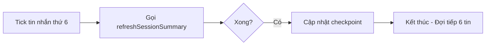
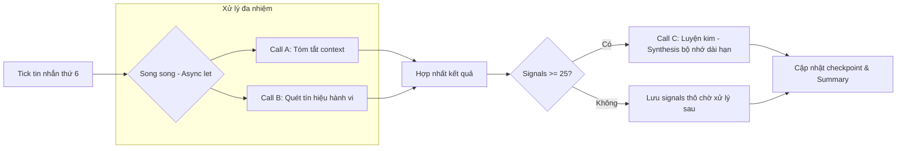
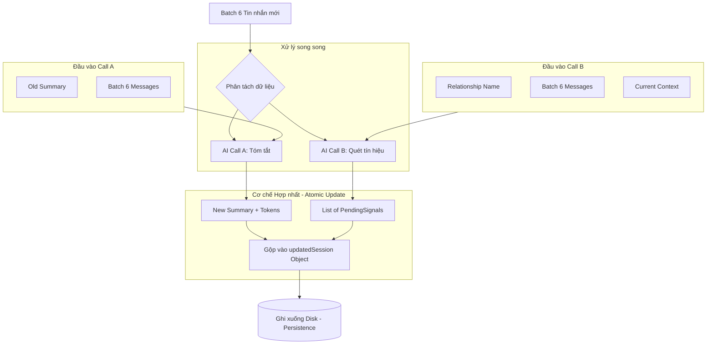
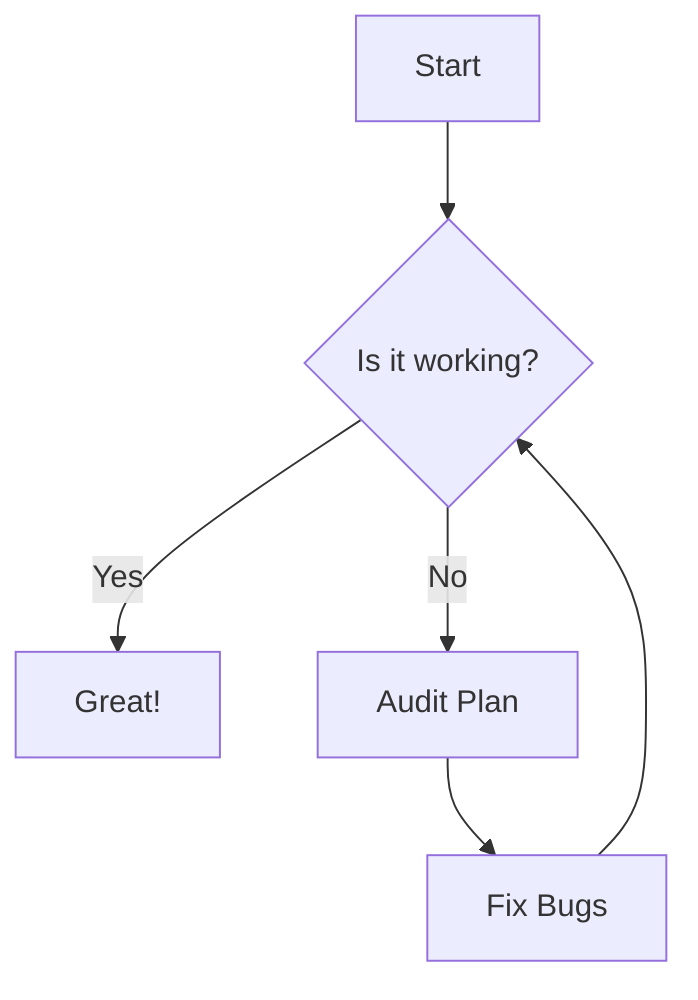
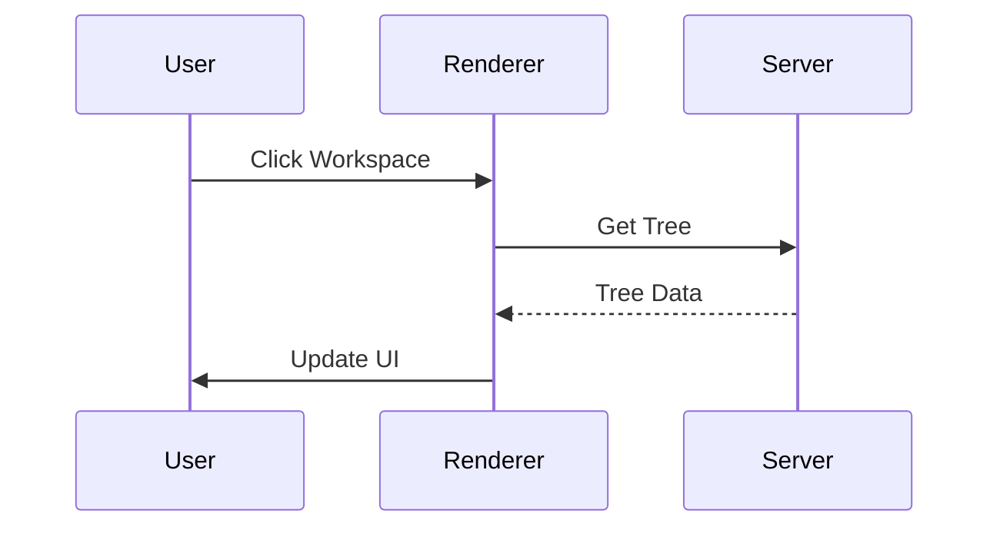
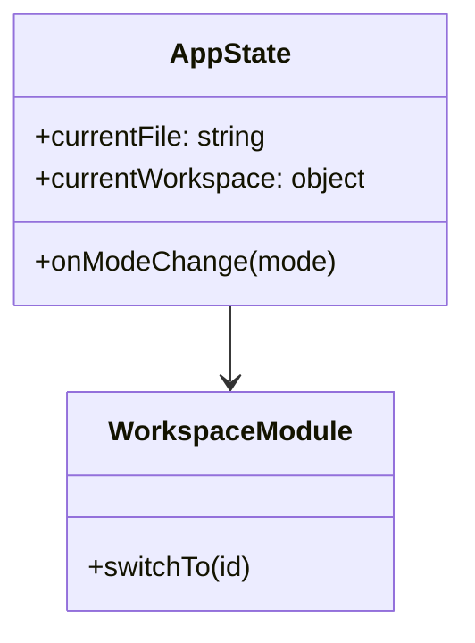

# Module: TESTS


<file path="tests/TestContent/rolling_summary_update_analysis.md">
```md
# 🔄 Technical Deep Dive: `handleRollingSummaryIfNeeded` Update

Hàm `handleRollingSummaryIfNeeded` đóng vai trò là mẫu chốt điều phối trong mỗi phiên Chat. Bản cập nhật mới nhất chuyển dịch từ việc chỉ tóm tắt (Summary) sang việc **thu hoạch dữ liệu song song**.

---

## 🛠️ Mã nguồn & Chú thích Swift Doc

```swift
/**
 Kích hoạt việc tóm tắt cửa sổ trượt (Call A) và quét tín hiệu (Call B) song song.
 
 - Parameters:
    - session: ChatSession hiện tại đang tương tác.
 - Returns: Session đã được cập nhật summary và danh sách signals mới.
 - Note: Hàm này thực thi cơ chế "Intermediate Synthesis" khi số lượng tín hiệu vượt ngưỡng 25.
 - Precondition: Được gọi mỗi khi có tin nhắn mới gửi/nhận thành công.
 */
private func handleRollingSummaryIfNeeded(session: ChatSession) async throws -> ChatSession {
    // Logic thực thi chi tiết bên dưới
}
```

---

## 🏗️ Phân tích Chi tiết từng Block Logic

### 1. Điều kiện kích hoạt (Trigger Logic)
```swift
var updatedSession = session
let batchSize = 6
let fallenCount = updatedSession.messages.count - maxRawHistory

guard fallenCount > 0 && fallenCount % batchSize == 0 else { return updatedSession }
```
-   **`maxRawHistory`**: Giới hạn số tin nhắn "thô" mà AI được phép đọc trực tiếp ( Sliding Window).
-   **`% batchSize == 0`**: Logic này đảm bảo cứ sau đúng **6 tin nhắn** rơi ra khỏi cửa sổ trượt, hệ thống mới kích hoạt AI một lần. Điều này giúp tối ưu hóa chi phí API và tránh việc gọi AI quá dày đặc.

---

### 2. Sức mạnh của Sự song song (Parallel Execution)
Đây là thay đổi quan trọng nhất so với phiên bản cũ.

```swift
// Bước chuẩn bị batch tin nhắn cần xử lý
let startIndex = fallenCount - batchSize
let endIndex = fallenCount
let messagesToProcess = Array(updatedSession.messages[startIndex..<endIndex])

// KÍCH HOẠT SONG SONG
async let summaryResult = refreshSessionSummary(
    oldSummary: updatedSession.sessionSummary,
    newMessages: messagesToProcess
)
async let signalsResult: [PendingChatSignal] = updatedSession.mode == .normal
    ? runSignalScanner(
        messages: messagesToProcess,
        relationshipName: cachedRelationshipName ?? "Unknown",
        sessionSummary: updatedSession.sessionSummary
    )
    : []

// CHỜ CẢ HAI HOÀN THÀNH
let (newSum, sumTokens) = try await summaryResult
let newSignals = await signalsResult
```
-   **`async let`**: Thay vì đợi Call A xong mới chạy Call B, hệ thống "bắn" cả hai yêu cầu lên OpenAI cùng lúc. Thời gian chờ tổng cộng giảm xuống chỉ còn bằng thời gian của Call lâu nhất.
-   **Tối ưu hóa nội dung**: Batch tin nhắn `messagesToProcess` được dùng chung cho cả hai mục đích: Cập nhật tóm tắt và Tìm tín hiệu hành vi.

---

### 3. Cơ chế "Luyện kim" giữa phiên (Intermediate Synthesis)
Trước đây, chúng ta chỉ tổng hợp bộ nhớ khi đóng Chat. Giờ đây, chúng ta học ngay trong lúc Chat.

```swift
if !newSignals.isEmpty {
    var existing = updatedSession.pendingChatSignals ?? []
    existing.append(contentsOf: newSignals)

    // NGƯỠNG ĐỘC LẬP: 25 signals
    if existing.count >= 25, let relName = cachedRelationshipName {
        let toSynthesize = Array(existing.prefix(25))
        existing = Array(existing.dropFirst(25)) // Giữ lại phần dư
        
        // Gọi Synthesis trong Task riêng (Background)
        let sessionID = updatedSession.id
        let relID = updatedSession.relationshipID

        Task.detached(priority: .background) {
            await self.runChatSynthesis(
                signals: toSynthesize,
                relationshipName: relName,
                sessionID: sessionID,
                relationshipID: relID
            )
        }
    }
    updatedSession.pendingChatSignals = existing.isEmpty ? nil : existing
}
```
-   **Logic**: Nếu cuộc hội thoại kéo dài và AI thu hoạch được quá nhiều tín hiệu (>= 25), nó sẽ tự động "đóng gói" 25 tín hiệu đầu tiên thành một **ChatMemory** chính thức.
-   **Lợi ích**:
    1.  Giảm tải lượng dữ liệu phải xử lý khi kết thúc session.
    2.  Làm sạch mảng `pendingChatSignals` giúp giảm kích thước file lưu trữ trên Disk.
    3.  Đảm bảo AI "thông minh lên" ngay lập tức nếu người dùng chat quá lâu.

---

### 4. Cập nhật Checkpoint cuối cùng
```swift
updatedSession.sessionSummary = newSum
updatedSession.lastScannedMessageIndex = endIndex
TouchEnergyManager.shared.recordUsage(tokens: sumTokens)
```
-   **Ghi nhận**: Cập nhật tóm tắt mới và đánh dấu checkpoint tin nhắn đã quét.
-   **Energy**: Ghi nhận mức tiêu thụ năng lượng của AI (Call A).

---

## 📊 So sánh: Cũ vs. Mới

| Đặc tính | Phiên bản cũ | Phiên bản mới (Update C7) |
| :--- | :--- | :--- |
| **Concurrency** | Tuần tự (Sequential) | Song song (Parallel async let) |
| **Data Harvest** | Chỉ có Summary | Summary + Behavioral Signals |
| **Synthesis Trigger** | Chỉ khi Close Chat | Ngay khi đạt ngưỡng 25 signals |
| **Performance** | Chậm hơn (Tích lũy thời gian) | Nhanh hơn (Max của một call đơn) |

---
---

## 📊 Trực quan hóa So sánh Logic: Before vs. After

Sử dụng sơ đồ luồng để minh họa sự thay đổi từ việc "chỉ tóm tắt" sang "xử lý đa nhiệm" thông minh.

### 🔴 BEFORE: Logic cũ (Tuần tự & Đơn nhiệm)
*Hệ thống chỉ lo việc tóm tắt để giải phóng Token, bỏ qua việc học hỏi hành vi.*



### 🟢 AFTER: Logic mới (Song song & Đa học hỏi)
*Hệ thống vừa bảo trì Token, vừa thu hoạch tín hiệu hành vi và tự tổng hợp tri thức ngay lập tức.*



---

## 💾 Trực quan hóa Luồng dữ liệu & Cơ chế Hợp nhất (Data Merging)

Phần này giải thích cách dữ liệu được phân tách để xử lý song song và tại sao chúng ta phải "hợp nhất" chúng lại trước khi kết thúc.

### 📤 Sơ đồ Luồng dữ liệu (Data Flow)



### ❓ Tại sao cần "Hợp nhất" kết quả?

Trong code, chúng ta sử dụng `async let` để nhận về hai kết quả độc lập (`newSum` và `newSignals`). Việc hợp nhất chúng vào `updatedSession` là bắt buộc vì:

1.  **Tính toàn vẹn (Data Integrity)**: `ChatSession` là một đối tượng duy nhất trên Disk. Nếu chúng ta ghi `newSum` xuống trước rồi mới ghi `newSignals` sau, và app bị crash ở giữa, dữ liệu sẽ bị lệch (Summary mới nhưng Signals cũ). Hợp nhất giúp chúng ta thực hiện một lệnh **Update nguyên tử (Atomic)**.
2.  **Đồng bộ Checkpoint**: Cả hai Call đều dùng chung một mốc tin nhắn (`endIndex`). Việc hợp nhất đảm bảo rằng khi session được đánh dấu là "đã quét đến tin thứ n", thì cả tóm tắt và tín hiệu đều đã cập nhật đến đúng tin đó.
3.  **Cung cấp Context cho Interaction**: `updatedSession` sau khi hợp nhất sẽ được trả về cho luồng chính để UI (ChatDetailView) có thể hiển thị Summary mới nhất ngay lập tức mà không cần load lại từ Disk.

### 📝 Chi tiết Input/Output

| Thành phần | Input (Đầu vào) | Output (Đầu ra) |
| :--- | :--- | :--- |
| **Call A (Summary)** | Summary cũ + 6 Tin nhắn mới | Bản tóm tắt mới + Số lượng Token |
| **Call B (Scanner)** | Tên đối tượng + 6 Tin nhắn + Context hiện tại | Mảng các `PendingChatSignal` (Trích dẫn + Ý nghĩa) |
| **Hợp nhất (Merge)** | Kết quả từ Call A & B | Đối tượng `ChatSession` hoàn chỉnh đã cập nhật checkpoint |

```
</file>

<file path="tests/audit-security.js">
```js
/**
 * audit-security.js — Automated Security & Stress Test Suite
 * Run with: node tests/audit-security.js
 */

const path = require('path');
const fs = require('fs');

const COLORS = {
  RESET: "\x1b[0m",
  RED: "\x1b[31m",
  GREEN: "\x1b[32m",
  YELLOW: "\x1b[33m",
  CYAN: "\x1b[36m"
};

function log(msg, color = COLORS.RESET) {
  console.log(`${color}${msg}${COLORS.RESET}`);
}

// ── Mock resolvePath logic (copied from server for testing) ──────────
function resolvePath(watchDir, filePath) {
  const fullPath = path.isAbsolute(filePath) ? path.normalize(filePath) : path.resolve(watchDir, filePath);
  const normalizedWatchDir = path.normalize(watchDir);
  if (!fullPath.startsWith(normalizedWatchDir)) {
    throw new Error('Security Error: Path traversal detected.');
  }
  return fullPath;
}

// ── Test Runner ───────────────────────────────────────────────
async function runTests() {
  log("🚀 Starting MDpreview Security & Stress Audit...", COLORS.CYAN);

  let passed = 0;
  let failed = 0;

  const test = (name, fn) => {
    try {
      fn();
      log(`✅ PASS: ${name}`, COLORS.GREEN);
      passed++;
    } catch (e) {
      log(`❌ FAIL: ${name} -> ${e.message}`, COLORS.RED);
      failed++;
    }
  };

  const MOCK_WS = "/Users/mchisdo/MDpreview";

  // 1. Path Traversal Tests
  test("Should allow valid file in workspace", () => {
    const res = resolvePath(MOCK_WS, "README.md");
    if (!res.includes(MOCK_WS)) throw new Error("Path incorrect");
  });

  test("Should block relative traversal (../../etc/passwd)", () => {
    try {
      resolvePath(MOCK_WS, "../../etc/passwd");
      throw new Error("Traversed successfully! (VULNERABLE)");
    } catch (e) {
      if (e.message.includes("Path traversal detected")) return;
      throw e;
    }
  });

  test("Should block absolute traversal (/etc/passwd)", () => {
    try {
      resolvePath(MOCK_WS, "/etc/passwd");
      throw new Error("Traversed successfully! (VULNERABLE)");
    } catch (e) {
      if (e.message.includes("Path traversal detected")) return;
      throw e;
    }
  });

  test("Should block tricky traversal (./../MDpreview/../../etc/passwd)", () => {
    try {
      resolvePath(MOCK_WS, "./../MDpreview/../../etc/passwd");
      throw new Error("Traversed successfully! (VULNERABLE)");
    } catch (e) {
      if (e.message.includes("Path traversal detected")) return;
      throw e;
    }
  });

  // 2. Special Characters Test
  test("Should handle spaces and symbols in filenames", () => {
    const weirdName = "File # With & Spaces.md";
    const res = resolvePath(MOCK_WS, weirdName);
    if (!res.endsWith(weirdName)) throw new Error("Filename corrupted");
  });

  // 3. Stress Test Simulation (File Size)
  test("Large file path resolution performance", () => {
    const start = Date.now();
    for(let i=0; i<1000; i++) {
        resolvePath(MOCK_WS, "folder/sub/sub/sub/file_" + i + ".md");
    }
    const end = Date.now();
    if (end - start > 100) throw new Error("Path resolution too slow: " + (end-start) + "ms");
    log(`   (1000 paths resolved in ${end - start}ms)`, COLORS.YELLOW);
  });

  log("\n--- Audit Summary ---", COLORS.CYAN);
  log(`Total: ${passed + failed}`, COLORS.RESET);
  log(`Passed: ${passed}`, COLORS.GREEN);
  log(`Failed: ${failed}`, failed > 0 ? COLORS.RED : COLORS.GREEN);

  if (failed > 0) process.exit(1);
}

runTests();

```
</file>

<file path="tests/audit-test-suite.md">
```md
# 🧪 MDpreview Audit Test Suite

This file is designed to test the edge cases of the Markdown renderer and UI.

## 1. Typography & Basic Styles
Testing **bold**, *italic*, ~~strikethrough~~, and `inline code`.
Testing [links](https://google.com) and .

## 2. Lists & Nesting
- Level 1
    - Level 2
        - Level 3 with `code`
    - Level 2 again
- Level 1 again

1. Ordered Item 1
    1. Sub-item A
    2. Sub-item B
2. Ordered Item 2

> [!NOTE]
> This is a GitHub-style alert (if supported by our renderer).
> > Nested blockquote test.

## 3. Tables
| Feature | Status | Priority | Notes |
| :--- | :---: | :---: | :--- |
| Workspace Switching | ✅ | P0 | Needs isolation check |
| Tab Persistence | 🔄 | P1 | Check localStorage |
| Mermaid Zoom | ❌ | P0 | Test large diagrams |

## 4. Complex Mermaid Diagrams
### Flowchart


### Sequence Diagram


### Class Diagram


## 5. Details & Summary (Collapsible)
<details>
<summary>Click to expand advanced settings</summary>

- Setting A: Enabled
- Setting B: Disabled
- Nested table:
    | Key | Value |
    |---|---|
    | Key 1 | Val 1 |

</details>

## 6. Code Blocks (Syntax Highlighting)
```javascript
function helloWorld() {
  console.log("Hello, MDpreview!");
  const app = {
    version: '1.0.0',
    features: ['markdown', 'mermaid', 'comments']
  };
}
```

```python
def calculate_gravity(mass):
    # Testing indentation and comments
    G = 6.67430e-11
    return G * mass
```

## 7. Special Characters & Emojis
🚀 🧪 🎨 🤖 🛠️
Path simulation: `/Users/mchisdo/Projects/Test Suite (Space Test) 🔥/index.md`

## 8. Large Content Stress Test
Inserting a lot of repetitive text to test scroll performance...
Lorem ipsum dolor sit amet, consectetur adipiscing elit. ... (Imagine 1000 more lines)

```
</file>

<file path="tests/editor-module.test.js">
```js
/**
 * @vitest-environment jsdom
 */
import { describe, it, expect, beforeEach, vi } from 'vitest';
import fs from 'fs';
import path from 'path';

// ── Mock Dependencies ──────────────────────────────────────────
global.AppState = {
  currentFile: 'test.md'
};

global.MarkdownLogicService = {
  applyAction: vi.fn(),
  syncCursor: vi.fn()
};

// ── Load the Module Code ──────────────────────────────────────
const modulePath = path.resolve(__dirname, '../renderer/js/modules/editor.js');
const moduleCode = fs.readFileSync(modulePath, 'utf8');

// Inject into global scope
const script = new Function('global', moduleCode + '\n global.EditorModule = EditorModule;');
script(global);

describe('EditorModule - Refactored Service', () => {
  let textarea;

  beforeEach(() => {
    document.body.innerHTML = '<textarea id="test-editor"></textarea>';
    textarea = document.getElementById('test-editor');
    vi.clearAllMocks();
    
    // Reset internal state
    global.EditorModule.bindToElement(null);
  });

  it('TC-Editor-01: should bind to a textarea element', () => {
    global.EditorModule.bindToElement(textarea);
    // Internal state should now point to this textarea
    // We can verify by calling an action
    global.EditorModule.applyAction('b');
    expect(global.MarkdownLogicService.applyAction).toHaveBeenCalledWith(textarea, 'b');
  });

  it('TC-Editor-02: should track dirty state', () => {
    global.EditorModule.bindToElement(textarea);
    global.EditorModule.setOriginalContent('old');
    
    expect(global.EditorModule.isDirty()).toBe(false);
    
    textarea.value = 'new';
    expect(global.EditorModule.isDirty()).toBe(true);
  });

  it('TC-Editor-03: should clear dirty state after save', async () => {
    // Mock fetch for save
    global.fetch = vi.fn().mockResolvedValue({
      ok: true,
      json: () => Promise.resolve({ success: true })
    });

    global.EditorModule.bindToElement(textarea);
    global.EditorModule.setOriginalContent('old');
    textarea.value = 'new';
    
    await global.EditorModule.save();
    expect(global.EditorModule.isDirty()).toBe(false);
  });

  it('TC-Editor-04: should handle focusWithContext', () => {
    global.EditorModule.bindToElement(textarea);
    const context = { line: 5, selectionText: 'hello' };
    
    global.EditorModule.focusWithContext(context);
    
    expect(textarea === document.activeElement).toBe(true);
    expect(global.MarkdownLogicService.syncCursor).toHaveBeenCalledWith(textarea, context);
  });
});

```
</file>

<file path="tests/markdown-logic.test.js">
```js
/**
 * @vitest-environment jsdom
 */
import { describe, it, expect, beforeEach, vi } from 'vitest';
import fs from 'fs';
import path from 'path';

// Load Service Code
const servicePath = path.resolve(__dirname, '../renderer/js/services/markdown-logic-service.js');
const serviceCode = fs.readFileSync(servicePath, 'utf8');

// Inject into global scope
const script = new Function('global', serviceCode + '\n global.MarkdownLogicService = MarkdownLogicService;');
script(global);

describe('MarkdownLogicService - Actions', () => {
  let textarea;

  beforeEach(() => {
    document.body.innerHTML = '<textarea id="test-editor"></textarea>';
    textarea = document.getElementById('test-editor');
  });

  it('TC-01: should toggle Bold ON', () => {
    textarea.value = 'hello';
    textarea.setSelectionRange(0, 5);
    global.MarkdownLogicService.applyAction(textarea, 'b');
    expect(textarea.value).toBe('**hello**');
    // Check selection (should select the whole new text including symbols)
    expect(textarea.selectionStart).toBe(0);
    expect(textarea.selectionEnd).toBe(9);
  });

  it('TC-02: should toggle Bold OFF', () => {
    textarea.value = '**hello**';
    textarea.setSelectionRange(0, 9);
    global.MarkdownLogicService.applyAction(textarea, 'b');
    expect(textarea.value).toBe('hello');
    expect(textarea.selectionStart).toBe(0);
    expect(textarea.selectionEnd).toBe(5);
  });

  it('TC-03: should apply H1 header', () => {
    textarea.value = 'Title';
    textarea.setSelectionRange(0, 5);
    global.MarkdownLogicService.applyAction(textarea, 'h1');
    expect(textarea.value).toBe('# Title');
  });

  it('TC-04: should switch from H1 to H2', () => {
    textarea.value = '# Title';
    textarea.setSelectionRange(0, 7);
    global.MarkdownLogicService.applyAction(textarea, 'h2');
    expect(textarea.value).toBe('## Title');
  });

  it('TC-05: should toggle Header OFF when same level', () => {
    textarea.value = '### Title';
    textarea.setSelectionRange(0, 9);
    global.MarkdownLogicService.applyAction(textarea, 'h3');
    expect(textarea.value).toBe('Title');
  });
  
  it('TC-06: should handle List Toggle', () => {
    textarea.value = 'Item';
    textarea.setSelectionRange(0, 4);
    global.MarkdownLogicService.applyAction(textarea, 'ul');
    expect(textarea.value).toBe('* Item');
  });
});

describe('MarkdownLogicService - Sync (Sandwich Strategy)', () => {
  let textarea;

  beforeEach(() => {
    // Mock getComputedStyle for scroll logic
    window.getComputedStyle = vi.fn().mockReturnValue({ lineHeight: '24px' });
    document.body.innerHTML = '<textarea id="test-editor" style="line-height:24px"></textarea>';
    textarea = document.getElementById('test-editor');
    // Mock scrollTop
    Object.defineProperty(textarea, 'scrollTop', {
        writable: true,
        value: 0
    });
  });

  it('TC-07: should find text using Sandwich Strategy after content drift', () => {
    // Simulated content with some drift (extra newlines)
    textarea.value = '\n\nExtra lines...\nTarget Text here';
    
    const context = {
      line: 1, // Legacy line was 1
      selectionText: 'Target Text',
      offset: 0
    };
    
    global.MarkdownLogicService.syncCursor(textarea, context);
    
    // It should have found the text at a later position
    const start = textarea.selectionStart;
    const end = textarea.selectionEnd;
    expect(textarea.value.substring(start, end)).toBe('Target Text');
    expect(start).toBeGreaterThan(10); // Definitely not at line 1 anymore
  });

  it('TC-08: should handle Longest Word Fallback', () => {
    textarea.value = 'Some prefix\nSuperUniqueWordThatMatchesNothingElse\nSome suffix';
    
    const context = {
      line: 10, // Wrong line
      selectionText: 'SuperUniqueWordThatMatchesNothingElse',
      offset: 0
    };
    
    global.MarkdownLogicService.syncCursor(textarea, context);
    
    expect(textarea.value.substring(textarea.selectionStart, textarea.selectionEnd)).toBe('SuperUniqueWordThatMatchesNothingElse');
  });
});

```
</file>

<file path="tests/markdown-viewer.test.js">
```js
/**
 * @vitest-environment jsdom
 */
import { describe, it, expect, beforeEach, vi } from 'vitest';
import fs from 'fs';
import path from 'path';

// ── Mock Dependencies ──────────────────────────────────────────
global.DesignSystem = {
  createElement: (tag, className, options = {}) => {
    const el = document.createElement(tag);
    if (className) el.className = className;
    Object.keys(options).forEach(key => {
      if (key === 'id') el.id = options[key];
      else if (key === 'placeholder') el.placeholder = options[key];
      else if (key === 'html') el.innerHTML = options[key];
      else el.setAttribute(key, options[key]);
    });
    return el;
  },
  createButton: ({ label, variant, onClick }) => {
    const btn = document.createElement('button');
    btn.textContent = label;
    btn.className = `ds-button-${variant}`;
    btn.onclick = onClick;
    return btn;
  },
  getIcon: (name) => `<svg data-icon="${name}"></svg>`
};

global.AppState = {
  currentMode: 'read',
  currentFile: null,
  lastSyncContext: null
};

global.EditorModule = {
  bindToElement: vi.fn(),
  unbind: vi.fn(),
  applyAction: vi.fn(),
  save: vi.fn().mockResolvedValue(true)
};

global.MarkdownLogicService = {
  syncCursor: vi.fn()
};

global.processMermaid = vi.fn();
global.CodeBlockModule = {
  process: vi.fn()
};

global.ScrollModule = {
  setContainer: vi.fn(),
  save: vi.fn(),
  restore: vi.fn()
};

// ── Load the Component Code ───────────────────────────────────
const componentPath = path.resolve(__dirname, '../renderer/js/components/organisms/markdown-viewer-component.js');
const componentCode = fs.readFileSync(componentPath, 'utf8');

// Inject into global scope
const script = new Function('global', componentCode + '\n global.MarkdownViewerComponent = MarkdownViewerComponent;');
script(global);

describe('MarkdownViewerComponent - Lifecycle & Rendering', () => {
  let viewer;
  let mount;

  beforeEach(() => {
    document.body.innerHTML = '<div id="md-viewer-mount"></div>';
    mount = document.getElementById('md-viewer-mount');
    vi.clearAllMocks();
    viewer = new global.MarkdownViewerComponent({ mount });
  });

  it('TC-Viewer-01: should render EmptyState by default', () => {
    expect(document.getElementById('empty-state')).not.toBeNull();
    expect(mount.innerHTML).toContain('MDpreview');
  });

  it('TC-Viewer-02: should switch to Read mode and render HTML', () => {
    viewer.setState({
      mode: 'read',
      file: 'test.md',
      html: '<h1>Hello Test</h1>'
    });

    const content = document.getElementById('md-content');
    expect(content).not.toBeNull();
    expect(content.innerHTML).toContain('Hello Test');
  });

  it('TC-Viewer-03: should switch to Edit mode and bind EditorModule', () => {
    viewer.setState({
      mode: 'edit',
      file: 'test.md',
      content: '# Initial Content'
    });

    const textarea = document.getElementById('edit-textarea');
    expect(textarea).not.toBeNull();
    expect(textarea.value).toBe('# Initial Content');
    
    // Check if EditorModule.bindToElement was called
    expect(global.EditorModule.bindToElement).toHaveBeenCalledWith(textarea);
  });

  it('TC-Viewer-04: should switch from Edit back to Read', () => {
    // 1. Enter Edit
    viewer.setState({ mode: 'edit', file: 'test.md' });
    expect(document.getElementById('edit-viewer')).not.toBeNull();

    // 2. Switch to Read
    viewer.setState({ mode: 'read', file: 'test.md', html: '<p>Updated</p>' });
    expect(document.getElementById('edit-viewer')).toBeNull();
    expect(document.getElementById('md-content')).not.toBeNull();
    expect(document.getElementById('md-content').innerHTML).toContain('Updated');
  });

  it('TC-Viewer-05: should trigger Editor action from toolbar', () => {
    viewer.setState({ mode: 'edit', file: 'test.md' });
    
    const boldBtn = document.querySelector('[data-action="b"]');
    expect(boldBtn).not.toBeNull();
    
    boldBtn.click();
    expect(global.EditorModule.applyAction).toHaveBeenCalledWith('b');
  });

  it('TC-Viewer-06: should re-render when switching between files (Tab Switching)', () => {
    // 1. Initial File
    viewer.setState({ mode: 'read', file: 'file1.md', html: '<p>File 1</p>' });
    expect(mount.innerHTML).toContain('File 1');

    // 2. Switch Tab (Same Mode, Different File)
    viewer.setState({ mode: 'read', file: 'file2.md', html: '<p>File 2</p>' });
    expect(mount.innerHTML).toContain('File 2');
    expect(mount.innerHTML).not.toContain('File 1');
  });

  it('TC-Viewer-07: should handle Draft content updates correctly', async () => {
    viewer.setState({ mode: 'read', file: '__DRAFT_1', html: '<p>Draft v1</p>' });
    expect(mount.innerHTML).toContain('Draft v1');

    // Update same draft (isFileChange = false, isModeChange = false, but content/html changed)
    // The component should call update() instead of full render()
    const updateSpy = vi.spyOn(viewer.activeComponent, 'update');
    
    viewer.setState({ html: '<p>Draft v2</p>' });
    
    await vi.waitFor(() => {
      expect(updateSpy).toHaveBeenCalled();
      expect(mount.innerHTML).toContain('Draft v2');
    });
  });

  it('TC-Viewer-08: should trigger post-render processors (Mermaid, CodeBlocks)', async () => {
    viewer.setState({ 
      mode: 'read', 
      file: 'complex.md', 
      html: '<div class="mermaid">graph TD; A-->B;</div>' 
    });

    await vi.waitFor(() => {
      expect(global.processMermaid).toHaveBeenCalled();
      expect(global.CodeBlockModule.process).toHaveBeenCalled();
      expect(global.ScrollModule.setContainer).toHaveBeenCalledWith(mount, 'complex.md');
      expect(global.ScrollModule.restore).toHaveBeenCalledWith('complex.md');
    });
  });

  it('TC-Viewer-09: should handle rapid mode switching without overlapping views', () => {
    viewer.setState({ mode: 'read', file: 'test.md', html: 'Read View' });
    viewer.setState({ mode: 'edit', file: 'test.md', content: 'Edit View' });
    viewer.setState({ mode: 'read', file: 'test.md', html: 'Final Read View' });

    expect(mount.innerHTML).toContain('Final Read View');
    expect(document.getElementById('edit-viewer')).toBeNull();
    expect(document.getElementById('md-content')).not.toBeNull();
  });

  it('TC-Viewer-10: should verify the Singleton Bridge (window.MarkdownViewer)', () => {
    const bridge = global.MarkdownViewer;
    const inst1 = bridge.init({ mount });
    const inst2 = bridge.getInstance();
    
    expect(inst1).toBe(inst2);
    expect(inst1).toBeInstanceOf(global.MarkdownViewerComponent);
  });

  it('TC-Viewer-11: should audit all typography toolbar actions', () => {
    viewer.setState({ mode: 'edit', file: 'test.md' });
    
    const actions = ['h', 'b', 'i', 's', 'q', 'l', 'img', 'hr', 'ul', 'ol', 'tl', 'c', 'cb', 'tb'];
    actions.forEach(action => {
      const btn = document.querySelector(`[data-action="${action}"]`);
      expect(btn, `Button for action ${action} should exist`).not.toBeNull();
      btn.click();
      expect(global.EditorModule.applyAction).toHaveBeenCalledWith(action);
    });
  });

  it('TC-Viewer-12: should render MarkdownPreview for comment and collect modes', () => {
    // 1. Comment Mode
    viewer.setState({ mode: 'comment', file: 'test.md', html: '<p>Comment View</p>' });
    expect(document.getElementById('md-content')).not.toBeNull();
    expect(mount.innerHTML).toContain('Comment View');

    // 2. Collect Mode
    viewer.setState({ mode: 'collect', file: 'test.md', html: '<p>Collect View</p>' });
    expect(document.getElementById('md-content')).not.toBeNull();
    expect(mount.innerHTML).toContain('Collect View');
  });

  it('TC-Viewer-13: should save old scroll position before switching files', () => {
    // Start with file A
    viewer.setState({ mode: 'read', file: 'fileA.md', html: '<p>A</p>' });
    
    // Switch to file B
    viewer.setState({ file: 'fileB.md', html: '<p>B</p>' });
    
    // Should have saved fileA
    expect(global.ScrollModule.save).toHaveBeenCalledWith('fileA.md');
  });
});

```
</file>

<file path="tests/sidebar-left.test.js">
```js
/**
 * @vitest-environment jsdom
 */
import { describe, it, expect, beforeEach, vi } from 'vitest';
import fs from 'fs';
import path from 'path';

// ── Mock AppState ─────────────────────────────────────────────
global.AppState = {
  settings: { sidebarWidth: 260 },
  savePersistentState: vi.fn()
};

// ── Setup Mocks ───────────────────────────────────────────────
global.localStorage = {
  getItem: vi.fn(),
  setItem: vi.fn(),
  removeItem: vi.fn(),
  key: vi.fn(),
  length: 0
};

// ── Load the Component Code ───────────────────────────────────
const componentPath = path.resolve(__dirname, '../renderer/js/components/organisms/sidebar-left.js');
const componentCode = fs.readFileSync(componentPath, 'utf8');

// Inject into global scope
const script = new Function('global', componentCode + '\n global.SidebarLeftComponent = SidebarLeftComponent;');
script(global);

describe('SidebarLeftComponent', () => {
  let sidebar;
  let mount;

  beforeEach(() => {
    document.body.innerHTML = '<div id="sidebar-left-mount"></div>';
    mount = document.getElementById('sidebar-left-mount');
    vi.clearAllMocks();
    // Create fresh instance for each test to avoid singleton issues
    sidebar = new global.SidebarLeftComponent({ mount });
  });

  it('should render the basic structure', () => {
    expect(document.getElementById('sidebar-left-wrap')).not.toBeNull();
    expect(document.getElementById('sidebar-left')).not.toBeNull();
    expect(document.getElementById('sidebar-resizer')).not.toBeNull();
  });

  it('should have all necessary mount points', () => {
    expect(document.getElementById('sidebar-md-header')).not.toBeNull();
    expect(document.getElementById('file-tree')).not.toBeNull();
    expect(document.getElementById('sidebar-search-mount')).not.toBeNull();
    expect(document.getElementById('recently-viewed-list')).not.toBeNull();
  });

  it('should handle view switching correctly', () => {
    const explorerView = document.getElementById('sidebar-explorer-view');
    const searchView = document.getElementById('sidebar-search-view');
    const mdHeader = document.getElementById('sidebar-md-header');

    // Switch to SEARCH
    sidebar.switchView(sidebar.VIEWS.SEARCH);
    expect(searchView.style.display).toBe('flex');
    expect(mdHeader.style.display).toBe('none');
    expect(explorerView.style.display).toBe('none');

    // Switch to EXPLORER
    sidebar.switchView(sidebar.VIEWS.EXPLORER);
    expect(explorerView.style.display).toBe('flex');
    expect(mdHeader.style.display).toBe('flex');
    expect(searchView.style.display).toBe('none');
  });

  it('should load saved width from localStorage', () => {
    global.localStorage.getItem.mockReturnValue('400');
    
    const newSidebar = new global.SidebarLeftComponent({ mount });
    expect(newSidebar.state.width).toBe(400);
    
    const wrap = document.getElementById('sidebar-left-wrap');
    expect(wrap.style.width).toBe('400px');
  });

  it('should show "Loading..." by default in workspace name', () => {
    const wsName = document.getElementById('workspace-name');
    expect(wsName.textContent).toBe('Loading...');
  });
});

```
</file>

<file path="tests/sync-cursor.test.js">
```js
/**
 * @vitest-environment jsdom
 *
 * Sync Cursor Test Suite — tests the core fuzzy matching logic
 * by extracting and re-implementing the algorithm from markdown-logic-service.js
 *
 * TC-S01  Exact match on correct line
 * TC-S02  Fuzzy match when hint line is offset
 * TC-S03  Emoji prefix (📊 SESSION 3)
 * TC-S04  Single digit suffix preserved
 * TC-S05  Duplicate phrases — nearest line wins
 * TC-S06  Special chars ($0.001279, #hash, *star*)
 * TC-S07  Vietnamese / CJK unicode
 * TC-S08  Long paragraph (head-word anchor)
 * TC-S09  Code block content
 * TC-S10  Table cell text
 * TC-S11  Deeply nested blockquote
 * TC-S12  Selection at first line
 * TC-S13  Selection at last line
 * TC-S14  Empty / noisy line → line-number fallback
 * TC-S15  selectionText < 3 chars → line-number fallback
 * TC-S16  Hint line > 150 off → reject match
 * TC-S17  Repeated phrase — nearest instance wins
 * TC-S18  Markdown heading with # stripped
 * TC-S19  Mixed emoji + number + text
 * TC-S20  Decimal numbers preserved
 * TC-R01..R08  captureEditorSyncData regex simulation
 */

import { describe, it, expect } from 'vitest';

// ══════════════════════════════════════════════════════════════════
// Pure re-implementation of the core fuzzy-match logic
// (mirrors markdown-logic-service.js syncCursor algorithm)
// ══════════════════════════════════════════════════════════════════

/**
 * Given raw markdown text and a context hint, returns the best-matching
 * character index (and the line number it lands on).
 */
function findTargetChar(text, context) {
  if (!context.selectionText || context.selectionText.length <= 2) return -1;

  const lines = text.split('\n');

  // ── 1. Exact match at predicted position ──
  let startOfLine = 0;
  const targetLineIdx = Math.min((context.line || 1) - 1, lines.length - 1);
  for (let i = 0; i < targetLineIdx; i++) {
    startOfLine += (lines[i] ? lines[i].length : 0) + 1;
  }
  const predictedPos = startOfLine + (context.offset || 0);
  const sample = text.substring(predictedPos, predictedPos + context.selectionText.length);
  if (sample === context.selectionText) {
    return predictedPos;
  }

  // ── 2. Fuzzy Match (Sandwich Strategy) ──
  const normalizedSelection = context.selectionText.replace(/[""''«»]/g, ' ');
  // Keep single-char digit tokens (e.g. "SESSION 3" → keep "3")
  const allWords = normalizedSelection.trim()
    .split(/[\s,\-()""''«»\[\]{}:;!?\/\\]+/)
    .filter(w => w.length > 1 || /^\d+$/.test(w));

  if (allWords.length === 0) return -1;

  const buildPattern = (words) => words
    .map(w => w.replace(/[.*+?^${}()|[\]\\]/g, '\\$&'))
    .join('[^\\n]{0,100}?');

  const findBestMatch = (pattern, isLiteral = false) => {
    try {
      const regex = new RegExp(pattern, (isLiteral ? 'g' : 'gi') + 'u');
      let match;
      let best = null;
      let minDistance = Infinity;
      while ((match = regex.exec(text)) !== null) {
        const matchIdx = match.index;
        const matchLine = text.substring(0, matchIdx).split('\n').length;
        const distance = Math.abs(matchLine - (context.line || 1));
        if (distance < minDistance) {
          minDistance = distance;
          best = { index: matchIdx, length: match[0].length, line: matchLine, distance };
        }
      }
      return best;
    } catch (_e) { return null; }
  };

  const headWords = allWords.slice(0, 5);
  let matchResult = findBestMatch(buildPattern(headWords));

  // Triple-word anchor fallback
  if (!matchResult && allWords.length >= 3) {
    for (let i = 0; i <= allWords.length - 3; i++) {
      const result = findBestMatch(buildPattern(allWords.slice(i, i + 3)));
      if (result && result.distance < 100) { matchResult = result; break; }
    }
  }

  // Best single word fallback
  if (!matchResult && allWords.length > 0) {
    const bestWord = [...allWords].sort((a, b) => b.length - a.length)[0];
    if (bestWord.length >= 4) {
      matchResult = findBestMatch(bestWord.replace(/[.*+?^${}()|[\]\\]/g, '\\$&'), true);
    }
  }

  if (!matchResult) return -1;
  if (matchResult.distance > 150) return -1;

  return matchResult.index;
}

function lineOf(text, charIndex) {
  if (charIndex < 0) return -1;
  return text.substring(0, charIndex).split('\n').length;
}

function syncLine(text, context) {
  const idx = findTargetChar(text, context);
  return lineOf(text, idx);
}

// ── captureEditorSyncData regex (same as in change-action-view-bar.js) ──
const cleanForSearch = (text) =>
  text.replace(/[#*`_~\[\]()>\-+]/g, ' ').trim();

// ══════════════════════════════════════════════════════════════════
// Sample Documents
// ══════════════════════════════════════════════════════════════════

const DOC_BASIC = [
  '# Introduction',
  '',
  'Hello world paragraph.',
  '',
  '## Section Two',
  '',
  'Some content here.',
  '',
  '## Section Three',
  '',
  'Final content.',
].join('\n');
// line 1: # Introduction
// line 3: Hello world paragraph.
// line 5: ## Section Two
// line 7: Some content here.
// line 9: ## Section Three
// line 11: Final content.

const DOC_SESSIONS = [
  '# Report',
  '',
  '📊 SESSION 1',
  'data: foo bar',
  '',
  '📊 SESSION 2',
  'data: baz qux',
  '',
  '📊 SESSION 3',
  'data: abc def',
  '',
  '📊 SESSION 4',
  'data: xyz',
].join('\n');
// line 3: 📊 SESSION 1
// line 6: 📊 SESSION 2
// line 9: 📊 SESSION 3
// line 12: 📊 SESSION 4

const DOC_FINANCIAL = [
  '# Financial Report',
  '',
  'Input Tokens: 1771',
  'Output Tokens: 354',
  'Total Tokens: 2125',
  'Total Cost:   $0.001279',
  '',
  'Another line here.',
].join('\n');
// line 3: Input Tokens: 1771
// line 5: Total Tokens: 2125
// line 6: Total Cost:   $0.001279

const DOC_DUPLICATES_SMALL = [
  'Start of document.',
  'repeated phrase here',
  'some other content',
  'more content A',
  'repeated phrase here',
  'some other content',
  'more content B',
  'repeated phrase here',
  'End of document.',
].join('\n');
// "repeated phrase here" at lines 2, 5, 8

const DOC_VIETNAMESE = [
  '# Tiêu đề chính',
  '',
  'Đây là nội dung tiếng Việt với các ký tự đặc biệt.',
  'Chúng ta cần kiểm tra sync cursor với unicode.',
  '',
  '## Phần hai',
  '',
  'Nội dung phần hai với từ ngữ phong phú hơn.',
].join('\n');
// line 3: Vietnamese
// line 8: Vietnamese

const DOC_TABLE = [
  '# Data',
  '',
  '| Name    | Value | Score |',
  '|---------|-------|-------|',
  '| Alpha   | 100   | 9.5   |',
  '| Beta    | 200   | 8.7   |',
  '| Gamma   | 300   | 7.2   |',
  '',
  'Summary below.',
].join('\n');

const DOC_CODE = [
  '# Code Example',
  '',
  '```javascript',
  'function hello(name) {',
  "  return `Hello, ${name}!`;",
  '}',
  '```',
  '',
  'Usage: call hello() with a name.',
].join('\n');

const DOC_BLOCKQUOTE = [
  '# Quotes',
  '',
  '> First level quote',
  '>> Second level quote',
  '>>> Third level deeply nested',
  '',
  'Back to normal text.',
].join('\n');

// ══════════════════════════════════════════════════════════════════
describe('TC-S01 — Exact Match', () => {

  it('exact text at correct line', () => {
    expect(syncLine(DOC_BASIC, { line: 3, offset: 0, selectionText: 'Hello world paragraph.' })).toBe(3);
  });

  it('exact match with offset', () => {
    expect(syncLine(DOC_BASIC, { line: 7, offset: 5, selectionText: 'content here.' })).toBe(7);
  });

  it('heading line exact', () => {
    expect(syncLine(DOC_BASIC, { line: 5, selectionText: '## Section Two' })).toBe(5);
  });
});

// ══════════════════════════════════════════════════════════════════
describe('TC-S02 — Fuzzy Match (Line Offset)', () => {

  it('finds correct line when hint is +10 off', () => {
    expect(syncLine(DOC_SESSIONS, { line: 19, selectionText: '📊 SESSION 3' })).toBe(9);
  });

  it('finds correct line when hint is -5 off', () => {
    expect(syncLine(DOC_SESSIONS, { line: 4, selectionText: '📊 SESSION 3' })).toBe(9);
  });

  it('finds correct line when hint is +15 off', () => {
    expect(syncLine(DOC_FINANCIAL, { line: 21, selectionText: 'Total Cost:   $0.001279' })).toBe(6);
  });
});

// ══════════════════════════════════════════════════════════════════
describe('TC-S03/04 — Emoji + Digit Suffix', () => {

  it('emoji prefix SESSION 3 → correct line', () => {
    expect(syncLine(DOC_SESSIONS, { line: 9, selectionText: '📊 SESSION 3' })).toBe(9);
  });

  it('digit "3" distinguishes SESSION 3 from SESSION 2', () => {
    const l3 = syncLine(DOC_SESSIONS, { line: 9,  selectionText: '📊 SESSION 3' });
    const l4 = syncLine(DOC_SESSIONS, { line: 12, selectionText: '📊 SESSION 4' });
    expect(l3).toBe(9);
    expect(l4).toBe(12);
  });

  it('TC-S19: emoji + number + colon', () => {
    const doc = [
      '🔥 Item 1: first entry',
      '🔥 Item 2: second entry',
      '🔥 Item 3: third entry',
    ].join('\n');
    expect(syncLine(doc, { line: 3, selectionText: '🔥 Item 3: third entry' })).toBe(3);
  });
});

// ══════════════════════════════════════════════════════════════════
describe('TC-S05/17 — Duplicate Phrases (Nearest Line Wins)', () => {

  it('nearest instance of repeated phrase — hint line 2', () => {
    expect(syncLine(DOC_DUPLICATES_SMALL, { line: 2, selectionText: 'repeated phrase here' })).toBe(2);
  });

  it('nearest instance of repeated phrase — hint line 5', () => {
    expect(syncLine(DOC_DUPLICATES_SMALL, { line: 5, selectionText: 'repeated phrase here' })).toBe(5);
  });

  it('nearest instance of repeated phrase — hint line 8', () => {
    expect(syncLine(DOC_DUPLICATES_SMALL, { line: 8, selectionText: 'repeated phrase here' })).toBe(8);
  });

  it('TC-S17: repeated phrase in large doc — within ±5 lines', () => {
    const doc = Array.from({ length: 200 }, (_, i) => {
      if (i % 20 === 0) return `## Chapter ${Math.floor(i / 20) + 1}`;
      if (i % 5 === 0) return 'This is a repeated phrase that appears many times.';
      return `Line ${i + 1}: content with unique-id-${i}`;
    }).join('\n');
    const line = syncLine(doc, { line: 105, selectionText: 'This is a repeated phrase that appears many times.' });
    expect(Math.abs(line - 105)).toBeLessThanOrEqual(5);
  });
});

// ══════════════════════════════════════════════════════════════════
describe('TC-S06/20 — Special Characters & Numbers', () => {

  it('TC-S20: decimal $0.001279 preserved in fuzzy search', () => {
    expect(syncLine(DOC_FINANCIAL, { line: 6, selectionText: 'Total Cost:   $0.001279' })).toBe(6);
  });

  it('integer with spaces: Total Tokens: 2125', () => {
    expect(syncLine(DOC_FINANCIAL, { line: 5, selectionText: 'Total Tokens: 2125' })).toBe(5);
  });

  it('TC-S18: markdown heading with # stripped text', () => {
    const doc = ['# First Heading', '', '## Second Heading', '', 'Body text.'].join('\n');
    expect(syncLine(doc, { line: 3, selectionText: '## Second Heading' })).toBe(3);
  });
});

// ══════════════════════════════════════════════════════════════════
describe('TC-S07 — Unicode / Vietnamese', () => {

  it('Vietnamese sentence line 3', () => {
    expect(syncLine(DOC_VIETNAMESE, {
      line: 3,
      selectionText: 'Đây là nội dung tiếng Việt với các ký tự đặc biệt.'
    })).toBe(3);
  });

  it('Vietnamese sentence line 8', () => {
    expect(syncLine(DOC_VIETNAMESE, {
      line: 8,
      selectionText: 'Nội dung phần hai với từ ngữ phong phú hơn.'
    })).toBe(8);
  });
});

// ══════════════════════════════════════════════════════════════════
describe('TC-S08 — Long Paragraphs', () => {

  it('long paragraph matched by first 10 words', () => {
    const longPara = 'The quick brown fox jumps over the lazy dog near the river bank where many animals gather every morning at sunrise to drink fresh cool water from the flowing stream below the ancient oak trees.';
    const doc = ['Short intro.', longPara, 'Short outro.'].join('\n');
    expect(syncLine(doc, { line: 2, selectionText: 'The quick brown fox jumps over the lazy dog' })).toBe(2);
  });
});

// ══════════════════════════════════════════════════════════════════
describe('TC-S09/10/11 — Structured Content', () => {

  it('TC-S09: code block content', () => {
    expect(syncLine(DOC_CODE, { line: 4, selectionText: 'function hello(name) {' })).toBe(4);
  });

  it('TC-S10: table row', () => {
    expect(syncLine(DOC_TABLE, { line: 6, selectionText: '| Beta    | 200   | 8.7   |' })).toBe(6);
  });

  it('TC-S11: blockquote nested', () => {
    expect(syncLine(DOC_BLOCKQUOTE, { line: 5, selectionText: '>>> Third level deeply nested' })).toBe(5);
  });
});

// ══════════════════════════════════════════════════════════════════
describe('TC-S12/13 — Boundary Lines', () => {

  it('TC-S12: first line', () => {
    expect(syncLine(DOC_BASIC, { line: 1, selectionText: '# Introduction' })).toBe(1);
  });

  it('TC-S13: last line', () => {
    const lines = DOC_BASIC.split('\n');
    expect(syncLine(DOC_BASIC, { line: lines.length, selectionText: 'Final content.' })).toBe(lines.length);
  });
});

// ══════════════════════════════════════════════════════════════════
describe('TC-S14/15/16 — Fallback & Rejection', () => {

  it('TC-S14: empty selectionText → no match', () => {
    expect(findTargetChar(DOC_BASIC, { line: 4, selectionText: '' })).toBe(-1);
  });

  it('TC-S15: selectionText 2 chars → no match', () => {
    expect(findTargetChar(DOC_BASIC, { line: 5, selectionText: 'ab' })).toBe(-1);
  });

  it('TC-S16: hint line > 150 off → reject match', () => {
    // DOC_BASIC has 11 lines; hint=200 → distance > 150
    const idx = findTargetChar(DOC_BASIC, { line: 200, selectionText: 'Hello world paragraph.' });
    expect(idx).toBe(-1);
  });
});

// ══════════════════════════════════════════════════════════════════
describe('TC-R01..08 — captureEditorSyncData Regex', () => {

  it('TC-R01: session number preserved', () => {
    expect(cleanForSearch('📊 SESSION 3')).toBe('📊 SESSION 3');
  });

  it('TC-R02: decimal number preserved', () => {
    expect(cleanForSearch('Total Cost:   $0.001279')).toBe('Total Cost:   $0.001279');
  });

  it('TC-R03: markdown heading # stripped', () => {
    expect(cleanForSearch('## My Heading')).toBe('My Heading');
  });

  it('TC-R04: bold markers stripped', () => {
    expect(cleanForSearch('**bold text**')).toContain('bold text');
  });

  it('TC-R05: backtick code stripped', () => {
    expect(cleanForSearch('Use `code` here')).toContain('code');
    expect(cleanForSearch('Use `code` here')).not.toContain('`');
  });

  it('TC-R06: link markdown stripped', () => {
    const result = cleanForSearch('[link text](url)');
    expect(result).toContain('link text');
    expect(result).not.toContain('[');
    expect(result).not.toContain(']');
  });

  it('TC-R07: list marker stripped', () => {
    const result = cleanForSearch('- Item one two three');
    expect(result).toContain('Item one two three');
    expect(result).not.toMatch(/^-/);
  });

  it('TC-R08: digit in numbered list kept', () => {
    const result = cleanForSearch('1. Item text here');
    expect(result).toContain('Item text here');
    expect(result).toContain('1');
  });
});

```
</file>
