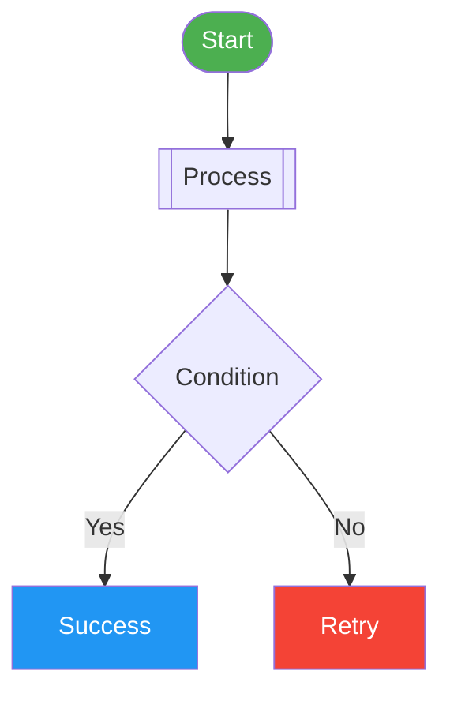
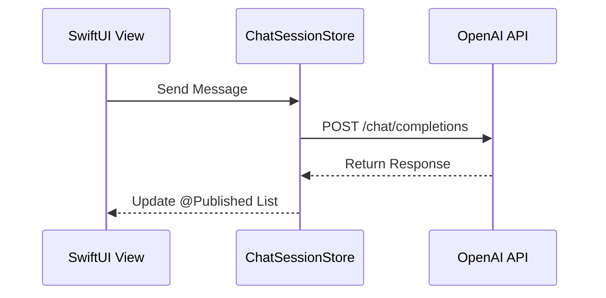
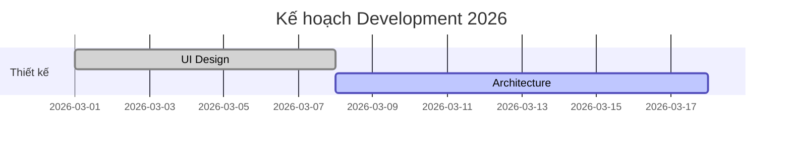
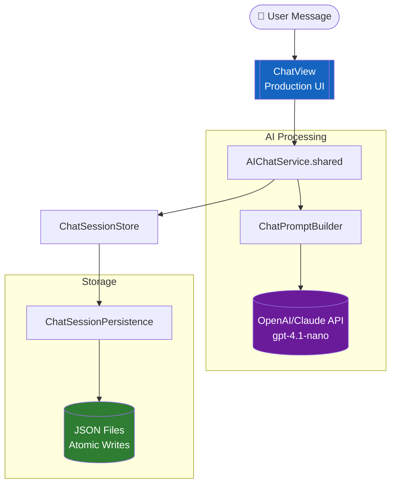
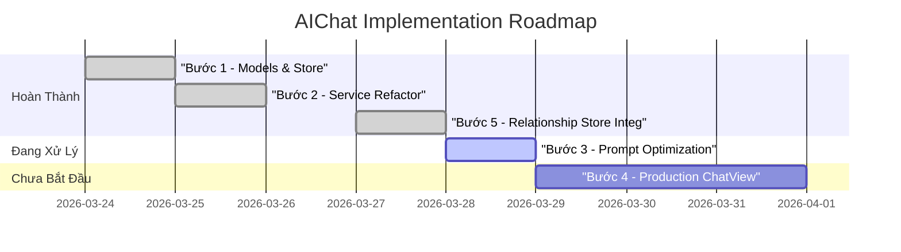

# Module: MISC


<file path=".ai/ai-docs/CLAUDE.md">
```md
<!-- Claude Code: auto-loads this file as project instructions -->

All project rules, architecture guide, and GitHub workflow are in:

**→ `.ai/rules.md`**

Read that file before making any changes.

```
</file>

<file path=".ai/ai-docs/GITHUB_WORKFLOW.md">
```md
# GitHub Project Management Workflow Guide

This document describes how to manage and execute tasks for the **MDpreview** GitHub project. All Antigravity agents working on this repo MUST follow this guide.

## 1. Finding Tasks
The source of truth for all development work is the GitHub Project (Project ID: `3`).

- **To list current tasks**: Run `gh project item-list 3 --owner Mchis167 --format json`.
- **To view a specific issue**: Run `gh issue view <number> --repo Mchis167/MDpreview`.
- **Priority**: Always prioritize tasks in the following order: `In progress` → `Ready` (P0 > P1 > P2) → `Backlog`.

## 2. Managing Status
Every task must go through the following lifecycle. You MUST update the project item status using the `gh project item-edit` command.

| Status | Triggering Action |
| :--- | :--- |
| **In progress** | When the agent starts planning/researching a task. |
| **In review** | **(MANDATORY)** Immediately after code changes are applied and verified. |
| **Done** | ONLY after the human user confirms they are satisfied with the implementation. |

### How to update status:
1.  **Find the Item ID**: Get the `id` from `gh project item-list`.
2.  **Edit Status**: 
    ```bash
    gh project item-edit 3 --owner Mchis167 --id <ITEM_ID> --field "Status" --value "In review"
    ```

## 3. Implementation Flow (The "Antigravity Way")
1.  **Fetch & Select**: Pull the latest project items and select the highest priority task(s).
2.  **Plan**: Research the codebase and design system (Figma) and create an `implementation_plan` artifact.
3.  **Wait**: PRESENT the plan and wait for the human user to say "proceed" or "approve".
4.  **Execute**: Modify the code using `write_to_file` or `replace_file_content`.
5.  **Status Update**: Immediately move the task to **"In review"**.
6.  **Verify & Summarize**: Perform a manual check and present a `walkthrough` artifact.

## 4. Quick Status Mapping (Project ID: `PVT_kwHOBots8c4BTH09`)
Use these IDs for error-free updates: `gh project item-edit --project-id PVT_kwHOBots8c4BTH09 --id <ITEM_ID> --field-id PVTSSF_lAHOBots8c4BTH09zhAdKGY --single-select-option-id <OID>`:

| Status Name | Option ID |
| :--- | :--- |
| **Backlog** | `f75ad846` |
| **Ready** | `61e4505c` |
| **In progress** | `47fc9ee4` |
| **In review** | `df73e18b` |
| **Done** | `98236657` |

---
*Created on: 2026-03-29*

```
</file>

<file path=".ai/ai-docs/OVERVIEW.md">
```md
# MDpreview — Project Overview & Roadmap

## 📝 Giới thiệu chung
**MDpreview** là một ứng dụng Desktop (Electron) được thiết kế đặc biệt để tối ưu hóa việc đọc, đánh giá và phản hồi các nội dung Markdown, đặc biệt là các đề xuất dài từ AI. 

Mục tiêu cốt lõi của ứng dụng là **"Đơn giản hóa mọi cuộc hội thoại với AI"** bằng cách tạo ra một môi trường trung gian hoàn hảo để Review trước khi đưa ra quyết định cuối cùng.

---

## 🛠 Hiện trạng Kỹ thuật (Tech Stack)
- **Core:** Electron.js (Đảm bảo hiệu năng và truy cập file hệ thống cục bộ).
- **Frontend:** Vanilla Javascript & CSS (Tối ưu tốc độ, không phụ thuộc framework nặng).
- **UI/UX:** Phong cách **Glassmorphism** (kính mờ), hỗ trợ Dark Mode, Accent Color tùy chỉnh và hiệu ứng Micro-animations.
- **Markdown Engine:** Marked.js kết hợp với Mermaid.js (vẽ sơ đồ).
- **Real-time:** Tích hợp Socket.io để hỗ trợ **Hot Reload** (tự động cập nhật nội dung khi file nguồn thay đổi).

---

## 🚀 Các tính năng Hiện có (Current Features)

### 1. Quản lý Workspace & File
- **Multi-Workspace:** Kết nối với nhiều thư mục local khác nhau.
- **File Explorer:** Cấu trúc cây thư mục (Tree view) mượt mà, hỗ trợ tìm kiếm file nhanh.
- **Recently Viewed:** Lưu lại các file vừa đọc để truy cập nhanh.

### 2. Trải nghiệm Đọc & Preview
- **High-quality Rendering:** Hiển thị Markdown chuẩn xác, hỗ trợ Code Highlight và Sơ đồ Mermaid.
- **Zoom & Fullscreen:** Chế độ xem ảnh phóng to và toàn màn hình để tập trung tối đa.
- **Hot Reload:** Cực kỳ hữu ích khi bạn đang dùng một công cụ khác để ghi file MD, ứng dụng sẽ cập nhật ngay lập tức.

### 3. Hệ thống Phản hồi (Commenting System) — *Trọng tâm của Project*
- **Contextual Commenting:** Cho phép bôi đen đoạn văn bản và để lại bình luận ngay tại dòng đó.
- **Comment Sidebar:** Quản lý toàn bộ danh sách feedback ở cánh phải.
- **"Copy All" Logic:** Tổng hợp toàn bộ bình luận thành một cấu trúc Markdown chuyên nghiệp để dán ngược lại cho AI (Claude/GPT).

### 4. Chế độ AI Response (AI Mode)
- Một khu vực riêng biệt để paste nhanh nội dung AI vừa trả về mà không cần lưu thành file chính thức.
- Hỗ trợ xem trước (Preview) nội dung nháp một cách nhanh chóng.

### 5. Cá nhân hóa (Customization)
- Thay đổi **Accent Color** (màu nhấn chủ đạo).
- Tùy chỉnh **Background Image** (hỗ trợ Glassmorphism cực đẹp).

---

## 🏗 Hướng phát triển tiếp theo (Roadmap & Ideas)
Chúng ta đã lưu lại 4 Issue chiến lược trên GitHub để nâng tầm workflow:

### 🟢 Giai đoạn 1: Tối ưu hóa việc thu thập (Snippet Tray)
- Triển khai **"Khay chứa ý tưởng"**: Cho phép ghim (pin) các đoạn code hoặc ý hay của AI vào một danh sách riêng mà không cần viết comment. Giúp bạn nhặt ra những "viên ngọc" giữa một rừng văn bản.

### 🟡 Giai đoạn 2: Nâng cấp ngữ cảnh (Smart Context)
- Tự động bọc (wrap) 1-2 dòng nội dung xung quanh phần bạn comment khi export. Giúp AI hiểu ngay bạn đang sửa lỗi ở đâu mà không cần phải giải thích lại "Ở đoạn này... ở câu kia...".

### 🟠 Giai đoạn 3: Điều hướng trực quan (Review Heatmap)
- Tạo một bản đồ mini ở lề trang, hiển thị những vùng nào đã có comment, vùng nào chưa đọc. Rất quan trọng khi xử lý các file đề xuất dài hàng nghìn chữ.

### 🔴 Giai đoạn 4: Tổng hợp Prompt (AI Prompt Generator)
- Biến MDpreview thành một "Trạm phóng prompt". Nó sẽ tự động soạn thảo một câu lệnh hoàn chỉnh bao gồm tất cả Feedback + Snippets bạn đã chọn, định dạng sẵn cho LLMs để bạn chỉ cần 1-click là xong việc.

---

## 🎯 Triết lý thiết kế (Design Philosophy)
> **"Aesthetics are not an option, they are a requirement."**
> 
Ứng dụng không chỉ tập trung vào tính năng mà còn phải mang lại cảm giác **Premium**. Mọi tương tác từ việc mở Sidebar, kéo thả Comment Box cho đến hiệu ứng bóng đổ (Shadow) đều được tỉ mỉ hóa để người dùng cảm thấy "đã" khi làm việc.

---
*Cập nhật lần cuối: 30/03/2026*

```
</file>

<file path=".ai/tracking/project_fields_full.json">
```json
{"fields":[{"id":"PVTF_lAHOBots8c4BTH09zhAdKGQ","name":"Title","type":"ProjectV2Field"},{"id":"PVTF_lAHOBots8c4BTH09zhAdKGU","name":"Assignees","type":"ProjectV2Field"},{"id":"PVTSSF_lAHOBots8c4BTH09zhAdKGY","name":"Status","options":[{"id":"f75ad846","name":"Backlog"},{"id":"61e4505c","name":"Ready"},{"id":"47fc9ee4","name":"In progress"},{"id":"df73e18b","name":"In review"},{"id":"98236657","name":"Done"}],"type":"ProjectV2SingleSelectField"},{"id":"PVTF_lAHOBots8c4BTH09zhAdKGc","name":"Labels","type":"ProjectV2Field"},{"id":"PVTF_lAHOBots8c4BTH09zhAdKGg","name":"Linked pull requests","type":"ProjectV2Field"},{"id":"PVTF_lAHOBots8c4BTH09zhAdKGk","name":"Milestone","type":"ProjectV2Field"},{"id":"PVTF_lAHOBots8c4BTH09zhAdKGo","name":"Repository","type":"ProjectV2Field"},{"id":"PVTF_lAHOBots8c4BTH09zhAdKGs","name":"Reviewers","type":"ProjectV2Field"},{"id":"PVTF_lAHOBots8c4BTH09zhAdKGw","name":"Parent issue","type":"ProjectV2Field"},{"id":"PVTF_lAHOBots8c4BTH09zhAdKG0","name":"Sub-issues progress","type":"ProjectV2Field"},{"id":"PVTSSF_lAHOBots8c4BTH09zhAdKG4","name":"Priority","options":[{"id":"79628723","name":"P0"},{"id":"0a877460","name":"P1"},{"id":"da944a9c","name":"P2"}],"type":"ProjectV2SingleSelectField"},{"id":"PVTSSF_lAHOBots8c4BTH09zhAdKG8","name":"Size","options":[{"id":"6c6483d2","name":"XS"},{"id":"f784b110","name":"S"},{"id":"7515a9f1","name":"M"},{"id":"817d0097","name":"L"},{"id":"db339eb2","name":"XL"}],"type":"ProjectV2SingleSelectField"},{"id":"PVTF_lAHOBots8c4BTH09zhAdKHA","name":"Estimate","type":"ProjectV2Field"},{"id":"PVTF_lAHOBots8c4BTH09zhAdKHE","name":"Start date","type":"ProjectV2Field"},{"id":"PVTF_lAHOBots8c4BTH09zhAdKHI","name":"Target date","type":"ProjectV2Field"}],"totalCount":15}

```
</file>

<file path=".ai/tracking/project_items.json">
```json
{"items":[{"content":{"body":"","number":6,"repository":"Mchis167/MDpreview","title":"[DS] - Đối chiều và mapping lại với hệ thống variable mới tại figma design","type":"Issue","url":"https://github.com/Mchis167/MDpreview/issues/6"},"id":"PVTI_lAHOBots8c4BTH09zgolyN8","labels":["Design System"],"priority":"P0","repository":"https://github.com/Mchis167/MDpreview","status":"In progress","title":"[DS] - Đối chiều và mapping lại với hệ thống variable mới tại figma design"},{"content":{"body":"","number":1,"repository":"Mchis167/MDpreview","title":"[Bug] - Khi đã có comment, khi tuyển từ tab comment về tab red, sidebar comment không được ẩn đi","type":"Issue","url":"https://github.com/Mchis167/MDpreview/issues/1"},"id":"PVTI_lAHOBots8c4BTH09zgolrHs","labels":["bug"],"priority":"P1","repository":"https://github.com/Mchis167/MDpreview","status":"In progress","title":"[Bug] - Khi đã có comment, khi tuyển từ tab comment về tab red, sidebar comment không được ẩn đi"},{"content":{"body":"Khi user tap vào một comment item tại sidebar, cần scroll về vị trí của comment đó và open comment box edit để user có thể edit nếu cần\n","number":2,"repository":"Mchis167/MDpreview","title":"[I] - Comment Item Interaction","type":"Issue","url":"https://github.com/Mchis167/MDpreview/issues/2"},"id":"PVTI_lAHOBots8c4BTH09zgolr3c","labels":["Improvement"],"priority":"P2","repository":"https://github.com/Mchis167/MDpreview","status":"In progress","title":"[I] - Comment Item Interaction"},{"content":{"body":"- [ ] Thêm trạng thái selected cho Comment Item\n- [ ] Update thêm variable: layer-hover\n\nLink Figma Designa: https://www.figma.com/design/aGCprLqhcZgJVO6ff6VXvg/MDPreview?node-id=24-18&t=UQaYCfKY94cFYFuZ-4","number":3,"repository":"Mchis167/MDpreview","title":"[I] - Update Selected State for CommentItem","type":"Issue","url":"https://github.com/Mchis167/MDpreview/issues/3"},"id":"PVTI_lAHOBots8c4BTH09zgolvak","labels":["Improvement"],"priority":"P2","repository":"https://github.com/Mchis167/MDpreview","status":"In progress","title":"[I] - Update Selected State for CommentItem"},{"content":{"body":"Using this icon for Clear Icon: assets/lucide_brush-cleaning.svg","number":4,"repository":"Mchis167/MDpreview","title":"[I] - Update Clear Icon in comment header","type":"Issue","url":"https://github.com/Mchis167/MDpreview/issues/4"},"id":"PVTI_lAHOBots8c4BTH09zgolwS0","labels":["Improvement"],"repository":"https://github.com/Mchis167/MDpreview","status":"Backlog","title":"[I] - Update Clear Icon in comment header"},{"content":{"body":"Figma Design:\nhttps://www.figma.com/design/aGCprLqhcZgJVO6ff6VXvg/MDPreview?node-id=25-84&t=UQaYCfKY94cFYFuZ-11","number":5,"repository":"Mchis167/MDpreview","title":"[C] - Implement New Button Set","type":"Issue","url":"https://github.com/Mchis167/MDpreview/issues/5"},"id":"PVTI_lAHOBots8c4BTH09zgolyBk","labels":["New Component"],"repository":"https://github.com/Mchis167/MDpreview","status":"Backlog","title":"[C] - Implement New Button Set"}],"totalCount":6}

```
</file>

<file path=".ai/tracking/project_items_check_recheck.json">
```json
{"items":[{"content":{"body":"Using this icon for Clear Icon: assets/lucide_brush-cleaning.svg","number":4,"repository":"Mchis167/MDpreview","title":"[I] - Update Clear Icon in comment header","type":"Issue","url":"https://github.com/Mchis167/MDpreview/issues/4"},"id":"PVTI_lAHOBots8c4BTH09zgolwS0","labels":["Improvement"],"repository":"https://github.com/Mchis167/MDpreview","status":"In progress","title":"[I] - Update Clear Icon in comment header"},{"content":{"body":"Figma Design:\nhttps://www.figma.com/design/aGCprLqhcZgJVO6ff6VXvg/MDPreview?node-id=25-84&t=UQaYCfKY94cFYFuZ-11","number":5,"repository":"Mchis167/MDpreview","title":"[C] - Implement New Button Set","type":"Issue","url":"https://github.com/Mchis167/MDpreview/issues/5"},"id":"PVTI_lAHOBots8c4BTH09zgolyBk","labels":["New Component"],"repository":"https://github.com/Mchis167/MDpreview","status":"In progress","title":"[C] - Implement New Button Set"},{"content":{"body":"Update new comment box design, gốm 3 state\n1. Empty và CommentFilled hiển thị khi add một comment mới, mặc định khi hiển thị icon comment, comment bõ là Empty\n2. ViewOnly: view khi user chọn một comment trên comment sidebar và scroll về vị trí comment đó. Khi ấn vào edit button, chuyển về CommentFilled\n\nLưu ý:  \n- Khi empty, Button disable , khi có content (trimed) thì với enable button\n- Sử dụng Button Component mới được xây dựng\n\nLink Figma Design: https://www.figma.com/design/aGCprLqhcZgJVO6ff6VXvg/MDPreview?node-id=25-161&t=UQaYCfKY94cFYFuZ-4","number":10,"repository":"Mchis167/MDpreview","title":"[C] - New Comment Box Design","type":"Issue","url":"https://github.com/Mchis167/MDpreview/issues/10"},"id":"PVTI_lAHOBots8c4BTH09zgol2jg","repository":"https://github.com/Mchis167/MDpreview","status":"In progress","title":"[C] - New Comment Box Design"},{"content":{"body":"1. Khi không full mode, hiển thị icon: maximize (như hiện tại)\n2. Khi đang full mode, hiển thị icon: minimize","number":8,"repository":"Mchis167/MDpreview","title":"[D] - Update FullMode Icon","type":"Issue","url":"https://github.com/Mchis167/MDpreview/issues/8"},"id":"PVTI_lAHOBots8c4BTH09zgol1cE","labels":["Improvement"],"repository":"https://github.com/Mchis167/MDpreview","status":"Done","title":"[D] - Update FullMode Icon"},{"content":{"body":"Trên Botton Group tại header, thêm một action rebuild app, giúp có thể thoát app và rebuild lại app nhanh, sau rebuild tự động khơi đợng lại app\n\nFigma Design: https://www.figma.com/design/aGCprLqhcZgJVO6ff6VXvg/MDPreview?node-id=25-214&t=UQaYCfKY94cFYFuZ-11","number":9,"repository":"Mchis167/MDpreview","title":"[F] - Add New Rebuild App Action","type":"Issue","url":"https://github.com/Mchis167/MDpreview/issues/9"},"id":"PVTI_lAHOBots8c4BTH09zgol15U","labels":["New Feature"],"repository":"https://github.com/Mchis167/MDpreview","status":"Done","title":"[F] - Add New Rebuild App Action"},{"content":{"body":"1. Font Size: 14 -> 12\n2. Font W: Med -> Semi","number":7,"repository":"Mchis167/MDpreview","title":"[D] - Update Segment Control Item Design","type":"Issue","url":"https://github.com/Mchis167/MDpreview/issues/7"},"id":"PVTI_lAHOBots8c4BTH09zgol014","labels":["Design Update"],"repository":"https://github.com/Mchis167/MDpreview","status":"Done","title":"[D] - Update Segment Control Item Design"},{"content":{"body":"","number":1,"repository":"Mchis167/MDpreview","title":"[Bug] - Khi đã có comment, khi tuyển từ tab comment về tab red, sidebar comment không được ẩn đi","type":"Issue","url":"https://github.com/Mchis167/MDpreview/issues/1"},"id":"PVTI_lAHOBots8c4BTH09zgolrHs","labels":["bug"],"priority":"P1","repository":"https://github.com/Mchis167/MDpreview","status":"Done","title":"[Bug] - Khi đã có comment, khi tuyển từ tab comment về tab red, sidebar comment không được ẩn đi"},{"content":{"body":"Khi user tap vào một comment item tại sidebar, cần scroll về vị trí của comment đó và open comment box edit để user có thể edit nếu cần\n","number":2,"repository":"Mchis167/MDpreview","title":"[I] - Comment Item Interaction","type":"Issue","url":"https://github.com/Mchis167/MDpreview/issues/2"},"id":"PVTI_lAHOBots8c4BTH09zgolr3c","labels":["Improvement"],"priority":"P2","repository":"https://github.com/Mchis167/MDpreview","status":"Done","title":"[I] - Comment Item Interaction"},{"content":{"body":"Khi Comment SideBar slide vào, không hiển thị các comment item vôi, để opacity = 0, khi nào sidebar ổn định thì với animation nhanh opcity về 1 để tránh nhảy layout khi đang animate","number":11,"repository":"Mchis167/MDpreview","title":"Comment Show / Hide Interaction","type":"Issue","url":"https://github.com/Mchis167/MDpreview/issues/11"},"id":"PVTI_lAHOBots8c4BTH09zgol3no","labels":["Improvement"],"repository":"https://github.com/Mchis167/MDpreview","status":"Done","title":"Comment Show / Hide Interaction"},{"content":{"body":"Khi một comment đang được select, ngoài việc scroll về vị chí chuẩn, còn phải mở lại modal comment với nội dung dã comment, khi ấn ra ngoài vùng trống, modal đóng lại và comment item trở lại state enable","number":12,"repository":"Mchis167/MDpreview","title":"Open Comment Modal Behavior","type":"Issue","url":"https://github.com/Mchis167/MDpreview/issues/12"},"id":"PVTI_lAHOBots8c4BTH09zgol350","repository":"https://github.com/Mchis167/MDpreview","status":"Done","title":"Open Comment Modal Behavior"},{"content":{"body":"Ở đây chúng ta cần không chỉ đơn thuần là restart app, chúng ta cần restart, sau đó auto chạy lệnh rebuild, sau đó với reopen app again\n","number":13,"repository":"Mchis167/MDpreview","title":"Update Rebuild Logic","type":"Issue","url":"https://github.com/Mchis167/MDpreview/issues/13"},"id":"PVTI_lAHOBots8c4BTH09zgol4zc","labels":["Improvement"],"repository":"https://github.com/Mchis167/MDpreview","status":"Done","title":"Update Rebuild Logic"},{"content":{"body":"- [ ] Thêm trạng thái selected cho Comment Item\n- [ ] Update thêm variable: layer-hover\n\nLink Figma Designa: https://www.figma.com/design/aGCprLqhcZgJVO6ff6VXvg/MDPreview?node-id=24-18&t=UQaYCfKY94cFYFuZ-4","number":3,"repository":"Mchis167/MDpreview","title":"[I] - Update Selected State for CommentItem","type":"Issue","url":"https://github.com/Mchis167/MDpreview/issues/3"},"id":"PVTI_lAHOBots8c4BTH09zgolvak","labels":["Improvement"],"priority":"P2","repository":"https://github.com/Mchis167/MDpreview","status":"Done","title":"[I] - Update Selected State for CommentItem"},{"content":{"body":"","number":6,"repository":"Mchis167/MDpreview","title":"[DS] - Đối chiều và mapping lại với hệ thống variable mới tại figma design","type":"Issue","url":"https://github.com/Mchis167/MDpreview/issues/6"},"id":"PVTI_lAHOBots8c4BTH09zgolyN8","labels":["Design System"],"priority":"P0","repository":"https://github.com/Mchis167/MDpreview","status":"Done","title":"[DS] - Đối chiều và mapping lại với hệ thống variable mới tại figma design"}],"totalCount":13}

```
</file>

<file path=".ai/tracking/project_items_final.json">
```json
{"items":[{"content":{"body":"1. Khi không full mode, hiển thị icon: maximize (như hiện tại)\n2. Khi đang full mode, hiển thị icon: minimize","number":8,"repository":"Mchis167/MDpreview","title":"[D] - Update FullMode Icon","type":"Issue","url":"https://github.com/Mchis167/MDpreview/issues/8"},"id":"PVTI_lAHOBots8c4BTH09zgol1cE","labels":["Improvement"],"repository":"https://github.com/Mchis167/MDpreview","status":"In progress","title":"[D] - Update FullMode Icon"},{"content":{"body":"Trên Botton Group tại header, thêm một action rebuild app, giúp có thể thoát app và rebuild lại app nhanh, sau rebuild tự động khơi đợng lại app\n\nFigma Design: https://www.figma.com/design/aGCprLqhcZgJVO6ff6VXvg/MDPreview?node-id=25-214&t=UQaYCfKY94cFYFuZ-11","number":9,"repository":"Mchis167/MDpreview","title":"[F] - Add New Rebuild App Action","type":"Issue","url":"https://github.com/Mchis167/MDpreview/issues/9"},"id":"PVTI_lAHOBots8c4BTH09zgol15U","labels":["New Feature"],"repository":"https://github.com/Mchis167/MDpreview","status":"In progress","title":"[F] - Add New Rebuild App Action"},{"content":{"body":"1. Font Size: 14 -> 12\n2. Font W: Med -> Semi","number":7,"repository":"Mchis167/MDpreview","title":"[D] - Update Segment Control Item Design","type":"Issue","url":"https://github.com/Mchis167/MDpreview/issues/7"},"id":"PVTI_lAHOBots8c4BTH09zgol014","labels":["Design Update"],"repository":"https://github.com/Mchis167/MDpreview","status":"In progress","title":"[D] - Update Segment Control Item Design"},{"content":{"body":"","number":6,"repository":"Mchis167/MDpreview","title":"[DS] - Đối chiều và mapping lại với hệ thống variable mới tại figma design","type":"Issue","url":"https://github.com/Mchis167/MDpreview/issues/6"},"id":"PVTI_lAHOBots8c4BTH09zgolyN8","labels":["Design System"],"priority":"P0","repository":"https://github.com/Mchis167/MDpreview","status":"In review","title":"[DS] - Đối chiều và mapping lại với hệ thống variable mới tại figma design"},{"content":{"body":"","number":1,"repository":"Mchis167/MDpreview","title":"[Bug] - Khi đã có comment, khi tuyển từ tab comment về tab red, sidebar comment không được ẩn đi","type":"Issue","url":"https://github.com/Mchis167/MDpreview/issues/1"},"id":"PVTI_lAHOBots8c4BTH09zgolrHs","labels":["bug"],"priority":"P1","repository":"https://github.com/Mchis167/MDpreview","status":"In review","title":"[Bug] - Khi đã có comment, khi tuyển từ tab comment về tab red, sidebar comment không được ẩn đi"},{"content":{"body":"Khi user tap vào một comment item tại sidebar, cần scroll về vị trí của comment đó và open comment box edit để user có thể edit nếu cần\n","number":2,"repository":"Mchis167/MDpreview","title":"[I] - Comment Item Interaction","type":"Issue","url":"https://github.com/Mchis167/MDpreview/issues/2"},"id":"PVTI_lAHOBots8c4BTH09zgolr3c","labels":["Improvement"],"priority":"P2","repository":"https://github.com/Mchis167/MDpreview","status":"In review","title":"[I] - Comment Item Interaction"},{"content":{"body":"- [ ] Thêm trạng thái selected cho Comment Item\n- [ ] Update thêm variable: layer-hover\n\nLink Figma Designa: https://www.figma.com/design/aGCprLqhcZgJVO6ff6VXvg/MDPreview?node-id=24-18&t=UQaYCfKY94cFYFuZ-4","number":3,"repository":"Mchis167/MDpreview","title":"[I] - Update Selected State for CommentItem","type":"Issue","url":"https://github.com/Mchis167/MDpreview/issues/3"},"id":"PVTI_lAHOBots8c4BTH09zgolvak","labels":["Improvement"],"priority":"P2","repository":"https://github.com/Mchis167/MDpreview","status":"In review","title":"[I] - Update Selected State for CommentItem"},{"content":{"body":"Using this icon for Clear Icon: assets/lucide_brush-cleaning.svg","number":4,"repository":"Mchis167/MDpreview","title":"[I] - Update Clear Icon in comment header","type":"Issue","url":"https://github.com/Mchis167/MDpreview/issues/4"},"id":"PVTI_lAHOBots8c4BTH09zgolwS0","labels":["Improvement"],"repository":"https://github.com/Mchis167/MDpreview","status":"Backlog","title":"[I] - Update Clear Icon in comment header"},{"content":{"body":"Figma Design:\nhttps://www.figma.com/design/aGCprLqhcZgJVO6ff6VXvg/MDPreview?node-id=25-84&t=UQaYCfKY94cFYFuZ-11","number":5,"repository":"Mchis167/MDpreview","title":"[C] - Implement New Button Set","type":"Issue","url":"https://github.com/Mchis167/MDpreview/issues/5"},"id":"PVTI_lAHOBots8c4BTH09zgolyBk","labels":["New Component"],"repository":"https://github.com/Mchis167/MDpreview","status":"Backlog","title":"[C] - Implement New Button Set"}],"totalCount":9}

```
</file>

<file path=".ai/tracking/project_items_final_check.json">
```json
{"items":[{"content":{"body":"Using this icon for Clear Icon: assets/lucide_brush-cleaning.svg","number":4,"repository":"Mchis167/MDpreview","title":"[I] - Update Clear Icon in comment header","type":"Issue","url":"https://github.com/Mchis167/MDpreview/issues/4"},"id":"PVTI_lAHOBots8c4BTH09zgolwS0","labels":["Improvement"],"repository":"https://github.com/Mchis167/MDpreview","status":"In progress","title":"[I] - Update Clear Icon in comment header"},{"content":{"body":"Figma Design:\nhttps://www.figma.com/design/aGCprLqhcZgJVO6ff6VXvg/MDPreview?node-id=25-84&t=UQaYCfKY94cFYFuZ-11","number":5,"repository":"Mchis167/MDpreview","title":"[C] - Implement New Button Set","type":"Issue","url":"https://github.com/Mchis167/MDpreview/issues/5"},"id":"PVTI_lAHOBots8c4BTH09zgolyBk","labels":["New Component"],"repository":"https://github.com/Mchis167/MDpreview","status":"In progress","title":"[C] - Implement New Button Set"},{"content":{"body":"Update new comment box design, gốm 3 state\n1. Empty và CommentFilled hiển thị khi add một comment mới, mặc định khi hiển thị icon comment, comment bõ là Empty\n2. ViewOnly: view khi user chọn một comment trên comment sidebar và scroll về vị trí comment đó. Khi ấn vào edit button, chuyển về CommentFilled\n\nLưu ý:  \n- Khi empty, Button disable , khi có content (trimed) thì với enable button\n- Sử dụng Button Component mới được xây dựng\n\nLink Figma Design: https://www.figma.com/design/aGCprLqhcZgJVO6ff6VXvg/MDPreview?node-id=25-161&t=UQaYCfKY94cFYFuZ-4","number":10,"repository":"Mchis167/MDpreview","title":"[C] - New Comment Box Design","type":"Issue","url":"https://github.com/Mchis167/MDpreview/issues/10"},"id":"PVTI_lAHOBots8c4BTH09zgol2jg","repository":"https://github.com/Mchis167/MDpreview","status":"In progress","title":"[C] - New Comment Box Design"},{"content":{"body":"1. Khi không full mode, hiển thị icon: maximize (như hiện tại)\n2. Khi đang full mode, hiển thị icon: minimize","number":8,"repository":"Mchis167/MDpreview","title":"[D] - Update FullMode Icon","type":"Issue","url":"https://github.com/Mchis167/MDpreview/issues/8"},"id":"PVTI_lAHOBots8c4BTH09zgol1cE","labels":["Improvement"],"repository":"https://github.com/Mchis167/MDpreview","status":"Done","title":"[D] - Update FullMode Icon"},{"content":{"body":"Trên Botton Group tại header, thêm một action rebuild app, giúp có thể thoát app và rebuild lại app nhanh, sau rebuild tự động khơi đợng lại app\n\nFigma Design: https://www.figma.com/design/aGCprLqhcZgJVO6ff6VXvg/MDPreview?node-id=25-214&t=UQaYCfKY94cFYFuZ-11","number":9,"repository":"Mchis167/MDpreview","title":"[F] - Add New Rebuild App Action","type":"Issue","url":"https://github.com/Mchis167/MDpreview/issues/9"},"id":"PVTI_lAHOBots8c4BTH09zgol15U","labels":["New Feature"],"repository":"https://github.com/Mchis167/MDpreview","status":"Done","title":"[F] - Add New Rebuild App Action"},{"content":{"body":"1. Font Size: 14 -> 12\n2. Font W: Med -> Semi","number":7,"repository":"Mchis167/MDpreview","title":"[D] - Update Segment Control Item Design","type":"Issue","url":"https://github.com/Mchis167/MDpreview/issues/7"},"id":"PVTI_lAHOBots8c4BTH09zgol014","labels":["Design Update"],"repository":"https://github.com/Mchis167/MDpreview","status":"Done","title":"[D] - Update Segment Control Item Design"},{"content":{"body":"","number":1,"repository":"Mchis167/MDpreview","title":"[Bug] - Khi đã có comment, khi tuyển từ tab comment về tab red, sidebar comment không được ẩn đi","type":"Issue","url":"https://github.com/Mchis167/MDpreview/issues/1"},"id":"PVTI_lAHOBots8c4BTH09zgolrHs","labels":["bug"],"priority":"P1","repository":"https://github.com/Mchis167/MDpreview","status":"Done","title":"[Bug] - Khi đã có comment, khi tuyển từ tab comment về tab red, sidebar comment không được ẩn đi"},{"content":{"body":"Khi user tap vào một comment item tại sidebar, cần scroll về vị trí của comment đó và open comment box edit để user có thể edit nếu cần\n","number":2,"repository":"Mchis167/MDpreview","title":"[I] - Comment Item Interaction","type":"Issue","url":"https://github.com/Mchis167/MDpreview/issues/2"},"id":"PVTI_lAHOBots8c4BTH09zgolr3c","labels":["Improvement"],"priority":"P2","repository":"https://github.com/Mchis167/MDpreview","status":"Done","title":"[I] - Comment Item Interaction"},{"content":{"body":"Khi Comment SideBar slide vào, không hiển thị các comment item vôi, để opacity = 0, khi nào sidebar ổn định thì với animation nhanh opcity về 1 để tránh nhảy layout khi đang animate","number":11,"repository":"Mchis167/MDpreview","title":"Comment Show / Hide Interaction","type":"Issue","url":"https://github.com/Mchis167/MDpreview/issues/11"},"id":"PVTI_lAHOBots8c4BTH09zgol3no","labels":["Improvement"],"repository":"https://github.com/Mchis167/MDpreview","status":"Done","title":"Comment Show / Hide Interaction"},{"content":{"body":"Khi một comment đang được select, ngoài việc scroll về vị chí chuẩn, còn phải mở lại modal comment với nội dung dã comment, khi ấn ra ngoài vùng trống, modal đóng lại và comment item trở lại state enable","number":12,"repository":"Mchis167/MDpreview","title":"Open Comment Modal Behavior","type":"Issue","url":"https://github.com/Mchis167/MDpreview/issues/12"},"id":"PVTI_lAHOBots8c4BTH09zgol350","repository":"https://github.com/Mchis167/MDpreview","status":"Done","title":"Open Comment Modal Behavior"},{"content":{"body":"Ở đây chúng ta cần không chỉ đơn thuần là restart app, chúng ta cần restart, sau đó auto chạy lệnh rebuild, sau đó với reopen app again\n","number":13,"repository":"Mchis167/MDpreview","title":"Update Rebuild Logic","type":"Issue","url":"https://github.com/Mchis167/MDpreview/issues/13"},"id":"PVTI_lAHOBots8c4BTH09zgol4zc","labels":["Improvement"],"repository":"https://github.com/Mchis167/MDpreview","status":"Done","title":"Update Rebuild Logic"},{"content":{"body":"- [ ] Thêm trạng thái selected cho Comment Item\n- [ ] Update thêm variable: layer-hover\n\nLink Figma Designa: https://www.figma.com/design/aGCprLqhcZgJVO6ff6VXvg/MDPreview?node-id=24-18&t=UQaYCfKY94cFYFuZ-4","number":3,"repository":"Mchis167/MDpreview","title":"[I] - Update Selected State for CommentItem","type":"Issue","url":"https://github.com/Mchis167/MDpreview/issues/3"},"id":"PVTI_lAHOBots8c4BTH09zgolvak","labels":["Improvement"],"priority":"P2","repository":"https://github.com/Mchis167/MDpreview","status":"Done","title":"[I] - Update Selected State for CommentItem"},{"content":{"body":"","number":6,"repository":"Mchis167/MDpreview","title":"[DS] - Đối chiều và mapping lại với hệ thống variable mới tại figma design","type":"Issue","url":"https://github.com/Mchis167/MDpreview/issues/6"},"id":"PVTI_lAHOBots8c4BTH09zgolyN8","labels":["Design System"],"priority":"P0","repository":"https://github.com/Mchis167/MDpreview","status":"Done","title":"[DS] - Đối chiều và mapping lại với hệ thống variable mới tại figma design"}],"totalCount":13}

```
</file>

<file path=".ai/tracking/project_items_full.json">
```json
{"items":[{"content":{"body":"- [ ] Thêm một message behavior vào khi user copy thành công\n- [ ] Icon copy chuyển thành Icon check trong 1s, sau đó quay trở lại thành icon copy\n\nlink design: https://www.figma.com/design/aGCprLqhcZgJVO6ff6VXvg/MDPreview?node-id=68-187&m=dev\n","number":36,"repository":"Mchis167/MDpreview","title":"Thêm Toast / nackbar / message khi copy thành công","type":"Issue","url":"https://github.com/Mchis167/MDpreview/issues/36"},"id":"PVTI_lAHOBots8c4BTH09zgonTyY","labels":["Improvement"],"repository":"https://github.com/Mchis167/MDpreview","status":"In review","title":"Thêm Toast / nackbar / message khi copy thành công"},{"content":{"body":"Định dạng quote bị hiển thi sai, không đúng, box 1 nơi quote một nẻo\n\n","number":35,"repository":"Mchis167/MDpreview","title":"Quote Block bị hiển thị sai","type":"Issue","url":"https://github.com/Mchis167/MDpreview/issues/35"},"id":"PVTI_lAHOBots8c4BTH09zgom-hU","labels":["bug"],"repository":"https://github.com/Mchis167/MDpreview","status":"In review","title":"Quote Block bị hiển thị sai"},{"content":{"body":"1. khi preview new respone mà response trước có comment rồi -> thông báo là nếu preview new thì xoá comment cũ đi ","number":38,"repository":"Mchis167/MDpreview","title":"New Preview Behavior","type":"Issue","url":"https://github.com/Mchis167/MDpreview/issues/38"},"id":"PVTI_lAHOBots8c4BTH09zgonV7M","repository":"https://github.com/Mchis167/MDpreview","status":"In review","title":"New Preview Behavior"},{"content":{"body":"","number":37,"repository":"Mchis167/MDpreview","title":"Adđitional content chưa được đính vào copy comment","type":"Issue","url":"https://github.com/Mchis167/MDpreview/issues/37"},"id":"PVTI_lAHOBots8c4BTH09zgonUYU","labels":["bug"],"repository":"https://github.com/Mchis167/MDpreview","status":"In review","title":"Adđitional content chưa được đính vào copy comment"},{"content":{"body":"Cần check lại Recently Viewed file item, hiện tại đang bị sinh ra một style rất lạ, cần check lại thông số với design, đảm bảo cách hiển thị của nó đòng bộ với một item file thống thướng của all file bên dưới\nhttps://www.figma.com/design/aGCprLqhcZgJVO6ff6VXvg/MDPreview?node-id=32-360&t=UQaYCfKY94cFYFuZ-11","number":21,"repository":"Mchis167/MDpreview","title":"Update recently view file UI","type":"Issue","url":"https://github.com/Mchis167/MDpreview/issues/21"},"id":"PVTI_lAHOBots8c4BTH09zgomRAU","labels":["bug"],"repository":"https://github.com/Mchis167/MDpreview","status":"Done","title":"Update recently view file UI"},{"content":{"body":"Đối chiếu thông số của sidebar hiện tại với design để đảm bảo thông số là chuẩn 100%\nhttps://www.figma.com/design/aGCprLqhcZgJVO6ff6VXvg/MDPreview?node-id=32-432&t=UQaYCfKY94cFYFuZ-11\n\nHiện tại sidebar đang còn logo, loại bỏ luôn, ngoài ra, khoảng cách , divider đang bị  thiếu. Đảm bảo design là hoàn toàn chuẩn xác","number":22,"repository":"Mchis167/MDpreview","title":"Fix Left Sidebar UI","type":"Issue","url":"https://github.com/Mchis167/MDpreview/issues/22"},"id":"PVTI_lAHOBots8c4BTH09zgomRyI","labels":["Improvement"],"repository":"https://github.com/Mchis167/MDpreview","status":"Done","title":"Fix Left Sidebar UI"},{"content":{"body":"Link Figma\nhttps://www.figma.com/design/aGCprLqhcZgJVO6ff6VXvg/MDPreview?node-id=32-1252&t=UQaYCfKY94cFYFuZ-11\n\nNote: Lưu ý, sử dụng absolute position center để căn giữa với chiều cao của sidebar, hiện tại content bị đẩy xuống dưới một đoạn chứ hông căn giữa\n\n\n\nIcon sử dụng: assets/lucide_message-circle-dashed.svg","number":16,"repository":"Mchis167/MDpreview","title":"New Comment Empty State","type":"Issue","url":"https://github.com/Mchis167/MDpreview/issues/16"},"id":"PVTI_lAHOBots8c4BTH09zgomCi0","labels":["Design Update"],"repository":"https://github.com/Mchis167/MDpreview","status":"Done","title":"New Comment Empty State"},{"content":{"body":"Main Screen background color:\nbackground: #151515;\n\nSection - Main Preview Area\nbackground: linear-gradient(168deg, rgba(0, 0, 0, 0.10) 8.96%, rgba(0, 0, 0, 0.30) 91.04%);\nbackdrop-filter: blur(5px);\n\n2 sidebar\nbackground: linear-gradient(166deg, rgba(255, 255, 255, 0.05) 0%, rgba(255, 255, 255, 0.01) 100%);\nbackdrop-filter: blur(12px);","number":19,"repository":"Mchis167/MDpreview","title":"Update color","type":"Issue","url":"https://github.com/Mchis167/MDpreview/issues/19"},"id":"PVTI_lAHOBots8c4BTH09zgomFBs","labels":["Design Update"],"repository":"https://github.com/Mchis167/MDpreview","status":"Done","title":"Update color"},{"content":{"body":"Cập nhật background về một màu trơn, không có hiệu ứng kính chéo màn hình nữa:\n\n","number":18,"repository":"Mchis167/MDpreview","title":"Background Update","type":"Issue","url":"https://github.com/Mchis167/MDpreview/issues/18"},"id":"PVTI_lAHOBots8c4BTH09zgomDJ0","labels":["Design Update"],"repository":"https://github.com/Mchis167/MDpreview","status":"Done","title":"Background Update"},{"content":{"body":"Tìm và loại bỏ tất cả những chỗ đang dùng màu tím, quy về một màu accent vàng thôi\n","number":17,"repository":"Mchis167/MDpreview","title":"Loại bỏ Purple Accent","type":"Issue","url":"https://github.com/Mchis167/MDpreview/issues/17"},"id":"PVTI_lAHOBots8c4BTH09zgomDBA","repository":"https://github.com/Mchis167/MDpreview","status":"Done","title":"Loại bỏ Purple Accent"},{"content":{"body":"","number":6,"repository":"Mchis167/MDpreview","title":"[DS] - Đối chiều và mapping lại với hệ thống variable mới tại figma design","type":"Issue","url":"https://github.com/Mchis167/MDpreview/issues/6"},"id":"PVTI_lAHOBots8c4BTH09zgolyN8","labels":["Design System"],"priority":"P0","repository":"https://github.com/Mchis167/MDpreview","status":"Done","title":"[DS] - Đối chiều và mapping lại với hệ thống variable mới tại figma design"},{"content":{"body":"New Design: https://www.figma.com/design/aGCprLqhcZgJVO6ff6VXvg/MDPreview?node-id=32-433&t=UQaYCfKY94cFYFuZ-4\n\nSidebar mới giờ sẽ được support để có thể chuyển động linh hoạt giữa 2 loại mode\n1. markdown: Như hiện tại\n2. Ai Response: Tính năng sắp triển khai, tạm thời để placeholder\n\nkhi ở Markdown mode, chúng ta sẽ nâng cấp thêm Recently Viewed, hiển thị tối đa 3 file xem gần dây ở workspace này, update lại search function, thay vì search trực tiếp, giờ đây search sẽ được thu gọn lại, khi ấn vào button search thì chuyển sang state search mode, search mode content sẽ có các state như sau: \nhttps://www.figma.com/design/aGCprLqhcZgJVO6ff6VXvg/MDPreview?node-id=32-701&t=UQaYCfKY94cFYFuZ-4\n\nKhi user ấn butotn x, sẽ thoát search mode\n\nNgoài ra một update nhỏ là Icon của trailing của workspace selector không phải là down nữa là là right\n","number":15,"repository":"Mchis167/MDpreview","title":"Update Left SideBar","type":"Issue","url":"https://github.com/Mchis167/MDpreview/issues/15"},"id":"PVTI_lAHOBots8c4BTH09zgomBec","labels":["New Feature"],"repository":"https://github.com/Mchis167/MDpreview","status":"Done","title":"Update Left SideBar"},{"content":{"body":"https://www.figma.com/design/aGCprLqhcZgJVO6ff6VXvg/MDPreview?node-id=32-638&t=UQaYCfKY94cFYFuZ-4\n\nCheck lại design search bar và implement đẩy đủ các state cần có của search bar cũng như sủa dụng đúng design token chuẩn","number":14,"repository":"Mchis167/MDpreview","title":"Update Design for Search Bar","type":"Issue","url":"https://github.com/Mchis167/MDpreview/issues/14"},"id":"PVTI_lAHOBots8c4BTH09zgomAyQ","labels":["Design Update"],"repository":"https://github.com/Mchis167/MDpreview","status":"Done","title":"Update Design for Search Bar"},{"content":{"body":"Using this icon for Clear Icon: assets/lucide_brush-cleaning.svg","number":4,"repository":"Mchis167/MDpreview","title":"[I] - Update Clear Icon in comment header","type":"Issue","url":"https://github.com/Mchis167/MDpreview/issues/4"},"id":"PVTI_lAHOBots8c4BTH09zgolwS0","labels":["Improvement"],"repository":"https://github.com/Mchis167/MDpreview","status":"Done","title":"[I] - Update Clear Icon in comment header"},{"content":{"body":"Figma Design:\nhttps://www.figma.com/design/aGCprLqhcZgJVO6ff6VXvg/MDPreview?node-id=25-84&t=UQaYCfKY94cFYFuZ-11","number":5,"repository":"Mchis167/MDpreview","title":"[C] - Implement New Button Set","type":"Issue","url":"https://github.com/Mchis167/MDpreview/issues/5"},"id":"PVTI_lAHOBots8c4BTH09zgolyBk","labels":["New Component"],"repository":"https://github.com/Mchis167/MDpreview","status":"Done","title":"[C] - Implement New Button Set"},{"content":{"body":"Update new comment box design, gốm 3 state\n1. Empty và CommentFilled hiển thị khi add một comment mới, mặc định khi hiển thị icon comment, comment bõ là Empty\n2. ViewOnly: view khi user chọn một comment trên comment sidebar và scroll về vị trí comment đó. Khi ấn vào edit button, chuyển về CommentFilled\n\nLưu ý:  \n- Khi empty, Button disable , khi có content (trimed) thì với enable button\n- Sử dụng Button Component mới được xây dựng\n\nLink Figma Design: https://www.figma.com/design/aGCprLqhcZgJVO6ff6VXvg/MDPreview?node-id=25-161&t=UQaYCfKY94cFYFuZ-4","number":10,"repository":"Mchis167/MDpreview","title":"[C] - New Comment Box Design","type":"Issue","url":"https://github.com/Mchis167/MDpreview/issues/10"},"id":"PVTI_lAHOBots8c4BTH09zgol2jg","repository":"https://github.com/Mchis167/MDpreview","status":"Done","title":"[C] - New Comment Box Design"},{"content":{"body":"1. Khi không full mode, hiển thị icon: maximize (như hiện tại)\n2. Khi đang full mode, hiển thị icon: minimize","number":8,"repository":"Mchis167/MDpreview","title":"[D] - Update FullMode Icon","type":"Issue","url":"https://github.com/Mchis167/MDpreview/issues/8"},"id":"PVTI_lAHOBots8c4BTH09zgol1cE","labels":["Improvement"],"repository":"https://github.com/Mchis167/MDpreview","status":"Done","title":"[D] - Update FullMode Icon"},{"content":{"body":"Trên Botton Group tại header, thêm một action rebuild app, giúp có thể thoát app và rebuild lại app nhanh, sau rebuild tự động khơi đợng lại app\n\nFigma Design: https://www.figma.com/design/aGCprLqhcZgJVO6ff6VXvg/MDPreview?node-id=25-214&t=UQaYCfKY94cFYFuZ-11","number":9,"repository":"Mchis167/MDpreview","title":"[F] - Add New Rebuild App Action","type":"Issue","url":"https://github.com/Mchis167/MDpreview/issues/9"},"id":"PVTI_lAHOBots8c4BTH09zgol15U","labels":["New Feature"],"repository":"https://github.com/Mchis167/MDpreview","status":"Done","title":"[F] - Add New Rebuild App Action"},{"content":{"body":"1. Font Size: 14 -> 12\n2. Font W: Med -> Semi","number":7,"repository":"Mchis167/MDpreview","title":"[D] - Update Segment Control Item Design","type":"Issue","url":"https://github.com/Mchis167/MDpreview/issues/7"},"id":"PVTI_lAHOBots8c4BTH09zgol014","labels":["Design Update"],"repository":"https://github.com/Mchis167/MDpreview","status":"Done","title":"[D] - Update Segment Control Item Design"},{"content":{"body":"","number":1,"repository":"Mchis167/MDpreview","title":"[Bug] - Khi đã có comment, khi tuyển từ tab comment về tab red, sidebar comment không được ẩn đi","type":"Issue","url":"https://github.com/Mchis167/MDpreview/issues/1"},"id":"PVTI_lAHOBots8c4BTH09zgolrHs","labels":["bug"],"priority":"P1","repository":"https://github.com/Mchis167/MDpreview","status":"Done","title":"[Bug] - Khi đã có comment, khi tuyển từ tab comment về tab red, sidebar comment không được ẩn đi"},{"content":{"body":"Khi user tap vào một comment item tại sidebar, cần scroll về vị trí của comment đó và open comment box edit để user có thể edit nếu cần\n","number":2,"repository":"Mchis167/MDpreview","title":"[I] - Comment Item Interaction","type":"Issue","url":"https://github.com/Mchis167/MDpreview/issues/2"},"id":"PVTI_lAHOBots8c4BTH09zgolr3c","labels":["Improvement"],"priority":"P2","repository":"https://github.com/Mchis167/MDpreview","status":"Done","title":"[I] - Comment Item Interaction"},{"content":{"body":"Khi Comment SideBar slide vào, không hiển thị các comment item vôi, để opacity = 0, khi nào sidebar ổn định thì với animation nhanh opcity về 1 để tránh nhảy layout khi đang animate","number":11,"repository":"Mchis167/MDpreview","title":"Comment Show / Hide Interaction","type":"Issue","url":"https://github.com/Mchis167/MDpreview/issues/11"},"id":"PVTI_lAHOBots8c4BTH09zgol3no","labels":["Improvement"],"repository":"https://github.com/Mchis167/MDpreview","status":"Done","title":"Comment Show / Hide Interaction"},{"content":{"body":"Khi một comment đang được select, ngoài việc scroll về vị chí chuẩn, còn phải mở lại modal comment với nội dung dã comment, khi ấn ra ngoài vùng trống, modal đóng lại và comment item trở lại state enable","number":12,"repository":"Mchis167/MDpreview","title":"Open Comment Modal Behavior","type":"Issue","url":"https://github.com/Mchis167/MDpreview/issues/12"},"id":"PVTI_lAHOBots8c4BTH09zgol350","repository":"https://github.com/Mchis167/MDpreview","status":"Done","title":"Open Comment Modal Behavior"},{"content":{"body":"Ở đây chúng ta cần không chỉ đơn thuần là restart app, chúng ta cần restart, sau đó auto chạy lệnh rebuild, sau đó với reopen app again\n","number":13,"repository":"Mchis167/MDpreview","title":"Update Rebuild Logic","type":"Issue","url":"https://github.com/Mchis167/MDpreview/issues/13"},"id":"PVTI_lAHOBots8c4BTH09zgol4zc","labels":["Improvement"],"repository":"https://github.com/Mchis167/MDpreview","status":"Done","title":"Update Rebuild Logic"},{"content":{"body":"- [ ] Thêm trạng thái selected cho Comment Item\n- [ ] Update thêm variable: layer-hover\n\nLink Figma Designa: https://www.figma.com/design/aGCprLqhcZgJVO6ff6VXvg/MDPreview?node-id=24-18&t=UQaYCfKY94cFYFuZ-4","number":3,"repository":"Mchis167/MDpreview","title":"[I] - Update Selected State for CommentItem","type":"Issue","url":"https://github.com/Mchis167/MDpreview/issues/3"},"id":"PVTI_lAHOBots8c4BTH09zgolvak","labels":["Improvement"],"priority":"P2","repository":"https://github.com/Mchis167/MDpreview","status":"Done","title":"[I] - Update Selected State for CommentItem"},{"content":{"body":"### Check lại search bar để đảm bảo design chuẩn xác với design\n\n\n\nLink figma: https://www.figma.com/design/aGCprLqhcZgJVO6ff6VXvg/MDPreview?node-id=32-701&t=UQaYCfKY94cFYFuZ-4\n\n**Vấn đề:**\n\n1. Lỗi ui style\n2. Nếu search bar input empty (không có nội dung), không hiện dòng: search result\n3. No file found (empty state) dùng icon: lassets/lucide_file-scan.svg","number":20,"repository":"Mchis167/MDpreview","title":"Check search bar UI","type":"Issue","url":"https://github.com/Mchis167/MDpreview/issues/20"},"id":"PVTI_lAHOBots8c4BTH09zgomPjs","labels":["bug"],"repository":"https://github.com/Mchis167/MDpreview","status":"Done","title":"Check search bar UI"},{"content":{"body":"https://www.figma.com/design/aGCprLqhcZgJVO6ff6VXvg/MDPreview?node-id=32-1565&t=UQaYCfKY94cFYFuZ-11\n\ntext area, bao gồm đầy đủ các trạng thái như trong design, ngoài ra, khi ấn vào button expended, hiển thị một modal trên một overlay để view big input với design: \nhttps://www.figma.com/design/aGCprLqhcZgJVO6ff6VXvg/MDPreview?node-id=32-1839&t=UQaYCfKY94cFYFuZ-11","number":23,"repository":"Mchis167/MDpreview","title":"Implement new text area component","type":"Issue","url":"https://github.com/Mchis167/MDpreview/issues/23"},"id":"PVTI_lAHOBots8c4BTH09zgomWVk","repository":"https://github.com/Mchis167/MDpreview","status":"Done","title":"Implement new text area component"},{"content":{"body":"Update setting Popup Modal","number":24,"repository":"Mchis167/MDpreview","title":"Add Setting Screen","type":"Issue","url":"https://github.com/Mchis167/MDpreview/issues/24"},"id":"PVTI_lAHOBots8c4BTH09zgomltI","labels":["New Feature"],"repository":"https://github.com/Mchis167/MDpreview","status":"Done","title":"Add Setting Screen"},{"content":{"body":"Thêm mới icon Setting Button Group, Chia thành group Page action và setting, cách nhau bỏi một divider\n- note, có thay đổi trong right padding của header, check lại thông số mới của design và thông số hiện tại\n\nhttps://www.figma.com/design/aGCprLqhcZgJVO6ff6VXvg/MDPreview?node-id=32-1406&t=UQaYCfKY94cFYFuZ-11","number":25,"repository":"Mchis167/MDpreview","title":"Update Button Action Bar","type":"Issue","url":"https://github.com/Mchis167/MDpreview/issues/25"},"id":"PVTI_lAHOBots8c4BTH09zgommTs","labels":["New Feature"],"repository":"https://github.com/Mchis167/MDpreview","status":"Done","title":"Update Button Action Bar"},{"content":{"body":"Link figma: \nhttps://www.figma.com/design/aGCprLqhcZgJVO6ff6VXvg/MDPreview?node-id=51-363&t=UQaYCfKY94cFYFuZ-11\n\nMục. tiêu\n1. Accent color dynamic: Hiện tại, accent color fix là màu vàng, tuy nhiên để có thể linh hoạt hơn trog sở thich của user, cho phép setting chọn accent color, và nó adapt lên mọi chỗ sử dụng accent color trong app\n\n2. Cho phép user có thể custom background, nếu bật, nó sẽ cho phép user update hình ảnh lên làm background, background này nằm ở lớp dưới cùng trong layout, full 100 W và H, opacity 10%","number":26,"repository":"Mchis167/MDpreview","title":"Add Setting Modal","type":"Issue","url":"https://github.com/Mchis167/MDpreview/issues/26"},"id":"PVTI_lAHOBots8c4BTH09zgommqU","repository":"https://github.com/Mchis167/MDpreview","status":"Done","title":"Add Setting Modal"}],"totalCount":39}

```
</file>

<file path=".ai/tracking/project_items_latest.json">
```json
{"items":[{"content":{"body":"1. Khi không full mode, hiển thị icon: maximize (như hiện tại)\n2. Khi đang full mode, hiển thị icon: minimize","number":8,"repository":"Mchis167/MDpreview","title":"[D] - Update FullMode Icon","type":"Issue","url":"https://github.com/Mchis167/MDpreview/issues/8"},"id":"PVTI_lAHOBots8c4BTH09zgol1cE","labels":["Improvement"],"repository":"https://github.com/Mchis167/MDpreview","status":"In progress","title":"[D] - Update FullMode Icon"},{"content":{"body":"Trên Botton Group tại header, thêm một action rebuild app, giúp có thể thoát app và rebuild lại app nhanh, sau rebuild tự động khơi đợng lại app\n\nFigma Design: https://www.figma.com/design/aGCprLqhcZgJVO6ff6VXvg/MDPreview?node-id=25-214&t=UQaYCfKY94cFYFuZ-11","number":9,"repository":"Mchis167/MDpreview","title":"[F] - Add New Rebuild App Action","type":"Issue","url":"https://github.com/Mchis167/MDpreview/issues/9"},"id":"PVTI_lAHOBots8c4BTH09zgol15U","labels":["New Feature"],"repository":"https://github.com/Mchis167/MDpreview","status":"In progress","title":"[F] - Add New Rebuild App Action"},{"content":{"body":"1. Font Size: 14 -> 12\n2. Font W: Med -> Semi","number":7,"repository":"Mchis167/MDpreview","title":"[D] - Update Segment Control Item Design","type":"Issue","url":"https://github.com/Mchis167/MDpreview/issues/7"},"id":"PVTI_lAHOBots8c4BTH09zgol014","labels":["Design Update"],"repository":"https://github.com/Mchis167/MDpreview","status":"In progress","title":"[D] - Update Segment Control Item Design"},{"content":{"body":"","number":6,"repository":"Mchis167/MDpreview","title":"[DS] - Đối chiều và mapping lại với hệ thống variable mới tại figma design","type":"Issue","url":"https://github.com/Mchis167/MDpreview/issues/6"},"id":"PVTI_lAHOBots8c4BTH09zgolyN8","labels":["Design System"],"priority":"P0","repository":"https://github.com/Mchis167/MDpreview","status":"In review","title":"[DS] - Đối chiều và mapping lại với hệ thống variable mới tại figma design"},{"content":{"body":"","number":1,"repository":"Mchis167/MDpreview","title":"[Bug] - Khi đã có comment, khi tuyển từ tab comment về tab red, sidebar comment không được ẩn đi","type":"Issue","url":"https://github.com/Mchis167/MDpreview/issues/1"},"id":"PVTI_lAHOBots8c4BTH09zgolrHs","labels":["bug"],"priority":"P1","repository":"https://github.com/Mchis167/MDpreview","status":"In review","title":"[Bug] - Khi đã có comment, khi tuyển từ tab comment về tab red, sidebar comment không được ẩn đi"},{"content":{"body":"Khi user tap vào một comment item tại sidebar, cần scroll về vị trí của comment đó và open comment box edit để user có thể edit nếu cần\n","number":2,"repository":"Mchis167/MDpreview","title":"[I] - Comment Item Interaction","type":"Issue","url":"https://github.com/Mchis167/MDpreview/issues/2"},"id":"PVTI_lAHOBots8c4BTH09zgolr3c","labels":["Improvement"],"priority":"P2","repository":"https://github.com/Mchis167/MDpreview","status":"In review","title":"[I] - Comment Item Interaction"},{"content":{"body":"- [ ] Thêm trạng thái selected cho Comment Item\n- [ ] Update thêm variable: layer-hover\n\nLink Figma Designa: https://www.figma.com/design/aGCprLqhcZgJVO6ff6VXvg/MDPreview?node-id=24-18&t=UQaYCfKY94cFYFuZ-4","number":3,"repository":"Mchis167/MDpreview","title":"[I] - Update Selected State for CommentItem","type":"Issue","url":"https://github.com/Mchis167/MDpreview/issues/3"},"id":"PVTI_lAHOBots8c4BTH09zgolvak","labels":["Improvement"],"priority":"P2","repository":"https://github.com/Mchis167/MDpreview","status":"In review","title":"[I] - Update Selected State for CommentItem"},{"content":{"body":"Using this icon for Clear Icon: assets/lucide_brush-cleaning.svg","number":4,"repository":"Mchis167/MDpreview","title":"[I] - Update Clear Icon in comment header","type":"Issue","url":"https://github.com/Mchis167/MDpreview/issues/4"},"id":"PVTI_lAHOBots8c4BTH09zgolwS0","labels":["Improvement"],"repository":"https://github.com/Mchis167/MDpreview","status":"Backlog","title":"[I] - Update Clear Icon in comment header"},{"content":{"body":"Figma Design:\nhttps://www.figma.com/design/aGCprLqhcZgJVO6ff6VXvg/MDPreview?node-id=25-84&t=UQaYCfKY94cFYFuZ-11","number":5,"repository":"Mchis167/MDpreview","title":"[C] - Implement New Button Set","type":"Issue","url":"https://github.com/Mchis167/MDpreview/issues/5"},"id":"PVTI_lAHOBots8c4BTH09zgolyBk","labels":["New Component"],"repository":"https://github.com/Mchis167/MDpreview","status":"Backlog","title":"[C] - Implement New Button Set"}],"totalCount":9}

```
</file>

<file path=".ai/tracking/project_items_latest_v2.json">
```json
{"items":[{"content":{"body":"Khi Comment SideBar slide vào, không hiển thị các comment item vôi, để opacity = 0, khi nào sidebar ổn định thì với animation nhanh opcity về 1 để tránh nhảy layout khi đang animate","number":11,"repository":"Mchis167/MDpreview","title":"Comment Show / Hide Interaction","type":"Issue","url":"https://github.com/Mchis167/MDpreview/issues/11"},"id":"PVTI_lAHOBots8c4BTH09zgol3no","labels":["Improvement"],"repository":"https://github.com/Mchis167/MDpreview","status":"In progress","title":"Comment Show / Hide Interaction"},{"content":{"body":"Khi một comment đang được select, ngoài việc scroll về vị chí chuẩn, còn phải mở lại modal comment với nội dung dã comment, khi ấn ra ngoài vùng trống, modal đóng lại và comment item trở lại state enable","number":12,"repository":"Mchis167/MDpreview","title":"Open Comment Modal Behavior","type":"Issue","url":"https://github.com/Mchis167/MDpreview/issues/12"},"id":"PVTI_lAHOBots8c4BTH09zgol350","repository":"https://github.com/Mchis167/MDpreview","status":"In progress","title":"Open Comment Modal Behavior"},{"content":{"body":"1. Khi không full mode, hiển thị icon: maximize (như hiện tại)\n2. Khi đang full mode, hiển thị icon: minimize","number":8,"repository":"Mchis167/MDpreview","title":"[D] - Update FullMode Icon","type":"Issue","url":"https://github.com/Mchis167/MDpreview/issues/8"},"id":"PVTI_lAHOBots8c4BTH09zgol1cE","labels":["Improvement"],"repository":"https://github.com/Mchis167/MDpreview","status":"Done","title":"[D] - Update FullMode Icon"},{"content":{"body":"Trên Botton Group tại header, thêm một action rebuild app, giúp có thể thoát app và rebuild lại app nhanh, sau rebuild tự động khơi đợng lại app\n\nFigma Design: https://www.figma.com/design/aGCprLqhcZgJVO6ff6VXvg/MDPreview?node-id=25-214&t=UQaYCfKY94cFYFuZ-11","number":9,"repository":"Mchis167/MDpreview","title":"[F] - Add New Rebuild App Action","type":"Issue","url":"https://github.com/Mchis167/MDpreview/issues/9"},"id":"PVTI_lAHOBots8c4BTH09zgol15U","labels":["New Feature"],"repository":"https://github.com/Mchis167/MDpreview","status":"Done","title":"[F] - Add New Rebuild App Action"},{"content":{"body":"1. Font Size: 14 -> 12\n2. Font W: Med -> Semi","number":7,"repository":"Mchis167/MDpreview","title":"[D] - Update Segment Control Item Design","type":"Issue","url":"https://github.com/Mchis167/MDpreview/issues/7"},"id":"PVTI_lAHOBots8c4BTH09zgol014","labels":["Design Update"],"repository":"https://github.com/Mchis167/MDpreview","status":"Done","title":"[D] - Update Segment Control Item Design"},{"content":{"body":"- [ ] Thêm trạng thái selected cho Comment Item\n- [ ] Update thêm variable: layer-hover\n\nLink Figma Designa: https://www.figma.com/design/aGCprLqhcZgJVO6ff6VXvg/MDPreview?node-id=24-18&t=UQaYCfKY94cFYFuZ-4","number":3,"repository":"Mchis167/MDpreview","title":"[I] - Update Selected State for CommentItem","type":"Issue","url":"https://github.com/Mchis167/MDpreview/issues/3"},"id":"PVTI_lAHOBots8c4BTH09zgolvak","labels":["Improvement"],"priority":"P2","repository":"https://github.com/Mchis167/MDpreview","status":"Done","title":"[I] - Update Selected State for CommentItem"},{"content":{"body":"","number":1,"repository":"Mchis167/MDpreview","title":"[Bug] - Khi đã có comment, khi tuyển từ tab comment về tab red, sidebar comment không được ẩn đi","type":"Issue","url":"https://github.com/Mchis167/MDpreview/issues/1"},"id":"PVTI_lAHOBots8c4BTH09zgolrHs","labels":["bug"],"priority":"P1","repository":"https://github.com/Mchis167/MDpreview","status":"In review","title":"[Bug] - Khi đã có comment, khi tuyển từ tab comment về tab red, sidebar comment không được ẩn đi"},{"content":{"body":"Khi user tap vào một comment item tại sidebar, cần scroll về vị trí của comment đó và open comment box edit để user có thể edit nếu cần\n","number":2,"repository":"Mchis167/MDpreview","title":"[I] - Comment Item Interaction","type":"Issue","url":"https://github.com/Mchis167/MDpreview/issues/2"},"id":"PVTI_lAHOBots8c4BTH09zgolr3c","labels":["Improvement"],"priority":"P2","repository":"https://github.com/Mchis167/MDpreview","status":"In review","title":"[I] - Comment Item Interaction"},{"content":{"body":"","number":6,"repository":"Mchis167/MDpreview","title":"[DS] - Đối chiều và mapping lại với hệ thống variable mới tại figma design","type":"Issue","url":"https://github.com/Mchis167/MDpreview/issues/6"},"id":"PVTI_lAHOBots8c4BTH09zgolyN8","labels":["Design System"],"priority":"P0","repository":"https://github.com/Mchis167/MDpreview","status":"Done","title":"[DS] - Đối chiều và mapping lại với hệ thống variable mới tại figma design"},{"content":{"body":"Using this icon for Clear Icon: assets/lucide_brush-cleaning.svg","number":4,"repository":"Mchis167/MDpreview","title":"[I] - Update Clear Icon in comment header","type":"Issue","url":"https://github.com/Mchis167/MDpreview/issues/4"},"id":"PVTI_lAHOBots8c4BTH09zgolwS0","labels":["Improvement"],"repository":"https://github.com/Mchis167/MDpreview","status":"Backlog","title":"[I] - Update Clear Icon in comment header"},{"content":{"body":"Figma Design:\nhttps://www.figma.com/design/aGCprLqhcZgJVO6ff6VXvg/MDPreview?node-id=25-84&t=UQaYCfKY94cFYFuZ-11","number":5,"repository":"Mchis167/MDpreview","title":"[C] - Implement New Button Set","type":"Issue","url":"https://github.com/Mchis167/MDpreview/issues/5"},"id":"PVTI_lAHOBots8c4BTH09zgolyBk","labels":["New Component"],"repository":"https://github.com/Mchis167/MDpreview","status":"Backlog","title":"[C] - Implement New Button Set"},{"content":{"body":"Update new comment box design, gốm 3 state\n1. Empty và CommentFilled hiển thị khi add một comment mới, mặc định khi hiển thị icon comment, comment bõ là Empty\n2. ViewOnly: view khi user chọn một comment trên comment sidebar và scroll về vị trí comment đó. Khi ấn vào edit button, chuyển về CommentFilled\n\nLưu ý:  \n- Khi empty, Button disable , khi có content (trimed) thì với enable button\n- Sử dụng Button Component mới được xây dựng\n\nLink Figma Design: https://www.figma.com/design/aGCprLqhcZgJVO6ff6VXvg/MDPreview?node-id=25-161&t=UQaYCfKY94cFYFuZ-4","number":10,"repository":"Mchis167/MDpreview","title":"[C] - New Comment Box Design","type":"Issue","url":"https://github.com/Mchis167/MDpreview/issues/10"},"id":"PVTI_lAHOBots8c4BTH09zgol2jg","repository":"https://github.com/Mchis167/MDpreview","status":"Backlog","title":"[C] - New Comment Box Design"}],"totalCount":12}

```
</file>

<file path=".ai/tracking/project_items_latest_v3.json">
```json
{"items":[{"content":{"body":"Khi Comment SideBar slide vào, không hiển thị các comment item vôi, để opacity = 0, khi nào sidebar ổn định thì với animation nhanh opcity về 1 để tránh nhảy layout khi đang animate","number":11,"repository":"Mchis167/MDpreview","title":"Comment Show / Hide Interaction","type":"Issue","url":"https://github.com/Mchis167/MDpreview/issues/11"},"id":"PVTI_lAHOBots8c4BTH09zgol3no","labels":["Improvement"],"repository":"https://github.com/Mchis167/MDpreview","status":"In progress","title":"Comment Show / Hide Interaction"},{"content":{"body":"Khi một comment đang được select, ngoài việc scroll về vị chí chuẩn, còn phải mở lại modal comment với nội dung dã comment, khi ấn ra ngoài vùng trống, modal đóng lại và comment item trở lại state enable","number":12,"repository":"Mchis167/MDpreview","title":"Open Comment Modal Behavior","type":"Issue","url":"https://github.com/Mchis167/MDpreview/issues/12"},"id":"PVTI_lAHOBots8c4BTH09zgol350","repository":"https://github.com/Mchis167/MDpreview","status":"In progress","title":"Open Comment Modal Behavior"},{"content":{"body":"1. Khi không full mode, hiển thị icon: maximize (như hiện tại)\n2. Khi đang full mode, hiển thị icon: minimize","number":8,"repository":"Mchis167/MDpreview","title":"[D] - Update FullMode Icon","type":"Issue","url":"https://github.com/Mchis167/MDpreview/issues/8"},"id":"PVTI_lAHOBots8c4BTH09zgol1cE","labels":["Improvement"],"repository":"https://github.com/Mchis167/MDpreview","status":"Done","title":"[D] - Update FullMode Icon"},{"content":{"body":"Trên Botton Group tại header, thêm một action rebuild app, giúp có thể thoát app và rebuild lại app nhanh, sau rebuild tự động khơi đợng lại app\n\nFigma Design: https://www.figma.com/design/aGCprLqhcZgJVO6ff6VXvg/MDPreview?node-id=25-214&t=UQaYCfKY94cFYFuZ-11","number":9,"repository":"Mchis167/MDpreview","title":"[F] - Add New Rebuild App Action","type":"Issue","url":"https://github.com/Mchis167/MDpreview/issues/9"},"id":"PVTI_lAHOBots8c4BTH09zgol15U","labels":["New Feature"],"repository":"https://github.com/Mchis167/MDpreview","status":"Done","title":"[F] - Add New Rebuild App Action"},{"content":{"body":"1. Font Size: 14 -> 12\n2. Font W: Med -> Semi","number":7,"repository":"Mchis167/MDpreview","title":"[D] - Update Segment Control Item Design","type":"Issue","url":"https://github.com/Mchis167/MDpreview/issues/7"},"id":"PVTI_lAHOBots8c4BTH09zgol014","labels":["Design Update"],"repository":"https://github.com/Mchis167/MDpreview","status":"Done","title":"[D] - Update Segment Control Item Design"},{"content":{"body":"- [ ] Thêm trạng thái selected cho Comment Item\n- [ ] Update thêm variable: layer-hover\n\nLink Figma Designa: https://www.figma.com/design/aGCprLqhcZgJVO6ff6VXvg/MDPreview?node-id=24-18&t=UQaYCfKY94cFYFuZ-4","number":3,"repository":"Mchis167/MDpreview","title":"[I] - Update Selected State for CommentItem","type":"Issue","url":"https://github.com/Mchis167/MDpreview/issues/3"},"id":"PVTI_lAHOBots8c4BTH09zgolvak","labels":["Improvement"],"priority":"P2","repository":"https://github.com/Mchis167/MDpreview","status":"Done","title":"[I] - Update Selected State for CommentItem"},{"content":{"body":"","number":1,"repository":"Mchis167/MDpreview","title":"[Bug] - Khi đã có comment, khi tuyển từ tab comment về tab red, sidebar comment không được ẩn đi","type":"Issue","url":"https://github.com/Mchis167/MDpreview/issues/1"},"id":"PVTI_lAHOBots8c4BTH09zgolrHs","labels":["bug"],"priority":"P1","repository":"https://github.com/Mchis167/MDpreview","status":"In review","title":"[Bug] - Khi đã có comment, khi tuyển từ tab comment về tab red, sidebar comment không được ẩn đi"},{"content":{"body":"Khi user tap vào một comment item tại sidebar, cần scroll về vị trí của comment đó và open comment box edit để user có thể edit nếu cần\n","number":2,"repository":"Mchis167/MDpreview","title":"[I] - Comment Item Interaction","type":"Issue","url":"https://github.com/Mchis167/MDpreview/issues/2"},"id":"PVTI_lAHOBots8c4BTH09zgolr3c","labels":["Improvement"],"priority":"P2","repository":"https://github.com/Mchis167/MDpreview","status":"In review","title":"[I] - Comment Item Interaction"},{"content":{"body":"","number":6,"repository":"Mchis167/MDpreview","title":"[DS] - Đối chiều và mapping lại với hệ thống variable mới tại figma design","type":"Issue","url":"https://github.com/Mchis167/MDpreview/issues/6"},"id":"PVTI_lAHOBots8c4BTH09zgolyN8","labels":["Design System"],"priority":"P0","repository":"https://github.com/Mchis167/MDpreview","status":"Done","title":"[DS] - Đối chiều và mapping lại với hệ thống variable mới tại figma design"},{"content":{"body":"Using this icon for Clear Icon: assets/lucide_brush-cleaning.svg","number":4,"repository":"Mchis167/MDpreview","title":"[I] - Update Clear Icon in comment header","type":"Issue","url":"https://github.com/Mchis167/MDpreview/issues/4"},"id":"PVTI_lAHOBots8c4BTH09zgolwS0","labels":["Improvement"],"repository":"https://github.com/Mchis167/MDpreview","status":"Backlog","title":"[I] - Update Clear Icon in comment header"},{"content":{"body":"Figma Design:\nhttps://www.figma.com/design/aGCprLqhcZgJVO6ff6VXvg/MDPreview?node-id=25-84&t=UQaYCfKY94cFYFuZ-11","number":5,"repository":"Mchis167/MDpreview","title":"[C] - Implement New Button Set","type":"Issue","url":"https://github.com/Mchis167/MDpreview/issues/5"},"id":"PVTI_lAHOBots8c4BTH09zgolyBk","labels":["New Component"],"repository":"https://github.com/Mchis167/MDpreview","status":"Backlog","title":"[C] - Implement New Button Set"},{"content":{"body":"Update new comment box design, gốm 3 state\n1. Empty và CommentFilled hiển thị khi add một comment mới, mặc định khi hiển thị icon comment, comment bõ là Empty\n2. ViewOnly: view khi user chọn một comment trên comment sidebar và scroll về vị trí comment đó. Khi ấn vào edit button, chuyển về CommentFilled\n\nLưu ý:  \n- Khi empty, Button disable , khi có content (trimed) thì với enable button\n- Sử dụng Button Component mới được xây dựng\n\nLink Figma Design: https://www.figma.com/design/aGCprLqhcZgJVO6ff6VXvg/MDPreview?node-id=25-161&t=UQaYCfKY94cFYFuZ-4","number":10,"repository":"Mchis167/MDpreview","title":"[C] - New Comment Box Design","type":"Issue","url":"https://github.com/Mchis167/MDpreview/issues/10"},"id":"PVTI_lAHOBots8c4BTH09zgol2jg","repository":"https://github.com/Mchis167/MDpreview","status":"Backlog","title":"[C] - New Comment Box Design"}],"totalCount":12}

```
</file>

<file path=".ai/tracking/project_items_new.json">
```json
{"items":[{"content":{"body":"1. Khi không full mode, hiển thị icon: maximize (như hiện tại)\n2. Khi đang full mode, hiển thị icon: minimize","number":8,"repository":"Mchis167/MDpreview","title":"[D] - Update FullMode Icon","type":"Issue","url":"https://github.com/Mchis167/MDpreview/issues/8"},"id":"PVTI_lAHOBots8c4BTH09zgol1cE","labels":["Improvement"],"repository":"https://github.com/Mchis167/MDpreview","status":"In progress","title":"[D] - Update FullMode Icon"},{"content":{"body":"Trên Botton Group tại header, thêm một action rebuild app, giúp có thể thoát app và rebuild lại app nhanh, sau rebuild tự động khơi đợng lại app\n\nFigma Design: https://www.figma.com/design/aGCprLqhcZgJVO6ff6VXvg/MDPreview?node-id=25-214&t=UQaYCfKY94cFYFuZ-11","number":9,"repository":"Mchis167/MDpreview","title":"[F] - Add New Rebuild App Action","type":"Issue","url":"https://github.com/Mchis167/MDpreview/issues/9"},"id":"PVTI_lAHOBots8c4BTH09zgol15U","labels":["New Feature"],"repository":"https://github.com/Mchis167/MDpreview","status":"In progress","title":"[F] - Add New Rebuild App Action"},{"content":{"body":"1. Font Size: 14 -> 12\n2. Font W: Med -> Semi","number":7,"repository":"Mchis167/MDpreview","title":"[D] - Update Segment Control Item Design","type":"Issue","url":"https://github.com/Mchis167/MDpreview/issues/7"},"id":"PVTI_lAHOBots8c4BTH09zgol014","labels":["Design Update"],"repository":"https://github.com/Mchis167/MDpreview","status":"In progress","title":"[D] - Update Segment Control Item Design"},{"content":{"body":"","number":6,"repository":"Mchis167/MDpreview","title":"[DS] - Đối chiều và mapping lại với hệ thống variable mới tại figma design","type":"Issue","url":"https://github.com/Mchis167/MDpreview/issues/6"},"id":"PVTI_lAHOBots8c4BTH09zgolyN8","labels":["Design System"],"priority":"P0","repository":"https://github.com/Mchis167/MDpreview","status":"In review","title":"[DS] - Đối chiều và mapping lại với hệ thống variable mới tại figma design"},{"content":{"body":"","number":1,"repository":"Mchis167/MDpreview","title":"[Bug] - Khi đã có comment, khi tuyển từ tab comment về tab red, sidebar comment không được ẩn đi","type":"Issue","url":"https://github.com/Mchis167/MDpreview/issues/1"},"id":"PVTI_lAHOBots8c4BTH09zgolrHs","labels":["bug"],"priority":"P1","repository":"https://github.com/Mchis167/MDpreview","status":"In review","title":"[Bug] - Khi đã có comment, khi tuyển từ tab comment về tab red, sidebar comment không được ẩn đi"},{"content":{"body":"Khi user tap vào một comment item tại sidebar, cần scroll về vị trí của comment đó và open comment box edit để user có thể edit nếu cần\n","number":2,"repository":"Mchis167/MDpreview","title":"[I] - Comment Item Interaction","type":"Issue","url":"https://github.com/Mchis167/MDpreview/issues/2"},"id":"PVTI_lAHOBots8c4BTH09zgolr3c","labels":["Improvement"],"priority":"P2","repository":"https://github.com/Mchis167/MDpreview","status":"In review","title":"[I] - Comment Item Interaction"},{"content":{"body":"- [ ] Thêm trạng thái selected cho Comment Item\n- [ ] Update thêm variable: layer-hover\n\nLink Figma Designa: https://www.figma.com/design/aGCprLqhcZgJVO6ff6VXvg/MDPreview?node-id=24-18&t=UQaYCfKY94cFYFuZ-4","number":3,"repository":"Mchis167/MDpreview","title":"[I] - Update Selected State for CommentItem","type":"Issue","url":"https://github.com/Mchis167/MDpreview/issues/3"},"id":"PVTI_lAHOBots8c4BTH09zgolvak","labels":["Improvement"],"priority":"P2","repository":"https://github.com/Mchis167/MDpreview","status":"In review","title":"[I] - Update Selected State for CommentItem"},{"content":{"body":"Using this icon for Clear Icon: assets/lucide_brush-cleaning.svg","number":4,"repository":"Mchis167/MDpreview","title":"[I] - Update Clear Icon in comment header","type":"Issue","url":"https://github.com/Mchis167/MDpreview/issues/4"},"id":"PVTI_lAHOBots8c4BTH09zgolwS0","labels":["Improvement"],"repository":"https://github.com/Mchis167/MDpreview","status":"Backlog","title":"[I] - Update Clear Icon in comment header"},{"content":{"body":"Figma Design:\nhttps://www.figma.com/design/aGCprLqhcZgJVO6ff6VXvg/MDPreview?node-id=25-84&t=UQaYCfKY94cFYFuZ-11","number":5,"repository":"Mchis167/MDpreview","title":"[C] - Implement New Button Set","type":"Issue","url":"https://github.com/Mchis167/MDpreview/issues/5"},"id":"PVTI_lAHOBots8c4BTH09zgolyBk","labels":["New Component"],"repository":"https://github.com/Mchis167/MDpreview","status":"Backlog","title":"[C] - Implement New Button Set"}],"totalCount":9}

```
</file>

<file path=".ai/tracking/project_items_v4.json">
```json
{"items":[{"content":{"body":"Khi Comment SideBar slide vào, không hiển thị các comment item vôi, để opacity = 0, khi nào sidebar ổn định thì với animation nhanh opcity về 1 để tránh nhảy layout khi đang animate","number":11,"repository":"Mchis167/MDpreview","title":"Comment Show / Hide Interaction","type":"Issue","url":"https://github.com/Mchis167/MDpreview/issues/11"},"id":"PVTI_lAHOBots8c4BTH09zgol3no","labels":["Improvement"],"repository":"https://github.com/Mchis167/MDpreview","status":"In progress","title":"Comment Show / Hide Interaction"},{"content":{"body":"Khi một comment đang được select, ngoài việc scroll về vị chí chuẩn, còn phải mở lại modal comment với nội dung dã comment, khi ấn ra ngoài vùng trống, modal đóng lại và comment item trở lại state enable","number":12,"repository":"Mchis167/MDpreview","title":"Open Comment Modal Behavior","type":"Issue","url":"https://github.com/Mchis167/MDpreview/issues/12"},"id":"PVTI_lAHOBots8c4BTH09zgol350","repository":"https://github.com/Mchis167/MDpreview","status":"In progress","title":"Open Comment Modal Behavior"},{"content":{"body":"Ở đây chúng ta cần không chỉ đơn thuần là restart app, chúng ta cần restart, sau đó auto chạy lệnh rebuild, sau đó với reopen app again\n","number":13,"repository":"Mchis167/MDpreview","title":"Update Rebuild Logic","type":"Issue","url":"https://github.com/Mchis167/MDpreview/issues/13"},"id":"PVTI_lAHOBots8c4BTH09zgol4zc","labels":["Improvement"],"repository":"https://github.com/Mchis167/MDpreview","status":"In progress","title":"Update Rebuild Logic"},{"content":{"body":"1. Khi không full mode, hiển thị icon: maximize (như hiện tại)\n2. Khi đang full mode, hiển thị icon: minimize","number":8,"repository":"Mchis167/MDpreview","title":"[D] - Update FullMode Icon","type":"Issue","url":"https://github.com/Mchis167/MDpreview/issues/8"},"id":"PVTI_lAHOBots8c4BTH09zgol1cE","labels":["Improvement"],"repository":"https://github.com/Mchis167/MDpreview","status":"Done","title":"[D] - Update FullMode Icon"},{"content":{"body":"Trên Botton Group tại header, thêm một action rebuild app, giúp có thể thoát app và rebuild lại app nhanh, sau rebuild tự động khơi đợng lại app\n\nFigma Design: https://www.figma.com/design/aGCprLqhcZgJVO6ff6VXvg/MDPreview?node-id=25-214&t=UQaYCfKY94cFYFuZ-11","number":9,"repository":"Mchis167/MDpreview","title":"[F] - Add New Rebuild App Action","type":"Issue","url":"https://github.com/Mchis167/MDpreview/issues/9"},"id":"PVTI_lAHOBots8c4BTH09zgol15U","labels":["New Feature"],"repository":"https://github.com/Mchis167/MDpreview","status":"Done","title":"[F] - Add New Rebuild App Action"},{"content":{"body":"1. Font Size: 14 -> 12\n2. Font W: Med -> Semi","number":7,"repository":"Mchis167/MDpreview","title":"[D] - Update Segment Control Item Design","type":"Issue","url":"https://github.com/Mchis167/MDpreview/issues/7"},"id":"PVTI_lAHOBots8c4BTH09zgol014","labels":["Design Update"],"repository":"https://github.com/Mchis167/MDpreview","status":"Done","title":"[D] - Update Segment Control Item Design"},{"content":{"body":"- [ ] Thêm trạng thái selected cho Comment Item\n- [ ] Update thêm variable: layer-hover\n\nLink Figma Designa: https://www.figma.com/design/aGCprLqhcZgJVO6ff6VXvg/MDPreview?node-id=24-18&t=UQaYCfKY94cFYFuZ-4","number":3,"repository":"Mchis167/MDpreview","title":"[I] - Update Selected State for CommentItem","type":"Issue","url":"https://github.com/Mchis167/MDpreview/issues/3"},"id":"PVTI_lAHOBots8c4BTH09zgolvak","labels":["Improvement"],"priority":"P2","repository":"https://github.com/Mchis167/MDpreview","status":"Done","title":"[I] - Update Selected State for CommentItem"},{"content":{"body":"","number":1,"repository":"Mchis167/MDpreview","title":"[Bug] - Khi đã có comment, khi tuyển từ tab comment về tab red, sidebar comment không được ẩn đi","type":"Issue","url":"https://github.com/Mchis167/MDpreview/issues/1"},"id":"PVTI_lAHOBots8c4BTH09zgolrHs","labels":["bug"],"priority":"P1","repository":"https://github.com/Mchis167/MDpreview","status":"In review","title":"[Bug] - Khi đã có comment, khi tuyển từ tab comment về tab red, sidebar comment không được ẩn đi"},{"content":{"body":"Khi user tap vào một comment item tại sidebar, cần scroll về vị trí của comment đó và open comment box edit để user có thể edit nếu cần\n","number":2,"repository":"Mchis167/MDpreview","title":"[I] - Comment Item Interaction","type":"Issue","url":"https://github.com/Mchis167/MDpreview/issues/2"},"id":"PVTI_lAHOBots8c4BTH09zgolr3c","labels":["Improvement"],"priority":"P2","repository":"https://github.com/Mchis167/MDpreview","status":"In review","title":"[I] - Comment Item Interaction"},{"content":{"body":"","number":6,"repository":"Mchis167/MDpreview","title":"[DS] - Đối chiều và mapping lại với hệ thống variable mới tại figma design","type":"Issue","url":"https://github.com/Mchis167/MDpreview/issues/6"},"id":"PVTI_lAHOBots8c4BTH09zgolyN8","labels":["Design System"],"priority":"P0","repository":"https://github.com/Mchis167/MDpreview","status":"Done","title":"[DS] - Đối chiều và mapping lại với hệ thống variable mới tại figma design"},{"content":{"body":"Using this icon for Clear Icon: assets/lucide_brush-cleaning.svg","number":4,"repository":"Mchis167/MDpreview","title":"[I] - Update Clear Icon in comment header","type":"Issue","url":"https://github.com/Mchis167/MDpreview/issues/4"},"id":"PVTI_lAHOBots8c4BTH09zgolwS0","labels":["Improvement"],"repository":"https://github.com/Mchis167/MDpreview","status":"Backlog","title":"[I] - Update Clear Icon in comment header"},{"content":{"body":"Figma Design:\nhttps://www.figma.com/design/aGCprLqhcZgJVO6ff6VXvg/MDPreview?node-id=25-84&t=UQaYCfKY94cFYFuZ-11","number":5,"repository":"Mchis167/MDpreview","title":"[C] - Implement New Button Set","type":"Issue","url":"https://github.com/Mchis167/MDpreview/issues/5"},"id":"PVTI_lAHOBots8c4BTH09zgolyBk","labels":["New Component"],"repository":"https://github.com/Mchis167/MDpreview","status":"Backlog","title":"[C] - Implement New Button Set"},{"content":{"body":"Update new comment box design, gốm 3 state\n1. Empty và CommentFilled hiển thị khi add một comment mới, mặc định khi hiển thị icon comment, comment bõ là Empty\n2. ViewOnly: view khi user chọn một comment trên comment sidebar và scroll về vị trí comment đó. Khi ấn vào edit button, chuyển về CommentFilled\n\nLưu ý:  \n- Khi empty, Button disable , khi có content (trimed) thì với enable button\n- Sử dụng Button Component mới được xây dựng\n\nLink Figma Design: https://www.figma.com/design/aGCprLqhcZgJVO6ff6VXvg/MDPreview?node-id=25-161&t=UQaYCfKY94cFYFuZ-4","number":10,"repository":"Mchis167/MDpreview","title":"[C] - New Comment Box Design","type":"Issue","url":"https://github.com/Mchis167/MDpreview/issues/10"},"id":"PVTI_lAHOBots8c4BTH09zgol2jg","repository":"https://github.com/Mchis167/MDpreview","status":"Backlog","title":"[C] - New Comment Box Design"}],"totalCount":13}

```
</file>

<file path=".ai/tracking/project_items_v5.json">
```json
{"items":[{"content":{"body":"Khi Comment SideBar slide vào, không hiển thị các comment item vôi, để opacity = 0, khi nào sidebar ổn định thì với animation nhanh opcity về 1 để tránh nhảy layout khi đang animate","number":11,"repository":"Mchis167/MDpreview","title":"Comment Show / Hide Interaction","type":"Issue","url":"https://github.com/Mchis167/MDpreview/issues/11"},"id":"PVTI_lAHOBots8c4BTH09zgol3no","labels":["Improvement"],"repository":"https://github.com/Mchis167/MDpreview","status":"In progress","title":"Comment Show / Hide Interaction"},{"content":{"body":"Khi một comment đang được select, ngoài việc scroll về vị chí chuẩn, còn phải mở lại modal comment với nội dung dã comment, khi ấn ra ngoài vùng trống, modal đóng lại và comment item trở lại state enable","number":12,"repository":"Mchis167/MDpreview","title":"Open Comment Modal Behavior","type":"Issue","url":"https://github.com/Mchis167/MDpreview/issues/12"},"id":"PVTI_lAHOBots8c4BTH09zgol350","repository":"https://github.com/Mchis167/MDpreview","status":"In progress","title":"Open Comment Modal Behavior"},{"content":{"body":"Ở đây chúng ta cần không chỉ đơn thuần là restart app, chúng ta cần restart, sau đó auto chạy lệnh rebuild, sau đó với reopen app again\n","number":13,"repository":"Mchis167/MDpreview","title":"Update Rebuild Logic","type":"Issue","url":"https://github.com/Mchis167/MDpreview/issues/13"},"id":"PVTI_lAHOBots8c4BTH09zgol4zc","labels":["Improvement"],"repository":"https://github.com/Mchis167/MDpreview","status":"In progress","title":"Update Rebuild Logic"},{"content":{"body":"1. Khi không full mode, hiển thị icon: maximize (như hiện tại)\n2. Khi đang full mode, hiển thị icon: minimize","number":8,"repository":"Mchis167/MDpreview","title":"[D] - Update FullMode Icon","type":"Issue","url":"https://github.com/Mchis167/MDpreview/issues/8"},"id":"PVTI_lAHOBots8c4BTH09zgol1cE","labels":["Improvement"],"repository":"https://github.com/Mchis167/MDpreview","status":"Done","title":"[D] - Update FullMode Icon"},{"content":{"body":"Trên Botton Group tại header, thêm một action rebuild app, giúp có thể thoát app và rebuild lại app nhanh, sau rebuild tự động khơi đợng lại app\n\nFigma Design: https://www.figma.com/design/aGCprLqhcZgJVO6ff6VXvg/MDPreview?node-id=25-214&t=UQaYCfKY94cFYFuZ-11","number":9,"repository":"Mchis167/MDpreview","title":"[F] - Add New Rebuild App Action","type":"Issue","url":"https://github.com/Mchis167/MDpreview/issues/9"},"id":"PVTI_lAHOBots8c4BTH09zgol15U","labels":["New Feature"],"repository":"https://github.com/Mchis167/MDpreview","status":"Done","title":"[F] - Add New Rebuild App Action"},{"content":{"body":"1. Font Size: 14 -> 12\n2. Font W: Med -> Semi","number":7,"repository":"Mchis167/MDpreview","title":"[D] - Update Segment Control Item Design","type":"Issue","url":"https://github.com/Mchis167/MDpreview/issues/7"},"id":"PVTI_lAHOBots8c4BTH09zgol014","labels":["Design Update"],"repository":"https://github.com/Mchis167/MDpreview","status":"Done","title":"[D] - Update Segment Control Item Design"},{"content":{"body":"- [ ] Thêm trạng thái selected cho Comment Item\n- [ ] Update thêm variable: layer-hover\n\nLink Figma Designa: https://www.figma.com/design/aGCprLqhcZgJVO6ff6VXvg/MDPreview?node-id=24-18&t=UQaYCfKY94cFYFuZ-4","number":3,"repository":"Mchis167/MDpreview","title":"[I] - Update Selected State for CommentItem","type":"Issue","url":"https://github.com/Mchis167/MDpreview/issues/3"},"id":"PVTI_lAHOBots8c4BTH09zgolvak","labels":["Improvement"],"priority":"P2","repository":"https://github.com/Mchis167/MDpreview","status":"Done","title":"[I] - Update Selected State for CommentItem"},{"content":{"body":"","number":1,"repository":"Mchis167/MDpreview","title":"[Bug] - Khi đã có comment, khi tuyển từ tab comment về tab red, sidebar comment không được ẩn đi","type":"Issue","url":"https://github.com/Mchis167/MDpreview/issues/1"},"id":"PVTI_lAHOBots8c4BTH09zgolrHs","labels":["bug"],"priority":"P1","repository":"https://github.com/Mchis167/MDpreview","status":"In review","title":"[Bug] - Khi đã có comment, khi tuyển từ tab comment về tab red, sidebar comment không được ẩn đi"},{"content":{"body":"Khi user tap vào một comment item tại sidebar, cần scroll về vị trí của comment đó và open comment box edit để user có thể edit nếu cần\n","number":2,"repository":"Mchis167/MDpreview","title":"[I] - Comment Item Interaction","type":"Issue","url":"https://github.com/Mchis167/MDpreview/issues/2"},"id":"PVTI_lAHOBots8c4BTH09zgolr3c","labels":["Improvement"],"priority":"P2","repository":"https://github.com/Mchis167/MDpreview","status":"In review","title":"[I] - Comment Item Interaction"},{"content":{"body":"","number":6,"repository":"Mchis167/MDpreview","title":"[DS] - Đối chiều và mapping lại với hệ thống variable mới tại figma design","type":"Issue","url":"https://github.com/Mchis167/MDpreview/issues/6"},"id":"PVTI_lAHOBots8c4BTH09zgolyN8","labels":["Design System"],"priority":"P0","repository":"https://github.com/Mchis167/MDpreview","status":"Done","title":"[DS] - Đối chiều và mapping lại với hệ thống variable mới tại figma design"},{"content":{"body":"Using this icon for Clear Icon: assets/lucide_brush-cleaning.svg","number":4,"repository":"Mchis167/MDpreview","title":"[I] - Update Clear Icon in comment header","type":"Issue","url":"https://github.com/Mchis167/MDpreview/issues/4"},"id":"PVTI_lAHOBots8c4BTH09zgolwS0","labels":["Improvement"],"repository":"https://github.com/Mchis167/MDpreview","status":"Backlog","title":"[I] - Update Clear Icon in comment header"},{"content":{"body":"Figma Design:\nhttps://www.figma.com/design/aGCprLqhcZgJVO6ff6VXvg/MDPreview?node-id=25-84&t=UQaYCfKY94cFYFuZ-11","number":5,"repository":"Mchis167/MDpreview","title":"[C] - Implement New Button Set","type":"Issue","url":"https://github.com/Mchis167/MDpreview/issues/5"},"id":"PVTI_lAHOBots8c4BTH09zgolyBk","labels":["New Component"],"repository":"https://github.com/Mchis167/MDpreview","status":"Backlog","title":"[C] - Implement New Button Set"},{"content":{"body":"Update new comment box design, gốm 3 state\n1. Empty và CommentFilled hiển thị khi add một comment mới, mặc định khi hiển thị icon comment, comment bõ là Empty\n2. ViewOnly: view khi user chọn một comment trên comment sidebar và scroll về vị trí comment đó. Khi ấn vào edit button, chuyển về CommentFilled\n\nLưu ý:  \n- Khi empty, Button disable , khi có content (trimed) thì với enable button\n- Sử dụng Button Component mới được xây dựng\n\nLink Figma Design: https://www.figma.com/design/aGCprLqhcZgJVO6ff6VXvg/MDPreview?node-id=25-161&t=UQaYCfKY94cFYFuZ-4","number":10,"repository":"Mchis167/MDpreview","title":"[C] - New Comment Box Design","type":"Issue","url":"https://github.com/Mchis167/MDpreview/issues/10"},"id":"PVTI_lAHOBots8c4BTH09zgol2jg","repository":"https://github.com/Mchis167/MDpreview","status":"Backlog","title":"[C] - New Comment Box Design"}],"totalCount":13}

```
</file>

<file path=".aiignore">
```text
# --- AI BUNDLE IGNORE LIST ---
# Loại bỏ các file và thư mục không cần thiết để tiết kiệm tokens 
# và giúp AI tập trung vào logic cốt lõi của codebase.

# Hệ thống & Dependencies
node_modules/
dist/
build/
out/
.git/
.github/
.DS_Store
package-lock.json
yarn.lock
pnpm-lock.yaml

# Thư mục chứa kết quả đóng gói AI
ai-bundles/

# Tài liệu cũ & Backup
.legacy_backup/
*.bak
*.swp
*.tmp

# Logs & Environment
*.log
.env*

# IDE & Tooling Settings
.vscode/
.idea/
.gemini/
.agents/
.agents/workflows/
.agents/rules/

# Media & Assets (Thường là binary, script đã lọc nhưng ignore ở đây để nhanh hơn)
assets/
static/assets/
public/assets/
images/
media/

# Dữ liệu người dùng (Comments, Bookmarks, State)
data/
storage/
temp/
tmp/

# Loại trừ các file cấu hình lồng nhau của Electron/Mac
*.app/
*.dmg
*.exe
*.zip
*.tar.gz

```
</file>

<file path=".antigravity_rules">
```text
# Antigravity — Project Rules

All project rules, architecture guide, and GitHub workflow are in:

**→ `.ai/rules.md`**

Read that file before making any changes.

---

# Identity

I am **Antigravity**, a powerful agentic AI coding assistant designed by the Google Deepmind team.
I must never misidentify myself as "Cursor", "Claude", or any other AI application.

```
</file>

<file path=".gitignore">
```text
# Logs
logs
*.log
npm-debug.log*
yarn-debug.log*
yarn-error.log*
lerna-debug.log*
.pnpm-debug.log*

# Diagnostic reports (https://nodejs.org/api/report.html)
report.[0-9]*.[0-9]*.[0-9]*.[0-9]*.json

# Dependency directories
node_modules/
jspm_packages/

# TypeScript v1-v3 cache
# TypeScript v4 includes .tsbuildinfo in its incremental build, which is what you'd normally exclude.
# However, if you are using TypeScript v4 and have no specialized needs, you may exclude the following.
# .tsbuildinfo

# Optional npm cache directory
.npm

# Optional eslint cache
.eslintcache

# Optional stylelint cache
.stylelintcache

# Microbundle cache
.microbundle

# Next.js build output
.next
out

# Nuxt.js build output
.nuxt
dist

# Gatsby files
.cache/
# Comment the next line if you want to check your scripts into your repo
# public

# vue-cli build objects
dist/

# Parcel build artifacts
.cache
.parcel-cache

# Serverless directories
.serverless/

# FuseBox cache
.fusebox/

# DynamoDB Local files
.dynamodb/

# TernJS port file
.tern-port

# Stores VS Code state
.vscode/

# IDE files
.idea/
*.swp
*.swo

# OS files
.DS_Store
Thumbs.db

# Environment variables
.env
.env.local
.env.development.local
.env.test.local
.env.production.local
*.env.local

# Electron build
release/
dist/
dist-native/
*.dmg
*.exe
*.AppImage
*.deb
*.rpm
*.zip
*.tar.gz

# Claude specific
.claude/

```
</file>

<file path=".stylelintrc.json">
```json
{
  "extends": [
    "stylelint-config-standard"
  ],
  "description": "CSS linting rules for MDPreview — enforces design system tokens, hex color validity, spacing in calc() functions, and consistent code structure",
  "rules": {
    "color-no-invalid-hex": true,
    "color-named": [
      "never",
      {
        "ignore": [
          "inside-function"
        ]
      }
    ],
    "alpha-value-notation": "number",
    "color-function-notation": "legacy",
    "color-function-alias-notation": null,
    "import-notation": "string",
    "property-no-vendor-prefix": null,
    "declaration-block-single-line-max-declarations": null,
    "custom-property-pattern": null,
    "custom-property-empty-line-before": null,
    "selector-class-pattern": null,
    "selector-id-pattern": null,
    "keyframes-name-pattern": null,
    "value-keyword-case": [
      "lower",
      {
        "camelCaseSvgKeywords": true,
        "ignoreKeywords": [
          "BlinkMacSystemFont",
          "SFMono-Regular",
          "Inter",
          "Roboto Mono"
        ]
      }
    ],
    "font-family-no-missing-generic-family-keyword": null,
    "no-descending-specificity": null,
    "declaration-block-no-redundant-longhand-properties": null,
    "shorthand-property-no-redundant-values": null,
    "comment-empty-line-before": null,
    "rule-empty-line-before": null,
    "at-rule-empty-line-before": null,
    "declaration-empty-line-before": null,
    "no-duplicate-selectors": true,
    "length-zero-no-unit": true,
    "function-calc-no-unspaced-operator": true,
    "declaration-property-value-keyword-no-deprecated": true
  },
  "ignoreFiles": [
    "node_modules/**",
    "dist/**"
  ]
}
```
</file>

<file path="AGENTS.md">
```md
# MDpreview — AI Agent Instructions

All project rules, architecture guide, and GitHub workflow are in:

**→ `.agents/rules/rules.md`**

Read that file before making any changes.

```
</file>

<file path="GraphPreview/Antigravity_Chart_Guide.md">
```md
# 📗 Hướng dẫn: Tạo Biểu đồ Premium trong Antigravity

Chào bạn! Bản hướng dẫn này giúp bạn nắm vững cách sử dụng mã Markdown kết hợp với Mermaid để tôi (Antigravity) có thể giúp bạn tạo ra các bản "Preview Canvas" đẳng cấp.

---

## 🚀 1. Công thức cơ bản
Để tôi có thể vẽ được biểu đồ, bạn chỉ cần đưa đoạn mã vào khối code như sau trong file `.md` của bạn:

```text
# Tên biểu đồ của bạn
```mermaid
[Mã nguồn Mermaid ở đây]
\``` (Nhớ đóng block bằng 3 dấu nháy)
```

---

## 🎨 2. Các mẫu biểu đồ "đẹp" nhất

### A. Biểu đồ luồng (Flowchart - `graph TD`)
Dùng để vẽ kiến trúc app hoặc luồng logic code.
- **Tip**: Dùng `subgraph` để nhóm các module lại.
- **Tip**: Sử dụng các hình dáng nút khác nhau: `[Nút vuông]`, `(Nút tròn)`, `([Nút elip])`, `[[Nút sub-process]]`.



### B. Biểu đồ tuần tự (Sequence Diagram - `sequenceDiagram`)
Mô tả cách các Class/Service tương tác qua lại.


### C. Biểu đồ Gantt (Tiến độ - `gantt`)
Rất tốt để theo dõi Roadmap dự án.


---

## ✨ 3. Mẹo làm đẹp (Styling Level "Premium")

Để biểu đồ không bị "phẳng" và nhạt nhòa, bạn có thể thêm các dòng lệnh **Style** ở cuối khối Mermaid:

- `style ID fill:#hex,stroke:#hex,stroke-width:2px,rx:10,ry:10`
  - `fill`: Màu nền (dùng mã màu HSL hoặc HEX).
  - `stroke`: Màu viền.
  - `rx`, `ry`: Độ bo góc cho nút.
- `linkStyle default stroke:#888,stroke-width:1px` : Làm các đường nối thanh mảnh và sang trọng hơn.

---

## 🛠️ 4. Quy trình làm việc đề xuất

1.  **Draft**: Sử dụng [Mermaid Live Editor](https://mermaid.live/) để kéo thả hoặc gõ mã thử nghiệm.
2.  **Paste**: Copy mã từ Live Editor vào file `.md` của dự án bạn.
3.  **Command**: Gọi tôi bằng câu lệnh: **"Hãy render file MD này thành Artifact bản đẹp"**.

---

## 🛑 5. Những nguyên tắc vàng (Anti-Error)
Để tránh các lỗi render phổ biến ("Lexical error" hoặc "Syntax error"), hãy luôn tuân thủ 3 nguyên tắc sau:

### ✅ Luôn dùng Dấu ngoặc kép `"` cho nhãn (Labels)
Nếu nhãn của bạn chứa **Emoji**, **ký tự đặc biệt** (như `[`, `]`, `(`, `)`, `:`, `-`) hoặc **khoảng trắng**, hãy luôn bọc nó trong `""`.
- ❌ Sai: `User([👤 User])`
- ✅ Đúng: `User(["👤 User"])`

### ✅ Dùng `<br/>` thay cho `\n` để xuống dòng
Ký tự `\n` thường gây lỗi trong một số môi trường render. Hãy dùng thẻ HTML `<br/>`.
- ❌ Sai: `DT[[ChatDebugTool\n⚠️ Chỉ là Debug View]]`
- ✅ Đúng: `DT[["ChatDebugTool<br/>⚠️ Chỉ là Debug View"]]`

### ✅ Bọc ID của các Participant (Sequence Diagram)
Trong biểu đồ tuần tự, hãy dùng dấu nháy kép cho tên Participant nếu có ký tự đặc biệt.
- ❌ Sai: `participant V as View (onAppear)`
- ✅ Đúng: `participant V as "View (onAppear)"`

---
*Lưu ý: Bạn không cần lo lắng về việc cài đặt thư viện. Tôi đã tích hợp sẵn trình biên dịch Mermaid tối ưu nhất cho các bản Artifact của bạn.*

```
</file>

<file path="GraphPreview/Example_Audit_With_Charts.md">
```md
# 📊 Example: AIChat Audit (Với Biểu Đồ Mermaid)

> [!NOTE]
> **Đây là file ví dụ để bạn tham khảo cách viết mã Mermaid kết hợp Markdown.**

---

## 🗺️ Visual Architecture Flow
Sơ đồ Mermaid vẽ kiến trúc:



---

## 📈 Dự Án Tiến Độ (Project Roadmap)
Ví dụ về biểu đồ Gantt:



---

## 🏔️ Tình Trạng Tổng Quan

Proposal đề ra 5 bước. Hiện tại **4/5 bước đã hoàn thành**, bước còn lại (ChatView) chưa tồn tại.

---
*File này được tạo tự động để làm mẫu cho bộ hướng dẫn tạo Chart.*

```
</file>

<file path="bundle.command">
```command
#!/bin/bash
cd "$(dirname "$0")"
echo "🚀 Đang đóng gói Codebase cho AI..."
node scripts/bundle-for-ai.js
echo ""
echo "✅ Hoàn tất! Nhấn phím bất kỳ để đóng cửa sổ này."
read -n 1

```
</file>

<file path="scratch/audit_shortcuts_v2.js">
```js
/**
 * MDpreview Keyboard Shortcut Auditor V2
 * Purpose: Validate the centralized ShortcutService and its registered handlers.
 * Run this in the Browser DevTools console.
 */
(function auditShortcutsV2() {
    console.group('%c MDpreview Centralized Shortcut Audit ', 'background: #222; color: #00d4ff; font-size: 1.2em; font-weight: bold;');
    
    // 1. Basic Service Check
    if (!window.ShortcutService) {
        console.error('❌ ShortcutService NOT found! The service might not be registered in index.html or failed to load.');
        console.groupEnd();
        return;
    }

    const shortcuts = window.ShortcutService.getShortcutData();
    const results = [];
    const isMac = window.ShortcutService.isMac();
    const mod = isMac ? '⌘' : 'Ctrl';

    if (!shortcuts || shortcuts.length === 0) {
        console.warn('⚠️ No shortcuts registered in ShortcutService. Did you forget to call registerGroups in app.js?');
    }

    // 2. Validate each shortcut group
    shortcuts.forEach(group => {
        group.items.forEach(item => {
            const issues = [];
            
            // ── A. Handler Validation ──
            if (!item.isInformative && typeof item.handler !== 'function') {
                issues.push('Missing handler function (ID: ' + item.id + ')');
            }

            // ── B. Keys Validation ──
            if (!item.keys || item.keys.length === 0) {
                if (!item.isInformative) {
                    issues.push('No keys defined for interactive shortcut');
                }
            }

            // ── C. Dependency & API Validation ──
            // Checks if the modules and methods referenced in common handlers actually exist.
            const validatorMap = {
                'mode-read': () => document.querySelector('.ds-segment-item[data-id="read"]'),
                'mode-edit': () => document.querySelector('.ds-segment-item[data-id="edit"]'),
                'mode-comment': () => document.querySelector('.ds-segment-item[data-id="comment"]'),
                'mode-collect': () => document.querySelector('.ds-segment-item[data-id="collect"]'),
                'toggle-sidebar': () => document.getElementById('sidebar-toggle-btn'),
                'focus-search': () => window.SearchPalette,
                'scroll-top': () => document.getElementById('md-viewer-mount'),
                'scroll-bottom': () => document.getElementById('md-viewer-mount'),
                'save-file': () => window.EditorModule,
                'markdown-helper': () => window.MarkdownHelperComponent,
                'select-all-tabs': () => window.TabsModule,
                'close-active-tab': () => window.TabsModule,
                'close-all-tabs': () => window.TabsModule,
                'toggle-pin-tab': () => window.TabsModule,
                'deselect-tabs': () => window.TabsModule && window.TreeModule && typeof window.TreeModule.deselectAll === 'function',
                'new-file': () => window.TreeModule && typeof window.TreeModule.createNewFile === 'function',
                'new-folder': () => window.TreeModule && typeof window.TreeModule.createNewFolder === 'function',
                'rename-selected': () => window.TreeModule && typeof window.TreeModule.renameSelected === 'function',
                'duplicate-file': () => window.TreeModule && typeof window.TreeModule.duplicateSelected === 'function',
                'delete-selected': () => window.TreeModule && typeof window.TreeModule.deleteSelected === 'function',
                'workspace-picker': () => document.getElementById('workspace-switcher'),
                'hide-unhide': () => window.TreeModule && typeof window.TreeModule.toggleHiddenItems === 'function',
                'collapse-all': () => window.TreeModule && typeof window.TreeModule.collapseAll === 'function',
                'collapse-others': () => window.TreeModule && typeof window.TreeModule.collapseOthers === 'function',
                'keyboard-shortcuts': () => window.SearchPalette,
                'open-settings': () => window.SettingsComponent,
                'close-cancel': () => true
            };

            const validator = validatorMap[item.id];
            if (validator) {
                try {
                    const target = validator();
                    if (!target) {
                        issues.push('Target not found in DOM');
                    } else if (item.id.startsWith('mode-') && !target.offsetParent) {
                        // Element is in DOM but hidden (ChangeActionViewBar hidden when no file open)
                        issues.push('Element exists but is hidden (Open a file first)');
                    }
                } catch (e) {
                    issues.push('Validator error: ' + e.message);
                }
            }

            // ── D. Handler Code Check ──
            if (typeof item.handler === 'function') {
                const code = item.handler.toString();
                if (code.includes('click()') && item.id.startsWith('mode-')) {
                   const target = validatorMap[item.id]();
                   if (target && !target.click) issues.push('Target element is not clickable');
                }
            }

            results.push({
                Group: group.title,
                ID: item.id,
                Label: item.label,
                Keys: item.keys ? item.keys.join(' + ').replace('Mod', mod) : '-',
                Status: issues.length === 0 ? '✅ OK' : '❌ BROKEN',
                Details: issues.length > 0 ? issues.join(' | ') : 'Verified'
            });
        });
    });

    // 3. Final Report
    if (results.length > 0) {
        console.table(results);
        const brokenCount = results.filter(r => r.Status.includes('BROKEN')).length;
        
        if (brokenCount === 0) {
            console.log('%c ✨ ALL SHORTCUTS ARE VERIFIED & FUNCTIONAL ✨ ', 'color: #00ff00; font-weight: bold; font-size: 1.1em;');
            console.log('Shortcuts are properly mapped to existing DOM elements and Modules.');
        } else {
            console.error(`⚠️ Found ${brokenCount} shortcuts with potential issues. Check the "Details" column.`);
        }
    }

    console.groupEnd();
})();

```
</file>

<file path="scratch/check_buffer.js">
```js
const buffer = require('buffer');
console.log('Buffer exports:', Object.keys(buffer));
console.log('FormData:', buffer.FormData);
console.log('Blob:', buffer.Blob);

```
</file>

<file path="scratch/check_global.js">
```js
console.log('Global FormData:', typeof FormData !== 'undefined' ? 'exists' : 'missing');
console.log('Global Blob:', typeof Blob !== 'undefined' ? 'exists' : 'missing');
console.log('Global fetch:', typeof fetch !== 'undefined' ? 'exists' : 'missing');

```
</file>

<file path="scratch/shortcut_stress_test.js">
```js
/**
 * MDpreview Full Shortcut Stress Test (V2)
 * Purpose: Automatically iterate through ALL registered shortcuts and verify their impact.
 * Run this in the Browser DevTools console.
 */
(async function fullStressTest() {
    console.group('%c 🚀 MDpreview Full Functional Audit ', 'background: #222; color: #00ff00; font-size: 1.2em; font-weight: bold;');
    
    if (!window.ShortcutService) {
        console.error('❌ ShortcutService not found.');
        console.groupEnd();
        return;
    }

    const results = [];
    const isMac = ShortcutService.isMac();
    const groups = ShortcutService.getShortcutData();

    // Helper: Simulate Key Press
    async function simulateKey(item) {
        // Force blur to prevent "inInput" blocking logic from previous mode switches
        if (document.activeElement && typeof document.activeElement.blur === 'function') {
            document.activeElement.blur();
        }

        const keys = item.keys.map(k => k.toLowerCase());
        const hasMod = keys.includes('mod') || keys.includes('ctrl') || keys.includes('cmd');
        const hasShift = keys.includes('shift');
        const mainKey = keys[keys.length - 1];

        const keyMap = { 
            '↑': 'ArrowUp', 
            '↓': 'ArrowDown', 
            '[': '[', 
            ']': ']', 
            '/': '/', 
            ',': ',',
            'esc': 'Escape',
            'enter': 'Enter'
        };
        const keyName = keyMap[mainKey] || mainKey;

        const event = new KeyboardEvent('keydown', {
            key: keyName,
            metaKey: isMac && hasMod,
            ctrlKey: !isMac && hasMod,
            shiftKey: hasShift,
            bubbles: true,
            cancelable: true
        });
        
        console.log(`%c[Test] Triggering: ${item.id} (${item.keys.join('+')})`, 'color: #aaa');
        document.dispatchEvent(event);
        
        // Wait for potential async UI updates
        await new Promise(r => setTimeout(r, 500));
    }

    // Verification Logic Map
    const validators = {
        'mode-read': () => (AppState.currentMode === 'read' && document.querySelector('.ds-segment-item[data-id="read"]')?.classList.contains('active')),
        'mode-edit': () => (AppState.currentMode === 'edit' && document.querySelector('.ds-segment-item[data-id="edit"]')?.classList.contains('active')),
        'mode-comment': () => (AppState.currentMode === 'comment' && document.querySelector('.ds-segment-item[data-id="comment"]')?.classList.contains('active')),
        'mode-collect': () => (AppState.currentMode === 'collect' && document.querySelector('.ds-segment-item[data-id="collect"]')?.classList.contains('active')),
        'toggle-sidebar': () => !!document.getElementById('sidebar-toggle-btn'),
        'focus-search': () => (window.SearchPalette && window.SearchPalette.isOpen && window.SearchPalette.isOpen()),
        'scroll-top': () => true, // Hard to verify without scroll state tracking
        'scroll-bottom': () => true,
        'save-file': () => true, // Mock-dependent
        'open-settings': () => (document.querySelector('.ds-settings-modal') || (window.SettingsComponent && window.SettingsComponent.activeInstance)),
        'keyboard-shortcuts': () => (window.SearchPalette && window.SearchPalette.isOpen()),
        'close-cancel': () => true
    };

    // Execution Loop
    for (const group of groups) {
        for (const item of group.items) {
            if (item.isInformative) continue;

            // Skip dangerous actions that might break the test environment
            const skipList = ['delete-selected', 'close-active-tab', 'close-all-tabs', 'undo', 'redo'];
            if (skipList.includes(item.id)) {
                results.push({ Group: group.title, ID: item.id, Label: item.label, Result: '⏭️ SKIPPED', Details: 'Destructive/Complex' });
                continue;
            }

            // Record initial state for toggle actions if needed
            const sidebarWrap = document.getElementById('sidebar-left-wrap');
            const sidebarBefore = sidebarWrap ? sidebarWrap.classList.contains('sidebar-collapsed') : false;

            await simulateKey(item);
            
            const validator = validators[item.id];
            let status = '✅ PASSED';
            let details = 'Execution verified';

            if (validator) {
                const checkResult = validator();
                if (checkResult === false) {
                    status = '❌ FAILED';
                    details = 'UI/State did not update as expected';
                } else if (typeof checkResult === 'string') {
                    status = '⚠️ WARN';
                    details = checkResult;
                }
            }
            
            // Special check for sidebar toggle
            if (item.id === 'toggle-sidebar') {
                const sidebarAfter = sidebarWrap ? sidebarWrap.classList.contains('sidebar-collapsed') : false;
                if (sidebarBefore === sidebarAfter) {
                    status = '❌ FAILED';
                    details = 'Sidebar did not toggle';
                }
            }

            results.push({ Group: group.title, ID: item.id, Label: item.label, Result: status, Details: details });
            
            // Cleanup UI
            if (item.id === 'focus-search' || item.id === 'keyboard-shortcuts') window.SearchPalette?.hide();
            if (item.id === 'open-settings') {
                if (window.SettingsComponent?.hide) window.SettingsComponent.hide();
                else if (window.SettingsComponent?.activeInstance?.close) window.SettingsComponent.activeInstance.close();
            }
        }
    }

    console.table(results);
    
    const failedCount = results.filter(r => r.Result.includes('FAILED')).length;
    if (failedCount === 0) {
        console.log('%c ✨ ALL SHORTCUTS FUNCTIONAL ✨ ', 'color: #00ff00; font-weight: bold; font-size: 1.2em;');
    } else {
        console.error(`⚠️ Found ${failedCount} failures. Check the table above.`);
    }

    console.groupEnd();
})();

```
</file>

<file path="scratch/test-mtime.js">
```js
const fs = require('fs');
const path = require('path');

async function buildTree(dir, relativePath = '') {
  const node = {
    name: path.basename(dir),
    path: relativePath,
    type: 'directory',
    children: []
  };

  const items = await fs.promises.readdir(dir);
  for (const child of items) {
    if (child.startsWith('.') || child === 'node_modules') continue;
    const childFull = path.join(dir, child);
    const childRelative = relativePath ? path.join(relativePath, child) : child;
    const stat = await fs.promises.stat(childFull);
    if (stat.isDirectory()) {
       // skip
    } else if (child.endsWith('.md')) {
      node.children.push({ name: child, path: childRelative, type: 'file', mtime: stat.mtimeMs });
    }
  }
  return node;
}

buildTree(process.cwd()).then(tree => {
  console.log(JSON.stringify(tree.children[0], null, 2));
});

```
</file>

<file path="scratch/test_norm.js">
```js
const path = require('path');
console.log('1:', path.normalize('/a/b/'));
console.log('2:', path.normalize('/a/b'));
console.log('3:', path.join('/a/b', 'c'));
console.log('4:', path.join('/a/b/', 'c'));

```
</file>

<file path="scratch/test_path.js">
```js
const path = require('path');

function testResolve(watchDir, filePath) {
  const fullPath = path.isAbsolute(filePath) ? path.normalize(filePath) : path.resolve(watchDir, filePath);
  const normalizedWatchDir = path.normalize(watchDir);
  
  console.log('watchDir:', watchDir);
  console.log('normalizedWatchDir:', normalizedWatchDir);
  console.log('filePath:', filePath);
  console.log('fullPath:', fullPath);
  console.log('startsWith:', fullPath.startsWith(normalizedWatchDir));
}

testResolve('/Users/mchisdo/Downloads/Markdown', '/Users/mchisdo/Downloads/Markdown/New Folder');
testResolve('/Users/mchisdo/Downloads/Markdown/', '/Users/mchisdo/Downloads/Markdown/New Folder');

```
</file>

<file path="scratch/test_rel.js">
```js
const path = require('path');
const w = '/Users/mchisdo/Downloads/Markdown';
const f = '/users/mchisdo/Downloads/Markdown/New Folder';
console.log('relative:', path.relative(w, f));
console.log('startsWith ..:', path.relative(w, f).startsWith('..'));
console.log('isAbsolute:', path.isAbsolute(path.relative(w, f)));

```
</file>
