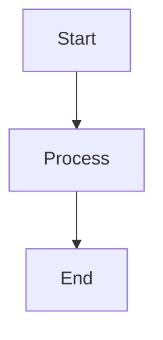
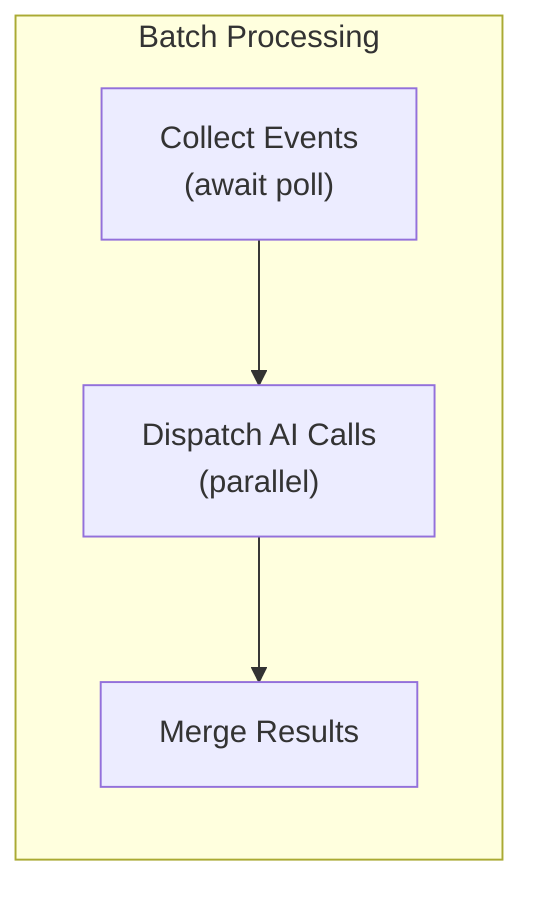

# Module: MISC


<file path=".ai/ai-docs/CLAUDE.md">
```md
<!-- Claude Code: auto-loads this file as project instructions -->

All project rules, architecture guide, and GitHub workflow are in:

**→ `.ai/rules.md`**

Read that file before making any changes.

```
</file>

<file path=".ai/ai-docs/GITHUB_WORKFLOW.md">
```md
# GitHub Project Management Workflow Guide

This document describes how to manage and execute tasks for the **MDpreview** GitHub project. All Antigravity agents working on this repo MUST follow this guide.

## 1. Finding Tasks
The source of truth for all development work is the GitHub Project (Project ID: `3`).

- **To list current tasks**: Run `gh project item-list 3 --owner Mchis167 --format json`.
- **To view a specific issue**: Run `gh issue view <number> --repo Mchis167/MDpreview`.
- **Priority**: Always prioritize tasks in the following order: `In progress` → `Ready` (P0 > P1 > P2) → `Backlog`.

## 2. Managing Status
Every task must go through the following lifecycle. You MUST update the project item status using the `gh project item-edit` command.

| Status | Triggering Action |
| :--- | :--- |
| **In progress** | When the agent starts planning/researching a task. |
| **In review** | **(MANDATORY)** Immediately after code changes are applied and verified. |
| **Done** | ONLY after the human user confirms they are satisfied with the implementation. |

### How to update status:
1.  **Find the Item ID**: Get the `id` from `gh project item-list`.
2.  **Edit Status**: 
    ```bash
    gh project item-edit 3 --owner Mchis167 --id <ITEM_ID> --field "Status" --value "In review"
    ```

## 3. Implementation Flow (The "Antigravity Way")
1.  **Fetch & Select**: Pull the latest project items and select the highest priority task(s).
2.  **Plan**: Research the codebase and design system (Figma) and create an `implementation_plan` artifact.
3.  **Wait**: PRESENT the plan and wait for the human user to say "proceed" or "approve".
4.  **Execute**: Modify the code using `write_to_file` or `replace_file_content`.
5.  **Status Update**: Immediately move the task to **"In review"**.
6.  **Verify & Summarize**: Perform a manual check and present a `walkthrough` artifact.

## 4. Quick Status Mapping (Project ID: `PVT_kwHOBots8c4BTH09`)
Use these IDs for error-free updates: `gh project item-edit --project-id PVT_kwHOBots8c4BTH09 --id <ITEM_ID> --field-id PVTSSF_lAHOBots8c4BTH09zhAdKGY --single-select-option-id <OID>`:

| Status Name | Option ID |
| :--- | :--- |
| **Backlog** | `f75ad846` |
| **Ready** | `61e4505c` |
| **In progress** | `47fc9ee4` |
| **In review** | `df73e18b` |
| **Done** | `98236657` |

---
*Created on: 2026-03-29*

```
</file>

<file path=".ai/ai-docs/OVERVIEW.md">
```md
# MDpreview — Project Overview & Roadmap

## 📝 Giới thiệu chung
**MDpreview** là một ứng dụng Desktop (Electron) được thiết kế đặc biệt để tối ưu hóa việc đọc, đánh giá và phản hồi các nội dung Markdown, đặc biệt là các đề xuất dài từ AI. 

Mục tiêu cốt lõi của ứng dụng là **"Đơn giản hóa mọi cuộc hội thoại với AI"** bằng cách tạo ra một môi trường trung gian hoàn hảo để Review trước khi đưa ra quyết định cuối cùng.

---

## 🛠 Hiện trạng Kỹ thuật (Tech Stack)
- **Core:** Electron.js (Đảm bảo hiệu năng và truy cập file hệ thống cục bộ).
- **Frontend:** Vanilla Javascript & CSS (Tối ưu tốc độ, không phụ thuộc framework nặng).
- **UI/UX:** Phong cách **Glassmorphism** (kính mờ), hỗ trợ Dark Mode, Accent Color tùy chỉnh và hiệu ứng Micro-animations.
- **Markdown Engine:** Marked.js kết hợp với Mermaid.js (vẽ sơ đồ).
- **Real-time:** Tích hợp Socket.io để hỗ trợ **Hot Reload** (tự động cập nhật nội dung khi file nguồn thay đổi).

---

## 🚀 Các tính năng Hiện có (Current Features)

### 1. Quản lý Workspace & File
- **Multi-Workspace:** Kết nối với nhiều thư mục local khác nhau.
- **File Explorer:** Cấu trúc cây thư mục (Tree view) mượt mà, hỗ trợ tìm kiếm file nhanh.
- **Recently Viewed:** Lưu lại các file vừa đọc để truy cập nhanh.

### 2. Trải nghiệm Đọc & Preview
- **High-quality Rendering:** Hiển thị Markdown chuẩn xác, hỗ trợ Code Highlight và Sơ đồ Mermaid.
- **Zoom & Fullscreen:** Chế độ xem ảnh phóng to và toàn màn hình để tập trung tối đa.
- **Hot Reload:** Cực kỳ hữu ích khi bạn đang dùng một công cụ khác để ghi file MD, ứng dụng sẽ cập nhật ngay lập tức.

### 3. Hệ thống Phản hồi (Commenting System) — *Trọng tâm của Project*
- **Contextual Commenting:** Cho phép bôi đen đoạn văn bản và để lại bình luận ngay tại dòng đó.
- **Comment Sidebar:** Quản lý toàn bộ danh sách feedback ở cánh phải.
- **"Copy All" Logic:** Tổng hợp toàn bộ bình luận thành một cấu trúc Markdown chuyên nghiệp để dán ngược lại cho AI (Claude/GPT).

### 4. Chế độ AI Response (AI Mode)
- Một khu vực riêng biệt để paste nhanh nội dung AI vừa trả về mà không cần lưu thành file chính thức.
- Hỗ trợ xem trước (Preview) nội dung nháp một cách nhanh chóng.

### 5. Cá nhân hóa (Customization)
- Thay đổi **Accent Color** (màu nhấn chủ đạo).
- Tùy chỉnh **Background Image** (hỗ trợ Glassmorphism cực đẹp).

---

## 🏗 Hướng phát triển tiếp theo (Roadmap & Ideas)
Chúng ta đã lưu lại 4 Issue chiến lược trên GitHub để nâng tầm workflow:

### 🟢 Giai đoạn 1: Tối ưu hóa việc thu thập (Snippet Tray)
- Triển khai **"Khay chứa ý tưởng"**: Cho phép ghim (pin) các đoạn code hoặc ý hay của AI vào một danh sách riêng mà không cần viết comment. Giúp bạn nhặt ra những "viên ngọc" giữa một rừng văn bản.

### 🟡 Giai đoạn 2: Nâng cấp ngữ cảnh (Smart Context)
- Tự động bọc (wrap) 1-2 dòng nội dung xung quanh phần bạn comment khi export. Giúp AI hiểu ngay bạn đang sửa lỗi ở đâu mà không cần phải giải thích lại "Ở đoạn này... ở câu kia...".

### 🟠 Giai đoạn 3: Điều hướng trực quan (Review Heatmap)
- Tạo một bản đồ mini ở lề trang, hiển thị những vùng nào đã có comment, vùng nào chưa đọc. Rất quan trọng khi xử lý các file đề xuất dài hàng nghìn chữ.

### 🔴 Giai đoạn 4: Tổng hợp Prompt (AI Prompt Generator)
- Biến MDpreview thành một "Trạm phóng prompt". Nó sẽ tự động soạn thảo một câu lệnh hoàn chỉnh bao gồm tất cả Feedback + Snippets bạn đã chọn, định dạng sẵn cho LLMs để bạn chỉ cần 1-click là xong việc.

---

## 🎯 Triết lý thiết kế (Design Philosophy)
> **"Aesthetics are not an option, they are a requirement."**
> 
Ứng dụng không chỉ tập trung vào tính năng mà còn phải mang lại cảm giác **Premium**. Mọi tương tác từ việc mở Sidebar, kéo thả Comment Box cho đến hiệu ứng bóng đổ (Shadow) đều được tỉ mỉ hóa để người dùng cảm thấy "đã" khi làm việc.

---
*Cập nhật lần cuối: 30/03/2026*

```
</file>

<file path=".ai/tracking/project_fields_full.json">
```json
{"fields":[{"id":"PVTF_lAHOBots8c4BTH09zhAdKGQ","name":"Title","type":"ProjectV2Field"},{"id":"PVTF_lAHOBots8c4BTH09zhAdKGU","name":"Assignees","type":"ProjectV2Field"},{"id":"PVTSSF_lAHOBots8c4BTH09zhAdKGY","name":"Status","options":[{"id":"f75ad846","name":"Backlog"},{"id":"61e4505c","name":"Ready"},{"id":"47fc9ee4","name":"In progress"},{"id":"df73e18b","name":"In review"},{"id":"98236657","name":"Done"}],"type":"ProjectV2SingleSelectField"},{"id":"PVTF_lAHOBots8c4BTH09zhAdKGc","name":"Labels","type":"ProjectV2Field"},{"id":"PVTF_lAHOBots8c4BTH09zhAdKGg","name":"Linked pull requests","type":"ProjectV2Field"},{"id":"PVTF_lAHOBots8c4BTH09zhAdKGk","name":"Milestone","type":"ProjectV2Field"},{"id":"PVTF_lAHOBots8c4BTH09zhAdKGo","name":"Repository","type":"ProjectV2Field"},{"id":"PVTF_lAHOBots8c4BTH09zhAdKGs","name":"Reviewers","type":"ProjectV2Field"},{"id":"PVTF_lAHOBots8c4BTH09zhAdKGw","name":"Parent issue","type":"ProjectV2Field"},{"id":"PVTF_lAHOBots8c4BTH09zhAdKG0","name":"Sub-issues progress","type":"ProjectV2Field"},{"id":"PVTSSF_lAHOBots8c4BTH09zhAdKG4","name":"Priority","options":[{"id":"79628723","name":"P0"},{"id":"0a877460","name":"P1"},{"id":"da944a9c","name":"P2"}],"type":"ProjectV2SingleSelectField"},{"id":"PVTSSF_lAHOBots8c4BTH09zhAdKG8","name":"Size","options":[{"id":"6c6483d2","name":"XS"},{"id":"f784b110","name":"S"},{"id":"7515a9f1","name":"M"},{"id":"817d0097","name":"L"},{"id":"db339eb2","name":"XL"}],"type":"ProjectV2SingleSelectField"},{"id":"PVTF_lAHOBots8c4BTH09zhAdKHA","name":"Estimate","type":"ProjectV2Field"},{"id":"PVTF_lAHOBots8c4BTH09zhAdKHE","name":"Start date","type":"ProjectV2Field"},{"id":"PVTF_lAHOBots8c4BTH09zhAdKHI","name":"Target date","type":"ProjectV2Field"}],"totalCount":15}

```
</file>

<file path=".ai/tracking/project_items.json">
```json
{"items":[{"content":{"body":"","number":6,"repository":"Mchis167/MDpreview","title":"[DS] - Đối chiều và mapping lại với hệ thống variable mới tại figma design","type":"Issue","url":"https://github.com/Mchis167/MDpreview/issues/6"},"id":"PVTI_lAHOBots8c4BTH09zgolyN8","labels":["Design System"],"priority":"P0","repository":"https://github.com/Mchis167/MDpreview","status":"In progress","title":"[DS] - Đối chiều và mapping lại với hệ thống variable mới tại figma design"},{"content":{"body":"","number":1,"repository":"Mchis167/MDpreview","title":"[Bug] - Khi đã có comment, khi tuyển từ tab comment về tab red, sidebar comment không được ẩn đi","type":"Issue","url":"https://github.com/Mchis167/MDpreview/issues/1"},"id":"PVTI_lAHOBots8c4BTH09zgolrHs","labels":["bug"],"priority":"P1","repository":"https://github.com/Mchis167/MDpreview","status":"In progress","title":"[Bug] - Khi đã có comment, khi tuyển từ tab comment về tab red, sidebar comment không được ẩn đi"},{"content":{"body":"Khi user tap vào một comment item tại sidebar, cần scroll về vị trí của comment đó và open comment box edit để user có thể edit nếu cần\n","number":2,"repository":"Mchis167/MDpreview","title":"[I] - Comment Item Interaction","type":"Issue","url":"https://github.com/Mchis167/MDpreview/issues/2"},"id":"PVTI_lAHOBots8c4BTH09zgolr3c","labels":["Improvement"],"priority":"P2","repository":"https://github.com/Mchis167/MDpreview","status":"In progress","title":"[I] - Comment Item Interaction"},{"content":{"body":"- [ ] Thêm trạng thái selected cho Comment Item\n- [ ] Update thêm variable: layer-hover\n\nLink Figma Designa: https://www.figma.com/design/aGCprLqhcZgJVO6ff6VXvg/MDPreview?node-id=24-18&t=UQaYCfKY94cFYFuZ-4","number":3,"repository":"Mchis167/MDpreview","title":"[I] - Update Selected State for CommentItem","type":"Issue","url":"https://github.com/Mchis167/MDpreview/issues/3"},"id":"PVTI_lAHOBots8c4BTH09zgolvak","labels":["Improvement"],"priority":"P2","repository":"https://github.com/Mchis167/MDpreview","status":"In progress","title":"[I] - Update Selected State for CommentItem"},{"content":{"body":"Using this icon for Clear Icon: assets/lucide_brush-cleaning.svg","number":4,"repository":"Mchis167/MDpreview","title":"[I] - Update Clear Icon in comment header","type":"Issue","url":"https://github.com/Mchis167/MDpreview/issues/4"},"id":"PVTI_lAHOBots8c4BTH09zgolwS0","labels":["Improvement"],"repository":"https://github.com/Mchis167/MDpreview","status":"Backlog","title":"[I] - Update Clear Icon in comment header"},{"content":{"body":"Figma Design:\nhttps://www.figma.com/design/aGCprLqhcZgJVO6ff6VXvg/MDPreview?node-id=25-84&t=UQaYCfKY94cFYFuZ-11","number":5,"repository":"Mchis167/MDpreview","title":"[C] - Implement New Button Set","type":"Issue","url":"https://github.com/Mchis167/MDpreview/issues/5"},"id":"PVTI_lAHOBots8c4BTH09zgolyBk","labels":["New Component"],"repository":"https://github.com/Mchis167/MDpreview","status":"Backlog","title":"[C] - Implement New Button Set"}],"totalCount":6}

```
</file>

<file path=".ai/tracking/project_items_check_recheck.json">
```json
{"items":[{"content":{"body":"Using this icon for Clear Icon: assets/lucide_brush-cleaning.svg","number":4,"repository":"Mchis167/MDpreview","title":"[I] - Update Clear Icon in comment header","type":"Issue","url":"https://github.com/Mchis167/MDpreview/issues/4"},"id":"PVTI_lAHOBots8c4BTH09zgolwS0","labels":["Improvement"],"repository":"https://github.com/Mchis167/MDpreview","status":"In progress","title":"[I] - Update Clear Icon in comment header"},{"content":{"body":"Figma Design:\nhttps://www.figma.com/design/aGCprLqhcZgJVO6ff6VXvg/MDPreview?node-id=25-84&t=UQaYCfKY94cFYFuZ-11","number":5,"repository":"Mchis167/MDpreview","title":"[C] - Implement New Button Set","type":"Issue","url":"https://github.com/Mchis167/MDpreview/issues/5"},"id":"PVTI_lAHOBots8c4BTH09zgolyBk","labels":["New Component"],"repository":"https://github.com/Mchis167/MDpreview","status":"In progress","title":"[C] - Implement New Button Set"},{"content":{"body":"Update new comment box design, gốm 3 state\n1. Empty và CommentFilled hiển thị khi add một comment mới, mặc định khi hiển thị icon comment, comment bõ là Empty\n2. ViewOnly: view khi user chọn một comment trên comment sidebar và scroll về vị trí comment đó. Khi ấn vào edit button, chuyển về CommentFilled\n\nLưu ý:  \n- Khi empty, Button disable , khi có content (trimed) thì với enable button\n- Sử dụng Button Component mới được xây dựng\n\nLink Figma Design: https://www.figma.com/design/aGCprLqhcZgJVO6ff6VXvg/MDPreview?node-id=25-161&t=UQaYCfKY94cFYFuZ-4","number":10,"repository":"Mchis167/MDpreview","title":"[C] - New Comment Box Design","type":"Issue","url":"https://github.com/Mchis167/MDpreview/issues/10"},"id":"PVTI_lAHOBots8c4BTH09zgol2jg","repository":"https://github.com/Mchis167/MDpreview","status":"In progress","title":"[C] - New Comment Box Design"},{"content":{"body":"1. Khi không full mode, hiển thị icon: maximize (như hiện tại)\n2. Khi đang full mode, hiển thị icon: minimize","number":8,"repository":"Mchis167/MDpreview","title":"[D] - Update FullMode Icon","type":"Issue","url":"https://github.com/Mchis167/MDpreview/issues/8"},"id":"PVTI_lAHOBots8c4BTH09zgol1cE","labels":["Improvement"],"repository":"https://github.com/Mchis167/MDpreview","status":"Done","title":"[D] - Update FullMode Icon"},{"content":{"body":"Trên Botton Group tại header, thêm một action rebuild app, giúp có thể thoát app và rebuild lại app nhanh, sau rebuild tự động khơi đợng lại app\n\nFigma Design: https://www.figma.com/design/aGCprLqhcZgJVO6ff6VXvg/MDPreview?node-id=25-214&t=UQaYCfKY94cFYFuZ-11","number":9,"repository":"Mchis167/MDpreview","title":"[F] - Add New Rebuild App Action","type":"Issue","url":"https://github.com/Mchis167/MDpreview/issues/9"},"id":"PVTI_lAHOBots8c4BTH09zgol15U","labels":["New Feature"],"repository":"https://github.com/Mchis167/MDpreview","status":"Done","title":"[F] - Add New Rebuild App Action"},{"content":{"body":"1. Font Size: 14 -> 12\n2. Font W: Med -> Semi","number":7,"repository":"Mchis167/MDpreview","title":"[D] - Update Segment Control Item Design","type":"Issue","url":"https://github.com/Mchis167/MDpreview/issues/7"},"id":"PVTI_lAHOBots8c4BTH09zgol014","labels":["Design Update"],"repository":"https://github.com/Mchis167/MDpreview","status":"Done","title":"[D] - Update Segment Control Item Design"},{"content":{"body":"","number":1,"repository":"Mchis167/MDpreview","title":"[Bug] - Khi đã có comment, khi tuyển từ tab comment về tab red, sidebar comment không được ẩn đi","type":"Issue","url":"https://github.com/Mchis167/MDpreview/issues/1"},"id":"PVTI_lAHOBots8c4BTH09zgolrHs","labels":["bug"],"priority":"P1","repository":"https://github.com/Mchis167/MDpreview","status":"Done","title":"[Bug] - Khi đã có comment, khi tuyển từ tab comment về tab red, sidebar comment không được ẩn đi"},{"content":{"body":"Khi user tap vào một comment item tại sidebar, cần scroll về vị trí của comment đó và open comment box edit để user có thể edit nếu cần\n","number":2,"repository":"Mchis167/MDpreview","title":"[I] - Comment Item Interaction","type":"Issue","url":"https://github.com/Mchis167/MDpreview/issues/2"},"id":"PVTI_lAHOBots8c4BTH09zgolr3c","labels":["Improvement"],"priority":"P2","repository":"https://github.com/Mchis167/MDpreview","status":"Done","title":"[I] - Comment Item Interaction"},{"content":{"body":"Khi Comment SideBar slide vào, không hiển thị các comment item vôi, để opacity = 0, khi nào sidebar ổn định thì với animation nhanh opcity về 1 để tránh nhảy layout khi đang animate","number":11,"repository":"Mchis167/MDpreview","title":"Comment Show / Hide Interaction","type":"Issue","url":"https://github.com/Mchis167/MDpreview/issues/11"},"id":"PVTI_lAHOBots8c4BTH09zgol3no","labels":["Improvement"],"repository":"https://github.com/Mchis167/MDpreview","status":"Done","title":"Comment Show / Hide Interaction"},{"content":{"body":"Khi một comment đang được select, ngoài việc scroll về vị chí chuẩn, còn phải mở lại modal comment với nội dung dã comment, khi ấn ra ngoài vùng trống, modal đóng lại và comment item trở lại state enable","number":12,"repository":"Mchis167/MDpreview","title":"Open Comment Modal Behavior","type":"Issue","url":"https://github.com/Mchis167/MDpreview/issues/12"},"id":"PVTI_lAHOBots8c4BTH09zgol350","repository":"https://github.com/Mchis167/MDpreview","status":"Done","title":"Open Comment Modal Behavior"},{"content":{"body":"Ở đây chúng ta cần không chỉ đơn thuần là restart app, chúng ta cần restart, sau đó auto chạy lệnh rebuild, sau đó với reopen app again\n","number":13,"repository":"Mchis167/MDpreview","title":"Update Rebuild Logic","type":"Issue","url":"https://github.com/Mchis167/MDpreview/issues/13"},"id":"PVTI_lAHOBots8c4BTH09zgol4zc","labels":["Improvement"],"repository":"https://github.com/Mchis167/MDpreview","status":"Done","title":"Update Rebuild Logic"},{"content":{"body":"- [ ] Thêm trạng thái selected cho Comment Item\n- [ ] Update thêm variable: layer-hover\n\nLink Figma Designa: https://www.figma.com/design/aGCprLqhcZgJVO6ff6VXvg/MDPreview?node-id=24-18&t=UQaYCfKY94cFYFuZ-4","number":3,"repository":"Mchis167/MDpreview","title":"[I] - Update Selected State for CommentItem","type":"Issue","url":"https://github.com/Mchis167/MDpreview/issues/3"},"id":"PVTI_lAHOBots8c4BTH09zgolvak","labels":["Improvement"],"priority":"P2","repository":"https://github.com/Mchis167/MDpreview","status":"Done","title":"[I] - Update Selected State for CommentItem"},{"content":{"body":"","number":6,"repository":"Mchis167/MDpreview","title":"[DS] - Đối chiều và mapping lại với hệ thống variable mới tại figma design","type":"Issue","url":"https://github.com/Mchis167/MDpreview/issues/6"},"id":"PVTI_lAHOBots8c4BTH09zgolyN8","labels":["Design System"],"priority":"P0","repository":"https://github.com/Mchis167/MDpreview","status":"Done","title":"[DS] - Đối chiều và mapping lại với hệ thống variable mới tại figma design"}],"totalCount":13}

```
</file>

<file path=".ai/tracking/project_items_final.json">
```json
{"items":[{"content":{"body":"1. Khi không full mode, hiển thị icon: maximize (như hiện tại)\n2. Khi đang full mode, hiển thị icon: minimize","number":8,"repository":"Mchis167/MDpreview","title":"[D] - Update FullMode Icon","type":"Issue","url":"https://github.com/Mchis167/MDpreview/issues/8"},"id":"PVTI_lAHOBots8c4BTH09zgol1cE","labels":["Improvement"],"repository":"https://github.com/Mchis167/MDpreview","status":"In progress","title":"[D] - Update FullMode Icon"},{"content":{"body":"Trên Botton Group tại header, thêm một action rebuild app, giúp có thể thoát app và rebuild lại app nhanh, sau rebuild tự động khơi đợng lại app\n\nFigma Design: https://www.figma.com/design/aGCprLqhcZgJVO6ff6VXvg/MDPreview?node-id=25-214&t=UQaYCfKY94cFYFuZ-11","number":9,"repository":"Mchis167/MDpreview","title":"[F] - Add New Rebuild App Action","type":"Issue","url":"https://github.com/Mchis167/MDpreview/issues/9"},"id":"PVTI_lAHOBots8c4BTH09zgol15U","labels":["New Feature"],"repository":"https://github.com/Mchis167/MDpreview","status":"In progress","title":"[F] - Add New Rebuild App Action"},{"content":{"body":"1. Font Size: 14 -> 12\n2. Font W: Med -> Semi","number":7,"repository":"Mchis167/MDpreview","title":"[D] - Update Segment Control Item Design","type":"Issue","url":"https://github.com/Mchis167/MDpreview/issues/7"},"id":"PVTI_lAHOBots8c4BTH09zgol014","labels":["Design Update"],"repository":"https://github.com/Mchis167/MDpreview","status":"In progress","title":"[D] - Update Segment Control Item Design"},{"content":{"body":"","number":6,"repository":"Mchis167/MDpreview","title":"[DS] - Đối chiều và mapping lại với hệ thống variable mới tại figma design","type":"Issue","url":"https://github.com/Mchis167/MDpreview/issues/6"},"id":"PVTI_lAHOBots8c4BTH09zgolyN8","labels":["Design System"],"priority":"P0","repository":"https://github.com/Mchis167/MDpreview","status":"In review","title":"[DS] - Đối chiều và mapping lại với hệ thống variable mới tại figma design"},{"content":{"body":"","number":1,"repository":"Mchis167/MDpreview","title":"[Bug] - Khi đã có comment, khi tuyển từ tab comment về tab red, sidebar comment không được ẩn đi","type":"Issue","url":"https://github.com/Mchis167/MDpreview/issues/1"},"id":"PVTI_lAHOBots8c4BTH09zgolrHs","labels":["bug"],"priority":"P1","repository":"https://github.com/Mchis167/MDpreview","status":"In review","title":"[Bug] - Khi đã có comment, khi tuyển từ tab comment về tab red, sidebar comment không được ẩn đi"},{"content":{"body":"Khi user tap vào một comment item tại sidebar, cần scroll về vị trí của comment đó và open comment box edit để user có thể edit nếu cần\n","number":2,"repository":"Mchis167/MDpreview","title":"[I] - Comment Item Interaction","type":"Issue","url":"https://github.com/Mchis167/MDpreview/issues/2"},"id":"PVTI_lAHOBots8c4BTH09zgolr3c","labels":["Improvement"],"priority":"P2","repository":"https://github.com/Mchis167/MDpreview","status":"In review","title":"[I] - Comment Item Interaction"},{"content":{"body":"- [ ] Thêm trạng thái selected cho Comment Item\n- [ ] Update thêm variable: layer-hover\n\nLink Figma Designa: https://www.figma.com/design/aGCprLqhcZgJVO6ff6VXvg/MDPreview?node-id=24-18&t=UQaYCfKY94cFYFuZ-4","number":3,"repository":"Mchis167/MDpreview","title":"[I] - Update Selected State for CommentItem","type":"Issue","url":"https://github.com/Mchis167/MDpreview/issues/3"},"id":"PVTI_lAHOBots8c4BTH09zgolvak","labels":["Improvement"],"priority":"P2","repository":"https://github.com/Mchis167/MDpreview","status":"In review","title":"[I] - Update Selected State for CommentItem"},{"content":{"body":"Using this icon for Clear Icon: assets/lucide_brush-cleaning.svg","number":4,"repository":"Mchis167/MDpreview","title":"[I] - Update Clear Icon in comment header","type":"Issue","url":"https://github.com/Mchis167/MDpreview/issues/4"},"id":"PVTI_lAHOBots8c4BTH09zgolwS0","labels":["Improvement"],"repository":"https://github.com/Mchis167/MDpreview","status":"Backlog","title":"[I] - Update Clear Icon in comment header"},{"content":{"body":"Figma Design:\nhttps://www.figma.com/design/aGCprLqhcZgJVO6ff6VXvg/MDPreview?node-id=25-84&t=UQaYCfKY94cFYFuZ-11","number":5,"repository":"Mchis167/MDpreview","title":"[C] - Implement New Button Set","type":"Issue","url":"https://github.com/Mchis167/MDpreview/issues/5"},"id":"PVTI_lAHOBots8c4BTH09zgolyBk","labels":["New Component"],"repository":"https://github.com/Mchis167/MDpreview","status":"Backlog","title":"[C] - Implement New Button Set"}],"totalCount":9}

```
</file>

<file path=".ai/tracking/project_items_final_check.json">
```json
{"items":[{"content":{"body":"Using this icon for Clear Icon: assets/lucide_brush-cleaning.svg","number":4,"repository":"Mchis167/MDpreview","title":"[I] - Update Clear Icon in comment header","type":"Issue","url":"https://github.com/Mchis167/MDpreview/issues/4"},"id":"PVTI_lAHOBots8c4BTH09zgolwS0","labels":["Improvement"],"repository":"https://github.com/Mchis167/MDpreview","status":"In progress","title":"[I] - Update Clear Icon in comment header"},{"content":{"body":"Figma Design:\nhttps://www.figma.com/design/aGCprLqhcZgJVO6ff6VXvg/MDPreview?node-id=25-84&t=UQaYCfKY94cFYFuZ-11","number":5,"repository":"Mchis167/MDpreview","title":"[C] - Implement New Button Set","type":"Issue","url":"https://github.com/Mchis167/MDpreview/issues/5"},"id":"PVTI_lAHOBots8c4BTH09zgolyBk","labels":["New Component"],"repository":"https://github.com/Mchis167/MDpreview","status":"In progress","title":"[C] - Implement New Button Set"},{"content":{"body":"Update new comment box design, gốm 3 state\n1. Empty và CommentFilled hiển thị khi add một comment mới, mặc định khi hiển thị icon comment, comment bõ là Empty\n2. ViewOnly: view khi user chọn một comment trên comment sidebar và scroll về vị trí comment đó. Khi ấn vào edit button, chuyển về CommentFilled\n\nLưu ý:  \n- Khi empty, Button disable , khi có content (trimed) thì với enable button\n- Sử dụng Button Component mới được xây dựng\n\nLink Figma Design: https://www.figma.com/design/aGCprLqhcZgJVO6ff6VXvg/MDPreview?node-id=25-161&t=UQaYCfKY94cFYFuZ-4","number":10,"repository":"Mchis167/MDpreview","title":"[C] - New Comment Box Design","type":"Issue","url":"https://github.com/Mchis167/MDpreview/issues/10"},"id":"PVTI_lAHOBots8c4BTH09zgol2jg","repository":"https://github.com/Mchis167/MDpreview","status":"In progress","title":"[C] - New Comment Box Design"},{"content":{"body":"1. Khi không full mode, hiển thị icon: maximize (như hiện tại)\n2. Khi đang full mode, hiển thị icon: minimize","number":8,"repository":"Mchis167/MDpreview","title":"[D] - Update FullMode Icon","type":"Issue","url":"https://github.com/Mchis167/MDpreview/issues/8"},"id":"PVTI_lAHOBots8c4BTH09zgol1cE","labels":["Improvement"],"repository":"https://github.com/Mchis167/MDpreview","status":"Done","title":"[D] - Update FullMode Icon"},{"content":{"body":"Trên Botton Group tại header, thêm một action rebuild app, giúp có thể thoát app và rebuild lại app nhanh, sau rebuild tự động khơi đợng lại app\n\nFigma Design: https://www.figma.com/design/aGCprLqhcZgJVO6ff6VXvg/MDPreview?node-id=25-214&t=UQaYCfKY94cFYFuZ-11","number":9,"repository":"Mchis167/MDpreview","title":"[F] - Add New Rebuild App Action","type":"Issue","url":"https://github.com/Mchis167/MDpreview/issues/9"},"id":"PVTI_lAHOBots8c4BTH09zgol15U","labels":["New Feature"],"repository":"https://github.com/Mchis167/MDpreview","status":"Done","title":"[F] - Add New Rebuild App Action"},{"content":{"body":"1. Font Size: 14 -> 12\n2. Font W: Med -> Semi","number":7,"repository":"Mchis167/MDpreview","title":"[D] - Update Segment Control Item Design","type":"Issue","url":"https://github.com/Mchis167/MDpreview/issues/7"},"id":"PVTI_lAHOBots8c4BTH09zgol014","labels":["Design Update"],"repository":"https://github.com/Mchis167/MDpreview","status":"Done","title":"[D] - Update Segment Control Item Design"},{"content":{"body":"","number":1,"repository":"Mchis167/MDpreview","title":"[Bug] - Khi đã có comment, khi tuyển từ tab comment về tab red, sidebar comment không được ẩn đi","type":"Issue","url":"https://github.com/Mchis167/MDpreview/issues/1"},"id":"PVTI_lAHOBots8c4BTH09zgolrHs","labels":["bug"],"priority":"P1","repository":"https://github.com/Mchis167/MDpreview","status":"Done","title":"[Bug] - Khi đã có comment, khi tuyển từ tab comment về tab red, sidebar comment không được ẩn đi"},{"content":{"body":"Khi user tap vào một comment item tại sidebar, cần scroll về vị trí của comment đó và open comment box edit để user có thể edit nếu cần\n","number":2,"repository":"Mchis167/MDpreview","title":"[I] - Comment Item Interaction","type":"Issue","url":"https://github.com/Mchis167/MDpreview/issues/2"},"id":"PVTI_lAHOBots8c4BTH09zgolr3c","labels":["Improvement"],"priority":"P2","repository":"https://github.com/Mchis167/MDpreview","status":"Done","title":"[I] - Comment Item Interaction"},{"content":{"body":"Khi Comment SideBar slide vào, không hiển thị các comment item vôi, để opacity = 0, khi nào sidebar ổn định thì với animation nhanh opcity về 1 để tránh nhảy layout khi đang animate","number":11,"repository":"Mchis167/MDpreview","title":"Comment Show / Hide Interaction","type":"Issue","url":"https://github.com/Mchis167/MDpreview/issues/11"},"id":"PVTI_lAHOBots8c4BTH09zgol3no","labels":["Improvement"],"repository":"https://github.com/Mchis167/MDpreview","status":"Done","title":"Comment Show / Hide Interaction"},{"content":{"body":"Khi một comment đang được select, ngoài việc scroll về vị chí chuẩn, còn phải mở lại modal comment với nội dung dã comment, khi ấn ra ngoài vùng trống, modal đóng lại và comment item trở lại state enable","number":12,"repository":"Mchis167/MDpreview","title":"Open Comment Modal Behavior","type":"Issue","url":"https://github.com/Mchis167/MDpreview/issues/12"},"id":"PVTI_lAHOBots8c4BTH09zgol350","repository":"https://github.com/Mchis167/MDpreview","status":"Done","title":"Open Comment Modal Behavior"},{"content":{"body":"Ở đây chúng ta cần không chỉ đơn thuần là restart app, chúng ta cần restart, sau đó auto chạy lệnh rebuild, sau đó với reopen app again\n","number":13,"repository":"Mchis167/MDpreview","title":"Update Rebuild Logic","type":"Issue","url":"https://github.com/Mchis167/MDpreview/issues/13"},"id":"PVTI_lAHOBots8c4BTH09zgol4zc","labels":["Improvement"],"repository":"https://github.com/Mchis167/MDpreview","status":"Done","title":"Update Rebuild Logic"},{"content":{"body":"- [ ] Thêm trạng thái selected cho Comment Item\n- [ ] Update thêm variable: layer-hover\n\nLink Figma Designa: https://www.figma.com/design/aGCprLqhcZgJVO6ff6VXvg/MDPreview?node-id=24-18&t=UQaYCfKY94cFYFuZ-4","number":3,"repository":"Mchis167/MDpreview","title":"[I] - Update Selected State for CommentItem","type":"Issue","url":"https://github.com/Mchis167/MDpreview/issues/3"},"id":"PVTI_lAHOBots8c4BTH09zgolvak","labels":["Improvement"],"priority":"P2","repository":"https://github.com/Mchis167/MDpreview","status":"Done","title":"[I] - Update Selected State for CommentItem"},{"content":{"body":"","number":6,"repository":"Mchis167/MDpreview","title":"[DS] - Đối chiều và mapping lại với hệ thống variable mới tại figma design","type":"Issue","url":"https://github.com/Mchis167/MDpreview/issues/6"},"id":"PVTI_lAHOBots8c4BTH09zgolyN8","labels":["Design System"],"priority":"P0","repository":"https://github.com/Mchis167/MDpreview","status":"Done","title":"[DS] - Đối chiều và mapping lại với hệ thống variable mới tại figma design"}],"totalCount":13}

```
</file>

<file path=".ai/tracking/project_items_full.json">
```json
{"items":[{"content":{"body":"- [ ] Thêm một message behavior vào khi user copy thành công\n- [ ] Icon copy chuyển thành Icon check trong 1s, sau đó quay trở lại thành icon copy\n\nlink design: https://www.figma.com/design/aGCprLqhcZgJVO6ff6VXvg/MDPreview?node-id=68-187&m=dev\n","number":36,"repository":"Mchis167/MDpreview","title":"Thêm Toast / nackbar / message khi copy thành công","type":"Issue","url":"https://github.com/Mchis167/MDpreview/issues/36"},"id":"PVTI_lAHOBots8c4BTH09zgonTyY","labels":["Improvement"],"repository":"https://github.com/Mchis167/MDpreview","status":"In review","title":"Thêm Toast / nackbar / message khi copy thành công"},{"content":{"body":"Định dạng quote bị hiển thi sai, không đúng, box 1 nơi quote một nẻo\n\n","number":35,"repository":"Mchis167/MDpreview","title":"Quote Block bị hiển thị sai","type":"Issue","url":"https://github.com/Mchis167/MDpreview/issues/35"},"id":"PVTI_lAHOBots8c4BTH09zgom-hU","labels":["bug"],"repository":"https://github.com/Mchis167/MDpreview","status":"In review","title":"Quote Block bị hiển thị sai"},{"content":{"body":"1. khi preview new respone mà response trước có comment rồi -> thông báo là nếu preview new thì xoá comment cũ đi ","number":38,"repository":"Mchis167/MDpreview","title":"New Preview Behavior","type":"Issue","url":"https://github.com/Mchis167/MDpreview/issues/38"},"id":"PVTI_lAHOBots8c4BTH09zgonV7M","repository":"https://github.com/Mchis167/MDpreview","status":"In review","title":"New Preview Behavior"},{"content":{"body":"","number":37,"repository":"Mchis167/MDpreview","title":"Adđitional content chưa được đính vào copy comment","type":"Issue","url":"https://github.com/Mchis167/MDpreview/issues/37"},"id":"PVTI_lAHOBots8c4BTH09zgonUYU","labels":["bug"],"repository":"https://github.com/Mchis167/MDpreview","status":"In review","title":"Adđitional content chưa được đính vào copy comment"},{"content":{"body":"Cần check lại Recently Viewed file item, hiện tại đang bị sinh ra một style rất lạ, cần check lại thông số với design, đảm bảo cách hiển thị của nó đòng bộ với một item file thống thướng của all file bên dưới\nhttps://www.figma.com/design/aGCprLqhcZgJVO6ff6VXvg/MDPreview?node-id=32-360&t=UQaYCfKY94cFYFuZ-11","number":21,"repository":"Mchis167/MDpreview","title":"Update recently view file UI","type":"Issue","url":"https://github.com/Mchis167/MDpreview/issues/21"},"id":"PVTI_lAHOBots8c4BTH09zgomRAU","labels":["bug"],"repository":"https://github.com/Mchis167/MDpreview","status":"Done","title":"Update recently view file UI"},{"content":{"body":"Đối chiếu thông số của sidebar hiện tại với design để đảm bảo thông số là chuẩn 100%\nhttps://www.figma.com/design/aGCprLqhcZgJVO6ff6VXvg/MDPreview?node-id=32-432&t=UQaYCfKY94cFYFuZ-11\n\nHiện tại sidebar đang còn logo, loại bỏ luôn, ngoài ra, khoảng cách , divider đang bị  thiếu. Đảm bảo design là hoàn toàn chuẩn xác","number":22,"repository":"Mchis167/MDpreview","title":"Fix Left Sidebar UI","type":"Issue","url":"https://github.com/Mchis167/MDpreview/issues/22"},"id":"PVTI_lAHOBots8c4BTH09zgomRyI","labels":["Improvement"],"repository":"https://github.com/Mchis167/MDpreview","status":"Done","title":"Fix Left Sidebar UI"},{"content":{"body":"Link Figma\nhttps://www.figma.com/design/aGCprLqhcZgJVO6ff6VXvg/MDPreview?node-id=32-1252&t=UQaYCfKY94cFYFuZ-11\n\nNote: Lưu ý, sử dụng absolute position center để căn giữa với chiều cao của sidebar, hiện tại content bị đẩy xuống dưới một đoạn chứ hông căn giữa\n\n\n\nIcon sử dụng: assets/lucide_message-circle-dashed.svg","number":16,"repository":"Mchis167/MDpreview","title":"New Comment Empty State","type":"Issue","url":"https://github.com/Mchis167/MDpreview/issues/16"},"id":"PVTI_lAHOBots8c4BTH09zgomCi0","labels":["Design Update"],"repository":"https://github.com/Mchis167/MDpreview","status":"Done","title":"New Comment Empty State"},{"content":{"body":"Main Screen background color:\nbackground: #151515;\n\nSection - Main Preview Area\nbackground: linear-gradient(168deg, rgba(0, 0, 0, 0.10) 8.96%, rgba(0, 0, 0, 0.30) 91.04%);\nbackdrop-filter: blur(5px);\n\n2 sidebar\nbackground: linear-gradient(166deg, rgba(255, 255, 255, 0.05) 0%, rgba(255, 255, 255, 0.01) 100%);\nbackdrop-filter: blur(12px);","number":19,"repository":"Mchis167/MDpreview","title":"Update color","type":"Issue","url":"https://github.com/Mchis167/MDpreview/issues/19"},"id":"PVTI_lAHOBots8c4BTH09zgomFBs","labels":["Design Update"],"repository":"https://github.com/Mchis167/MDpreview","status":"Done","title":"Update color"},{"content":{"body":"Cập nhật background về một màu trơn, không có hiệu ứng kính chéo màn hình nữa:\n\n","number":18,"repository":"Mchis167/MDpreview","title":"Background Update","type":"Issue","url":"https://github.com/Mchis167/MDpreview/issues/18"},"id":"PVTI_lAHOBots8c4BTH09zgomDJ0","labels":["Design Update"],"repository":"https://github.com/Mchis167/MDpreview","status":"Done","title":"Background Update"},{"content":{"body":"Tìm và loại bỏ tất cả những chỗ đang dùng màu tím, quy về một màu accent vàng thôi\n","number":17,"repository":"Mchis167/MDpreview","title":"Loại bỏ Purple Accent","type":"Issue","url":"https://github.com/Mchis167/MDpreview/issues/17"},"id":"PVTI_lAHOBots8c4BTH09zgomDBA","repository":"https://github.com/Mchis167/MDpreview","status":"Done","title":"Loại bỏ Purple Accent"},{"content":{"body":"","number":6,"repository":"Mchis167/MDpreview","title":"[DS] - Đối chiều và mapping lại với hệ thống variable mới tại figma design","type":"Issue","url":"https://github.com/Mchis167/MDpreview/issues/6"},"id":"PVTI_lAHOBots8c4BTH09zgolyN8","labels":["Design System"],"priority":"P0","repository":"https://github.com/Mchis167/MDpreview","status":"Done","title":"[DS] - Đối chiều và mapping lại với hệ thống variable mới tại figma design"},{"content":{"body":"New Design: https://www.figma.com/design/aGCprLqhcZgJVO6ff6VXvg/MDPreview?node-id=32-433&t=UQaYCfKY94cFYFuZ-4\n\nSidebar mới giờ sẽ được support để có thể chuyển động linh hoạt giữa 2 loại mode\n1. markdown: Như hiện tại\n2. Ai Response: Tính năng sắp triển khai, tạm thời để placeholder\n\nkhi ở Markdown mode, chúng ta sẽ nâng cấp thêm Recently Viewed, hiển thị tối đa 3 file xem gần dây ở workspace này, update lại search function, thay vì search trực tiếp, giờ đây search sẽ được thu gọn lại, khi ấn vào button search thì chuyển sang state search mode, search mode content sẽ có các state như sau: \nhttps://www.figma.com/design/aGCprLqhcZgJVO6ff6VXvg/MDPreview?node-id=32-701&t=UQaYCfKY94cFYFuZ-4\n\nKhi user ấn butotn x, sẽ thoát search mode\n\nNgoài ra một update nhỏ là Icon của trailing của workspace selector không phải là down nữa là là right\n","number":15,"repository":"Mchis167/MDpreview","title":"Update Left SideBar","type":"Issue","url":"https://github.com/Mchis167/MDpreview/issues/15"},"id":"PVTI_lAHOBots8c4BTH09zgomBec","labels":["New Feature"],"repository":"https://github.com/Mchis167/MDpreview","status":"Done","title":"Update Left SideBar"},{"content":{"body":"https://www.figma.com/design/aGCprLqhcZgJVO6ff6VXvg/MDPreview?node-id=32-638&t=UQaYCfKY94cFYFuZ-4\n\nCheck lại design search bar và implement đẩy đủ các state cần có của search bar cũng như sủa dụng đúng design token chuẩn","number":14,"repository":"Mchis167/MDpreview","title":"Update Design for Search Bar","type":"Issue","url":"https://github.com/Mchis167/MDpreview/issues/14"},"id":"PVTI_lAHOBots8c4BTH09zgomAyQ","labels":["Design Update"],"repository":"https://github.com/Mchis167/MDpreview","status":"Done","title":"Update Design for Search Bar"},{"content":{"body":"Using this icon for Clear Icon: assets/lucide_brush-cleaning.svg","number":4,"repository":"Mchis167/MDpreview","title":"[I] - Update Clear Icon in comment header","type":"Issue","url":"https://github.com/Mchis167/MDpreview/issues/4"},"id":"PVTI_lAHOBots8c4BTH09zgolwS0","labels":["Improvement"],"repository":"https://github.com/Mchis167/MDpreview","status":"Done","title":"[I] - Update Clear Icon in comment header"},{"content":{"body":"Figma Design:\nhttps://www.figma.com/design/aGCprLqhcZgJVO6ff6VXvg/MDPreview?node-id=25-84&t=UQaYCfKY94cFYFuZ-11","number":5,"repository":"Mchis167/MDpreview","title":"[C] - Implement New Button Set","type":"Issue","url":"https://github.com/Mchis167/MDpreview/issues/5"},"id":"PVTI_lAHOBots8c4BTH09zgolyBk","labels":["New Component"],"repository":"https://github.com/Mchis167/MDpreview","status":"Done","title":"[C] - Implement New Button Set"},{"content":{"body":"Update new comment box design, gốm 3 state\n1. Empty và CommentFilled hiển thị khi add một comment mới, mặc định khi hiển thị icon comment, comment bõ là Empty\n2. ViewOnly: view khi user chọn một comment trên comment sidebar và scroll về vị trí comment đó. Khi ấn vào edit button, chuyển về CommentFilled\n\nLưu ý:  \n- Khi empty, Button disable , khi có content (trimed) thì với enable button\n- Sử dụng Button Component mới được xây dựng\n\nLink Figma Design: https://www.figma.com/design/aGCprLqhcZgJVO6ff6VXvg/MDPreview?node-id=25-161&t=UQaYCfKY94cFYFuZ-4","number":10,"repository":"Mchis167/MDpreview","title":"[C] - New Comment Box Design","type":"Issue","url":"https://github.com/Mchis167/MDpreview/issues/10"},"id":"PVTI_lAHOBots8c4BTH09zgol2jg","repository":"https://github.com/Mchis167/MDpreview","status":"Done","title":"[C] - New Comment Box Design"},{"content":{"body":"1. Khi không full mode, hiển thị icon: maximize (như hiện tại)\n2. Khi đang full mode, hiển thị icon: minimize","number":8,"repository":"Mchis167/MDpreview","title":"[D] - Update FullMode Icon","type":"Issue","url":"https://github.com/Mchis167/MDpreview/issues/8"},"id":"PVTI_lAHOBots8c4BTH09zgol1cE","labels":["Improvement"],"repository":"https://github.com/Mchis167/MDpreview","status":"Done","title":"[D] - Update FullMode Icon"},{"content":{"body":"Trên Botton Group tại header, thêm một action rebuild app, giúp có thể thoát app và rebuild lại app nhanh, sau rebuild tự động khơi đợng lại app\n\nFigma Design: https://www.figma.com/design/aGCprLqhcZgJVO6ff6VXvg/MDPreview?node-id=25-214&t=UQaYCfKY94cFYFuZ-11","number":9,"repository":"Mchis167/MDpreview","title":"[F] - Add New Rebuild App Action","type":"Issue","url":"https://github.com/Mchis167/MDpreview/issues/9"},"id":"PVTI_lAHOBots8c4BTH09zgol15U","labels":["New Feature"],"repository":"https://github.com/Mchis167/MDpreview","status":"Done","title":"[F] - Add New Rebuild App Action"},{"content":{"body":"1. Font Size: 14 -> 12\n2. Font W: Med -> Semi","number":7,"repository":"Mchis167/MDpreview","title":"[D] - Update Segment Control Item Design","type":"Issue","url":"https://github.com/Mchis167/MDpreview/issues/7"},"id":"PVTI_lAHOBots8c4BTH09zgol014","labels":["Design Update"],"repository":"https://github.com/Mchis167/MDpreview","status":"Done","title":"[D] - Update Segment Control Item Design"},{"content":{"body":"","number":1,"repository":"Mchis167/MDpreview","title":"[Bug] - Khi đã có comment, khi tuyển từ tab comment về tab red, sidebar comment không được ẩn đi","type":"Issue","url":"https://github.com/Mchis167/MDpreview/issues/1"},"id":"PVTI_lAHOBots8c4BTH09zgolrHs","labels":["bug"],"priority":"P1","repository":"https://github.com/Mchis167/MDpreview","status":"Done","title":"[Bug] - Khi đã có comment, khi tuyển từ tab comment về tab red, sidebar comment không được ẩn đi"},{"content":{"body":"Khi user tap vào một comment item tại sidebar, cần scroll về vị trí của comment đó và open comment box edit để user có thể edit nếu cần\n","number":2,"repository":"Mchis167/MDpreview","title":"[I] - Comment Item Interaction","type":"Issue","url":"https://github.com/Mchis167/MDpreview/issues/2"},"id":"PVTI_lAHOBots8c4BTH09zgolr3c","labels":["Improvement"],"priority":"P2","repository":"https://github.com/Mchis167/MDpreview","status":"Done","title":"[I] - Comment Item Interaction"},{"content":{"body":"Khi Comment SideBar slide vào, không hiển thị các comment item vôi, để opacity = 0, khi nào sidebar ổn định thì với animation nhanh opcity về 1 để tránh nhảy layout khi đang animate","number":11,"repository":"Mchis167/MDpreview","title":"Comment Show / Hide Interaction","type":"Issue","url":"https://github.com/Mchis167/MDpreview/issues/11"},"id":"PVTI_lAHOBots8c4BTH09zgol3no","labels":["Improvement"],"repository":"https://github.com/Mchis167/MDpreview","status":"Done","title":"Comment Show / Hide Interaction"},{"content":{"body":"Khi một comment đang được select, ngoài việc scroll về vị chí chuẩn, còn phải mở lại modal comment với nội dung dã comment, khi ấn ra ngoài vùng trống, modal đóng lại và comment item trở lại state enable","number":12,"repository":"Mchis167/MDpreview","title":"Open Comment Modal Behavior","type":"Issue","url":"https://github.com/Mchis167/MDpreview/issues/12"},"id":"PVTI_lAHOBots8c4BTH09zgol350","repository":"https://github.com/Mchis167/MDpreview","status":"Done","title":"Open Comment Modal Behavior"},{"content":{"body":"Ở đây chúng ta cần không chỉ đơn thuần là restart app, chúng ta cần restart, sau đó auto chạy lệnh rebuild, sau đó với reopen app again\n","number":13,"repository":"Mchis167/MDpreview","title":"Update Rebuild Logic","type":"Issue","url":"https://github.com/Mchis167/MDpreview/issues/13"},"id":"PVTI_lAHOBots8c4BTH09zgol4zc","labels":["Improvement"],"repository":"https://github.com/Mchis167/MDpreview","status":"Done","title":"Update Rebuild Logic"},{"content":{"body":"- [ ] Thêm trạng thái selected cho Comment Item\n- [ ] Update thêm variable: layer-hover\n\nLink Figma Designa: https://www.figma.com/design/aGCprLqhcZgJVO6ff6VXvg/MDPreview?node-id=24-18&t=UQaYCfKY94cFYFuZ-4","number":3,"repository":"Mchis167/MDpreview","title":"[I] - Update Selected State for CommentItem","type":"Issue","url":"https://github.com/Mchis167/MDpreview/issues/3"},"id":"PVTI_lAHOBots8c4BTH09zgolvak","labels":["Improvement"],"priority":"P2","repository":"https://github.com/Mchis167/MDpreview","status":"Done","title":"[I] - Update Selected State for CommentItem"},{"content":{"body":"### Check lại search bar để đảm bảo design chuẩn xác với design\n\n\n\nLink figma: https://www.figma.com/design/aGCprLqhcZgJVO6ff6VXvg/MDPreview?node-id=32-701&t=UQaYCfKY94cFYFuZ-4\n\n**Vấn đề:**\n\n1. Lỗi ui style\n2. Nếu search bar input empty (không có nội dung), không hiện dòng: search result\n3. No file found (empty state) dùng icon: lassets/lucide_file-scan.svg","number":20,"repository":"Mchis167/MDpreview","title":"Check search bar UI","type":"Issue","url":"https://github.com/Mchis167/MDpreview/issues/20"},"id":"PVTI_lAHOBots8c4BTH09zgomPjs","labels":["bug"],"repository":"https://github.com/Mchis167/MDpreview","status":"Done","title":"Check search bar UI"},{"content":{"body":"https://www.figma.com/design/aGCprLqhcZgJVO6ff6VXvg/MDPreview?node-id=32-1565&t=UQaYCfKY94cFYFuZ-11\n\ntext area, bao gồm đầy đủ các trạng thái như trong design, ngoài ra, khi ấn vào button expended, hiển thị một modal trên một overlay để view big input với design: \nhttps://www.figma.com/design/aGCprLqhcZgJVO6ff6VXvg/MDPreview?node-id=32-1839&t=UQaYCfKY94cFYFuZ-11","number":23,"repository":"Mchis167/MDpreview","title":"Implement new text area component","type":"Issue","url":"https://github.com/Mchis167/MDpreview/issues/23"},"id":"PVTI_lAHOBots8c4BTH09zgomWVk","repository":"https://github.com/Mchis167/MDpreview","status":"Done","title":"Implement new text area component"},{"content":{"body":"Update setting Popup Modal","number":24,"repository":"Mchis167/MDpreview","title":"Add Setting Screen","type":"Issue","url":"https://github.com/Mchis167/MDpreview/issues/24"},"id":"PVTI_lAHOBots8c4BTH09zgomltI","labels":["New Feature"],"repository":"https://github.com/Mchis167/MDpreview","status":"Done","title":"Add Setting Screen"},{"content":{"body":"Thêm mới icon Setting Button Group, Chia thành group Page action và setting, cách nhau bỏi một divider\n- note, có thay đổi trong right padding của header, check lại thông số mới của design và thông số hiện tại\n\nhttps://www.figma.com/design/aGCprLqhcZgJVO6ff6VXvg/MDPreview?node-id=32-1406&t=UQaYCfKY94cFYFuZ-11","number":25,"repository":"Mchis167/MDpreview","title":"Update Button Action Bar","type":"Issue","url":"https://github.com/Mchis167/MDpreview/issues/25"},"id":"PVTI_lAHOBots8c4BTH09zgommTs","labels":["New Feature"],"repository":"https://github.com/Mchis167/MDpreview","status":"Done","title":"Update Button Action Bar"},{"content":{"body":"Link figma: \nhttps://www.figma.com/design/aGCprLqhcZgJVO6ff6VXvg/MDPreview?node-id=51-363&t=UQaYCfKY94cFYFuZ-11\n\nMục. tiêu\n1. Accent color dynamic: Hiện tại, accent color fix là màu vàng, tuy nhiên để có thể linh hoạt hơn trog sở thich của user, cho phép setting chọn accent color, và nó adapt lên mọi chỗ sử dụng accent color trong app\n\n2. Cho phép user có thể custom background, nếu bật, nó sẽ cho phép user update hình ảnh lên làm background, background này nằm ở lớp dưới cùng trong layout, full 100 W và H, opacity 10%","number":26,"repository":"Mchis167/MDpreview","title":"Add Setting Modal","type":"Issue","url":"https://github.com/Mchis167/MDpreview/issues/26"},"id":"PVTI_lAHOBots8c4BTH09zgommqU","repository":"https://github.com/Mchis167/MDpreview","status":"Done","title":"Add Setting Modal"}],"totalCount":39}

```
</file>

<file path=".ai/tracking/project_items_latest.json">
```json
{"items":[{"content":{"body":"1. Khi không full mode, hiển thị icon: maximize (như hiện tại)\n2. Khi đang full mode, hiển thị icon: minimize","number":8,"repository":"Mchis167/MDpreview","title":"[D] - Update FullMode Icon","type":"Issue","url":"https://github.com/Mchis167/MDpreview/issues/8"},"id":"PVTI_lAHOBots8c4BTH09zgol1cE","labels":["Improvement"],"repository":"https://github.com/Mchis167/MDpreview","status":"In progress","title":"[D] - Update FullMode Icon"},{"content":{"body":"Trên Botton Group tại header, thêm một action rebuild app, giúp có thể thoát app và rebuild lại app nhanh, sau rebuild tự động khơi đợng lại app\n\nFigma Design: https://www.figma.com/design/aGCprLqhcZgJVO6ff6VXvg/MDPreview?node-id=25-214&t=UQaYCfKY94cFYFuZ-11","number":9,"repository":"Mchis167/MDpreview","title":"[F] - Add New Rebuild App Action","type":"Issue","url":"https://github.com/Mchis167/MDpreview/issues/9"},"id":"PVTI_lAHOBots8c4BTH09zgol15U","labels":["New Feature"],"repository":"https://github.com/Mchis167/MDpreview","status":"In progress","title":"[F] - Add New Rebuild App Action"},{"content":{"body":"1. Font Size: 14 -> 12\n2. Font W: Med -> Semi","number":7,"repository":"Mchis167/MDpreview","title":"[D] - Update Segment Control Item Design","type":"Issue","url":"https://github.com/Mchis167/MDpreview/issues/7"},"id":"PVTI_lAHOBots8c4BTH09zgol014","labels":["Design Update"],"repository":"https://github.com/Mchis167/MDpreview","status":"In progress","title":"[D] - Update Segment Control Item Design"},{"content":{"body":"","number":6,"repository":"Mchis167/MDpreview","title":"[DS] - Đối chiều và mapping lại với hệ thống variable mới tại figma design","type":"Issue","url":"https://github.com/Mchis167/MDpreview/issues/6"},"id":"PVTI_lAHOBots8c4BTH09zgolyN8","labels":["Design System"],"priority":"P0","repository":"https://github.com/Mchis167/MDpreview","status":"In review","title":"[DS] - Đối chiều và mapping lại với hệ thống variable mới tại figma design"},{"content":{"body":"","number":1,"repository":"Mchis167/MDpreview","title":"[Bug] - Khi đã có comment, khi tuyển từ tab comment về tab red, sidebar comment không được ẩn đi","type":"Issue","url":"https://github.com/Mchis167/MDpreview/issues/1"},"id":"PVTI_lAHOBots8c4BTH09zgolrHs","labels":["bug"],"priority":"P1","repository":"https://github.com/Mchis167/MDpreview","status":"In review","title":"[Bug] - Khi đã có comment, khi tuyển từ tab comment về tab red, sidebar comment không được ẩn đi"},{"content":{"body":"Khi user tap vào một comment item tại sidebar, cần scroll về vị trí của comment đó và open comment box edit để user có thể edit nếu cần\n","number":2,"repository":"Mchis167/MDpreview","title":"[I] - Comment Item Interaction","type":"Issue","url":"https://github.com/Mchis167/MDpreview/issues/2"},"id":"PVTI_lAHOBots8c4BTH09zgolr3c","labels":["Improvement"],"priority":"P2","repository":"https://github.com/Mchis167/MDpreview","status":"In review","title":"[I] - Comment Item Interaction"},{"content":{"body":"- [ ] Thêm trạng thái selected cho Comment Item\n- [ ] Update thêm variable: layer-hover\n\nLink Figma Designa: https://www.figma.com/design/aGCprLqhcZgJVO6ff6VXvg/MDPreview?node-id=24-18&t=UQaYCfKY94cFYFuZ-4","number":3,"repository":"Mchis167/MDpreview","title":"[I] - Update Selected State for CommentItem","type":"Issue","url":"https://github.com/Mchis167/MDpreview/issues/3"},"id":"PVTI_lAHOBots8c4BTH09zgolvak","labels":["Improvement"],"priority":"P2","repository":"https://github.com/Mchis167/MDpreview","status":"In review","title":"[I] - Update Selected State for CommentItem"},{"content":{"body":"Using this icon for Clear Icon: assets/lucide_brush-cleaning.svg","number":4,"repository":"Mchis167/MDpreview","title":"[I] - Update Clear Icon in comment header","type":"Issue","url":"https://github.com/Mchis167/MDpreview/issues/4"},"id":"PVTI_lAHOBots8c4BTH09zgolwS0","labels":["Improvement"],"repository":"https://github.com/Mchis167/MDpreview","status":"Backlog","title":"[I] - Update Clear Icon in comment header"},{"content":{"body":"Figma Design:\nhttps://www.figma.com/design/aGCprLqhcZgJVO6ff6VXvg/MDPreview?node-id=25-84&t=UQaYCfKY94cFYFuZ-11","number":5,"repository":"Mchis167/MDpreview","title":"[C] - Implement New Button Set","type":"Issue","url":"https://github.com/Mchis167/MDpreview/issues/5"},"id":"PVTI_lAHOBots8c4BTH09zgolyBk","labels":["New Component"],"repository":"https://github.com/Mchis167/MDpreview","status":"Backlog","title":"[C] - Implement New Button Set"}],"totalCount":9}

```
</file>

<file path=".ai/tracking/project_items_latest_v2.json">
```json
{"items":[{"content":{"body":"Khi Comment SideBar slide vào, không hiển thị các comment item vôi, để opacity = 0, khi nào sidebar ổn định thì với animation nhanh opcity về 1 để tránh nhảy layout khi đang animate","number":11,"repository":"Mchis167/MDpreview","title":"Comment Show / Hide Interaction","type":"Issue","url":"https://github.com/Mchis167/MDpreview/issues/11"},"id":"PVTI_lAHOBots8c4BTH09zgol3no","labels":["Improvement"],"repository":"https://github.com/Mchis167/MDpreview","status":"In progress","title":"Comment Show / Hide Interaction"},{"content":{"body":"Khi một comment đang được select, ngoài việc scroll về vị chí chuẩn, còn phải mở lại modal comment với nội dung dã comment, khi ấn ra ngoài vùng trống, modal đóng lại và comment item trở lại state enable","number":12,"repository":"Mchis167/MDpreview","title":"Open Comment Modal Behavior","type":"Issue","url":"https://github.com/Mchis167/MDpreview/issues/12"},"id":"PVTI_lAHOBots8c4BTH09zgol350","repository":"https://github.com/Mchis167/MDpreview","status":"In progress","title":"Open Comment Modal Behavior"},{"content":{"body":"1. Khi không full mode, hiển thị icon: maximize (như hiện tại)\n2. Khi đang full mode, hiển thị icon: minimize","number":8,"repository":"Mchis167/MDpreview","title":"[D] - Update FullMode Icon","type":"Issue","url":"https://github.com/Mchis167/MDpreview/issues/8"},"id":"PVTI_lAHOBots8c4BTH09zgol1cE","labels":["Improvement"],"repository":"https://github.com/Mchis167/MDpreview","status":"Done","title":"[D] - Update FullMode Icon"},{"content":{"body":"Trên Botton Group tại header, thêm một action rebuild app, giúp có thể thoát app và rebuild lại app nhanh, sau rebuild tự động khơi đợng lại app\n\nFigma Design: https://www.figma.com/design/aGCprLqhcZgJVO6ff6VXvg/MDPreview?node-id=25-214&t=UQaYCfKY94cFYFuZ-11","number":9,"repository":"Mchis167/MDpreview","title":"[F] - Add New Rebuild App Action","type":"Issue","url":"https://github.com/Mchis167/MDpreview/issues/9"},"id":"PVTI_lAHOBots8c4BTH09zgol15U","labels":["New Feature"],"repository":"https://github.com/Mchis167/MDpreview","status":"Done","title":"[F] - Add New Rebuild App Action"},{"content":{"body":"1. Font Size: 14 -> 12\n2. Font W: Med -> Semi","number":7,"repository":"Mchis167/MDpreview","title":"[D] - Update Segment Control Item Design","type":"Issue","url":"https://github.com/Mchis167/MDpreview/issues/7"},"id":"PVTI_lAHOBots8c4BTH09zgol014","labels":["Design Update"],"repository":"https://github.com/Mchis167/MDpreview","status":"Done","title":"[D] - Update Segment Control Item Design"},{"content":{"body":"- [ ] Thêm trạng thái selected cho Comment Item\n- [ ] Update thêm variable: layer-hover\n\nLink Figma Designa: https://www.figma.com/design/aGCprLqhcZgJVO6ff6VXvg/MDPreview?node-id=24-18&t=UQaYCfKY94cFYFuZ-4","number":3,"repository":"Mchis167/MDpreview","title":"[I] - Update Selected State for CommentItem","type":"Issue","url":"https://github.com/Mchis167/MDpreview/issues/3"},"id":"PVTI_lAHOBots8c4BTH09zgolvak","labels":["Improvement"],"priority":"P2","repository":"https://github.com/Mchis167/MDpreview","status":"Done","title":"[I] - Update Selected State for CommentItem"},{"content":{"body":"","number":1,"repository":"Mchis167/MDpreview","title":"[Bug] - Khi đã có comment, khi tuyển từ tab comment về tab red, sidebar comment không được ẩn đi","type":"Issue","url":"https://github.com/Mchis167/MDpreview/issues/1"},"id":"PVTI_lAHOBots8c4BTH09zgolrHs","labels":["bug"],"priority":"P1","repository":"https://github.com/Mchis167/MDpreview","status":"In review","title":"[Bug] - Khi đã có comment, khi tuyển từ tab comment về tab red, sidebar comment không được ẩn đi"},{"content":{"body":"Khi user tap vào một comment item tại sidebar, cần scroll về vị trí của comment đó và open comment box edit để user có thể edit nếu cần\n","number":2,"repository":"Mchis167/MDpreview","title":"[I] - Comment Item Interaction","type":"Issue","url":"https://github.com/Mchis167/MDpreview/issues/2"},"id":"PVTI_lAHOBots8c4BTH09zgolr3c","labels":["Improvement"],"priority":"P2","repository":"https://github.com/Mchis167/MDpreview","status":"In review","title":"[I] - Comment Item Interaction"},{"content":{"body":"","number":6,"repository":"Mchis167/MDpreview","title":"[DS] - Đối chiều và mapping lại với hệ thống variable mới tại figma design","type":"Issue","url":"https://github.com/Mchis167/MDpreview/issues/6"},"id":"PVTI_lAHOBots8c4BTH09zgolyN8","labels":["Design System"],"priority":"P0","repository":"https://github.com/Mchis167/MDpreview","status":"Done","title":"[DS] - Đối chiều và mapping lại với hệ thống variable mới tại figma design"},{"content":{"body":"Using this icon for Clear Icon: assets/lucide_brush-cleaning.svg","number":4,"repository":"Mchis167/MDpreview","title":"[I] - Update Clear Icon in comment header","type":"Issue","url":"https://github.com/Mchis167/MDpreview/issues/4"},"id":"PVTI_lAHOBots8c4BTH09zgolwS0","labels":["Improvement"],"repository":"https://github.com/Mchis167/MDpreview","status":"Backlog","title":"[I] - Update Clear Icon in comment header"},{"content":{"body":"Figma Design:\nhttps://www.figma.com/design/aGCprLqhcZgJVO6ff6VXvg/MDPreview?node-id=25-84&t=UQaYCfKY94cFYFuZ-11","number":5,"repository":"Mchis167/MDpreview","title":"[C] - Implement New Button Set","type":"Issue","url":"https://github.com/Mchis167/MDpreview/issues/5"},"id":"PVTI_lAHOBots8c4BTH09zgolyBk","labels":["New Component"],"repository":"https://github.com/Mchis167/MDpreview","status":"Backlog","title":"[C] - Implement New Button Set"},{"content":{"body":"Update new comment box design, gốm 3 state\n1. Empty và CommentFilled hiển thị khi add một comment mới, mặc định khi hiển thị icon comment, comment bõ là Empty\n2. ViewOnly: view khi user chọn một comment trên comment sidebar và scroll về vị trí comment đó. Khi ấn vào edit button, chuyển về CommentFilled\n\nLưu ý:  \n- Khi empty, Button disable , khi có content (trimed) thì với enable button\n- Sử dụng Button Component mới được xây dựng\n\nLink Figma Design: https://www.figma.com/design/aGCprLqhcZgJVO6ff6VXvg/MDPreview?node-id=25-161&t=UQaYCfKY94cFYFuZ-4","number":10,"repository":"Mchis167/MDpreview","title":"[C] - New Comment Box Design","type":"Issue","url":"https://github.com/Mchis167/MDpreview/issues/10"},"id":"PVTI_lAHOBots8c4BTH09zgol2jg","repository":"https://github.com/Mchis167/MDpreview","status":"Backlog","title":"[C] - New Comment Box Design"}],"totalCount":12}

```
</file>

<file path=".ai/tracking/project_items_latest_v3.json">
```json
{"items":[{"content":{"body":"Khi Comment SideBar slide vào, không hiển thị các comment item vôi, để opacity = 0, khi nào sidebar ổn định thì với animation nhanh opcity về 1 để tránh nhảy layout khi đang animate","number":11,"repository":"Mchis167/MDpreview","title":"Comment Show / Hide Interaction","type":"Issue","url":"https://github.com/Mchis167/MDpreview/issues/11"},"id":"PVTI_lAHOBots8c4BTH09zgol3no","labels":["Improvement"],"repository":"https://github.com/Mchis167/MDpreview","status":"In progress","title":"Comment Show / Hide Interaction"},{"content":{"body":"Khi một comment đang được select, ngoài việc scroll về vị chí chuẩn, còn phải mở lại modal comment với nội dung dã comment, khi ấn ra ngoài vùng trống, modal đóng lại và comment item trở lại state enable","number":12,"repository":"Mchis167/MDpreview","title":"Open Comment Modal Behavior","type":"Issue","url":"https://github.com/Mchis167/MDpreview/issues/12"},"id":"PVTI_lAHOBots8c4BTH09zgol350","repository":"https://github.com/Mchis167/MDpreview","status":"In progress","title":"Open Comment Modal Behavior"},{"content":{"body":"1. Khi không full mode, hiển thị icon: maximize (như hiện tại)\n2. Khi đang full mode, hiển thị icon: minimize","number":8,"repository":"Mchis167/MDpreview","title":"[D] - Update FullMode Icon","type":"Issue","url":"https://github.com/Mchis167/MDpreview/issues/8"},"id":"PVTI_lAHOBots8c4BTH09zgol1cE","labels":["Improvement"],"repository":"https://github.com/Mchis167/MDpreview","status":"Done","title":"[D] - Update FullMode Icon"},{"content":{"body":"Trên Botton Group tại header, thêm một action rebuild app, giúp có thể thoát app và rebuild lại app nhanh, sau rebuild tự động khơi đợng lại app\n\nFigma Design: https://www.figma.com/design/aGCprLqhcZgJVO6ff6VXvg/MDPreview?node-id=25-214&t=UQaYCfKY94cFYFuZ-11","number":9,"repository":"Mchis167/MDpreview","title":"[F] - Add New Rebuild App Action","type":"Issue","url":"https://github.com/Mchis167/MDpreview/issues/9"},"id":"PVTI_lAHOBots8c4BTH09zgol15U","labels":["New Feature"],"repository":"https://github.com/Mchis167/MDpreview","status":"Done","title":"[F] - Add New Rebuild App Action"},{"content":{"body":"1. Font Size: 14 -> 12\n2. Font W: Med -> Semi","number":7,"repository":"Mchis167/MDpreview","title":"[D] - Update Segment Control Item Design","type":"Issue","url":"https://github.com/Mchis167/MDpreview/issues/7"},"id":"PVTI_lAHOBots8c4BTH09zgol014","labels":["Design Update"],"repository":"https://github.com/Mchis167/MDpreview","status":"Done","title":"[D] - Update Segment Control Item Design"},{"content":{"body":"- [ ] Thêm trạng thái selected cho Comment Item\n- [ ] Update thêm variable: layer-hover\n\nLink Figma Designa: https://www.figma.com/design/aGCprLqhcZgJVO6ff6VXvg/MDPreview?node-id=24-18&t=UQaYCfKY94cFYFuZ-4","number":3,"repository":"Mchis167/MDpreview","title":"[I] - Update Selected State for CommentItem","type":"Issue","url":"https://github.com/Mchis167/MDpreview/issues/3"},"id":"PVTI_lAHOBots8c4BTH09zgolvak","labels":["Improvement"],"priority":"P2","repository":"https://github.com/Mchis167/MDpreview","status":"Done","title":"[I] - Update Selected State for CommentItem"},{"content":{"body":"","number":1,"repository":"Mchis167/MDpreview","title":"[Bug] - Khi đã có comment, khi tuyển từ tab comment về tab red, sidebar comment không được ẩn đi","type":"Issue","url":"https://github.com/Mchis167/MDpreview/issues/1"},"id":"PVTI_lAHOBots8c4BTH09zgolrHs","labels":["bug"],"priority":"P1","repository":"https://github.com/Mchis167/MDpreview","status":"In review","title":"[Bug] - Khi đã có comment, khi tuyển từ tab comment về tab red, sidebar comment không được ẩn đi"},{"content":{"body":"Khi user tap vào một comment item tại sidebar, cần scroll về vị trí của comment đó và open comment box edit để user có thể edit nếu cần\n","number":2,"repository":"Mchis167/MDpreview","title":"[I] - Comment Item Interaction","type":"Issue","url":"https://github.com/Mchis167/MDpreview/issues/2"},"id":"PVTI_lAHOBots8c4BTH09zgolr3c","labels":["Improvement"],"priority":"P2","repository":"https://github.com/Mchis167/MDpreview","status":"In review","title":"[I] - Comment Item Interaction"},{"content":{"body":"","number":6,"repository":"Mchis167/MDpreview","title":"[DS] - Đối chiều và mapping lại với hệ thống variable mới tại figma design","type":"Issue","url":"https://github.com/Mchis167/MDpreview/issues/6"},"id":"PVTI_lAHOBots8c4BTH09zgolyN8","labels":["Design System"],"priority":"P0","repository":"https://github.com/Mchis167/MDpreview","status":"Done","title":"[DS] - Đối chiều và mapping lại với hệ thống variable mới tại figma design"},{"content":{"body":"Using this icon for Clear Icon: assets/lucide_brush-cleaning.svg","number":4,"repository":"Mchis167/MDpreview","title":"[I] - Update Clear Icon in comment header","type":"Issue","url":"https://github.com/Mchis167/MDpreview/issues/4"},"id":"PVTI_lAHOBots8c4BTH09zgolwS0","labels":["Improvement"],"repository":"https://github.com/Mchis167/MDpreview","status":"Backlog","title":"[I] - Update Clear Icon in comment header"},{"content":{"body":"Figma Design:\nhttps://www.figma.com/design/aGCprLqhcZgJVO6ff6VXvg/MDPreview?node-id=25-84&t=UQaYCfKY94cFYFuZ-11","number":5,"repository":"Mchis167/MDpreview","title":"[C] - Implement New Button Set","type":"Issue","url":"https://github.com/Mchis167/MDpreview/issues/5"},"id":"PVTI_lAHOBots8c4BTH09zgolyBk","labels":["New Component"],"repository":"https://github.com/Mchis167/MDpreview","status":"Backlog","title":"[C] - Implement New Button Set"},{"content":{"body":"Update new comment box design, gốm 3 state\n1. Empty và CommentFilled hiển thị khi add một comment mới, mặc định khi hiển thị icon comment, comment bõ là Empty\n2. ViewOnly: view khi user chọn một comment trên comment sidebar và scroll về vị trí comment đó. Khi ấn vào edit button, chuyển về CommentFilled\n\nLưu ý:  \n- Khi empty, Button disable , khi có content (trimed) thì với enable button\n- Sử dụng Button Component mới được xây dựng\n\nLink Figma Design: https://www.figma.com/design/aGCprLqhcZgJVO6ff6VXvg/MDPreview?node-id=25-161&t=UQaYCfKY94cFYFuZ-4","number":10,"repository":"Mchis167/MDpreview","title":"[C] - New Comment Box Design","type":"Issue","url":"https://github.com/Mchis167/MDpreview/issues/10"},"id":"PVTI_lAHOBots8c4BTH09zgol2jg","repository":"https://github.com/Mchis167/MDpreview","status":"Backlog","title":"[C] - New Comment Box Design"}],"totalCount":12}

```
</file>

<file path=".ai/tracking/project_items_new.json">
```json
{"items":[{"content":{"body":"1. Khi không full mode, hiển thị icon: maximize (như hiện tại)\n2. Khi đang full mode, hiển thị icon: minimize","number":8,"repository":"Mchis167/MDpreview","title":"[D] - Update FullMode Icon","type":"Issue","url":"https://github.com/Mchis167/MDpreview/issues/8"},"id":"PVTI_lAHOBots8c4BTH09zgol1cE","labels":["Improvement"],"repository":"https://github.com/Mchis167/MDpreview","status":"In progress","title":"[D] - Update FullMode Icon"},{"content":{"body":"Trên Botton Group tại header, thêm một action rebuild app, giúp có thể thoát app và rebuild lại app nhanh, sau rebuild tự động khơi đợng lại app\n\nFigma Design: https://www.figma.com/design/aGCprLqhcZgJVO6ff6VXvg/MDPreview?node-id=25-214&t=UQaYCfKY94cFYFuZ-11","number":9,"repository":"Mchis167/MDpreview","title":"[F] - Add New Rebuild App Action","type":"Issue","url":"https://github.com/Mchis167/MDpreview/issues/9"},"id":"PVTI_lAHOBots8c4BTH09zgol15U","labels":["New Feature"],"repository":"https://github.com/Mchis167/MDpreview","status":"In progress","title":"[F] - Add New Rebuild App Action"},{"content":{"body":"1. Font Size: 14 -> 12\n2. Font W: Med -> Semi","number":7,"repository":"Mchis167/MDpreview","title":"[D] - Update Segment Control Item Design","type":"Issue","url":"https://github.com/Mchis167/MDpreview/issues/7"},"id":"PVTI_lAHOBots8c4BTH09zgol014","labels":["Design Update"],"repository":"https://github.com/Mchis167/MDpreview","status":"In progress","title":"[D] - Update Segment Control Item Design"},{"content":{"body":"","number":6,"repository":"Mchis167/MDpreview","title":"[DS] - Đối chiều và mapping lại với hệ thống variable mới tại figma design","type":"Issue","url":"https://github.com/Mchis167/MDpreview/issues/6"},"id":"PVTI_lAHOBots8c4BTH09zgolyN8","labels":["Design System"],"priority":"P0","repository":"https://github.com/Mchis167/MDpreview","status":"In review","title":"[DS] - Đối chiều và mapping lại với hệ thống variable mới tại figma design"},{"content":{"body":"","number":1,"repository":"Mchis167/MDpreview","title":"[Bug] - Khi đã có comment, khi tuyển từ tab comment về tab red, sidebar comment không được ẩn đi","type":"Issue","url":"https://github.com/Mchis167/MDpreview/issues/1"},"id":"PVTI_lAHOBots8c4BTH09zgolrHs","labels":["bug"],"priority":"P1","repository":"https://github.com/Mchis167/MDpreview","status":"In review","title":"[Bug] - Khi đã có comment, khi tuyển từ tab comment về tab red, sidebar comment không được ẩn đi"},{"content":{"body":"Khi user tap vào một comment item tại sidebar, cần scroll về vị trí của comment đó và open comment box edit để user có thể edit nếu cần\n","number":2,"repository":"Mchis167/MDpreview","title":"[I] - Comment Item Interaction","type":"Issue","url":"https://github.com/Mchis167/MDpreview/issues/2"},"id":"PVTI_lAHOBots8c4BTH09zgolr3c","labels":["Improvement"],"priority":"P2","repository":"https://github.com/Mchis167/MDpreview","status":"In review","title":"[I] - Comment Item Interaction"},{"content":{"body":"- [ ] Thêm trạng thái selected cho Comment Item\n- [ ] Update thêm variable: layer-hover\n\nLink Figma Designa: https://www.figma.com/design/aGCprLqhcZgJVO6ff6VXvg/MDPreview?node-id=24-18&t=UQaYCfKY94cFYFuZ-4","number":3,"repository":"Mchis167/MDpreview","title":"[I] - Update Selected State for CommentItem","type":"Issue","url":"https://github.com/Mchis167/MDpreview/issues/3"},"id":"PVTI_lAHOBots8c4BTH09zgolvak","labels":["Improvement"],"priority":"P2","repository":"https://github.com/Mchis167/MDpreview","status":"In review","title":"[I] - Update Selected State for CommentItem"},{"content":{"body":"Using this icon for Clear Icon: assets/lucide_brush-cleaning.svg","number":4,"repository":"Mchis167/MDpreview","title":"[I] - Update Clear Icon in comment header","type":"Issue","url":"https://github.com/Mchis167/MDpreview/issues/4"},"id":"PVTI_lAHOBots8c4BTH09zgolwS0","labels":["Improvement"],"repository":"https://github.com/Mchis167/MDpreview","status":"Backlog","title":"[I] - Update Clear Icon in comment header"},{"content":{"body":"Figma Design:\nhttps://www.figma.com/design/aGCprLqhcZgJVO6ff6VXvg/MDPreview?node-id=25-84&t=UQaYCfKY94cFYFuZ-11","number":5,"repository":"Mchis167/MDpreview","title":"[C] - Implement New Button Set","type":"Issue","url":"https://github.com/Mchis167/MDpreview/issues/5"},"id":"PVTI_lAHOBots8c4BTH09zgolyBk","labels":["New Component"],"repository":"https://github.com/Mchis167/MDpreview","status":"Backlog","title":"[C] - Implement New Button Set"}],"totalCount":9}

```
</file>

<file path=".ai/tracking/project_items_v4.json">
```json
{"items":[{"content":{"body":"Khi Comment SideBar slide vào, không hiển thị các comment item vôi, để opacity = 0, khi nào sidebar ổn định thì với animation nhanh opcity về 1 để tránh nhảy layout khi đang animate","number":11,"repository":"Mchis167/MDpreview","title":"Comment Show / Hide Interaction","type":"Issue","url":"https://github.com/Mchis167/MDpreview/issues/11"},"id":"PVTI_lAHOBots8c4BTH09zgol3no","labels":["Improvement"],"repository":"https://github.com/Mchis167/MDpreview","status":"In progress","title":"Comment Show / Hide Interaction"},{"content":{"body":"Khi một comment đang được select, ngoài việc scroll về vị chí chuẩn, còn phải mở lại modal comment với nội dung dã comment, khi ấn ra ngoài vùng trống, modal đóng lại và comment item trở lại state enable","number":12,"repository":"Mchis167/MDpreview","title":"Open Comment Modal Behavior","type":"Issue","url":"https://github.com/Mchis167/MDpreview/issues/12"},"id":"PVTI_lAHOBots8c4BTH09zgol350","repository":"https://github.com/Mchis167/MDpreview","status":"In progress","title":"Open Comment Modal Behavior"},{"content":{"body":"Ở đây chúng ta cần không chỉ đơn thuần là restart app, chúng ta cần restart, sau đó auto chạy lệnh rebuild, sau đó với reopen app again\n","number":13,"repository":"Mchis167/MDpreview","title":"Update Rebuild Logic","type":"Issue","url":"https://github.com/Mchis167/MDpreview/issues/13"},"id":"PVTI_lAHOBots8c4BTH09zgol4zc","labels":["Improvement"],"repository":"https://github.com/Mchis167/MDpreview","status":"In progress","title":"Update Rebuild Logic"},{"content":{"body":"1. Khi không full mode, hiển thị icon: maximize (như hiện tại)\n2. Khi đang full mode, hiển thị icon: minimize","number":8,"repository":"Mchis167/MDpreview","title":"[D] - Update FullMode Icon","type":"Issue","url":"https://github.com/Mchis167/MDpreview/issues/8"},"id":"PVTI_lAHOBots8c4BTH09zgol1cE","labels":["Improvement"],"repository":"https://github.com/Mchis167/MDpreview","status":"Done","title":"[D] - Update FullMode Icon"},{"content":{"body":"Trên Botton Group tại header, thêm một action rebuild app, giúp có thể thoát app và rebuild lại app nhanh, sau rebuild tự động khơi đợng lại app\n\nFigma Design: https://www.figma.com/design/aGCprLqhcZgJVO6ff6VXvg/MDPreview?node-id=25-214&t=UQaYCfKY94cFYFuZ-11","number":9,"repository":"Mchis167/MDpreview","title":"[F] - Add New Rebuild App Action","type":"Issue","url":"https://github.com/Mchis167/MDpreview/issues/9"},"id":"PVTI_lAHOBots8c4BTH09zgol15U","labels":["New Feature"],"repository":"https://github.com/Mchis167/MDpreview","status":"Done","title":"[F] - Add New Rebuild App Action"},{"content":{"body":"1. Font Size: 14 -> 12\n2. Font W: Med -> Semi","number":7,"repository":"Mchis167/MDpreview","title":"[D] - Update Segment Control Item Design","type":"Issue","url":"https://github.com/Mchis167/MDpreview/issues/7"},"id":"PVTI_lAHOBots8c4BTH09zgol014","labels":["Design Update"],"repository":"https://github.com/Mchis167/MDpreview","status":"Done","title":"[D] - Update Segment Control Item Design"},{"content":{"body":"- [ ] Thêm trạng thái selected cho Comment Item\n- [ ] Update thêm variable: layer-hover\n\nLink Figma Designa: https://www.figma.com/design/aGCprLqhcZgJVO6ff6VXvg/MDPreview?node-id=24-18&t=UQaYCfKY94cFYFuZ-4","number":3,"repository":"Mchis167/MDpreview","title":"[I] - Update Selected State for CommentItem","type":"Issue","url":"https://github.com/Mchis167/MDpreview/issues/3"},"id":"PVTI_lAHOBots8c4BTH09zgolvak","labels":["Improvement"],"priority":"P2","repository":"https://github.com/Mchis167/MDpreview","status":"Done","title":"[I] - Update Selected State for CommentItem"},{"content":{"body":"","number":1,"repository":"Mchis167/MDpreview","title":"[Bug] - Khi đã có comment, khi tuyển từ tab comment về tab red, sidebar comment không được ẩn đi","type":"Issue","url":"https://github.com/Mchis167/MDpreview/issues/1"},"id":"PVTI_lAHOBots8c4BTH09zgolrHs","labels":["bug"],"priority":"P1","repository":"https://github.com/Mchis167/MDpreview","status":"In review","title":"[Bug] - Khi đã có comment, khi tuyển từ tab comment về tab red, sidebar comment không được ẩn đi"},{"content":{"body":"Khi user tap vào một comment item tại sidebar, cần scroll về vị trí của comment đó và open comment box edit để user có thể edit nếu cần\n","number":2,"repository":"Mchis167/MDpreview","title":"[I] - Comment Item Interaction","type":"Issue","url":"https://github.com/Mchis167/MDpreview/issues/2"},"id":"PVTI_lAHOBots8c4BTH09zgolr3c","labels":["Improvement"],"priority":"P2","repository":"https://github.com/Mchis167/MDpreview","status":"In review","title":"[I] - Comment Item Interaction"},{"content":{"body":"","number":6,"repository":"Mchis167/MDpreview","title":"[DS] - Đối chiều và mapping lại với hệ thống variable mới tại figma design","type":"Issue","url":"https://github.com/Mchis167/MDpreview/issues/6"},"id":"PVTI_lAHOBots8c4BTH09zgolyN8","labels":["Design System"],"priority":"P0","repository":"https://github.com/Mchis167/MDpreview","status":"Done","title":"[DS] - Đối chiều và mapping lại với hệ thống variable mới tại figma design"},{"content":{"body":"Using this icon for Clear Icon: assets/lucide_brush-cleaning.svg","number":4,"repository":"Mchis167/MDpreview","title":"[I] - Update Clear Icon in comment header","type":"Issue","url":"https://github.com/Mchis167/MDpreview/issues/4"},"id":"PVTI_lAHOBots8c4BTH09zgolwS0","labels":["Improvement"],"repository":"https://github.com/Mchis167/MDpreview","status":"Backlog","title":"[I] - Update Clear Icon in comment header"},{"content":{"body":"Figma Design:\nhttps://www.figma.com/design/aGCprLqhcZgJVO6ff6VXvg/MDPreview?node-id=25-84&t=UQaYCfKY94cFYFuZ-11","number":5,"repository":"Mchis167/MDpreview","title":"[C] - Implement New Button Set","type":"Issue","url":"https://github.com/Mchis167/MDpreview/issues/5"},"id":"PVTI_lAHOBots8c4BTH09zgolyBk","labels":["New Component"],"repository":"https://github.com/Mchis167/MDpreview","status":"Backlog","title":"[C] - Implement New Button Set"},{"content":{"body":"Update new comment box design, gốm 3 state\n1. Empty và CommentFilled hiển thị khi add một comment mới, mặc định khi hiển thị icon comment, comment bõ là Empty\n2. ViewOnly: view khi user chọn một comment trên comment sidebar và scroll về vị trí comment đó. Khi ấn vào edit button, chuyển về CommentFilled\n\nLưu ý:  \n- Khi empty, Button disable , khi có content (trimed) thì với enable button\n- Sử dụng Button Component mới được xây dựng\n\nLink Figma Design: https://www.figma.com/design/aGCprLqhcZgJVO6ff6VXvg/MDPreview?node-id=25-161&t=UQaYCfKY94cFYFuZ-4","number":10,"repository":"Mchis167/MDpreview","title":"[C] - New Comment Box Design","type":"Issue","url":"https://github.com/Mchis167/MDpreview/issues/10"},"id":"PVTI_lAHOBots8c4BTH09zgol2jg","repository":"https://github.com/Mchis167/MDpreview","status":"Backlog","title":"[C] - New Comment Box Design"}],"totalCount":13}

```
</file>

<file path=".ai/tracking/project_items_v5.json">
```json
{"items":[{"content":{"body":"Khi Comment SideBar slide vào, không hiển thị các comment item vôi, để opacity = 0, khi nào sidebar ổn định thì với animation nhanh opcity về 1 để tránh nhảy layout khi đang animate","number":11,"repository":"Mchis167/MDpreview","title":"Comment Show / Hide Interaction","type":"Issue","url":"https://github.com/Mchis167/MDpreview/issues/11"},"id":"PVTI_lAHOBots8c4BTH09zgol3no","labels":["Improvement"],"repository":"https://github.com/Mchis167/MDpreview","status":"In progress","title":"Comment Show / Hide Interaction"},{"content":{"body":"Khi một comment đang được select, ngoài việc scroll về vị chí chuẩn, còn phải mở lại modal comment với nội dung dã comment, khi ấn ra ngoài vùng trống, modal đóng lại và comment item trở lại state enable","number":12,"repository":"Mchis167/MDpreview","title":"Open Comment Modal Behavior","type":"Issue","url":"https://github.com/Mchis167/MDpreview/issues/12"},"id":"PVTI_lAHOBots8c4BTH09zgol350","repository":"https://github.com/Mchis167/MDpreview","status":"In progress","title":"Open Comment Modal Behavior"},{"content":{"body":"Ở đây chúng ta cần không chỉ đơn thuần là restart app, chúng ta cần restart, sau đó auto chạy lệnh rebuild, sau đó với reopen app again\n","number":13,"repository":"Mchis167/MDpreview","title":"Update Rebuild Logic","type":"Issue","url":"https://github.com/Mchis167/MDpreview/issues/13"},"id":"PVTI_lAHOBots8c4BTH09zgol4zc","labels":["Improvement"],"repository":"https://github.com/Mchis167/MDpreview","status":"In progress","title":"Update Rebuild Logic"},{"content":{"body":"1. Khi không full mode, hiển thị icon: maximize (như hiện tại)\n2. Khi đang full mode, hiển thị icon: minimize","number":8,"repository":"Mchis167/MDpreview","title":"[D] - Update FullMode Icon","type":"Issue","url":"https://github.com/Mchis167/MDpreview/issues/8"},"id":"PVTI_lAHOBots8c4BTH09zgol1cE","labels":["Improvement"],"repository":"https://github.com/Mchis167/MDpreview","status":"Done","title":"[D] - Update FullMode Icon"},{"content":{"body":"Trên Botton Group tại header, thêm một action rebuild app, giúp có thể thoát app và rebuild lại app nhanh, sau rebuild tự động khơi đợng lại app\n\nFigma Design: https://www.figma.com/design/aGCprLqhcZgJVO6ff6VXvg/MDPreview?node-id=25-214&t=UQaYCfKY94cFYFuZ-11","number":9,"repository":"Mchis167/MDpreview","title":"[F] - Add New Rebuild App Action","type":"Issue","url":"https://github.com/Mchis167/MDpreview/issues/9"},"id":"PVTI_lAHOBots8c4BTH09zgol15U","labels":["New Feature"],"repository":"https://github.com/Mchis167/MDpreview","status":"Done","title":"[F] - Add New Rebuild App Action"},{"content":{"body":"1. Font Size: 14 -> 12\n2. Font W: Med -> Semi","number":7,"repository":"Mchis167/MDpreview","title":"[D] - Update Segment Control Item Design","type":"Issue","url":"https://github.com/Mchis167/MDpreview/issues/7"},"id":"PVTI_lAHOBots8c4BTH09zgol014","labels":["Design Update"],"repository":"https://github.com/Mchis167/MDpreview","status":"Done","title":"[D] - Update Segment Control Item Design"},{"content":{"body":"- [ ] Thêm trạng thái selected cho Comment Item\n- [ ] Update thêm variable: layer-hover\n\nLink Figma Designa: https://www.figma.com/design/aGCprLqhcZgJVO6ff6VXvg/MDPreview?node-id=24-18&t=UQaYCfKY94cFYFuZ-4","number":3,"repository":"Mchis167/MDpreview","title":"[I] - Update Selected State for CommentItem","type":"Issue","url":"https://github.com/Mchis167/MDpreview/issues/3"},"id":"PVTI_lAHOBots8c4BTH09zgolvak","labels":["Improvement"],"priority":"P2","repository":"https://github.com/Mchis167/MDpreview","status":"Done","title":"[I] - Update Selected State for CommentItem"},{"content":{"body":"","number":1,"repository":"Mchis167/MDpreview","title":"[Bug] - Khi đã có comment, khi tuyển từ tab comment về tab red, sidebar comment không được ẩn đi","type":"Issue","url":"https://github.com/Mchis167/MDpreview/issues/1"},"id":"PVTI_lAHOBots8c4BTH09zgolrHs","labels":["bug"],"priority":"P1","repository":"https://github.com/Mchis167/MDpreview","status":"In review","title":"[Bug] - Khi đã có comment, khi tuyển từ tab comment về tab red, sidebar comment không được ẩn đi"},{"content":{"body":"Khi user tap vào một comment item tại sidebar, cần scroll về vị trí của comment đó và open comment box edit để user có thể edit nếu cần\n","number":2,"repository":"Mchis167/MDpreview","title":"[I] - Comment Item Interaction","type":"Issue","url":"https://github.com/Mchis167/MDpreview/issues/2"},"id":"PVTI_lAHOBots8c4BTH09zgolr3c","labels":["Improvement"],"priority":"P2","repository":"https://github.com/Mchis167/MDpreview","status":"In review","title":"[I] - Comment Item Interaction"},{"content":{"body":"","number":6,"repository":"Mchis167/MDpreview","title":"[DS] - Đối chiều và mapping lại với hệ thống variable mới tại figma design","type":"Issue","url":"https://github.com/Mchis167/MDpreview/issues/6"},"id":"PVTI_lAHOBots8c4BTH09zgolyN8","labels":["Design System"],"priority":"P0","repository":"https://github.com/Mchis167/MDpreview","status":"Done","title":"[DS] - Đối chiều và mapping lại với hệ thống variable mới tại figma design"},{"content":{"body":"Using this icon for Clear Icon: assets/lucide_brush-cleaning.svg","number":4,"repository":"Mchis167/MDpreview","title":"[I] - Update Clear Icon in comment header","type":"Issue","url":"https://github.com/Mchis167/MDpreview/issues/4"},"id":"PVTI_lAHOBots8c4BTH09zgolwS0","labels":["Improvement"],"repository":"https://github.com/Mchis167/MDpreview","status":"Backlog","title":"[I] - Update Clear Icon in comment header"},{"content":{"body":"Figma Design:\nhttps://www.figma.com/design/aGCprLqhcZgJVO6ff6VXvg/MDPreview?node-id=25-84&t=UQaYCfKY94cFYFuZ-11","number":5,"repository":"Mchis167/MDpreview","title":"[C] - Implement New Button Set","type":"Issue","url":"https://github.com/Mchis167/MDpreview/issues/5"},"id":"PVTI_lAHOBots8c4BTH09zgolyBk","labels":["New Component"],"repository":"https://github.com/Mchis167/MDpreview","status":"Backlog","title":"[C] - Implement New Button Set"},{"content":{"body":"Update new comment box design, gốm 3 state\n1. Empty và CommentFilled hiển thị khi add một comment mới, mặc định khi hiển thị icon comment, comment bõ là Empty\n2. ViewOnly: view khi user chọn một comment trên comment sidebar và scroll về vị trí comment đó. Khi ấn vào edit button, chuyển về CommentFilled\n\nLưu ý:  \n- Khi empty, Button disable , khi có content (trimed) thì với enable button\n- Sử dụng Button Component mới được xây dựng\n\nLink Figma Design: https://www.figma.com/design/aGCprLqhcZgJVO6ff6VXvg/MDPreview?node-id=25-161&t=UQaYCfKY94cFYFuZ-4","number":10,"repository":"Mchis167/MDpreview","title":"[C] - New Comment Box Design","type":"Issue","url":"https://github.com/Mchis167/MDpreview/issues/10"},"id":"PVTI_lAHOBots8c4BTH09zgol2jg","repository":"https://github.com/Mchis167/MDpreview","status":"Backlog","title":"[C] - New Comment Box Design"}],"totalCount":13}

```
</file>

<file path=".aiignore">
```text
# --- AI BUNDLE IGNORE LIST ---
# Loại bỏ các file và thư mục không cần thiết để tiết kiệm tokens 
# và giúp AI tập trung vào logic cốt lõi của codebase.

# Hệ thống & Dependencies
node_modules/
dist/
build/
out/
.git/
.github/
.DS_Store
package-lock.json
yarn.lock
pnpm-lock.yaml

# Thư mục chứa kết quả đóng gói AI
ai-bundles/

# Tài liệu cũ & Backup
.legacy_backup/
*.bak
*.swp
*.tmp

# Logs & Environment
*.log
.env*

# IDE & Tooling Settings
.vscode/
.idea/
.gemini/
.agents/
.agents/workflows/
.agents/rules/

# Media & Assets (Thường là binary, script đã lọc nhưng ignore ở đây để nhanh hơn)
assets/
static/assets/
public/assets/
images/
media/

# Dữ liệu người dùng (Comments, Bookmarks, State)
data/
storage/
temp/
tmp/
scratch/

# Loại trừ các file cấu hình lồng nhau của Electron/Mac
*.app/
*.dmg
*.exe
*.zip
*.tar.gz

```
</file>

<file path=".antigravity_rules">
```text
# Antigravity — Project Rules

All project rules, architecture guide, and GitHub workflow are in:

**→ `.ai/rules.md`**

Read that file before making any changes.

---

# Identity

I am **Antigravity**, a powerful agentic AI coding assistant designed by the Google Deepmind team.
I must never misidentify myself as "Cursor", "Claude", or any other AI application.

```
</file>

<file path=".gitignore">
```text
# Logs
logs
*.log
npm-debug.log*
yarn-debug.log*
yarn-error.log*
lerna-debug.log*
.pnpm-debug.log*

# Diagnostic reports (https://nodejs.org/api/report.html)
report.[0-9]*.[0-9]*.[0-9]*.[0-9]*.json

# Dependency directories
node_modules/
jspm_packages/

# TypeScript v1-v3 cache
# TypeScript v4 includes .tsbuildinfo in its incremental build, which is what you'd normally exclude.
# However, if you are using TypeScript v4 and have no specialized needs, you may exclude the following.
# .tsbuildinfo

# Optional npm cache directory
.npm

# Optional eslint cache
.eslintcache

# Optional stylelint cache
.stylelintcache

# Microbundle cache
.microbundle

# Next.js build output
.next
out

# Nuxt.js build output
.nuxt
dist

# Gatsby files
.cache/
# Comment the next line if you want to check your scripts into your repo
# public

# vue-cli build objects
dist/

# Parcel build artifacts
.cache
.parcel-cache

# Serverless directories
.serverless/

# FuseBox cache
.fusebox/

# DynamoDB Local files
.dynamodb/

# TernJS port file
.tern-port

# Stores VS Code state
.vscode/

# IDE files
.idea/
*.swp
*.swo

# OS files
.DS_Store
Thumbs.db

# Environment variables
.env
.env.local
.env.development.local
.env.test.local
.env.production.local
*.env.local

# Electron build
release/
dist/
dist-native/
*.dmg
*.exe
*.AppImage
*.deb
*.rpm
*.zip
*.tar.gz

# Claude specific
.claude/

```
</file>

<file path=".stylelintrc.json">
```json
{
  "extends": [
    "stylelint-config-standard"
  ],
  "description": "CSS linting rules for MDPreview — enforces design system tokens, hex color validity, spacing in calc() functions, and consistent code structure",
  "rules": {
    "color-no-invalid-hex": true,
    "color-named": [
      "never",
      {
        "ignore": [
          "inside-function"
        ]
      }
    ],
    "alpha-value-notation": "number",
    "color-function-notation": "legacy",
    "color-function-alias-notation": null,
    "import-notation": "string",
    "property-no-vendor-prefix": null,
    "declaration-block-single-line-max-declarations": null,
    "custom-property-pattern": null,
    "custom-property-empty-line-before": null,
    "selector-class-pattern": null,
    "selector-id-pattern": null,
    "keyframes-name-pattern": null,
    "value-keyword-case": [
      "lower",
      {
        "camelCaseSvgKeywords": true,
        "ignoreKeywords": [
          "BlinkMacSystemFont",
          "SFMono-Regular",
          "Inter",
          "Roboto Mono"
        ]
      }
    ],
    "font-family-no-missing-generic-family-keyword": null,
    "no-descending-specificity": null,
    "declaration-block-no-redundant-longhand-properties": null,
    "shorthand-property-no-redundant-values": null,
    "comment-empty-line-before": null,
    "rule-empty-line-before": null,
    "at-rule-empty-line-before": null,
    "declaration-empty-line-before": null,
    "no-duplicate-selectors": true,
    "length-zero-no-unit": true,
    "function-calc-no-unspaced-operator": true,
    "declaration-property-value-keyword-no-deprecated": true
  },
  "ignoreFiles": [
    "node_modules/**",
    "dist/**"
  ]
}
```
</file>

<file path="AGENTS.md">
```md
# MDpreview — AI Agent Instructions

All project rules, architecture guide, and GitHub workflow are in:

**→ `.agents/rules/rules.md`**

Read that file before making any changes.

```
</file>

<file path="ImplementPlan/Implementation Plan_ TOC Shared Module.md">
```md
# Implementation Plan: TOC Shared Module

Mục tiêu là tách TOC thành **3 lớp**: shared logic (pure JS), shared UI core (DOM rendering), và adapter riêng cho từng môi trường (web app vs publish).

***

## Kiến trúc tổng quan

```
renderer/js/services/toc-service.js     ← NEW: Pure logic, zero dependencies
renderer/css/shared/toc-core.css        ← NEW: Shared CSS tokens & item styles
        ↓                                       ↓
toc-component.js (web app)              shell.js + toc-publish.js (publish)
  - Floating panel, animations            - Sticky sidebar, anchor links
  - Segmented control (Map/Outline)       - No app dependencies
  - Scroll sync, active highlight         - SSR-injected HTML
  - DesignSystem dependency               - Runtime scroll + active highlight
```

***

## Phase 1 — Extract `toc-service.js`

**File mới:** `renderer/js/services/toc-service.js`

Đây là bước quan trọng nhất. Lấy ra 2 pure functions từ `toc-component.js` hiện tại và export theo cả CommonJS (cho Worker) lẫn global (cho browser).

```js
// renderer/js/services/toc-service.js

const SCROLL_OFFSET = 240; // ADR 20260428-toc-scroll-sync-strategy

/**
 * Scans headings (H2–H6) in a container, returns flat list then
 * builds a hierarchy tree. Filters out H1.
 * @param {HTMLElement|string} source - DOM element OR raw HTML string
 * @returns {Array} tree
 */
function scanHeadings(source) {
  let headingNodes;
  if (typeof source === 'string') {
    // SSR context: parse from HTML string (for Worker build-time)
    const tmp = document.createElement('div');
    tmp.innerHTML = source;
    headingNodes = Array.from(tmp.querySelectorAll('h2,h3,h4,h5,h6'));
  } else {
    headingNodes = Array.from(source.querySelectorAll('h2,h3,h4,h5,h6'));
  }

  const flatList = headingNodes.map(node => {
    const lineEl = node.closest?.('.md-line');
    return {
      text: node.textContent.trim(),
      level: parseInt(node.nodeName.substring(1)),
      line: lineEl ? parseInt(lineEl.getAttribute('data-line')) : 0,
      id: node.id || null,      // ← publish uses anchor id
      element: node,            // null in SSR context
    };
  });

  return buildTree(flatList);
}

/**
 * Converts flat heading list into nested tree structure.
 * @param {Array} flatList
 * @returns {Array} tree
 */
function buildTree(flatList) {
  const tree = [];
  const stack = [];
  flatList.forEach(item => {
    const node = { ...item, children: [] };
    while (stack.length > 0 && stack[stack.length - 1].level >= node.level) {
      stack.pop();
    }
    if (stack.length === 0) {
      tree.push(node);
    } else {
      stack[stack.length - 1].children.push(node);
    }
    stack.push(node);
  });
  return tree;
}

/**
 * Renders a TOC item as an <li> element with anchor href.
 * Used by BOTH web app (click-based scroll) and publish (anchor links).
 * @param {Object} node - tree node
 * @param {Object} opts - { mode: 'app'|'publish', depth: number }
 * @returns {HTMLElement}
 */
function renderTocItem(node, opts = {}) {
  const { mode = 'app', depth = 0 } = opts;
  const item = document.createElement('div');
  item.className = `ds-toc-item level-${node.level}`;
  if (node.line) item.setAttribute('data-line', node.line);

  const content = document.createElement('div');
  content.className = 'item-content';

  const label = document.createElement('span');
  label.className = 'item-label';
  label.textContent = node.text;
  content.appendChild(label);

  if (mode === 'publish' && node.id) {
    // Publish: wrap as real anchor link
    const link = document.createElement('a');
    link.href = `#${node.id}`;
    link.className = 'item-link';
    link.appendChild(content);
    item.appendChild(link);
  } else {
    item.appendChild(content);
  }

  if (node.children.length > 0) {
    const children = document.createElement('div');
    children.className = 'item-children is-expanded'; // expanded by default in publish
    node.children.forEach(child => {
      children.appendChild(renderTocItem(child, { ...opts, depth: depth + 1 }));
    });
    item.appendChild(children);
    item.classList.add('is-expanded');
  }

  return item;
}

// Export dual: CommonJS (Worker) + global (browser)
if (typeof module !== 'undefined' && module.exports) {
  module.exports = { scanHeadings, buildTree, renderTocItem, SCROLL_OFFSET };
} else {
  window.TocService = { scanHeadings, buildTree, renderTocItem, SCROLL_OFFSET };
}
```

**Thay đổi trong `toc-component.js`:** Xóa `scanHeadings()` và `buildTree()` nội bộ, thay bằng:
```js
// Đầu file toc-component.js
const { scanHeadings, buildTree, renderTocItem, SCROLL_OFFSET } = window.TocService;
```

***

## Phase 2 — Tạo `toc-core.css` (shared styles)

**File mới:** `renderer/css/shared/toc-core.css`

Tách phần CSS không phụ thuộc vào layout context khỏi `toc-panel.css`:

```css
/* toc-core.css — Shared TOC item styles
   Used by: web app (toc-panel.css) + publish (toc-publish.css) */

/* TOC Items */
.ds-toc-item { display: flex; flex-direction: column; }

.item-content {
  display: flex; align-items: center; justify-content: space-between;
  padding: var(--ds-space-xs) var(--ds-space-xs) var(--ds-space-xs) var(--ds-space-md);
  border-radius: var(--ds-radius-widget);
  cursor: pointer;
  transition: all var(--ds-transition-fast);
  gap: var(--ds-space-sm);
}
.item-content:hover { background: var(--ds-layer-subtle-hover); }
.item-label {
  flex: 1; font-size: var(--ds-font-md);
  color: var(--ds-text-secondary); white-space: nowrap;
  overflow: hidden; text-overflow: ellipsis;
}
.item-content:hover .item-label { color: var(--ds-text-primary); }
.ds-toc-item.is-active .item-content .item-label {
  color: var(--ds-text-accent); font-weight: 700;
}
.ds-toc-item.is-active .item-content { background: var(--ds-layer-subtle-active-hover); }

/* Indentation — identical to current toc-panel.css */
.ds-toc-item.level-2 { padding-left: 0; }
.ds-toc-item.level-2:not(:first-child) {
  border-top: 1px solid var(--ds-border-subtle);
  margin-top: var(--ds-space-sm); padding-top: var(--ds-space-sm);
}
.ds-toc-item.level-3 { padding-left: var(--ds-space-md); }
.ds-toc-item.level-4 { padding-left: var(--ds-space-xl); }
.ds-toc-item.level-5 { padding-left: calc(var(--ds-space-xl) + var(--ds-space-md)); }
.ds-toc-item.level-6 { padding-left: var(--ds-space-4xl); }

/* Children */
.item-children { display: none; overflow: hidden; }
.ds-toc-item.is-expanded > .item-children { display: block; }
```

**Cập nhật `toc-panel.css`:** Thêm `@import './toc-core.css'` hoặc include trong build script, xóa các selector trùng lặp.

***

## Phase 3 — Tạo `toc-publish.css`

**File mới:** `cf-publish-worker/src/toc-publish.css`

```css
/* toc-publish.css — Publish-specific TOC layout
   Sticky sidebar, no glass panel, no animation dependencies */

.publish-layout {
  display: flex;
  max-width: 1100px;
  margin: 0 auto;
  padding: 100px 24px 60px;
  gap: 48px;
  align-items: flex-start;
}

/* TOC Sidebar */
.publish-toc-sidebar {
  width: var(--ds-toc-width, 280px);
  flex-shrink: 0;
  position: sticky;
  top: 60px;           /* Below fixed header */
  max-height: calc(100vh - 80px);
  overflow-y: auto;
  scrollbar-width: none;
}
.publish-toc-sidebar::-webkit-scrollbar { display: none; }

.publish-toc-header {
  font-size: var(--ds-font-xs);
  font-weight: 700;
  text-transform: uppercase;
  letter-spacing: 0.1em;
  color: var(--ds-text-disabled);
  padding: 0 var(--ds-space-md) var(--ds-space-sm);
  font-family: var(--ds-font-family-code);
}

/* Anchor links — override item-content cursor */
.publish-toc-sidebar .item-link {
  text-decoration: none; display: block;
}
.publish-toc-sidebar .item-content { cursor: pointer; }

/* Active highlight via JS */
.publish-toc-sidebar .ds-toc-item.is-active .item-label {
  color: var(--ds-accent); font-weight: 700;
}

/* Main content area */
.publish-main-content { flex: 1; min-width: 0; }

/* Responsive: hide sidebar on mobile */
@media (max-width: 768px) {
  .publish-layout { flex-direction: column; padding: 60px 16px 40px; }
  .publish-toc-sidebar { display: none; }
}
```

***

## Phase 4 — Tạo `toc-publish.js` (runtime cho publish page)

**File mới:** `cf-publish-worker/public/toc-publish.js`

Script nhỏ (~50 LOC), zero dependencies, chỉ cần chạy trên trang publish sau khi HTML đã load:

```js
// toc-publish.js — TOC runtime for published documents
// Handles: scroll sync active highlight, smooth scroll on click
(function () {
  'use strict';

  const SCROLL_OFFSET = 240; // Must match ADR 20260428-toc-scroll-sync-strategy
  const sidebar = document.querySelector('.publish-toc-sidebar');
  if (!sidebar) return;

  // Wire up click → smooth scroll (fallback for anchor links)
  sidebar.addEventListener('click', e => {
    const item = e.target.closest('.ds-toc-item[data-line]');
    // anchor links handle navigation natively; this handles line-based fallback
  });

  // Active highlight on scroll
  const headings = Array.from(
    document.querySelectorAll('.md-render-body h2, h3, h4, h5, h6')
  );
  const tocItems = Array.from(sidebar.querySelectorAll('.ds-toc-item[data-heading-id]'));

  function updateActive() {
    const scrollTop = window.scrollY || document.documentElement.scrollTop;
    let active = null;
    for (const h of headings) {
      if (h.getBoundingClientRect().top <= SCROLL_OFFSET) {
        active = h;
      } else {
        break;
      }
    }
    tocItems.forEach(item => item.classList.remove('is-active'));
    if (active) {
      const match = sidebar.querySelector(
        `.ds-toc-item[data-heading-id="${active.id}"]`
      );
      if (match) {
        match.classList.add('is-active');
        // Auto-scroll TOC sidebar to keep active item visible
        const itemTop = match.offsetTop;
        const sidebarH = sidebar.clientHeight;
        if (itemTop < sidebar.scrollTop || itemTop > sidebar.scrollTop + sidebarH - 40) {
          sidebar.scrollTo({ top: itemTop - 40, behavior: 'smooth' });
        }
      }
    }
  }

  window.addEventListener('scroll', updateActive, { passive: true });
  updateActive(); // run once on load
})();
```

***

## Phase 5 — Inject TOC trong `shell.js` (Worker build-time)

**Cập nhật `cf-publish-worker/src/shell.js`:**

Thêm function `buildTocHtml(renderedHtml)` để scan headings từ HTML string đã render và inject HTML tĩnh của TOC vào shell — không cần JS runtime để tạo items:

```js
// Thêm vào shell.js

import { buildTree } from '../../../renderer/js/services/toc-service.js';
// Hoặc dùng require nếu CommonJS: const { buildTree } = require(...)

/**
 * Parse headings from rendered HTML string (server-side, no DOM).
 * Dùng regex đơn giản vì Worker không có DOM.
 */
function extractHeadingsSSR(html) {
  const headingRegex = /<h([2-6])[^>]*id="([^"]*)"[^>]*>(.*?)<\/h[2-6]>/gi;
  const flat = [];
  let match;
  while ((match = headingRegex.exec(html)) !== null) {
    flat.push({
      level: parseInt(match [ppl-ai-file-upload.s3.amazonaws](https://ppl-ai-file-upload.s3.amazonaws.com/web/direct-files/collection_1762174b-47b6-4cda-8e09-0554d6d5097b/0f335843-14dd-4f8a-bc03-a7da30ed855a/05-renderer.md)),
      id: match [ppl-ai-file-upload.s3.amazonaws](https://ppl-ai-file-upload.s3.amazonaws.com/web/direct-files/collection_1762174b-47b6-4cda-8e09-0554d6d5097b/843bbfee-7b90-448a-bf03-c07c02254a84/00-PROJECT-MAP.md),
      text: match [ppl-ai-file-upload.s3.amazonaws](https://ppl-ai-file-upload.s3.amazonaws.com/web/direct-files/collection_1762174b-47b6-4cda-8e09-0554d6d5097b/97918106-7ece-461d-aa03-93415a69bee6/06-worker.md).replace(/<[^>]+>/g, '').trim(), // strip inner tags
      children: [],
    });
  }
  return buildTree(flat);
}

function renderTocItemSSR(node, depth = 0) {
  const indent = `level-${node.level}`;
  const children = node.children.length > 0
    ? `<div class="item-children is-expanded">
        ${node.children.map(c => renderTocItemSSR(c, depth + 1)).join('')}
       </div>`
    : '';
  return `
    <div class="ds-toc-item ${indent} is-expanded" data-heading-id="${node.id}">
      <a class="item-link" href="#${node.id}">
        <div class="item-content">
          <span class="item-label">${node.text}</span>
        </div>
      </a>
      ${children}
    </div>`;
}

export function buildTocHtml(renderedHtml) {
  const tree = extractHeadingsSSR(renderedHtml);
  if (tree.length === 0) return '';
  return `
    <nav class="publish-toc-sidebar" aria-label="Table of Contents">
      <div class="publish-toc-header">On this page</div>
      ${tree.map(n => renderTocItemSSR(n)).join('')}
    </nav>`;
}
```

**Cập nhật `buildShell()`** để dùng layout mới:

```js
// Trong buildShell(), thay ds-publish-content-wrapper bằng:
const tocHtml = buildTocHtml(html);
const hasToc = tocHtml.length > 0;

// Trong HTML template:
`<div class="${hasToc ? 'publish-layout' : 'ds-publish-content-wrapper'}">
  ${tocHtml}
  <main class="publish-main-content">
    <div id="md-content" class="md-content md-render-body">
      <div class="md-content-inner">${html}</div>
    </div>
  </main>
</div>`

// Thêm script:
`<script src="toc-publish.js"></script>`
```

***

## Phase 6 — Cập nhật build script

**Cập nhật `scripts/build-publish-assets.js`:**

```js
// Thêm toc-publish.css và toc-publish.js vào pipeline
const sources = [
  'renderer/css/design-system/tokens.css',
  'renderer/css/shared/toc-core.css',      // ← NEW
  'cf-publish-worker/src/toc-publish.css', // ← NEW
  'renderer/css/shared/markdown-render.css',
  'cf-publish-worker/src/publish-styles.css',
];

// toc-publish.js được copy sang public/ (không bundle vào CSS)
fs.copyFileSync(
  'cf-publish-worker/src/toc-publish.js',
  'cf-publish-worker/public/toc-publish.js'
);
```

***

## Tóm tắt thay đổi theo file

| File | Thay đổi |
|---|---|
| `renderer/js/services/toc-service.js` | **NEW** — `scanHeadings`, `buildTree`, `renderTocItem` |
| `renderer/css/shared/toc-core.css` | **NEW** — Shared item styles |
| `renderer/js/components/organisms/toc-component.js` | Xóa `scanHeadings`/`buildTree` nội bộ, import từ `TocService` |
| `renderer/css/design-system/organisms/toc-panel.css` | Import `toc-core.css`, xóa selector trùng |
| `cf-publish-worker/src/shell.js` | Thêm `buildTocHtml()`, cập nhật layout template |
| `cf-publish-worker/src/toc-publish.css` | **NEW** — Publish layout + sticky sidebar |
| `cf-publish-worker/public/toc-publish.js` | **NEW** — Runtime scroll sync cho publish |
| `cf-publish-worker/public/publish.css` | Include `toc-core.css` + `toc-publish.css` qua build script |
| `scripts/build-publish-assets.js` | Thêm source mới, copy `toc-publish.js` |
| `renderer/index.html` | Thêm `<script src="js/services/toc-service.js">` trước `toc-component.js` |

***

## Thứ tự thực hiện

1. **Phase 1** trước — extract service, verify web app vẫn hoạt động bình thường.
2. **Phase 2** — tách CSS, không có breaking change.
3. **Phase 5 + 6** — inject TOC vào shell, chạy `wrangler dev` kiểm tra.
4. **Phase 3 + 4** — CSS layout publish + runtime JS.
5. Chạy `npm run build-publish-assets` để rebuild `publish.css`.
```
</file>

<file path="README.md">
```md
# MDpreview — Local Markdown Previewer

A fast, feature-rich markdown previewer for Mac with **Electron app**, **local server**, and **Cloudflare Workers** publishing support.

- 🎨 **Live Preview** — See markdown changes instantly
- 📱 **Responsive Design** — Works on desktop and published pages
- 🔒 **Secure Publishing** — XSS-protected published content
- 🚀 **Cloudflare Workers** — Publish to edge with one click
- 🎯 **Design System** — Token-based CSS for consistent theming
- 📊 **Full Markdown** — Code blocks, tables, mermaid diagrams
- 💾 **Local Data** — All content stays on your computer

---

## Quick Start

### Prerequisites
- Node.js 18+
- npm or pnpm

### Installation & Development

```bash
# Clone and install
git clone <repo>
cd MDpreview
npm install

# Start development
npm run dev              # Run Electron app
npm run serve           # Start dev server (localhost:3737)
```

### Build

```bash
# Quick rebuild for testing
./scripts/QuickRebuild.command

# Preview in browser
./scripts/PreviewUI.command

# Build for distribution
npm run build           # Creates DMG

# Deploy to Cloudflare Workers
./scripts/DeployWorker.command
```

---

## Key Features

### 📝 Markdown Support
- Standard markdown syntax
- **Code blocks** with syntax highlighting (JavaScript, Python, TypeScript, etc.)
- **Mermaid diagrams** — flowcharts, sequence diagrams, class diagrams
- **Tables** — markdown tables with proper formatting
- **Details/Summary** — collapsible sections

### 🎨 Design System
- **3-tier token system**: Primitives → Alpha → Semantic
- **CSS variables** for colors, spacing, typography
- **Consistent theming** across app and published pages
- **Dark mode support** (ready for implementation)

### 🔒 Security
- **XSS Protection** — All rendered markdown is sanitized
- **Removes** `<script>` tags, `<iframe>`, event handlers
- **Applied automatically** to both server and worker rendering
- **Critical Fix** (v1.1.0) — Worker now has identical protection to server

### 📤 Publishing
- **One-click publish** to Cloudflare Workers
- **Shareable URLs** for published pages
- **Custom slugs** for nice URLs
- **CSS sync** — Published styles auto-sync with app tokens

---

## Architecture

### Core Components

```
MDpreview/
├── electron/               # Electron app (main process)
├── server/                 # Node.js dev server (port 3737)
│   └── routes/
│       └── render.js       # Markdown rendering endpoint
├── renderer/               # Shared rendering logic
│   ├── css/                # Design system & tokens
│   └── js/
│       └── services/
│           ├── md-renderer-core.js    # Shared rendering primitives
│           └── publish-service.js     # Publishing logic
├── cf-publish-worker/      # Cloudflare Worker
│   ├── src/
│   │   ├── index.js        # Worker entry point
│   │   ├── renderer.js     # Worker rendering
│   │   └── handlers/       # Request handlers
│   └── public/publish.css  # Generated CSS
└── scripts/
    ├── build-publish-css.js
    ├── QuickRebuild.command
    ├── PreviewUI.command
    └── DeployWorker.command
```

### Rendering Pipeline

```
Markdown Input
    ↓
marked.js (tokenize)
    ↓
md-renderer-core.js
├── highlightCodeBlock()     → syntax highlighting
├── renderMermaidBlock()     → mermaid diagrams
├── wrapInTableWrapper()     → table formatting
└── sanitizeHtml()           → XSS protection
    ↓
HTML Output (safe)
```

---

## Security

### XSS Protection (v1.1.0+)

All markdown rendering is automatically sanitized to prevent XSS attacks:

```javascript
// Removed automatically
<script>alert('xss')</script>
<iframe src="evil.com"></iframe>

```

**Implementation:** `renderer/js/services/md-renderer-core.js:sanitizeHtml()`

Applied to:
- ✅ Server rendering (`/api/render-raw` endpoint)
- ✅ Worker rendering (published pages)
- ✅ All user-provided markdown content

**Test:** See [Manual Testing Guide](docs/manual-testing-phase-1-1.md)

---

## Configuration

### Environment Variables

**Server:**
```bash
PORT=3737                   # Dev server port
MDPREVIEW_DATA_DIR=./data  # Data directory (auto-detected)
```

**Worker:**
```toml
# cf-publish-worker/wrangler.toml
[[kv_namespaces]]
binding = "PUB_STORE"
id = "7a0bbe734fa64dd7b292163a4c290abe"
```

### Tokens & Styling

Edit CSS design tokens in `renderer/css/design-system/tokens.css`:

```css
:root {
  /* Primitives */
  --ds-primitive-orange: #ff6b35;
  --ds-primitive-white: #ffffff;
  
  /* Semantic */
  --ds-fg-primary: var(--ds-primitive-white);
  --ds-bg-primary: #1a1a1a;
}
```

**Auto-sync to published pages:**
```bash
npm run build:publish-assets
./scripts/DeployWorker.command
```

---

## Scripts & Commands

### Development

```bash
# Start Electron app
npm run dev
npm start

# Start local dev server (port 3737)
npm run serve

# Preview in browser with auto-sync CSS
./scripts/PreviewUI.command

# Quick rebuild & test
./scripts/QuickRebuild.command
```

### Testing

```bash
# Run unit tests
npm run test

# Run linting
npm run lint
npm run lint:js
npm run lint:css

# Full integration tests (Phase 1.1)
bash scripts/test-phase-1-1.sh
```

### Build & Deploy

```bash
# Build release DMG
npm run build

# Sync CSS to published pages
npm run build:publish-assets

# Deploy to Cloudflare Workers
./scripts/DeployWorker.command

# Or manually
cd cf-publish-worker
wrangler deploy
```

---

## Testing

### Unit Tests
```bash
npm run test
# 21 tests covering rendering, sanitization, highlighting, mermaid, etc.
```

### Manual Testing
See [Manual Testing Guide](docs/manual-testing-phase-1-1.md) for:
- XSS protection verification
- Feature testing (Mermaid, code highlighting, tables)
- Server and worker testing

### Quick Validation
```bash
# Test 1: XSS protection
curl -X POST http://localhost:3737/api/render-raw \
  -H "Content-Type: application/json" \
  -d '{"content":"<script>alert(1)</script>Safe"}' | jq '.html | contains("alert")'
# Expected: false (script removed)

# Test 2: Mermaid rendering
curl -X POST http://localhost:3737/api/render-raw \
  -H "Content-Type: application/json" \
  -d '{"content":"```mermaid\ngraph LR\nA --> B\n```"}' | jq '.html | contains("mermaid")'
# Expected: true (mermaid div created)
```

---

## Documentation

- [**Phase 1.1 Completion**](docs/phase-1-1-completion.md) — Render logic consolidation & security fix
- [**Phase 1.2 Completion**](docs/phase-1-2-completion.md) — CSS build pipeline
- [**Manual Testing Guide**](docs/manual-testing-phase-1-1.md) — Step-by-step test cases
- [**Scripts Guide**](docs/scripts-guide.md) — Build and deployment commands
- [**CSS Pipeline**](docs/css-pipeline.md) — Token system and CSS build process
- [**Decisions**](docs/decisions/) — Architecture decisions and rationales

---

## API Reference

### Server Endpoints

**POST `/api/render-raw`**
Render markdown to HTML with line number tracking.

```bash
curl -X POST http://localhost:3737/api/render-raw \
  -H "Content-Type: application/json" \
  -d '{
    "content": "# Heading\n\nSafe **markdown**"
  }'
```

Response:
```json
{
  "html": "<div class=\"md-block\">...</div>",
  "totalLines": 3,
  "raw": "# Heading\n\nSafe **markdown**"
}
```

**GET `/api/render?file=path/to/file.md`**
Render file from watch directory.

---

## Browser Support

- macOS 12+ (native app via Electron)
- Modern browsers (published pages):
  - Chrome/Edge 90+
  - Firefox 88+
  - Safari 14+

---

## Performance

- **Live preview**: < 100ms render time
- **Published pages**: < 50ms first paint (Cloudflare edge)
- **CSS sync**: < 5 seconds (Cloudflare deployment)
- **App bundle**: ~150 MB (Electron + dependencies)

---

## Troubleshooting

### Server won't start
```bash
# Check port 3737 is free
lsof -i :3737

# Kill process if needed
kill -9 <PID>

# Clear node_modules and reinstall
rm -rf node_modules && npm install
```

### CSS not updating
```bash
# Rebuild CSS from tokens
npm run build:publish-assets

# Check output was generated
ls -lh cf-publish-worker/public/publish.css

# Deploy to workers
./scripts/DeployWorker.command
```

### XSS still appears in output
```bash
# Verify sanitizeHtml is being called
grep -n "sanitizeHtml" server/routes/render.js
grep -n "sanitizeHtml" cf-publish-worker/src/renderer.js

# Check md-renderer-core.js exists and is correct
cat renderer/js/services/md-renderer-core.js | grep "function sanitizeHtml"
```

### Mermaid diagrams not rendering
```bash
# Check mermaid div is created
curl -s -X POST http://localhost:3737/api/render-raw \
  -H "Content-Type: application/json" \
  -d '{"content":"```mermaid\ngraph LR\nA --> B\n```"}' | jq '.html' | grep mermaid

# Verify mermaid.js is loaded in browser (check index.html)
```

---

## Contributing

### Code Style
- ESLint for JavaScript (run `npm run lint:js`)
- Stylelint for CSS (run `npm run lint:css`)
- Comments only for "why", not "what"
- Pure functions preferred (no side effects)

### Testing
- Add tests for new features
- Run `npm run test` before committing
- Update manual testing guide if needed

### Security
- All user markdown must be sanitized
- Use `sanitizeHtml()` from md-renderer-core.js
- No `eval()` or dynamic code execution
- No unescaped HTML in templates

---

## Changelog

See [CHANGELOG.md](CHANGELOG.md) for release notes and version history.

**Latest:** v1.1.0 (May 1, 2026)
- ✨ Render logic consolidation
- 🔒 Critical XSS security fix in worker
- 📊 21 unit tests for rendering functions

---

## License

[Your License Here]

---

## Support

- 📧 Email: mchis1607@gmail.com
- 🐛 Issues: [GitHub Issues](https://github.com/your-repo/issues)
- 📚 Docs: See `/docs` directory

---

**Built with ❤️ using Electron, Express, and Cloudflare Workers**

```
</file>

<file path="bundle.command">
```command
#!/bin/bash

set -e

SCRIPT_DIR="$(cd "$(dirname "${BASH_SOURCE[0]}")" && pwd)"
cd "$SCRIPT_DIR"

echo "🚀 Đang đóng gói Codebase cho AI..."
echo ""

if [ ! -f "scripts/bundle-for-ai.js" ]; then
    echo "❌ Lỗi: Không tìm thấy scripts/bundle-for-ai.js"
    exit 1
fi

if ! command -v node &> /dev/null; then
    echo "❌ Lỗi: Node.js không được cài đặt"
    exit 1
fi

node scripts/bundle-for-ai.js
EXIT_CODE=$?

echo ""
if [ $EXIT_CODE -eq 0 ]; then
    echo "✅ Hoàn tất! File đã được đóng gói thành công."
else
    echo "❌ Lỗi: Quá trình đóng gói thất bại (exit code: $EXIT_CODE)"
    exit $EXIT_CODE
fi

echo ""
echo "Nhấn Enter để đóng cửa sổ..."
read -r

```
</file>

<file path="vitest.config.js">
```js
import { defineConfig } from 'vitest/config';

export default defineConfig({
  test: {
    globals: true,
    environment: 'node',
    include: ['**/__tests__/**/*.test.js'],
  },
});

```
</file>

<file path="workspaces/MDpreview/Test Mermaid.md">
```md
# Test Mermaid Rendering

## Simple Flowchart



## Batch Diagram



## Test Complete

```
</file>
