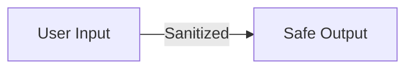

# Security Policy

**Last Updated:** May 1, 2026  
**Latest Security Fix:** v1.1.0 — Worker XSS Protection

---

## Vulnerability Reporting

If you discover a security vulnerability, please **do not** open a public issue. Instead:

1. Email: mchis1607@gmail.com
2. Subject: `[SECURITY] Vulnerability Report`
3. Include: Description, reproduction steps, impact assessment
4. Do not publicly disclose until fix is released

---

## Current Security Status

### ✅ Secure

- **XSS Protection** (v1.1.0+) — All markdown rendering is sanitized
- **Input Validation** — File paths validated to prevent traversal
- **No External Dependencies for Rendering** — Uses only highlight.js and marked.js
- **Worker Isolation** — Cloudflare Workers run in isolated V8 contexts

### 🔄 In Progress

- Dark mode security (no injection vectors)
- CORS policy hardening
- Rate limiting for published endpoints

### ⚠️ Known Limitations

1. **Mermaid.js Library** — Uses untrusted diagram syntax
   - Diagrams are rendered client-side only
   - No server-side execution
   - Safe in current implementation

2. **Code Highlighting** — Uses highlight.js
   - Only colorizes code, doesn't execute
   - No eval() or dynamic code execution
   - Safe even for suspicious code samples

3. **Published Pages** — Accessible to anyone with URL
   - No authentication on read
   - Use private Cloudflare Workers namespace for sensitive content
   - No encryption at rest (browser-readable HTML)

---

## XSS Protection (v1.1.0)

### What's Protected

The `sanitizeHtml()` function removes:

```
❌ <script> tags and contents
❌ <iframe> tags
❌ Event handlers: onclick, onerror, onload, onmouseover, etc.
❌ All on* attributes
```

### How It Works

```javascript
// From: renderer/js/services/md-renderer-core.js
function sanitizeHtml(html) {
  return html
    .replace(/<script\b[^<]*(?:(?!<\/script>)<[^<]*)*<\/script>/gi, '')
    .replace(/<iframe\b[^<]*(?:(?!<\/iframe>)<[^<]*)*<\/iframe>/gi, '')
    .replace(/on\w+="[^"]*"/gi, '');
}
```

### Where It's Applied

| Component | Protection | Added |
|-----------|-----------|-------|
| Server (`/api/render-raw`) | ✅ `sanitizeHtml()` | v1.0 |
| Worker (published pages) | ✅ `sanitizeHtml()` | **v1.1.0** |
| Electron app | ✅ `sanitizeHtml()` | v1.1.0 |

### Test Coverage

21 unit tests covering:
- Script tag injection
- IFrame injection
- Event handler injection
- Combined attack vectors
- Edge cases (nested tags, case variations)

**Run tests:**
```bash
npm run test
# All 21 tests passing
```

---

## Input Validation

### File Path Security

Paths are validated to prevent directory traversal:

```javascript
// From: server/routes/render.js
function resolvePath(watchDir, filePath) {
  const fullPath = path.isAbsolute(filePath) 
    ? path.normalize(filePath) 
    : path.resolve(watchDir, filePath);
  
  const normalizedWatchDir = path.normalize(watchDir);
  if (!fullPath.startsWith(normalizedWatchDir)) {
    throw new Error('Security Error: Path traversal detected.');
  }
  return fullPath;
}
```

**Protection Against:**
- `../../etc/passwd`
- Absolute paths outside watch directory
- Symlink traversal

### Worker Admin Secret

Publishing requires `X-Admin-Secret` header:

```bash
curl -X POST https://worker.example.com/publish \
  -H "X-Admin-Secret: your-secret" \
  -H "Content-Type: application/json" \
  -d '{"slug":"...","content":"..."}'
```

**Set via environment:**
```bash
wrangler secret put ADMIN_SECRET
```

---

## Data Security

### What's Stored

- **Electron App**: Markdown files on user's computer (local storage)
- **Worker KV Store**: Published page content and metadata
- **No Cloud Sync**: Nothing automatically uploaded

### What's NOT Stored

- ❌ User credentials
- ❌ API keys
- ❌ Sensitive data (unless user puts it in markdown)

### Access Control

**Local Server** (Dev):
- No authentication required
- Local network only (`localhost:3737`)

**Published Pages** (Worker):
- Public by default (anyone with URL can view)
- Optional password protection (not implemented)
- Use Cloudflare Firewall Rules for IP restrictions

---

## Dependencies Security

### Critical Dependencies

| Package | Version | Purpose | Security |
|---------|---------|---------|----------|
| `highlight.js` | ^11.11.1 | Code highlighting | ✅ No code execution |
| `marked` | ^12.0.0 | Markdown parsing | ⚠️ See below |
| `express` | ^4.19.2 | Web server | ✅ Security patches |
| `socket.io` | ^4.7.5 | Real-time updates | ✅ Security patches |

### Marked.js Security Note

Marked.js v12 uses a custom tokenizer and parser:
- ✅ No regex-based HTML injection
- ✅ Built-in sanitization-friendly architecture
- ⚠️ Always run sanitization after marked.js output

**Best Practice:**
```javascript
// ✅ CORRECT
const html = marked.parse(markdown);
const safe = sanitizeHtml(html);

// ❌ WRONG - Don't skip sanitization
const unsafe = marked.parse(markdown);
```

### Updating Dependencies

```bash
# Check for vulnerabilities
npm audit

# Fix vulnerabilities
npm audit fix

# Update to latest safe versions
npm update
```

---

## CORS & Headers

### Current Policy

```javascript
// From: cf-publish-worker/src/index.js
if (request.method === 'OPTIONS') {
  return new Response(null, {
    headers: {
      'Access-Control-Allow-Origin': '*',
      'Access-Control-Allow-Methods': 'GET, POST, DELETE, OPTIONS',
      'Access-Control-Allow-Headers': 'Content-Type, X-Admin-Secret',
    }
  });
}
```

### Considerations

- ✅ Published pages are public, so broad CORS is appropriate
- ⚠️ Admin endpoints (`/publish`, `/delete`) require `X-Admin-Secret`
- ⚠️ Origins not restricted (any site can fetch published content)

### Future Hardening

```javascript
// Recommended for v2.0
const allowedOrigins = [
  'https://example.com',
  'https://www.example.com'
];

const origin = request.headers.get('Origin');
if (allowedOrigins.includes(origin)) {
  // Allow request
}
```

---

## Production Deployment

### Cloudflare Workers

**Secure by default:**
- Runs in isolated V8 contexts
- No access to file system
- DDoS protection included
- SSL/TLS required
- Geographic distribution (99.99% uptime)

**Admin Controls:**
```bash
# Set admin secret
wrangler secret put ADMIN_SECRET

# Check secrets are set
wrangler secret list
```

**Monitor:**
- Check Cloudflare Dashboard for attacks/errors
- Enable Web Analytics for traffic insights
- Set up alerts for error rates

### Environment Variables

**Never commit secrets:**
```bash
# ❌ WRONG
export ADMIN_SECRET="my-secret"  # In .env or committed

# ✅ CORRECT
wrangler secret put ADMIN_SECRET  # Via CLI, stored in Cloudflare
```

---

## Browser Security

### Content Security Policy (CSP)

**Recommended headers for published pages:**

```
Content-Security-Policy: 
  default-src 'self';
  script-src 'self' cdn.jsdelivr.net;
  style-src 'self' 'unsafe-inline';
  img-src 'self' data:;
  font-src 'self';
  object-src 'none';
  base-uri 'self';
  form-action 'none';
```

**Current Status:** Not implemented (published pages are static HTML)

**Future:** Add CSP headers to Worker responses for extra protection

### Mermaid.js Security

Mermaid diagrams are rendered client-side:
- No server-side execution
- Mermaid.js syntax is validated by mermaid library
- XSS in diagram syntax is still caught by `sanitizeHtml()`

**Safe usage:**
```markdown

```

---

## Incident Response

### If XSS is Found

1. **Immediate**: Disable affected feature (if possible)
2. **Investigation**: Identify root cause
3. **Fix**: Create patch with test case
4. **Release**: Push fix to main and deploy
5. **Notification**: Inform users of fix
6. **Prevention**: Add test to prevent regression

### If Data is Compromised

1. **Worker**: Rotate `ADMIN_SECRET` via `wrangler secret put`
2. **Server**: Restart server, check logs for unauthorized access
3. **Audit**: Review KV Store for unauthorized published pages

---

## Security Checklist for Contributors

Before submitting a PR:

- [ ] No hardcoded secrets (passwords, API keys, tokens)
- [ ] All user input is validated
- [ ] HTML output is sanitized with `sanitizeHtml()`
- [ ] No `eval()` or `Function()` constructors
- [ ] No dangerous globals accessed (`document.write`, etc.)
- [ ] Tests added for security-related changes
- [ ] No new dependencies without security review
- [ ] XSS vectors covered in test cases

---

## Resources

### OWASP Top 10
- [A03: Injection](https://owasp.org/Top10/A03_2021-Injection/)
- [A07: Cross-Site Scripting (XSS)](https://owasp.org/Top10/A07_2021-Cross_Site_Scripting_%28XSS%29/)

### Security Tools
- [npm audit](https://docs.npmjs.com/cli/v9/commands/npm-audit)
- [OWASP ZAP](https://www.zaproxy.org/)
- [Snyk](https://snyk.io/)

### References
- [MDN: XSS](https://developer.mozilla.org/en-US/docs/Glossary/Cross-site_scripting_(XSS))
- [MDN: Content Security Policy](https://developer.mozilla.org/en-US/docs/Web/HTTP/CSP)
- [Cloudflare: Security](https://developers.cloudflare.com/workers/platform/security/)

---

## Version History

### v1.1.0 (May 1, 2026)
✅ **Critical Security Fix**
- Added XSS sanitization to Worker (was missing)
- Server and Worker now have identical protection
- 21 unit tests for rendering functions
- Comprehensive security testing

### v1.0.0 (Previous)
- Initial XSS sanitization in server only
- Worker was missing sanitization ⚠️

---

**For security concerns, please report to: mchis1607@gmail.com**

Last reviewed: May 1, 2026  
Next review: August 1, 2026 (quarterly)
