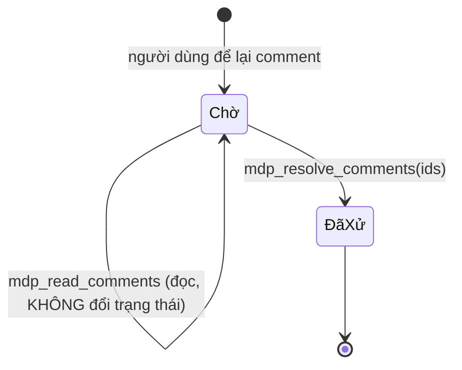

# MDpreview MCP — đề xuất cải tiến, xếp theo giá trị/chi phí

_Viết 2026-08-23, dựa trên vết đau THẬT của phase 05 `grid-canvas-gestures`: 23 comment qua 5 vòng review._

## Nguyên tắc trước khi bàn tính năng

Giá trị hiện tại của công cụ nằm ở chỗ **gần như không có ma sát khi để lại phản hồi**: bôi đen, gõ, xong. Mọi đề xuất dưới đây phải giữ nguyên điều đó — thêm một bước bắt buộc cho người viết comment là đánh mất thứ đắt nhất.

Vì vậy hầu hết đề xuất nhắm vào **phía agent đọc**, không phải phía người viết.

## P0 — Đọc KHÔNG được huỷ

**Vết đau thật:** tool archive comment ngay khi trả về. Phiên này mình đọc 3 file một lượt, comment biến mất khỏi hệ thống, và mình phải tự chép sang `draft.md` để không mất. Nếu ngữ cảnh bị nén ngay sau lệnh đọc, phần chưa xử lý bốc hơi vĩnh viễn — không có đường đọc lại.

Đây là lỗi thiết kế nguy hiểm nhất vì nó **im lặng**: không ai biết mình vừa mất gì.

**Đề xuất:** tách một thao tác thành hai.

- `mdp_read_comments(file)` → **không** archive; trả kèm `id` ổn định cho từng comment.
- `mdp_resolve_comments(file, ids[])` → agent chủ động đóng sau khi đã sửa xong.

Ba cái lợi cộng thêm, không phải chỉ chống mất dữ liệu:

1. Agent **xử một phần** được — đóng 3 comment đã làm, để lại 1 comment cần bạn quyết.
2. Bạn **nhìn thấy** comment nào agent đã tự nhận là xong ⇒ soát lại được.
3. Comment thành thứ có **trạng thái**, không còn là tin nhắn dùng một lần.

## P1 — Trả lời NGƯỢC vào comment

**Vết đau thật:** ca "kéo cạnh trái chưa hoạt động". Mình kết luận code đúng và nghi dev server chưa restart — nhưng chỗ duy nhất nói được điều đó là report và chat, tức bạn phải đọc ở chỗ khác rồi tự nối lại với comment mình đã viết. Vòng phản hồi không khép.

**Đề xuất:** `mdp_reply_comment(file, id, text)` — trả lời hiện ngay dưới comment gốc trong MDpreview.

Đi cặp tự nhiên với P0: mỗi comment kết thúc bằng **trả lời + đóng**, hoặc **trả lời + để mở** (khi cần bạn xác nhận). Ca kéo-cạnh-trái đáng lẽ là: reply "code đúng, nghi restart, đây là ca test chứng minh" + để mở → bạn restart, thử, tick hoặc bác ngay tại chỗ.

## P2 — Một lệnh hỏi "đang có comment ở đâu"

**Vết đau thật:** mình phải đoán file nào có comment và gọi lần lượt; có lần trúng file rỗng, tốn một vòng.

**Đề xuất:** `mdp_list_pending()` → `[{ file, count, newestAt }]`.

Rẻ, và mở ra một nếp làm việc: đầu mỗi lượt, agent hỏi một câu là biết có việc mới hay không — thay vì chờ bạn nhắc.

## P3 — Ảnh đi CÙNG comment

**Vết đau thật:** comment vòng 2 viết _"xem hình đính kèm 1"_ nhưng ảnh đến qua chat, không nằm trong payload comment. Mình phải tự ghép ảnh nào ứng với comment nào — lần đó ghép đúng, nhưng là may, không phải chắc chắn.

Với một editor thị giác như Motif, **ảnh là bằng chứng chính** chứ không phải phụ lục: bug bố cục mô tả bằng chữ luôn mất mát.

**Đề xuất:** comment mang `attachments: [{ path | dataUri, caption? }]`, agent đọc thẳng bằng công cụ đọc ảnh sẵn có.

## P4 — Trả kèm CẤU TRÚC của đoạn được chọn

**Vết đau thật:** khi bạn comment vào một dòng checklist, `selectedText` là chuỗi markdown thô. Mình vẫn phải tự mở file parse `- [x]` / `- [ ]` để biết ca đó bạn đã tick hay chưa — mà trạng thái tick chính là dữ liệu quan trọng nhất (tick + phàn nàn khác hẳn bỏ trống).

**Đề xuất:** thêm `block: { type, checked? }` với `type` ∈ `checklist-item | table-row | heading | paragraph | code-fence | mermaid-node`.

Với `table-row` thì trả luôn các ô đã tách; với `mermaid-node` thì trả nhãn node thay vì dòng cú pháp thô (comment vào sơ đồ hiện gần như không đọc được).

## Cân nhắc, chưa chắc nên làm

**Nhãn loại comment** (bug / hỏi / đề xuất / chấp nhận). Phiên này mình tự phân loại — nhóm A bug, nhóm B thiếu phản hồi thị giác, nhóm C cần chốt ngữ nghĩa — và phân loại đó quyết định thứ tự làm. Nếu bạn gắn nhãn sẵn thì chính xác hơn.

**Nhưng:** đây là đề xuất duy nhất thêm thao tác cho người viết. Chỉ nên làm nếu nhãn là **tuỳ chọn** và có phím tắt; bắt buộc chọn nhãn trước khi gõ là đúng thứ ma sát cần tránh.

## Thứ KHÔNG nên làm

Đừng tiến hoá nó thành issue tracker đầy đủ (assignee, milestone, trạng thái nhiều bậc, nhãn bắt buộc). Bạn đã bàn ý tưởng ticket có cấu trúc và quyết hoãn — quyết định đó vẫn đúng. P0+P1 cho bạn đủ phần "có trạng thái" mà không mất phần "không ma sát".

## Nếu chỉ làm được một thứ

**P0.** Không phải vì nó tiện nhất, mà vì nó là thứ duy nhất trong danh sách đang gây **mất dữ liệu im lặng**. Ba cái còn lại chỉ làm chậm; cái này làm hỏng.
