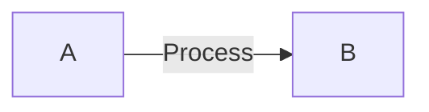

# Manual Testing Guide — Phase 1.1 Update

**Purpose:** Verify all Phase 1.1 features work correctly in real-world scenarios  
**Duration:** ~15 minutes  
**Prerequisites:** Phase 1.1 code deployed, both server and worker running

---

## Test Environment Setup

### Server
```bash
npm run serve
# Output: MDpreview running at http://localhost:3737
```

### Worker (Local Dev)
```bash
cd cf-publish-worker
npx wrangler dev --local
# Output: ⎔ Starting local server... Ready on http://localhost:8787
```

---

## Test Cases

### 1️⃣ Server: XSS Script Tag Protection

**Objective:** Verify server sanitizes `<script>` tags in markdown

**Steps:**
1. Open Terminal and send request:
```bash
curl -X POST http://localhost:3737/api/render-raw \
  -H "Content-Type: application/json" \
  -d '{"content":"# Title\n\n<script>alert(\"XSS Attack\")</script>\n\nSafe Content"}'
```

**Expected Result:**
- Response HTML contains: "Title" and "Safe Content"
- Response HTML does NOT contain: `<script>` tag or `alert(` text
- Markdown heading still renders as `<h1>Title</h1>`

**Pass/Fail:** ☐ Pass ☐ Fail

---

### 2️⃣ Server: XSS IFrame Protection

**Objective:** Verify server removes `<iframe>` tags

**Steps:**
1. Send request:
```bash
curl -X POST http://localhost:3737/api/render-raw \
  -H "Content-Type: application/json" \
  -d '{"content":"Safe Content\n\n<iframe src=\"https://evil.com\"></iframe>"}'
```

**Expected Result:**
- Response contains: "Safe Content"
- Response does NOT contain: `<iframe` or `src=`
- Clean paragraph without iframe

**Pass/Fail:** ☐ Pass ☐ Fail

---

### 3️⃣ Server: XSS Event Handler Protection

**Objective:** Verify server removes inline event handlers

**Steps:**
1. Send request:
```bash
curl -X POST http://localhost:3737/api/render-raw \
  -H "Content-Type: application/json" \
  -d '{"content":"Click me"}'
```

**Expected Result:**
- Response does NOT contain: `onerror=` or `onload=`
- Response contains: "Click me" text
- No event handlers in rendered HTML

**Pass/Fail:** ☐ Pass ☐ Fail

---

### 4️⃣ Server: Mermaid Diagram Rendering

**Objective:** Verify server renders Mermaid code blocks with `<div class="mermaid">`

**Steps:**
1. Send request:
```bash
curl -X POST http://localhost:3737/api/render-raw \
  -H "Content-Type: application/json" \
  -d '{"content":"# Diagram Example\n\n\`\`\`mermaid\ngraph LR\n    A[Start] -->|Process| B[End]\n\`\`\`\n\nDone"}'
```

**Expected Result:**
- Response contains: `<div class="mermaid">`
- Response contains: `A[Start]` and `B[End]`
- Response contains: "Diagram Example" heading
- Response contains: "Done" text

**Pass/Fail:** ☐ Pass ☐ Fail

---

### 5️⃣ Server: Code Highlighting

**Objective:** Verify server highlights code with highlight.js

**Steps:**
1. Send request:
```bash
curl -X POST http://localhost:3737/api/render-raw \
  -H "Content-Type: application/json" \
  -d '{"content":"## JavaScript Example\n\n\`\`\`javascript\nconst greeting = \"Hello\";\nconsole.log(greeting);\n\`\`\`"}'
```

**Expected Result:**
- Response contains: `<pre><code class="hljs language-javascript">`
- Response contains: `hljs` class names (e.g., `hljs-keyword`, `hljs-string`)
- Code is highlighted (has HTML span elements with syntax highlighting)
- NOT just plain text

**Visual Check:** Use `jq` to extract and view:
```bash
curl -s -X POST http://localhost:3737/api/render-raw \
  -H "Content-Type: application/json" \
  -d '{"content":"```javascript\nconst x = 42;\n```"}' \
  | jq -r '.html' | grep -o '<span[^>]*>[^<]*</span>' | head -5
```

Should show multiple `<span>` tags with highlighting classes.

**Pass/Fail:** ☐ Pass ☐ Fail

---

### 6️⃣ Server: Table Rendering with Wrapper

**Objective:** Verify server wraps tables in `md-table-wrapper` div

**Steps:**
1. Send request:
```bash
curl -X POST http://localhost:3737/api/render-raw \
  -H "Content-Type: application/json" \
  -d '{"content":"## Data Table\n\n| Name | Age |\n|------|-----|\n| Alice | 30 |\n| Bob | 25 |"}'
```

**Expected Result:**
- Response contains: `<div class="md-table-wrapper">`
- Response contains: `<table>` inside the wrapper
- Response contains: "Alice", "30", "Bob", "25"
- Table structure is intact: `<tr>`, `<td>`, `<th>` tags

**Verify with jq:**
```bash
curl -s -X POST http://localhost:3737/api/render-raw ... | jq -r '.html' | grep "md-table-wrapper"
```

**Pass/Fail:** ☐ Pass ☐ Fail

---

### 7️⃣ Server: Line Numbers Preserved

**Objective:** Verify server still tracks line numbers (server-specific feature)

**Steps:**
1. Send request:
```bash
curl -X POST http://localhost:3737/api/render-raw \
  -H "Content-Type: application/json" \
  -d '{"content":"Line 1\n\nLine 3\n\nLine 5"}'
```

**Expected Result:**
- Response contains: `data-line-start="1"` and `data-line-end="1"` for first block
- Response contains: `data-line="1"` for line tracking
- Line numbers properly tracked across blocks

**Verify:**
```bash
curl -s -X POST http://localhost:3737/api/render-raw ... | jq -r '.html' | grep "data-line" | head -10
```

**Pass/Fail:** ☐ Pass ☐ Fail

---

### 8️⃣ Worker: XSS Script Tag Protection

**Objective:** Verify worker sanitizes `<script>` tags in published content

**Steps:**
1. Send publish request:
```bash
curl -X POST http://localhost:8787/publish \
  -H "Content-Type: application/json" \
  -H "X-Admin-Secret: test" \
  -d '{
    "slug": "test-xss-1",
    "title": "XSS Test",
    "content": "# Safe Title\n\n<script>alert(\"hack\")</script>\n\nSafe content"
  }'
```

**Expected Result:**
- HTTP 200 response
- Response contains: "Safe Title" in HTML
- Response contains: "Safe content" in HTML
- Response does NOT contain: `<script>`, `alert`, or `hack` text

**Verify in response:**
```bash
# Should NOT contain script
curl -s -X POST http://localhost:8787/publish ... | grep -c "script" # Should return 0 or line with "script" is not <script>
```

**Pass/Fail:** ☐ Pass ☐ Fail

---

### 9️⃣ Worker: Event Handler Protection

**Objective:** Verify worker removes event handlers from published content

**Steps:**
1. Send publish request:
```bash
curl -X POST http://localhost:8787/publish \
  -H "Content-Type: application/json" \
  -H "X-Admin-Secret: test" \
  -d '{
    "slug": "test-event",
    "title": "Event Handler Test",
    "content": "<div onclick=\"alert(1)\" onmouseover=\"hack()\">Click me</div>"
  }'
```

**Expected Result:**
- Response contains: "Click me" text
- Response does NOT contain: `onclick=` or `onmouseover=`
- No event handlers in final HTML

**Pass/Fail:** ☐ Pass ☐ Fail

---

### 🔟 Worker: Code Block with Copy Button

**Objective:** Verify worker premium UI still works (copy button, header)

**Steps:**
1. Send publish request with code:
```bash
curl -X POST http://localhost:8787/publish \
  -H "Content-Type: application/json" \
  -H "X-Admin-Secret: test" \
  -d '{
    "slug": "test-code",
    "title": "Code Test",
    "content": "```python\ndef greet():\n    print(\"Hello\")\n```"
  }'
```

**Expected Result:**
- Response contains: `class="premium-code-block"`
- Response contains: `class="code-block-header"`
- Response contains: `<span class="code-block-lang">PYTHON</span>`
- Response contains: `<button class="code-block-copy"`
- Response contains: Copy button SVG icons
- Code is highlighted with `hljs` class

**Verify:**
```bash
curl -s -X POST http://localhost:8787/publish ... | grep "premium-code-block"
curl -s -X POST http://localhost:8787/publish ... | grep "code-block-copy"
```

**Pass/Fail:** ☐ Pass ☐ Fail

---

### 1️⃣1️⃣ Worker: Mermaid Diagram in Published Content

**Objective:** Verify worker renders Mermaid diagrams in published pages

**Steps:**
1. Send publish request:
```bash
curl -X POST http://localhost:8787/publish \
  -H "Content-Type: application/json" \
  -H "X-Admin-Secret: test" \
  -d '{
    "slug": "test-mermaid",
    "title": "Mermaid Test",
    "content": "# Architecture\n\n```mermaid\ngraph TD\n    Client[Browser]\n    Server[Server]\n    Client -->|HTTP| Server\n```"
  }'
```

**Expected Result:**
- Response contains: `<div class="mermaid">`
- Response contains: `Client[Browser]` and `Server[Server]`
- Mermaid diagram properly formatted
- "Architecture" heading present

**Pass/Fail:** ☐ Pass ☐ Fail

---

### 1️⃣2️⃣ Server & Worker: Mixed Content

**Objective:** Verify both handle complex markdown with multiple elements

**Steps:**

1. Create test markdown file `/tmp/complex.md`:
```markdown
# Complete Test Document

This document tests all rendering features.

## Code Example

```javascript
// Highlight test
const x = 42;
console.log(x);
```

## Diagram



## Table

| Feature | Status |
|---------|--------|
| Highlight | ✓ |
| Mermaid | ✓ |
| XSS Safe | ✓ |

## XSS Attempts (should be safe)

<script>alert('xss')</script>
<iframe src="evil"></iframe>


Safe content after XSS.
```

2. Test Server:
```bash
curl -X POST http://localhost:3737/api/render-raw \
  -H "Content-Type: application/json" \
  -d '{"content":"'"$(cat /tmp/complex.md)"'"}'
```

3. Test Worker:
```bash
curl -X POST http://localhost:8787/publish \
  -H "Content-Type: application/json" \
  -H "X-Admin-Secret: test" \
  -d '{
    "slug": "test-complex",
    "title": "Complex Test",
    "content": "'"$(cat /tmp/complex.md)"'"
  }'
```

**Expected Result (Both):**
- ✅ Heading renders: "# Complete Test Document"
- ✅ Code highlighted with `hljs`
- ✅ Mermaid diagram with `<div class="mermaid">`
- ✅ Table wrapped in `md-table-wrapper`
- ✅ "✓" checkmarks visible in table
- ✅ NO `<script>`, `<iframe>`, `onclick`, or `alert` in output
- ✅ "Safe content after XSS" text visible
- ✅ XSS attempts completely removed

**Pass/Fail:** ☐ Pass ☐ Fail

---

## Test Results Summary

| Test Case | Description | Status |
|-----------|-------------|--------|
| 1 | Server: Script tag XSS | ☐ Pass ☐ Fail |
| 2 | Server: IFrame XSS | ☐ Pass ☐ Fail |
| 3 | Server: Event handler XSS | ☐ Pass ☐ Fail |
| 4 | Server: Mermaid rendering | ☐ Pass ☐ Fail |
| 5 | Server: Code highlighting | ☐ Pass ☐ Fail |
| 6 | Server: Table wrapping | ☐ Pass ☐ Fail |
| 7 | Server: Line numbers | ☐ Pass ☐ Fail |
| 8 | Worker: Script tag XSS | ☐ Pass ☐ Fail |
| 9 | Worker: Event handler XSS | ☐ Pass ☐ Fail |
| 10 | Worker: Premium code block UI | ☐ Pass ☐ Fail |
| 11 | Worker: Mermaid rendering | ☐ Pass ☐ Fail |
| 12 | Server & Worker: Complex content | ☐ Pass ☐ Fail |

**Overall Status:** ☐ All Pass ☐ Some Fail

---

## Troubleshooting

### Server not responding
```bash
# Check if server is running
lsof -i :3737
# Start server
npm run serve
```

### Worker not responding
```bash
# Check if worker is running
lsof -i :8787
# Start worker
cd cf-publish-worker && npx wrangler dev --local
```

### XSS not being sanitized
```bash
# Check that md-renderer-core.js exists
ls -l renderer/js/services/md-renderer-core.js

# Check that render.js imports it
grep -n "sanitizeHtml" server/routes/render.js

# Check that worker renderer imports it
grep -n "sanitizeHtml" cf-publish-worker/src/renderer.js
```

### Code not highlighting
```bash
# Check highlight.js is working
grep -n "hljs" server/routes/render.js

# Check worker has highlighting
grep -n "hljs" cf-publish-worker/src/renderer.js
```

---

## Quick Copy-Paste Commands

### All Tests in One Run
```bash
# Open terminal 1: Start server
npm run serve

# Open terminal 2: Start worker
cd cf-publish-worker && npx wrangler dev --local

# Open terminal 3: Run all tests
echo "=== Test 1: Server Script XSS ===" && \
curl -s -X POST http://localhost:3737/api/render-raw \
  -H "Content-Type: application/json" \
  -d '{"content":"<script>alert(1)</script>Safe"}' | jq '.html | contains("alert")'

echo "=== Test 2: Server IFrame XSS ===" && \
curl -s -X POST http://localhost:3737/api/render-raw \
  -H "Content-Type: application/json" \
  -d '{"content":"<iframe src=\"evil\"></iframe>Content"}' | jq '.html | contains("iframe")'

echo "=== Test 3: Server Mermaid ===" && \
curl -s -X POST http://localhost:3737/api/render-raw \
  -H "Content-Type: application/json" \
  -d '{"content":"```mermaid\ngraph LR\n A --> B\n```"}' | jq '.html | contains("mermaid")'

echo "=== Test 4: Worker Script XSS ===" && \
curl -s -X POST http://localhost:8787/publish \
  -H "Content-Type: application/json" \
  -H "X-Admin-Secret: test" \
  -d '{"slug":"test","title":"t","content":"<script>alert(1)</script>Safe"}' | grep -c "alert" || echo "No alert found (PASS)"
```

---

## Sign-Off

**Tester Name:** ________________  
**Date:** ________________  
**Overall Status:** ☐ PASS ☐ FAIL  
**Notes:** ________________________________________________________________

---

**Phase 1.1 is production-ready when all 12 test cases pass ✅**
