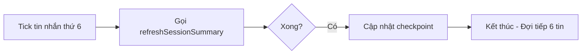
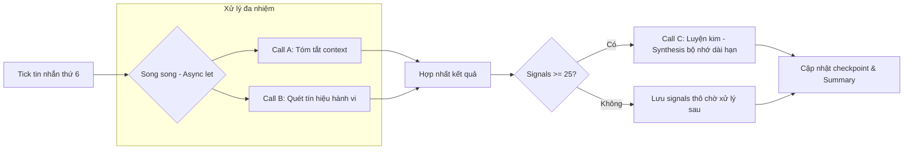
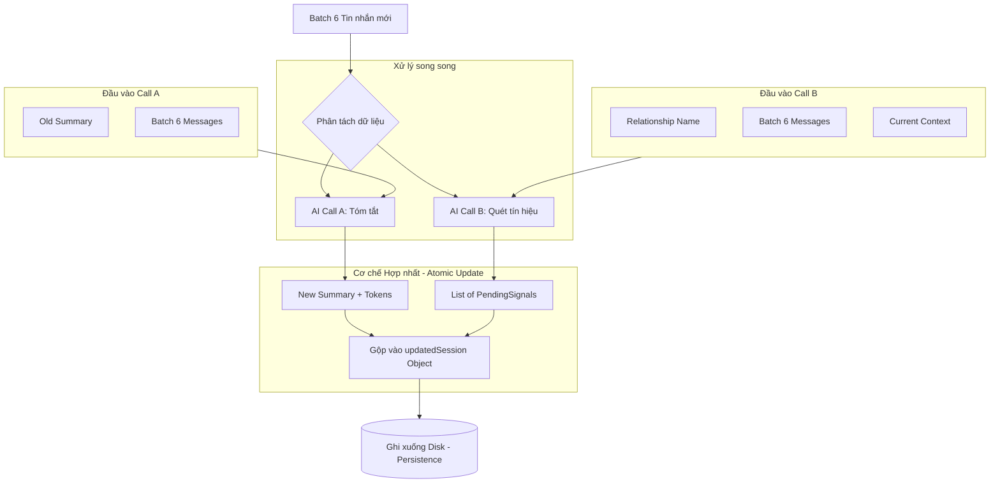

# 🔄 Technical Deep Dive: `handleRollingSummaryIfNeeded` Update

Hàm `handleRollingSummaryIfNeeded` đóng vai trò là mẫu chốt điều phối trong mỗi phiên Chat. Bản cập nhật mới nhất chuyển dịch từ việc chỉ tóm tắt (Summary) sang việc **thu hoạch dữ liệu song song**.

---

## 🛠️ Mã nguồn & Chú thích Swift Doc

```swift
/**
 Kích hoạt việc tóm tắt cửa sổ trượt (Call A) và quét tín hiệu (Call B) song song.
 
 - Parameters:
    - session: ChatSession hiện tại đang tương tác.
 - Returns: Session đã được cập nhật summary và danh sách signals mới.
 - Note: Hàm này thực thi cơ chế "Intermediate Synthesis" khi số lượng tín hiệu vượt ngưỡng 25.
 - Precondition: Được gọi mỗi khi có tin nhắn mới gửi/nhận thành công.
 */
private func handleRollingSummaryIfNeeded(session: ChatSession) async throws -> ChatSession {
    // Logic thực thi chi tiết bên dưới
}
```

---

## 🏗️ Phân tích Chi tiết từng Block Logic

### 1. Điều kiện kích hoạt (Trigger Logic)
```swift
var updatedSession = session
let batchSize = 6
let fallenCount = updatedSession.messages.count - maxRawHistory

guard fallenCount > 0 && fallenCount % batchSize == 0 else { return updatedSession }
```
-   **`maxRawHistory`**: Giới hạn số tin nhắn "thô" mà AI được phép đọc trực tiếp ( Sliding Window).
-   **`% batchSize == 0`**: Logic này đảm bảo cứ sau đúng **6 tin nhắn** rơi ra khỏi cửa sổ trượt, hệ thống mới kích hoạt AI một lần. Điều này giúp tối ưu hóa chi phí API và tránh việc gọi AI quá dày đặc.

---

### 2. Sức mạnh của Sự song song (Parallel Execution)
Đây là thay đổi quan trọng nhất so với phiên bản cũ.

```swift
// Bước chuẩn bị batch tin nhắn cần xử lý
let startIndex = fallenCount - batchSize
let endIndex = fallenCount
let messagesToProcess = Array(updatedSession.messages[startIndex..<endIndex])

// KÍCH HOẠT SONG SONG
async let summaryResult = refreshSessionSummary(
    oldSummary: updatedSession.sessionSummary,
    newMessages: messagesToProcess
)
async let signalsResult: [PendingChatSignal] = updatedSession.mode == .normal
    ? runSignalScanner(
        messages: messagesToProcess,
        relationshipName: cachedRelationshipName ?? "Unknown",
        sessionSummary: updatedSession.sessionSummary
    )
    : []

// CHỜ CẢ HAI HOÀN THÀNH
let (newSum, sumTokens) = try await summaryResult
let newSignals = await signalsResult
```
-   **`async let`**: Thay vì đợi Call A xong mới chạy Call B, hệ thống "bắn" cả hai yêu cầu lên OpenAI cùng lúc. Thời gian chờ tổng cộng giảm xuống chỉ còn bằng thời gian của Call lâu nhất.
-   **Tối ưu hóa nội dung**: Batch tin nhắn `messagesToProcess` được dùng chung cho cả hai mục đích: Cập nhật tóm tắt và Tìm tín hiệu hành vi.

---

### 3. Cơ chế "Luyện kim" giữa phiên (Intermediate Synthesis)
Trước đây, chúng ta chỉ tổng hợp bộ nhớ khi đóng Chat. Giờ đây, chúng ta học ngay trong lúc Chat.

```swift
if !newSignals.isEmpty {
    var existing = updatedSession.pendingChatSignals ?? []
    existing.append(contentsOf: newSignals)

    // NGƯỠNG ĐỘC LẬP: 25 signals
    if existing.count >= 25, let relName = cachedRelationshipName {
        let toSynthesize = Array(existing.prefix(25))
        existing = Array(existing.dropFirst(25)) // Giữ lại phần dư
        
        // Gọi Synthesis trong Task riêng (Background)
        let sessionID = updatedSession.id
        let relID = updatedSession.relationshipID

        Task.detached(priority: .background) {
            await self.runChatSynthesis(
                signals: toSynthesize,
                relationshipName: relName,
                sessionID: sessionID,
                relationshipID: relID
            )
        }
    }
    updatedSession.pendingChatSignals = existing.isEmpty ? nil : existing
}
```
-   **Logic**: Nếu cuộc hội thoại kéo dài và AI thu hoạch được quá nhiều tín hiệu (>= 25), nó sẽ tự động "đóng gói" 25 tín hiệu đầu tiên thành một **ChatMemory** chính thức.
-   **Lợi ích**:
    1.  Giảm tải lượng dữ liệu phải xử lý khi kết thúc session.
    2.  Làm sạch mảng `pendingChatSignals` giúp giảm kích thước file lưu trữ trên Disk.
    3.  Đảm bảo AI "thông minh lên" ngay lập tức nếu người dùng chat quá lâu.

---

### 4. Cập nhật Checkpoint cuối cùng
```swift
updatedSession.sessionSummary = newSum
updatedSession.lastScannedMessageIndex = endIndex
TouchEnergyManager.shared.recordUsage(tokens: sumTokens)
```
-   **Ghi nhận**: Cập nhật tóm tắt mới và đánh dấu checkpoint tin nhắn đã quét.
-   **Energy**: Ghi nhận mức tiêu thụ năng lượng của AI (Call A).

---

## 📊 So sánh: Cũ vs. Mới

| Đặc tính | Phiên bản cũ | Phiên bản mới (Update C7) |
| :--- | :--- | :--- |
| **Concurrency** | Tuần tự (Sequential) | Song song (Parallel async let) |
| **Data Harvest** | Chỉ có Summary | Summary + Behavioral Signals |
| **Synthesis Trigger** | Chỉ khi Close Chat | Ngay khi đạt ngưỡng 25 signals |
| **Performance** | Chậm hơn (Tích lũy thời gian) | Nhanh hơn (Max của một call đơn) |

---
---

## 📊 Trực quan hóa So sánh Logic: Before vs. After

Sử dụng sơ đồ luồng để minh họa sự thay đổi từ việc "chỉ tóm tắt" sang "xử lý đa nhiệm" thông minh.

### 🔴 BEFORE: Logic cũ (Tuần tự & Đơn nhiệm)
*Hệ thống chỉ lo việc tóm tắt để giải phóng Token, bỏ qua việc học hỏi hành vi.*



### 🟢 AFTER: Logic mới (Song song & Đa học hỏi)
*Hệ thống vừa bảo trì Token, vừa thu hoạch tín hiệu hành vi và tự tổng hợp tri thức ngay lập tức.*



---

## 💾 Trực quan hóa Luồng dữ liệu & Cơ chế Hợp nhất (Data Merging)

Phần này giải thích cách dữ liệu được phân tách để xử lý song song và tại sao chúng ta phải "hợp nhất" chúng lại trước khi kết thúc.

### 📤 Sơ đồ Luồng dữ liệu (Data Flow)



### ❓ Tại sao cần "Hợp nhất" kết quả?

Trong code, chúng ta sử dụng `async let` để nhận về hai kết quả độc lập (`newSum` và `newSignals`). Việc hợp nhất chúng vào `updatedSession` là bắt buộc vì:

1.  **Tính toàn vẹn (Data Integrity)**: `ChatSession` là một đối tượng duy nhất trên Disk. Nếu chúng ta ghi `newSum` xuống trước rồi mới ghi `newSignals` sau, và app bị crash ở giữa, dữ liệu sẽ bị lệch (Summary mới nhưng Signals cũ). Hợp nhất giúp chúng ta thực hiện một lệnh **Update nguyên tử (Atomic)**.
2.  **Đồng bộ Checkpoint**: Cả hai Call đều dùng chung một mốc tin nhắn (`endIndex`). Việc hợp nhất đảm bảo rằng khi session được đánh dấu là "đã quét đến tin thứ n", thì cả tóm tắt và tín hiệu đều đã cập nhật đến đúng tin đó.
3.  **Cung cấp Context cho Interaction**: `updatedSession` sau khi hợp nhất sẽ được trả về cho luồng chính để UI (ChatDetailView) có thể hiển thị Summary mới nhất ngay lập tức mà không cần load lại từ Disk.

### 📝 Chi tiết Input/Output

| Thành phần | Input (Đầu vào) | Output (Đầu ra) |
| :--- | :--- | :--- |
| **Call A (Summary)** | Summary cũ + 6 Tin nhắn mới | Bản tóm tắt mới + Số lượng Token |
| **Call B (Scanner)** | Tên đối tượng + 6 Tin nhắn + Context hiện tại | Mảng các `PendingChatSignal` (Trích dẫn + Ý nghĩa) |
| **Hợp nhất (Merge)** | Kết quả từ Call A & B | Đối tượng `ChatSession` hoàn chỉnh đã cập nhật checkpoint |
