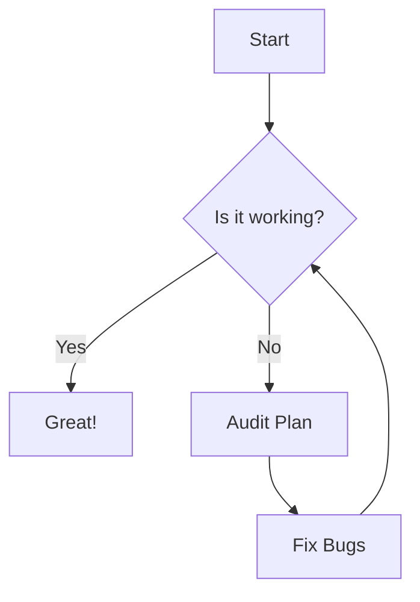
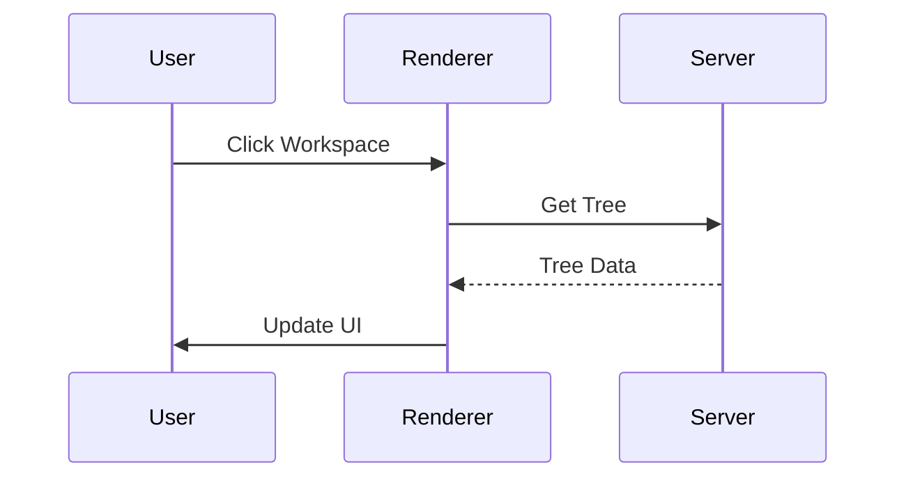
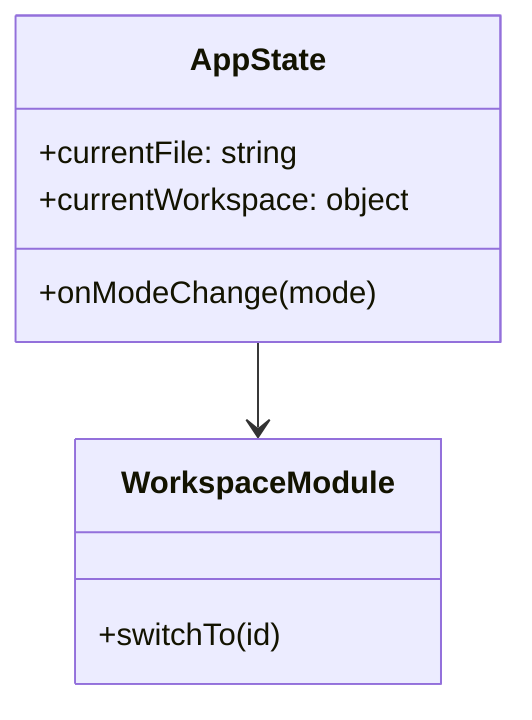

# 🧪 MDpreview Audit Test Suite

This file is designed to test the edge cases of the Markdown renderer and UI.

## 1. Typography & Basic Styles
Testing **bold**, *italic*, ~~strikethrough~~, and `inline code`.
Testing [links](https://google.com) and .

## 2. Lists & Nesting
- Level 1
    - Level 2
        - Level 3 with `code`
    - Level 2 again
- Level 1 again

1. Ordered Item 1
    1. Sub-item A
    2. Sub-item B
2. Ordered Item 2

> [!NOTE]
> This is a GitHub-style alert (if supported by our renderer).
> > Nested blockquote test.

## 3. Tables
| Feature | Status | Priority | Notes |
| :--- | :---: | :---: | :--- |
| Workspace Switching | ✅ | P0 | Needs isolation check |
| Tab Persistence | 🔄 | P1 | Check localStorage |
| Mermaid Zoom | ❌ | P0 | Test large diagrams |

## 4. Complex Mermaid Diagrams
### Flowchart


### Sequence Diagram


### Class Diagram


## 5. Details & Summary (Collapsible)
<details>
<summary>Click to expand advanced settings</summary>

- Setting A: Enabled
- Setting B: Disabled
- Nested table:
    | Key | Value |
    |---|---|
    | Key 1 | Val 1 |

</details>

## 6. Code Blocks (Syntax Highlighting)
```javascript
function helloWorld() {
  console.log("Hello, MDpreview!");
  const app = {
    version: '1.0.0',
    features: ['markdown', 'mermaid', 'comments']
  };
}
```

```python
def calculate_gravity(mass):
    # Testing indentation and comments
    G = 6.67430e-11
    return G * mass
```

## 7. Special Characters & Emojis
🚀 🧪 🎨 🤖 🛠️
Path simulation: `/Users/mchisdo/Projects/Test Suite (Space Test) 🔥/index.md`

## 8. Large Content Stress Test
Inserting a lot of repetitive text to test scroll performance...
Lorem ipsum dolor sit amet, consectetur adipiscing elit. ... (Imagine 1000 more lines)
