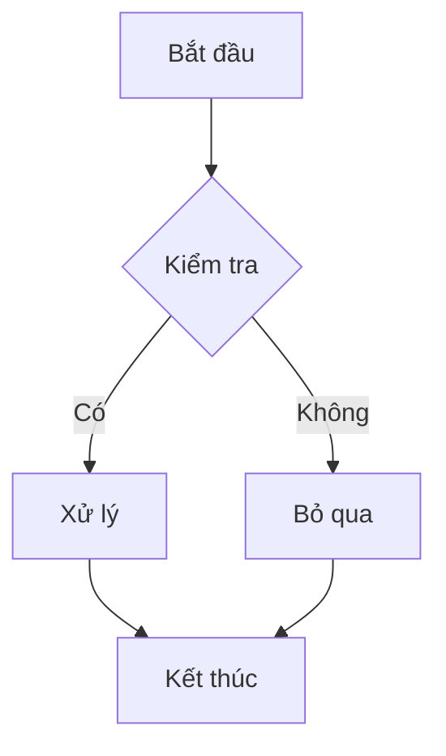

# MDpreview Extension Test

Đây là file test để kiểm tra extension render markdown trong VSCode/Antigravity.

## Danh sách

- Mục một
- Mục hai
  - Mục con lồng nhau
- Mục ba

1. Bước một
2. Bước hai
3. Bước ba

## Task list

- [x] Đã xong việc này
- [ ] Chưa xong việc kia

## Bảng

| Cột A | Cột B | Cột C |
|-------|-------|-------|
| 1     | 2     | 3     |
| 4     | 5     | 6     |

## Code block

```js
function hello() {
  console.log("Hello from MDpreview extension");
}
```

## Trích dẫn

> Đây là một đoạn trích dẫn để test blockquote.

## Định dạng inline

Đoạn văn có **chữ đậm**, *chữ nghiêng*, ~~gạch ngang~~, và `code inline`. Có cả [một liên kết](https://example.com) nữa.

## Tiếng Việt có dấu

Kiểm tra dấu tiếng Việt: à á ả ã ạ, ê ề ế ể, ơ ờ ớ, đ Đ.

## Sơ đồ Mermaid



## Test link

- [Link ngoài](https://example.com) — nên mở bằng trình duyệt mặc định
- [Link tới file khác](./package.json) — nên mở tab mới trong VSCode
- [Link neo trong bài](#tiếng-việt-có-dấu) — nên cuộn trong webview, không mở gì cả

## Mockup image


## Carousel

:::carousel


:::

## Details / Summary

<details>
<summary>Bấm để xem thêm</summary>

Nội dung ẩn bên trong `<details>`, nên có icon chevron trước "Bấm để xem thêm".

</details>
