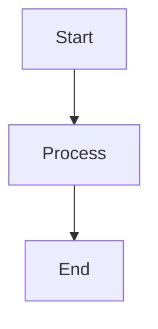
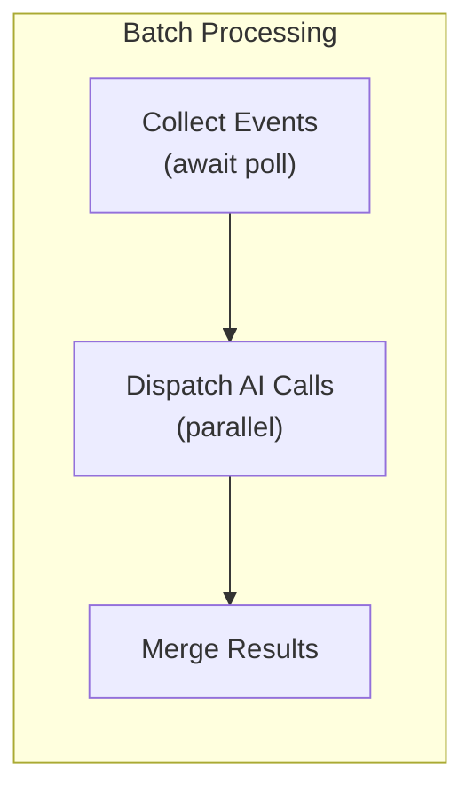

# Test Mermaid Rendering

## Simple Flowchart

```mermaid
flowchart TD
    A[Start] --> B[Process]
    B --> C[End]
```

## Batch Diagram

```mermaid
graph LR
    subgraph batch ["Batch Processing"]
        A["Collect Events<br/>(await poll)"]
        B["Dispatch AI Calls<br/>(parallel)"]
        C["Merge Results"]
    end
    
    A --> B
    B --> C
```

## Test Complete
